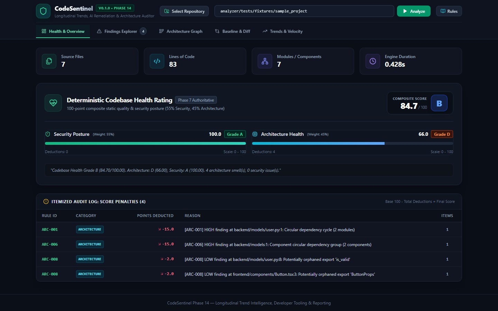
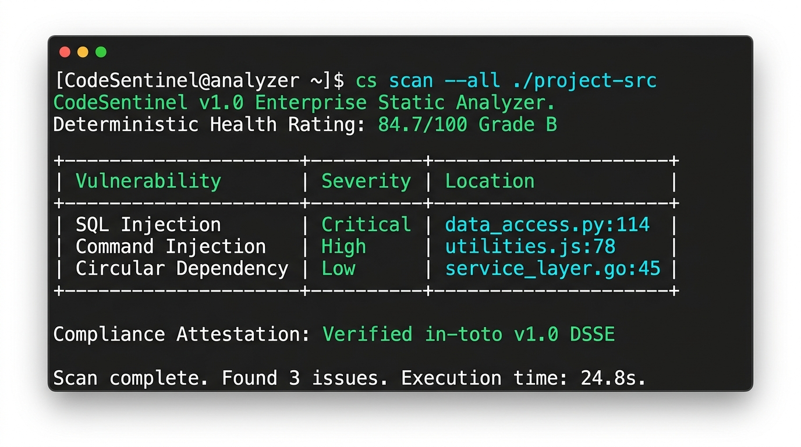
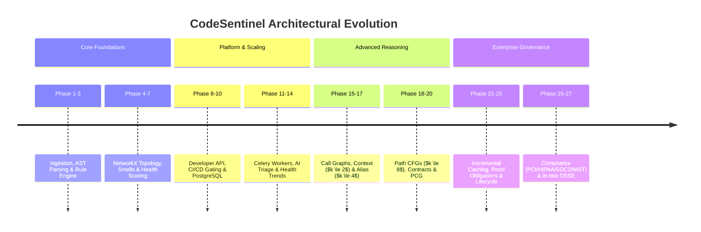

# CodeSentinel

> **Evidence-First Codebase Architecture, Security & Regulatory Compliance Auditor**

[](#current-status-phases-1--27-complete)
[-blue?style=flat-square)](#automated-testing--quality-assurance)
[](#milestone-6-enterprise-compliance-attestation--governance-hardening-phases-2627)
[](#milestone-6-enterprise-compliance-attestation--governance-hardening-phases-2627)
[](#license)

CodeSentinel is an enterprise-grade static analysis platform designed to audit modern full-stack web applications for security vulnerabilities, architectural anti-patterns, and regulatory compliance requirements.

Unlike generic LLM wrappers that hallucinate vulnerabilities or blindly transmit private source code to external models, CodeSentinel is built on an **evidence-first, deterministic foundation**:
1. **Deterministic Static Analysis Core (`analyzer/`)**: 100% offline, pure Python & Tree-sitter engine with zero AI or database dependencies. It builds ASTs, CFGs, call graphs, points-to sets, and formal function contracts.
2. **Architectural Graph Modeling**: A directed NetworkX topology engine mapping component boundaries, modular stability, coupling metrics, and circular dependency cycles.
3. **Regulatory Compliance & Attestation Engine**: Evaluates codebases against PCI-DSS v4.0, HIPAA Security Rule, SOC 2 Type II, and NIST SP 800-53 Rev 5, issuing cryptographic in-toto v1.0 DSSE attestations and RFC 6962 Merkle audit trails.
4. **Targeted Advisory AI Enrichment**: An optional LLM triage layer operates solely on verified candidate findings with bounded AST context and automated pre-flight secret scrubbing for explanations and candidate diffs.

---

## Visual Preview

### Interactive Developer Dashboard

*CodeSentinel Web Console: Real-time health scores (A–F), metric cards, interactive deductions log, and multi-tab architecture inspection.*

### CLI Static Analysis & Attestation

*CodeSentinel CLI: High-performance deterministic scan, vulnerability triage table, and cryptographic in-toto v1.0 DSSE attestation verification.*

---

## What CodeSentinel Detects (and What It Doesn't)

To ensure clarity for security teams, auditors, and engineering leaders, CodeSentinel maintains clear operational boundaries between static code analysis and dynamic runtime monitoring:

### What It Detects

| Category | Specific Capabilities & Detected Patterns |
|---|---|
| **Injection Vulnerabilities** | • **SQL Injection**: Raw query concatenation, unsafe cursor executions, raw ORM queries (`SEC-PY-002`, `SEC-PY-011`).<br>• **OS Command Injection**: Unescaped `subprocess`, `os.system`, `child_process.exec` calls (`SEC-PY-003`, `SEC-PY-012`, `SEC-JS-001`).<br>• **Dynamic Code Execution**: Unsafe `eval()`, `exec()`, `Function()` constructors (`SEC-PY-004`, `SEC-JS-002`, `SEC-JS-010`).<br>• **Path Traversal**: Unchecked user paths in `open()`, `fs.readFile()`, path joining (`SEC-PY-005`, `SEC-JS-003`). |
| **Client-Side & Web Security** | • **DOM-Based XSS**: `dangerouslySetInnerHTML`, `innerHTML`, `document.write` sinks (`SEC-JS-005`, `SEC-JS-009`).<br>• **Client Secret Exposure**: Sensitive keys, auth tokens stored in `localStorage` or `sessionStorage` (`SEC-JS-004`). |
| **Hardcoded Secrets & High Entropy** | • AWS Access/Secret Keys, GitHub Personal Access Tokens, Slack Webhooks.<br>• Private RSA/EC Key PEM blocks, JWT tokens, high-entropy database connection strings (`SEC-PY-001`). |
| **Interprocedural & Guard Bypasses** | • Multi-hop taint propagation through complex call chains ($k \le 2$ call-string context sensitivity).<br>• Field-sensitive object mutations and points-to alias tracking ($k \le 4$).<br>• Branch-specific guard pruning ($k \le 8$ CFG paths) verifying type narrowing (`isinstance`, `isdigit`), anchored regex, and nullity checks. |
| **Architectural Anti-Patterns** | • **Circular Dependencies**: Module-level import cycles and component-level subsystem loops (`ARC-001`, `ARC-006`).<br>• **God Modules & Layer Violations**: Excessive lines of code / fan-out, domain boundary violations (`ARC-002`, `ARC-003`).<br>• **Instability & Orphaned Code**: Architectural instability metrics, dead/orphaned exports (`ARC-004`, `ARC-008`). |
| **Regulatory Compliance Controls** | • **PCI-DSS v4.0**: Insecure cryptographic primitives (MD5/SHA1), unencrypted sensitive cardholder storage, unauthenticated debug endpoints.<br>• **HIPAA Security Rule**: Unaudited ePHI access pathways, missing TLS transport requirements.<br>• **SOC 2 & NIST SP 800-53**: Missing audit trails, improper access control barriers, privileged operation bypasses. |

### What It Does NOT Detect

CodeSentinel is a **static source code analysis engine**. The following operational and dynamic vectors are outside the scope of static source inspection:

- ❌ **Live Runtime & Cloud Infrastructure**: Live AWS/GCP/Azure IAM policy permissions, active firewall rules, VPC configurations, live Kubernetes cluster configurations, and network DDoS vulnerabilities.
- ❌ **Dynamic Business Logic Intent**: Application logic flaws where the syntax and data-flow are clean but the business rules are violated (e.g. allowing negative transfer amounts or client-controlled discounts without backend database validation).
- ❌ **Closed-Source Binaries & Native Code**: Third-party compiled C/C++ libraries, proprietary native OS binaries (`.so`, `.dll`), and minified/obfuscated JavaScript bundles lacking sourcemaps.
- ❌ **Opaque Remote Microservice Payloads**: Data flows received from dynamic external microservices whose schemas and transfer contracts are not present in the local codebase repository.
- ❌ **Zero-Day Hardware & Kernel Exploits**: Memory-corruption bugs or hardware timing channels (e.g. Spectre/Meltdown, kernel driver race conditions) below the application source abstraction.

---

## Finding Evidence Classification

Every finding discovered by CodeSentinel is explicitly classified by its evidence source:

- **`DETERMINISTIC`**: Direct syntactic match via AST node traversal with absolute conditions (e.g., `shell=True` in `subprocess.run`, `dangerouslySetInnerHTML`, `DEBUG=True`).
- **`HEURISTIC`**: Structural or pattern match where risk varies based on broader context or data flow (e.g., potential raw SQL concatenation, sensitive keys in `localStorage`).
- **`AI-ASSISTED`**: Contextual explanation, false-positive validation, or remediation suggestions generated by an LLM with bounded code context. The LLM is **never** the primary vulnerability detector.

---

## System Architecture

```text
Repository Source Code
         │
         ▼
┌─────────────────────────────────────────────────────────────┐
│                      analyzer/ Package                      │
│  (Independent Python package - Zero FastAPI / DB imports)   │
├─────────────────────────────────────────────────────────────┤
│  1. Ingestion & Multi-Language AST Parsing (Python, JS/TS)  │
│  2. Interprocedural Call Graph & Context Sensitivity        │
│  3. Alias, Points-To & Field-Sensitive State Tracking       │
│  4. Path-Sensitive CFGs, Propositional Guards & Infeasible  │
│  5. Function Contracts & Project-Wide Contract Graph (PCG)  │
│  6. Multi-Tier Analysis Caching (L1–L9 Incremental Engine)  │
│  7. Formal Proof Obligations & Constraint Verification      │
│  8. Regulatory Compliance Evaluator (PCI/HIPAA/SOC2/NIST)   │
│  9. Cryptographic in-toto v1.0 DSSE Attestation Generator   │
└──────────────────────────────┬──────────────────────────────┘
                               │ AnalysisResultDTO
                               ▼
┌─────────────────────────────────────────────────────────────┐
│                      backend/ Service                       │
│  (FastAPI REST API, Celery Workers, SQLAlchemy 2.0 Async)   │
├─────────────────────────────────────────────────────────────┤
│  1. Asynchronous Job Orchestration & Celery Task Queues     │
│  2. Real-Time Server-Sent Events (SSE) Progress Streaming   │
│  3. PostgreSQL 16 Persistence (Immutable UUID Snapshots)    │
│  4. Bounded Context Extraction & Pre-Flight Secret Scrubber │
│  5. Pluggable AI Advisory (OpenRouter / Local Ollama)       │
│  6. RESTful API for Catalog, History, Diffs & Compliance    │
└──────────────────────────────┬──────────────────────────────┘
                               │ REST / SSE API
                               ▼
┌─────────────────────────────────────────────────────────────┐
│                      frontend/ Client                       │
│  (Vite + React 19 + TypeScript + Tailwind CSS)              │
├─────────────────────────────────────────────────────────────┤
│  1. Authoritative Health Rating & Itemized Deduction Log    │
│  2. Findings Explorer with Monaco Code Evidence Viewer      │
│  3. React Flow (@xyflow/react) Component Architecture Graph │
│  4. Differential Baseline Gating & Health Delta Viewer      │
│  5. Longitudinal Health Trends & Velocity Tracking          │
│  6. Interactive AI Remediation & Monaco Diff Inspection     │
└─────────────────────────────────────────────────────────────┘
```

---

## Repository Structure

```text
CodeSentinel/
├── analyzer/                  # Standalone analysis engine (Strictly offline, zero web/DB dependencies)
│   ├── pyproject.toml
│   ├── models/                # Pydantic schemas (findings, graph, results, compliance)
│   ├── security/              # Security rule definitions, AST visitors, and taint engines
│   ├── architecture/          # Architecture rules, component metrics, and cycle detectors
│   ├── compliance/            # Regulatory frameworks (PCI, HIPAA, SOC2, NIST) & in-toto attestations
│   ├── engine/                # Core analysis pipeline, incremental cache, and contract graph
│   └── tests/                 # Unit and integration test suites (903 passing tests)
├── backend/                   # FastAPI orchestration & persistence service
│   ├── pyproject.toml
│   ├── requirements.txt
│   ├── alembic.ini            # Alembic database migration config
│   ├── alembic/               # Async SQLAlchemy migration versions
│   ├── app/
│   │   ├── core/              # Config, filesystem security, structured logging
│   │   ├── db/                # Async & sync engine & session factories
│   │   ├── models/            # SQLAlchemy 2.0 ORM models (snapshots, findings, jobs, attestations)
│   │   ├── services/          # PersistenceService, JobService, ProgressPublisher, Cache
│   │   ├── workers/           # Celery application & asynchronous worker tasks
│   │   ├── schemas/           # Pydantic DTO request/response schemas
│   │   ├── api/               # API routes (/repositories, /jobs, /stream, /analyze, /compliance)
│   │   └── main.py            # FastAPI application entry point
│   └── tests/                 # Backend API, Celery worker, cache, & persistence tests
├── frontend/                  # React + TypeScript + Vite web dashboard
│   ├── package.json
│   ├── vite.config.ts
│   ├── src/
│   │   ├── components/        # Health cards, Monaco viewer, React Flow canvas, Catalog, LoadingState
│   │   ├── services/          # useJobProgress SSE streaming hook
│   │   ├── api/               # Typed REST API client
│   │   ├── types/             # Frontend TypeScript interfaces
│   │   ├── App.tsx            # Main dashboard shell with async job orchestration & replay
│   │   └── main.tsx
│   └── tests/                 # Component and unit tests
├── docs/                      # Comprehensive Architecture & System Specifications
│   ├── PRD.md                 # Product Requirements Document
│   ├── TRD.md                 # Technical Requirements Document
│   ├── ARCHITECTURE.md        # System Architecture & Component Design
│   ├── DATABASE.md            # PostgreSQL Schema & Snapshot Immutability Guide
│   ├── API.md                 # Local Developer & REST API Reference
│   ├── CI_CD.md               # CI/CD Automation & Baseline Differential Gating
│   ├── SARIF.md               # SARIF v2.1.0 Specification & Tool Compatibility
│   ├── SECURITY_RULES.md      # Rule Catalog & Detection Methods
│   ├── ROADMAP.md             # Multi-Phase Master Implementation Roadmap (Phases 1-27)
│   ├── PHASE_27_IMPLEMENTATION_PLAN.md # Governance & Compliance Assurance Plan
│   └── images/                # Visual assets and dashboard screenshots
├── docker-compose.yml         # PostgreSQL, Redis & Celery worker container orchestration
├── .env.example               # Environment configuration template
└── README.md
```

---

## Current Status: Phases 1–27 Complete

CodeSentinel is fully implemented across all 27 planned phases, spanning foundation AST parsing to enterprise governance and compliance assurance:

```text
================================== 903 passed, 1 skipped, 2 warnings in 52.88s ==================================
```

### Complete Implementation Timeline (Phases 1–27)



---

## Architecture Roadmap & Phase Breakdown

### Milestone 1: Core Static Analysis, Graph Modeling & Health Foundations (Phases 1–7)
- **Phase 1: Ingestion & AST Parsing**: Safe filesystem traversal, file discovery, and multi-language AST extraction (Python stdlib AST and Tree-sitter for JavaScript/TypeScript).
- **Phase 2: Deterministic Security Rules**: Abstract base rules, visitor dispatch, and syntactic pattern matching for command injection, raw SQL, insecure eval, and secrets.
- **Phase 3: Syntactic Architecture Rules**: Boundary checking, layer separation (e.g. models importing views), and file size/LOC heuristics.
- **Phase 4: Dependency Graph Engine**: Directed graph construction using NetworkX, mapping internal import topologies and inter-file coupling.
- **Phase 5: Architectural Smells**: Detection of circular dependency cycles, God modules, and component instability metrics.
- **Phase 6: Subsystem Component Aggregation**: Directory-based component boundary aggregation and high-level subsystem coupling analysis.
- **Phase 7: Authoritative Codebase Health Rating**: 100-point composite scoring formula combining Security Posture (55%) and Architectural Health (45%) with an itemized deduction audit log.

### Milestone 2: Developer Platform, Persistence & CI/CD Automation (Phases 8–10)
- **Phase 8: Developer REST API & Web Dashboard**: Synchronous local analysis API (`/api/v1/analyze`), rule catalog, and interactive Vite/React dashboard with Monaco editor integration.
- **Phase 9: CI/CD Automation & Differential Analysis**: Git provenance extraction, OASIS SARIF v2.1.0 export, and baseline differential gating (`--fail-on-regression`).
- **Phase 10: Persistent Relational Storage & Snapshots**: Relational PostgreSQL 16 schema with Alembic async migrations, immutable UUID analysis snapshots, and automatic secret redaction at the persistence boundary.

### Milestone 3: Background Worker Orchestration & AI Contextual Enrichment (Phases 11–14)
- **Phase 11: Asynchronous Celery Analysis Pipeline**: Distributed worker task queues, Redis broker, and real-time Server-Sent Events (SSE) progress streaming.
- **Phase 12: Bounded-Context AI Triage & Secret Scrubber**: Narrow AST context extraction (2,048 tokens), zero-trust pre-flight secret scrubber, and semantic diff validation for candidate remediations.
- **Phase 13: Local Ollama Fallback & Offline AI**: Zero-egress LLM execution via local Ollama models with automated provider fallback and timeout resilience.
- **Phase 14: Longitudinal Trends & Health Velocity**: Time-series health velocity tracking, component risk trajectory, and historical snapshot comparison.

### Milestone 4: Advanced Interprocedural Reasoning & Bounded Verification (Phases 15–20)
- **Phase 15: Interprocedural Call Graph & Taint**: Repository-wide call graph extraction, bounded function summaries, and multi-hop cross-function taint propagation.
- **Phase 16: Bounded Context-Sensitive & Type-Aware Dispatch**: Receiver type inference and $k$-limiting call-string context sensitivity ($k \le 2$) preventing false positive cascades.
- **Phase 17: Bounded Alias, Points-To & Field-Sensitivity**: Deterministic points-to sets ($k \le 4$), field-level state tracking (`FieldStateMap`), and strong/weak assignment updates.
- **Phase 18: Bounded Path-Sensitive CFGs & Guard Pruning**: Basic block CFG construction, propositional guard reasoning (type, format, nullity), and infeasible path pruning ($k \le 8$ paths).
- **Phase 19: Path-Sensitive Function Contracts**: Formal function contracts (`FunctionContract`) specifying preconditions, postconditions, and conditional effects with caller-side refinement binding.
- **Phase 20: Project-Wide Contract Composition & PCG**: Cross-module contract composition, variable assignment epoch tracking, exception postconditions, and strict security boundary matrices.

### Milestone 5: Enterprise Scaling, Incremental Engine & Formal Proof Obligations (Phases 21–25)
- **Phase 21: Incremental Caching & Performance (L1–L9)**: Multi-tier SHA-256 fingerprinting and persistent on-disk cache enabling sub-second re-analysis of modified repositories.
- **Phase 22: Context-Aware Intelligence & Scope Graph**: AST lexical scope resolution, framework trust boundary awareness (FastAPI, Express, Django), and sanitization contracts.
- **Phase 23: Formal Proof Obligations & Constraint Verification**: Synthesized proof obligations at dangerous sinks verified against path constraints to mathematically eliminate false alarms.
- **Phase 24: Finding Lifecycle State Machine**: Enterprise finding triage states (`DISCOVERED`, `CONFIRMED`, `TRIAGED`, `RESOLVED`, `FALSE_POSITIVE`, `SUPPRESSED`) with cryptographically sealed audit trails.
- **Phase 25: Performance Engineering & Resource Envelopes**: Adaptive worker concurrency, streaming file ingestion, and strict memory budget envelopes preventing out-of-memory crashes on massive repositories.

### Milestone 6: Enterprise Compliance, Attestation & Governance Hardening (Phases 26–27)
- **Phase 26: Regulatory Compliance & in-toto Attestations**: Evaluator for PCI-DSS v4.0, HIPAA Security Rule, SOC 2 Type II, and NIST SP 800-53 Rev 5; cryptographic in-toto v1.0 DSSE attestation generation.
- **Phase 27: Compliance Assurance Hardening & Sealed Governance**: Monotonic rule pack evolution, RFC 8785 canonical JSON normalization, RFC 6962 Merkle tree audit logging, and formula-injection-sanitized (CWE-1236) CSV, Excel, and PDF compliance reports.

---

## Quick Start & Usage

### 1. CLI Static Analysis & Policy Enforcement

```bash
# Analyze repository with terminal output
codesentinel analyze /path/to/repo

# Output canonical JSON report to a file
codesentinel analyze /path/to/repo --format json -o audit-report.json

# Export OASIS SARIF v2.1.0 for GitHub Code Scanning
codesentinel analyze /path/to/repo --format sarif -o results.sarif

# Run incremental analysis leveraging cached artifacts
codesentinel analyze /path/to/repo --incremental --cache-stats

# CI Policy: Fail build if any finding is HIGH or CRITICAL (exit code 2)
codesentinel analyze /path/to/repo --fail-on HIGH

# Differential Gating: Fail CI only if NEW regressions are introduced
codesentinel analyze /path/to/repo --baseline baseline.json --fail-on-regression HIGH
```

### 2. Regulatory Compliance & Attestation Commands

```bash
# Run regulatory compliance audit (PCI-DSS v4.0, HIPAA, SOC 2, NIST SP 800-53)
codesentinel compliance check /path/to/repo --framework PCI-DSS-v4.0

# Generate sanitized compliance report (HTML, PDF, or Excel)
codesentinel compliance report /path/to/repo --format html -o compliance-report.html

# Generate cryptographic in-toto v1.0 DSSE attestation
codesentinel compliance attest /path/to/repo --key-path private-key.pem -o attestation.json

# Verify an existing attestation signature and provenance
codesentinel compliance verify-attestation attestation.json --public-key public-key.pem
```

### 3. Running the Full Local Developer Stack

```bash
# 1. Start PostgreSQL & Redis services
docker-compose up -d postgres redis

# 2. Launch FastAPI Backend
cd backend
python -m uvicorn app.main:app --host 127.0.0.1 --port 8000 --reload

# 3. Launch Celery Asynchronous Worker
celery -A app.workers.celery_app worker --loglevel=info

# 4. Launch Vite Frontend Dashboard
cd ../frontend
npm install
npm run dev
```

Open `http://localhost:5173` to access the interactive web console.

---

## Automated Testing & Quality Assurance

CodeSentinel enforces strict test coverage and regression protection across all packages:

```bash
# Run complete test suite (903 tests)
pytest analyzer/tests backend/tests -v

# Run analyzer static engine tests only
pytest analyzer/tests -v

# Run compliance, attestation, and governance hardening tests
pytest analyzer/tests/compliance -v
```

---

## Documentation Directory

| Document | Purpose |
|---|---|
| [System Architecture](docs/ARCHITECTURE.md) | Component architecture, data contracts, and engine specifications. |
| [Product Requirements Document (PRD)](docs/PRD.md) | Core objectives, user personas, and product requirements. |
| [Technical Requirements Document (TRD)](docs/TRD.md) | Technical stack, data models, and non-functional requirements. |
| [Master Roadmap (Phases 1–27)](docs/ROADMAP.md) | Comprehensive milestone roadmap across all 27 implementation phases. |
| [Phase 27 Implementation Plan](docs/PHASE_27_IMPLEMENTATION_PLAN.md) | Compliance assurance, attestation hardening, and Merkle audit logging. |
| [Security Rules Catalog](docs/SECURITY_RULES.md) | Comprehensive catalog of all security and architecture detection rules. |
| [Database & Snapshot Guide](docs/DATABASE.md) | PostgreSQL schema, Alembic migrations, and snapshot immutability. |
| [CI/CD & Baseline Gating](docs/CI_CD.md) | Automation pipelines, GitHub Actions integration, and differential gating. |
| [Local & REST API Reference](docs/API.md) | Complete OpenAPI / REST API route and schema specifications. |
| [SARIF v2.1.0 Integration Guide](docs/SARIF.md) | GitHub Code Scanning and IDE SARIF compatibility specifications. |

---

## License

Proprietary — Internal Developer Platform. All Rights Reserved.
