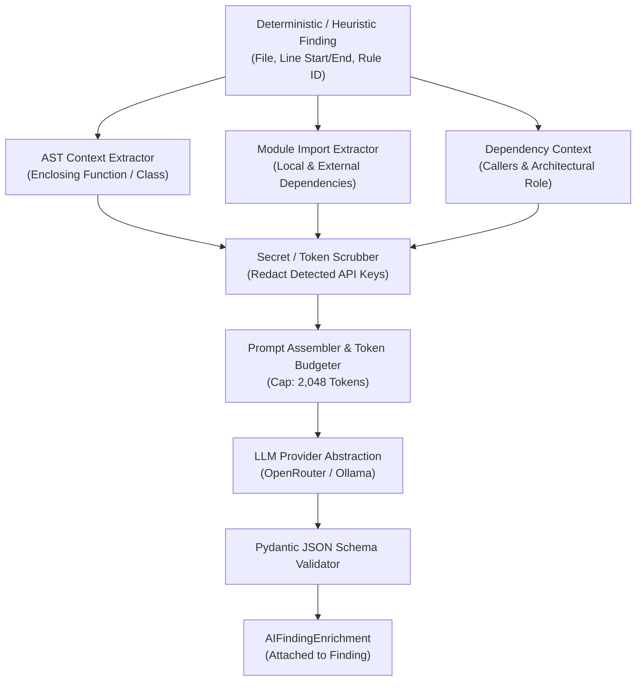

# CodeSentinel — AI Pipeline Specification & Guardrails

## 1. Principles & Hard Constraints

The CodeSentinel AI Pipeline is built on explicit safety and reliability principles:

1. **No Whole-Repository Dumps**: The LLM **never** receives an entire repository or unparsed file dumps. Doing so causes token context window exhaustion, high cost, and severe hallucination rates.
2. **Deterministic & Heuristic Primacy**: All candidate findings originate from deterministic AST rules or heuristic pattern detectors. The LLM is **never** the primary vulnerability detector.
3. **Bounded Context Budgeting**: The LLM receives strictly scoped context: the enclosing AST function/class block, relevant module imports, and immediate caller/callee signatures.
4. **Structured JSON Output & Schema Validation**: LLM outputs must conform to a strict Pydantic schema (`AIFindingEnrichment`). Malformed responses are rejected and logged.
5. **Clear Epistemic Distinction**: The UI and API must explicitly distinguish between verified static findings, AI assessments, and AI remediation suggestions. AI suggestions are never presented as guaranteed correct.

> [!NOTE]
> **Phase Status**: In **Phase 1**, this document establishes the formal pipeline contract, prompt schema, and provider abstraction. The AI pipeline implementation and integration occur in **Phase 5**.

---

## 2. Context Extraction & Assembly Workflow



### Context Envelope Budget
| Component | Maximum Token Budget | Contents |
| :--- | :--- | :--- |
| **System Instructions** | 350 tokens | Strict persona, security analysis rules, JSON schema instructions. |
| **Enclosing AST Block** | 1,000 tokens | Exact function or class declaration enclosing the finding. |
| **Imports & Signatures**| 250 tokens | Relevant imported libraries, helper functions, and types. |
| **Finding Metadata** | 150 tokens | Rule ID, detected pattern, CWE/OWASP classification. |
| **Reserved Output** | 600 tokens | Structured JSON completion. |
| **Total Context Window**| ~2,350 tokens | Fits comfortably within small local models (Ollama 7B) and commercial APIs. |

---

## 3. Provider Abstraction Architecture

The backend implements an extensible provider interface (`backend/app/services/llm/base.py`):

```python
from abc import ABC, abstractmethod
from pydantic import BaseModel

class LLMCompletionRequest(BaseModel):
    system_prompt: str
    user_prompt: str
    temperature: float = 0.1
    max_tokens: int = 1024

class LLMCompletionResponse(BaseModel):
    raw_content: str
    prompt_tokens: int
    completion_tokens: int
    provider: str
    model: str

class BaseLLMProvider(ABC):
    @abstractmethod
    async def complete(self, request: LLMCompletionRequest) -> LLMCompletionResponse:
        """Execute completion request against the configured provider."""
        pass
```

### Supported Providers:
1. **OpenRouter (`OpenRouterProvider`)**:
   - Primary commercial provider interface.
   - Defaults to models like `anthropic/claude-3.5-sonnet` or `openai/gpt-4o`.
2. **Ollama (`OllamaProvider`)**:
   - Primary local/air-gapped provider interface.
   - Communicates via local HTTP (`http://localhost:11434/api/generate`).
   - Defaults to code models like `deepseek-coder:6.7b` or `qwen2.5-coder:7b`.

---

## 4. Structured Output Contract

The LLM is prompted to return valid JSON conforming to the following Pydantic schema:

```json
{
  "validation_status": "CONFIRMED | PROBABLE_FALSE_POSITIVE | NEEDS_REVIEW",
  "explanation": "Clear, technical summary of why this code pattern is vulnerable or represents an anti-pattern in its specific context.",
  "risk_assessment": "Analysis of whether the pattern is reachable by untrusted input or mitigated by surrounding code.",
  "remediation_suggestion": "Step-by-step guidance for safe refactoring.",
  "unified_diff": "--- file.py\n+++ file.py\n@@ -45,1 +45,1 @@\n- subprocess.call(cmd, shell=True)\n+ subprocess.run(cmd_list, check=True)",
  "confidence": 0.95
}
```

### Validation & Error Handling:
- If the output fails JSON parsing or Pydantic validation, the pipeline attempts a single structured retry with the validation error feedback.
- If the second attempt fails, the finding is retained with an enrichment status of `ENRICHMENT_FAILED` without discarding the deterministic finding.
