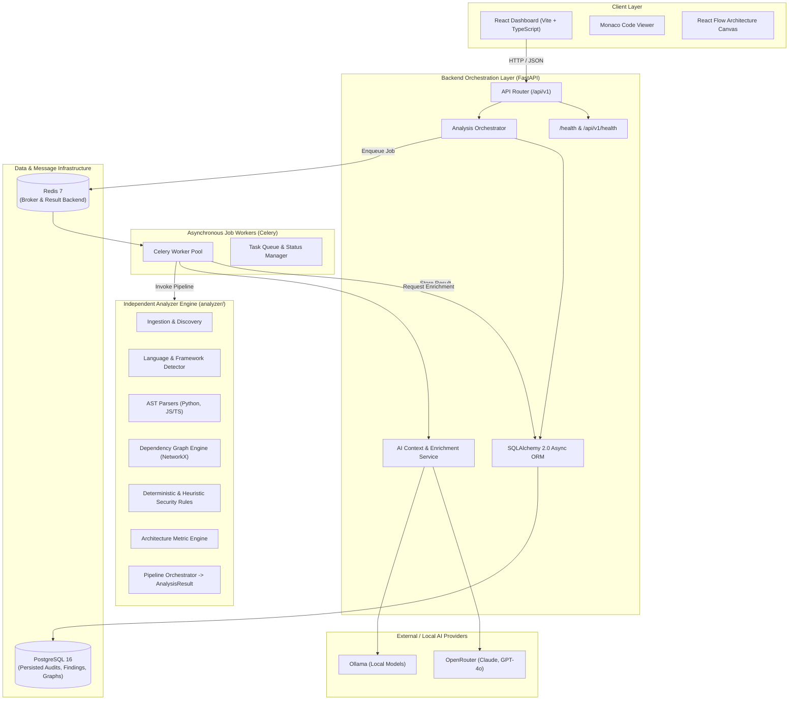
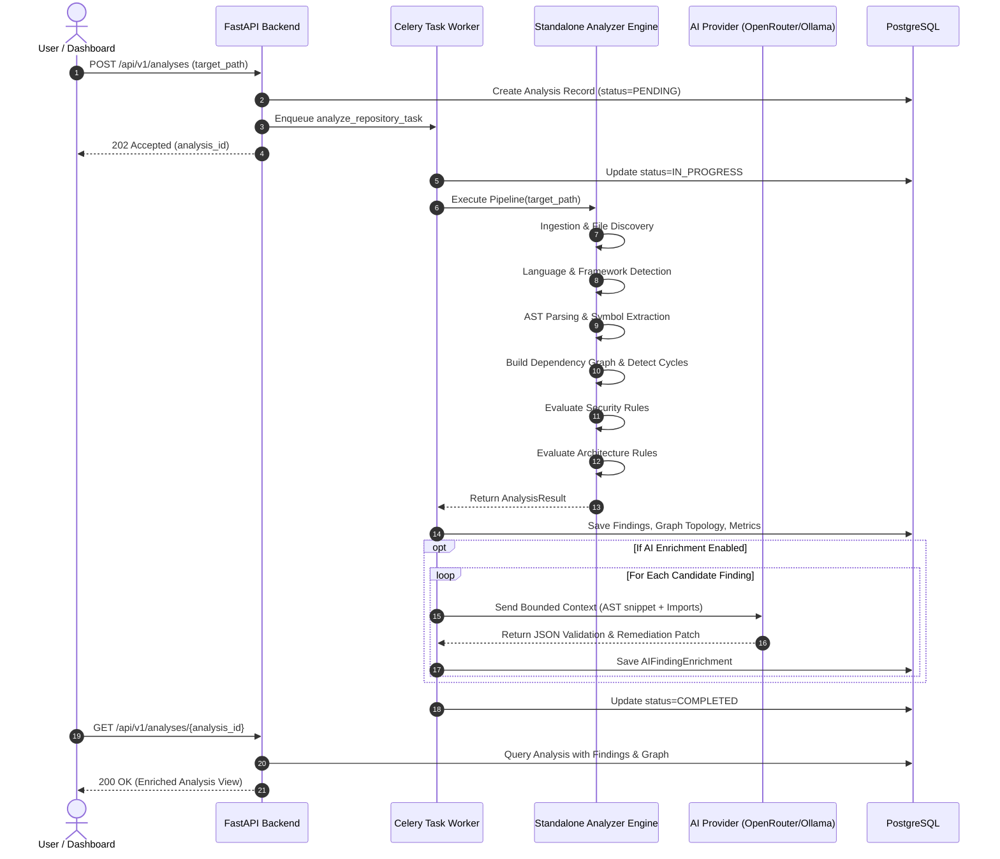
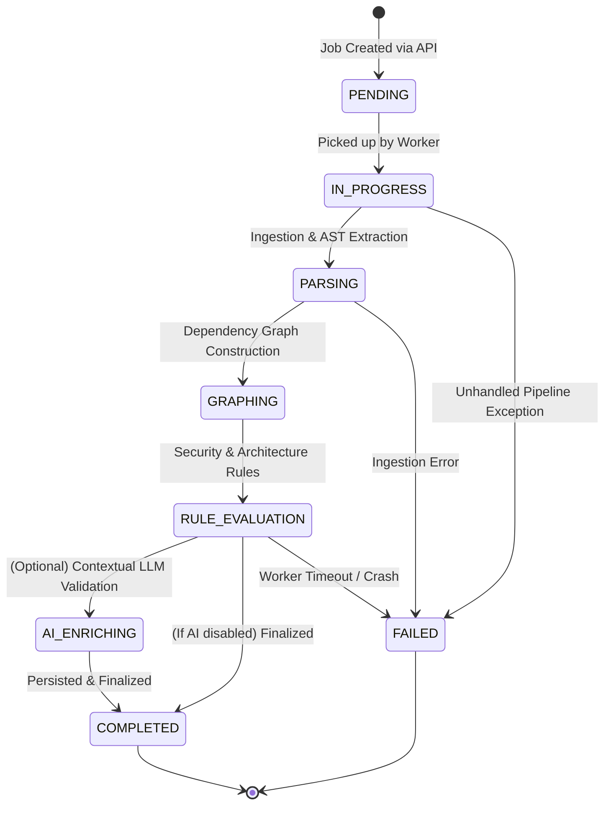

# CodeSentinel — System Architecture Document

## 1. High-Level Architecture Overview

CodeSentinel employs a decoupled, modular architecture designed for high determinism, clear boundary isolation, and explainable AI enrichment.



---

## 2. Core Separation Principle

A primary design constraint is that **`analyzer/` is completely decoupled from `backend/`**:

```
                       ┌──────────────────────┐
                       │  Source Code Files   │
                       └──────────┬───────────┘
                                  │
                                  ▼
 ┌──────────────────────────────────────────────────────────────────┐
 │                        analyzer/ Package                         │
 │                                                                  │
 │   1. Ingestion: scan directory, filter ignored paths             │
 │   2. Detection: classify languages and frameworks                │
 │   3. Parsing: generate ASTs (Python `ast`, JS/TS AST)            │
 │   4. Graphing: extract imports, compute cycles, fan-in/fan-out   │
 │   5. Rules: run deterministic & heuristic rules                  │
 │   6. Aggregator: produce strongly typed `AnalysisResult`         │
 └────────────────────────────────┬─────────────────────────────────┘
                                  │ AnalysisResult (Pydantic)
                                  ▼
 ┌──────────────────────────────────────────────────────────────────┐
 │                        backend/ Package                          │
 │                                                                  │
 │   1. Orchestrator calls analyzer in background worker            │
 │   2. Persists entities into PostgreSQL relational tables         │
 │   3. Selectively extracts code snippets for flagged findings     │
 │   4. Calls AI provider with bounded context for validation/patch │
 │   5. Exposes REST API for React frontend                         │
 └──────────────────────────────────────────────────────────────────┘
```

The analyzer does not know about databases, HTTP requests, web frameworks, or workers. This guarantees:
- Analyzer can be unit tested without starting servers or mocking DB connections.
- Analyzer can be distributed as a standalone CLI tool or integrated into CI/CD pipelines directly.
- Backend API bugs cannot corrupt analysis pipeline logic.

---

## 3. Analysis Pipeline Stages & Data Flow



---

## 4. Finding Classification Taxonomy

All findings generated by the system belong to one of three explicit evidence categories:

| Category | Description | Primary Evidence Source | Authority Level |
| :--- | :--- | :--- | :--- |
| **Deterministic** | Syntactically verified rule matches. Conditions are absolute (e.g. `shell=True` flag, `eval()` invocation). | AST node visitor match. | Authoritative; verified code defect or insecure configuration. |
| **Heuristic** | Contextual pattern matches where risk varies based on execution path or data source (e.g. potential raw SQL, high coupling). | AST pattern + lexical heuristic. | Advisory; flagged for developer review. |
| **AI-Assisted** | Contextual explanations, false-positive evaluations, and code remediation patches generated by LLM. | Bounded AST context + prompt. | Non-authoritative suggestion; requires developer approval. |

---

## 5. State Machine & Lifecycle of an Analysis Job



---

## 6. Implementation Status (Phase 3 Current)

- **Phase 1 (Complete)**:
  - Repository structure and specification docs.
  - Analyzer core interfaces, typed models (`findings.py`, `graph.py`, `results.py`), and base rule classes.
  - Backend FastAPI initialization, configuration via `pydantic-settings`, structured logging, and `/health` + `/api/v1/health` endpoints.
  - Frontend Vite + React + TypeScript setup with API client and health connection.
  - Infrastructure templates (`docker-compose.yml`, `.env.example`, `.gitignore`).
- **Phase 2 (Complete - Engine Foundation)**:
  - Safe repository ingestion and file discovery with `.gitignore` / `.sentinelignore`.
  - Deterministic language detection and evidence-based framework detection (Django, Flask, React).
  - Python AST parsing via `ast` and JavaScript/TypeScript/JSX/TSX concrete syntax tree parsing via Tree-sitter.
  - Normalized parse representation (`ParsedFile`, `ImportStatement`, `ExportStatement`, `SymbolDefinition`, `ParseError`).
  - Dependency resolution with standard-library (`sys.stdlib_module_names`) and Node built-in classification.
  - Directed architecture graph (NetworkX), coupling metrics, and circular dependency cycle detection.
  - End-to-end `AnalysisPipeline` producing strongly-typed, JSON-serializable `AnalysisResult`.
- **Phase 3 (Complete - Security & Architecture Rule Engine)**:
  - 8 Python/Django/Flask deterministic & heuristic security rules (`SEC-PY-001` through `SEC-PY-008`).
  - 6 JavaScript/TypeScript/React security rules (`SEC-JS-001` through `SEC-JS-006`).
  - 4 Architecture smell rules: `ARC-001` (circular dependencies), `ARC-002` (excessive fan-out coupling), `ARC-003` (god module), `ARC-004` (deep dependency chain with safe SCC condensation).
  - Central `RuleRegistry` and `RuleEngine` orchestrator with framework applicability filtering.
  - Deterministic UUIDv5 finding IDs and stable sort ordering (`file_path -> line_start -> col_start -> rule_id`).
  - Comprehensive 71-test automated suite with positive and negative boundary validation.
- **Phase 4 (Complete - CLI, Reporting, Configuration & Analysis Quality)**:
  - Standalone `codesentinel` CLI entry point with `analyze <path>`, format switches, and output redirection.
  - Formatted terminal report and machine-readable canonical JSON report with deterministically sorted collections and cyclic rotations.
  - Configuration subsystem (`AnalysisConfig`) with whitelist/blacklist semantics, conflict ambiguity rejection, and separation of data validation from registry boundary validation.
  - Dynamic architectural threshold overrides (`--god-module-loc`, fan-out, fan-in, depth).
  - Policy enforcement (`--fail-on`) with non-zero exit code (2) on threshold breaches.
  - Resilient zero-file handling for empty and unsupported repositories.
  - 105 automated tests verifying end-to-end analyzer behavior and repeated-run determinism.
- **Phase 5 (Complete - Finding Quality, Explainability, Precision & CLI Rule Inspection)**:
  - Additive model enhancements: `SourceLocation` optional end coordinates and aliases (`file`, `start_line`, `start_column`, `end_line`, `end_column`); `Finding` fields `message`, `explanation`, `evidence`, `file`, and `title`.
  - Severity vs. Confidence decoupling: severity measures impact; confidence measures static evidence strength (never ML or exploitability proof).
  - Centralized rule metadata (`RuleDefinition`, `rationale`, `supported_languages`, CWE, OWASP).
  - Structured evidence payloads across all 18 rules (secrets, cycles, god module coupling metrics, deep dependency chains).
  - Secret redaction guarantees for `SEC-PY-001` and `SEC-JS-004` (masking detected credentials in snippets, evidence, terminal, and JSON).
  - Deterministic deduplication in `RuleEngine` across `(rule_id, file_path, line_start, col_start, normalized_evidence)` preserving same-line distinct findings and canonical ordering.
  - CLI rule inspection (`codesentinel rules` list mode, `codesentinel rules <RULE_ID>` detail mode, `--format terminal/json`) with zero repo scan overhead.
  - Verified dependency classification semantics (`LOCAL`, `EXTERNAL`, `STDLIB`, `UNRESOLVED`).
  - Heuristic structural disclaimer on `ARC-003` and documented static analysis boundaries.
  - 131 automated unit and integration tests passing in ~3.2s.
- **Phase 6 (Next)**: Backend Orchestration, PostgreSQL Persistence & Celery Workers.
- **Phase 7**: AI Context Extraction Pipeline & Provider Integration (OpenRouter/Ollama).
- **Phase 8**: Interactive Web Dashboard, React Flow Graph Canvas & Monaco Code Viewer.
- **Phase 9**: Production Hardening, Multi-Stage Docker Builds & Release Packaging.


