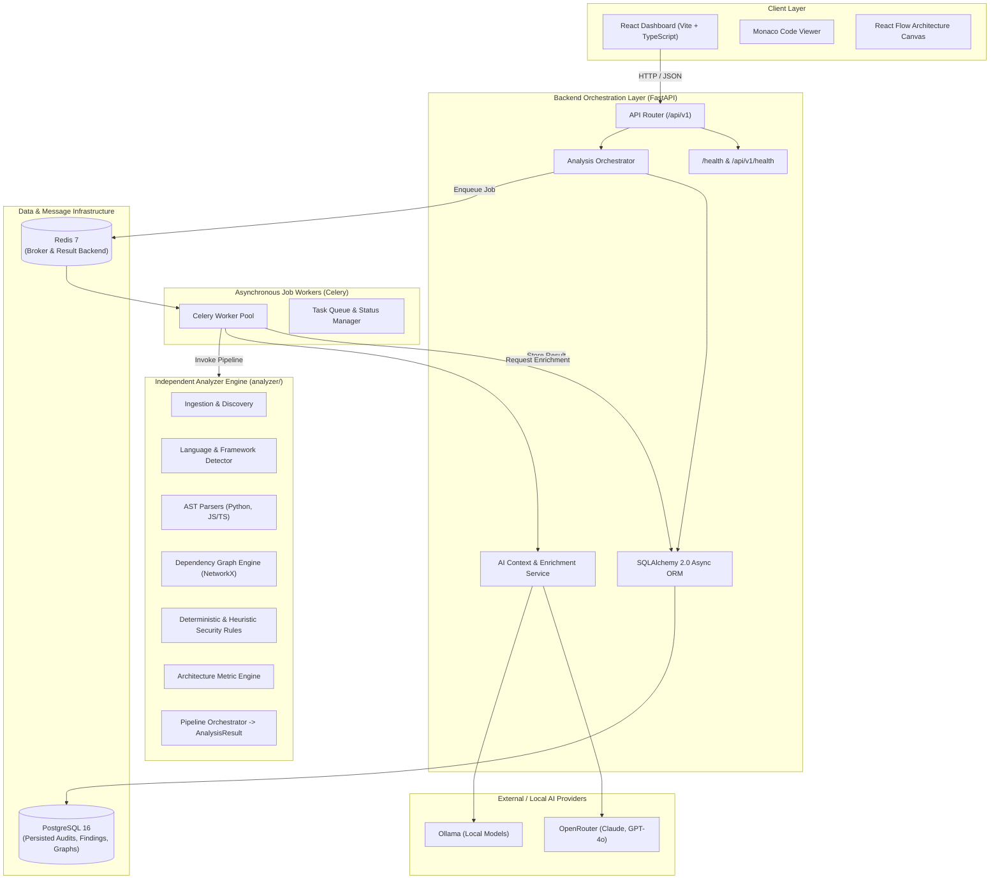
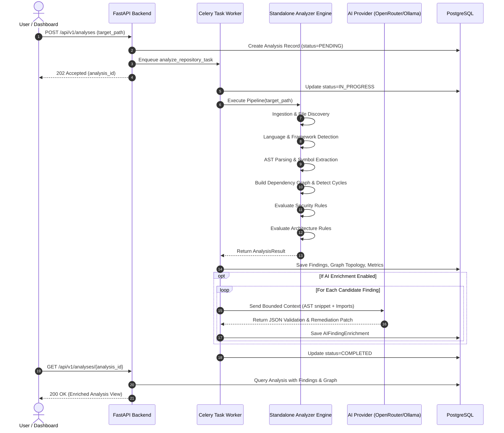
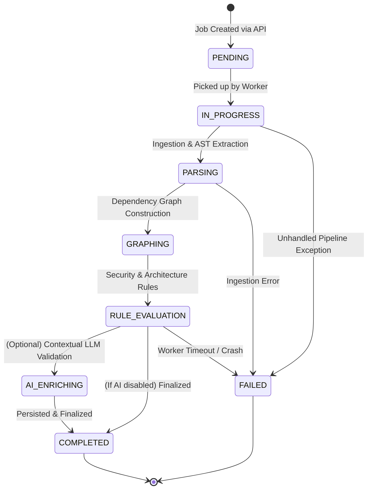

# CodeSentinel — System Architecture Document

## 1. High-Level Architecture Overview

CodeSentinel employs a decoupled, modular architecture designed for high determinism, clear boundary isolation, and explainable AI enrichment.



---

## 2. Core Separation Principle

A primary design constraint is that **`analyzer/` is completely decoupled from `backend/`**:

```
                       ┌──────────────────────┐
                       │  Source Code Files   │
                       └──────────┬───────────┘
                                  │
                                  ▼
 ┌──────────────────────────────────────────────────────────────────┐
 │                        analyzer/ Package                         │
 │                                                                  │
 │   1. Ingestion: scan directory, filter ignored paths             │
 │   2. Detection: classify languages and frameworks                │
 │   3. Parsing: generate ASTs (Python `ast`, JS/TS AST)            │
 │   4. Graphing: extract imports, compute cycles, fan-in/fan-out   │
 │   5. Rules: run deterministic & heuristic rules                  │
 │   6. Aggregator: produce strongly typed `AnalysisResult`         │
 └────────────────────────────────┬─────────────────────────────────┘
                                  │ AnalysisResult (Pydantic)
                                  ▼
 ┌──────────────────────────────────────────────────────────────────┐
 │                        backend/ Package                          │
 │                                                                  │
 │   1. Orchestrator calls analyzer in background worker            │
 │   2. Persists entities into PostgreSQL relational tables         │
 │   3. Selectively extracts code snippets for flagged findings     │
 │   4. Calls AI provider with bounded context for validation/patch │
 │   5. Exposes REST API for React frontend                         │
 └──────────────────────────────────────────────────────────────────┘
```

The analyzer does not know about databases, HTTP requests, web frameworks, or workers. This guarantees:
- Analyzer can be unit tested without starting servers or mocking DB connections.
- Analyzer can be distributed as a standalone CLI tool or integrated into CI/CD pipelines directly.
- Backend API bugs cannot corrupt analysis pipeline logic.

---

## 3. Analysis Pipeline Stages & Data Flow



---

## 4. Finding Classification Taxonomy

All findings generated by the system belong to one of three explicit evidence categories:

| Category | Description | Primary Evidence Source | Authority Level |
| :--- | :--- | :--- | :--- |
| **Deterministic** | Syntactically verified rule matches. Conditions are absolute (e.g. `shell=True` flag, `eval()` invocation). | AST node visitor match. | Authoritative; verified code defect or insecure configuration. |
| **Heuristic** | Contextual pattern matches where risk varies based on execution path or data source (e.g. potential raw SQL, high coupling). | AST pattern + lexical heuristic. | Advisory; flagged for developer review. |
| **AI-Assisted** | Contextual explanations, false-positive evaluations, and code remediation patches generated by LLM. | Bounded AST context + prompt. | Non-authoritative suggestion; requires developer approval. |

---

## 5. State Machine & Lifecycle of an Analysis Job



---

## 6. Implementation Status (Phase 1 vs Future)

- **Phase 1 (Current)**:
  - Repository structure and specification docs.
  - Analyzer core interfaces, typed models (`findings.py`, `graph.py`, `results.py`), and base rule classes.
  - Backend FastAPI initialization, configuration via `pydantic-settings`, structured logging, and `/health` + `/api/v1/health` endpoints.
  - Frontend Vite + React + TypeScript setup with API client and health connection.
  - Infrastructure templates (`docker-compose.yml`, `.env.example`, `.gitignore`).
- **Phase 2 (Next)**: Language detection, AST parsers for Python/JS/TS, and dependency graph construction.
- **Phase 3**: Implementation of initial security and architecture rule catalogs.
- **Phase 4**: Celery task workers, SQLAlchemy models, and PostgreSQL persistence.
- **Phase 5**: AI context extraction pipeline and OpenRouter/Ollama providers.
- **Phase 6**: React Flow dependency visualization, Monaco code viewer, and full interactive dashboard.
