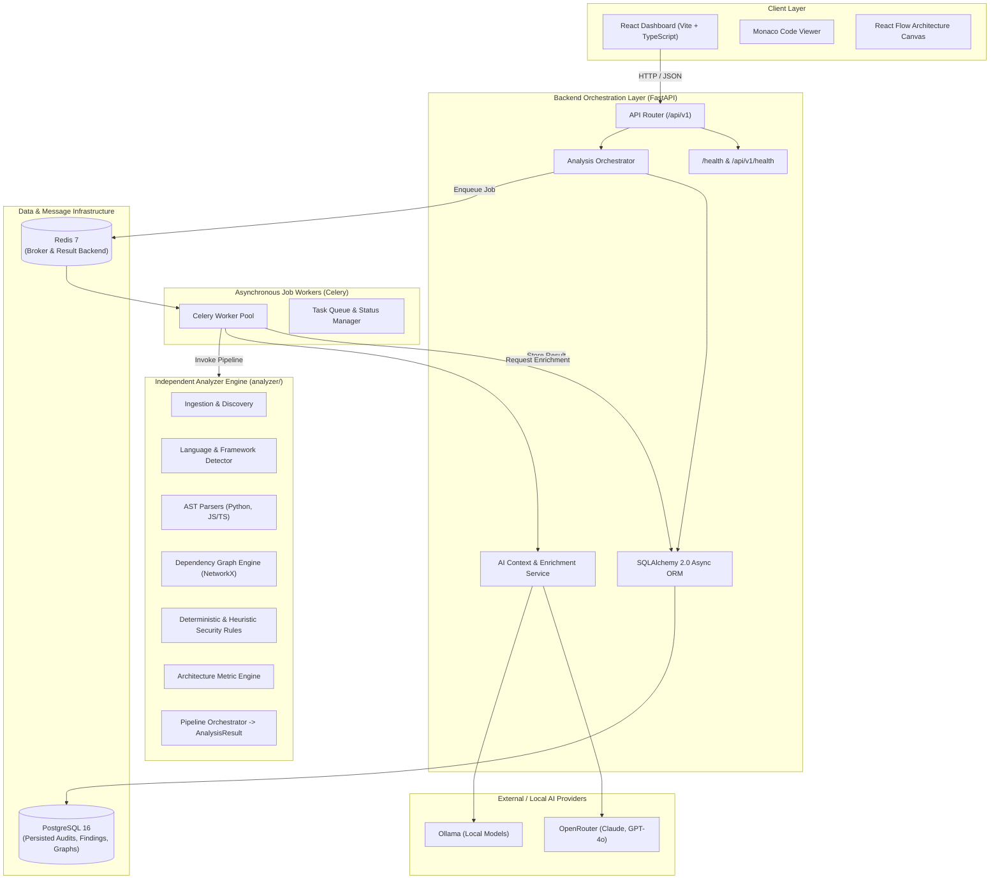
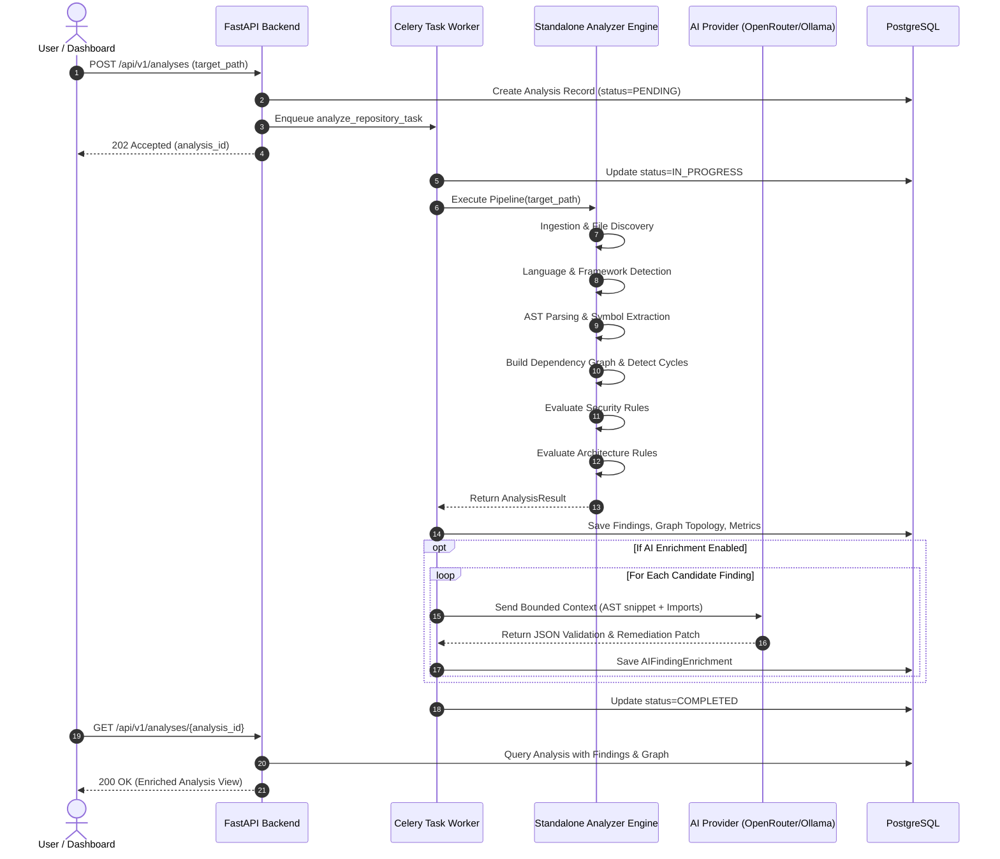
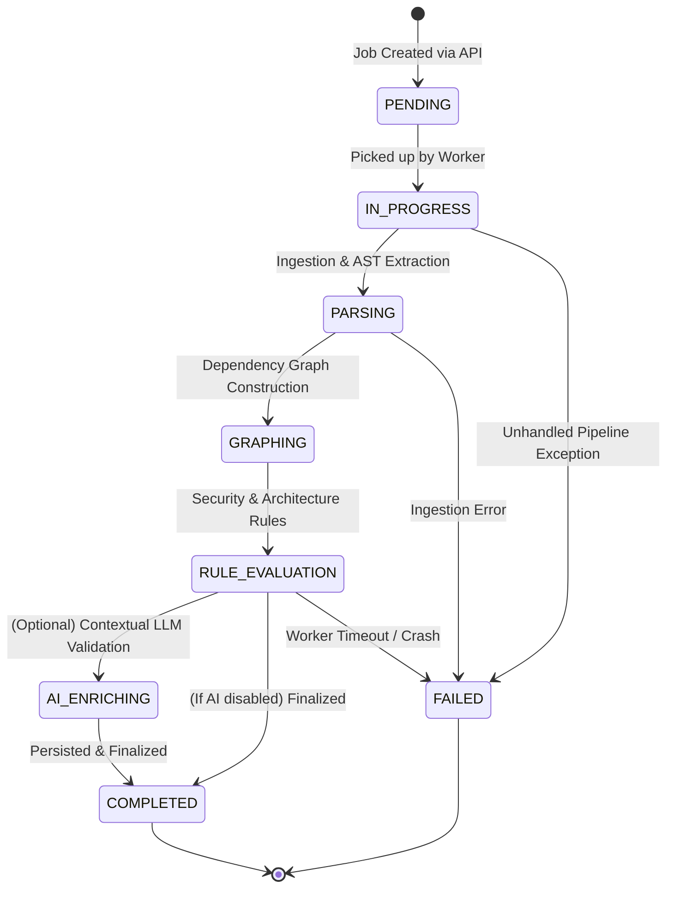
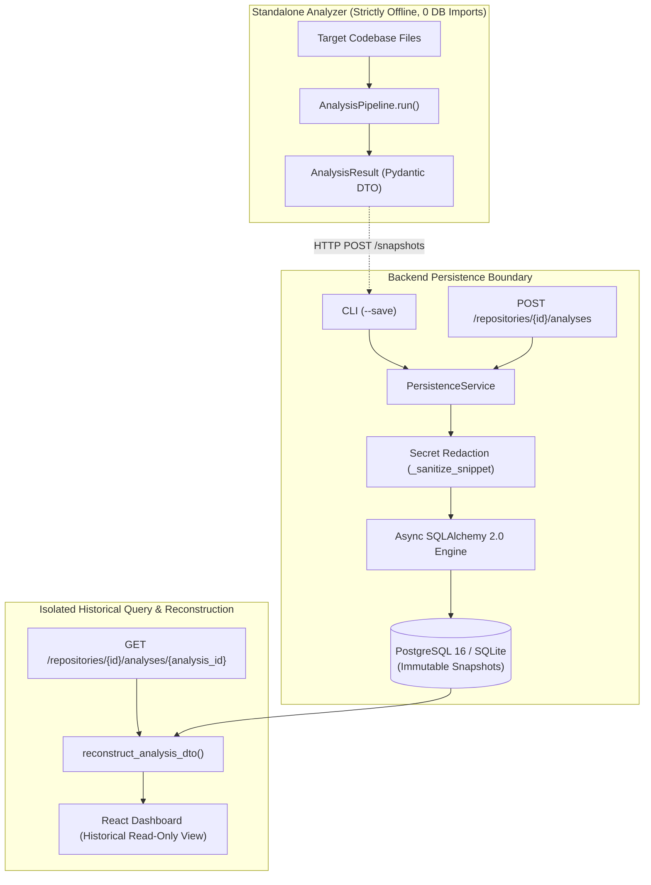
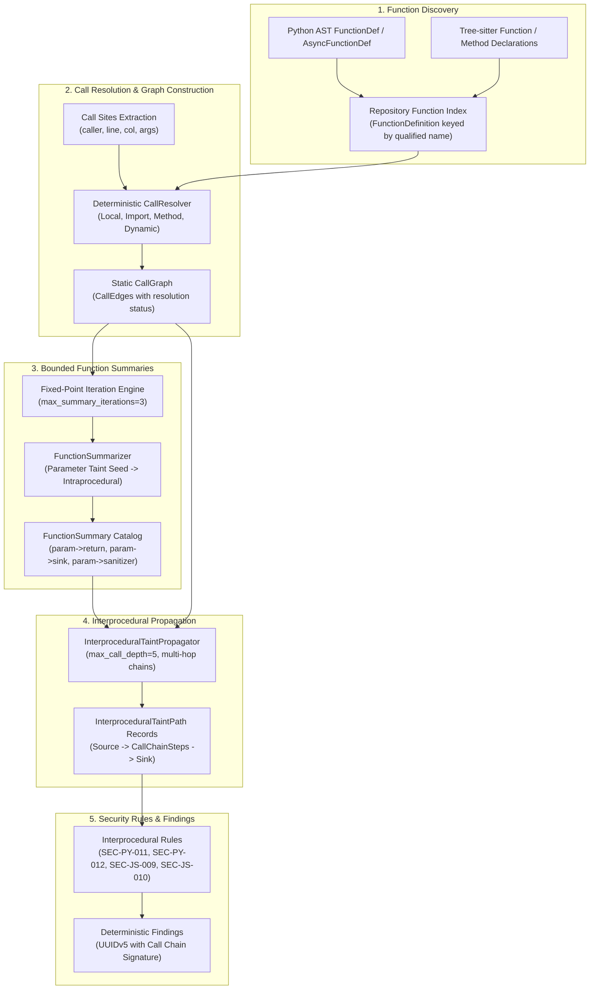
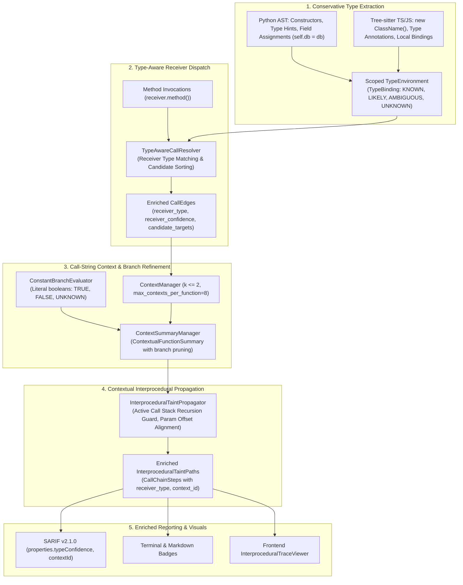
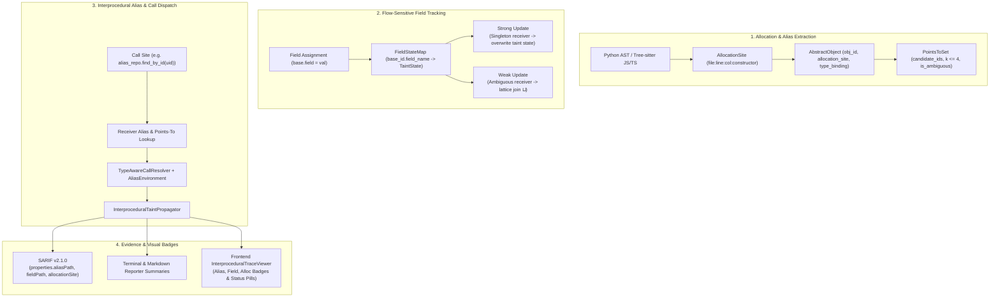

# CodeSentinel — System Architecture Document

## 1. High-Level Architecture Overview

CodeSentinel employs a decoupled, modular architecture designed for high determinism, clear boundary isolation, and explainable AI enrichment.



---

## 2. Core Separation Principle

A primary design constraint is that **`analyzer/` is completely decoupled from `backend/`**:

```
                       ┌──────────────────────┐
                       │  Source Code Files   │
                       └──────────┬───────────┘
                                  │
                                  ▼
 ┌──────────────────────────────────────────────────────────────────┐
 │                        analyzer/ Package                         │
 │                                                                  │
 │   1. Ingestion: scan directory, filter ignored paths             │
 │   2. Detection: classify languages and frameworks                │
 │   3. Parsing: generate ASTs (Python `ast`, JS/TS AST)            │
 │   4. Graphing: extract imports, compute cycles, fan-in/fan-out   │
 │   5. Rules: run deterministic & heuristic rules                  │
 │   6. Aggregator: produce strongly typed `AnalysisResult`         │
 └────────────────────────────────┬─────────────────────────────────┘
                                  │ AnalysisResult (Pydantic)
                                  ▼
 ┌──────────────────────────────────────────────────────────────────┐
 │                        backend/ Package                          │
 │                                                                  │
 │   1. Orchestrator calls analyzer in background worker            │
 │   2. Persists entities into PostgreSQL relational tables         │
 │   3. Selectively extracts code snippets for flagged findings     │
 │   4. Calls AI provider with bounded context for validation/patch │
 │   5. Exposes REST API for React frontend                         │
 └──────────────────────────────────────────────────────────────────┘
```

The analyzer does not know about databases, HTTP requests, web frameworks, or workers. This guarantees:
- Analyzer can be unit tested without starting servers or mocking DB connections.
- Analyzer can be distributed as a standalone CLI tool or integrated into CI/CD pipelines directly.
- Backend API bugs cannot corrupt analysis pipeline logic.

---

## 3. Analysis Pipeline Stages & Data Flow



---

## 4. Finding Classification Taxonomy

All findings generated by the system belong to one of three explicit evidence categories:

| Category | Description | Primary Evidence Source | Authority Level |
| :--- | :--- | :--- | :--- |
| **Deterministic** | Syntactically verified rule matches. Conditions are absolute (e.g. `shell=True` flag, `eval()` invocation). | AST node visitor match. | Authoritative; verified code defect or insecure configuration. |
| **Heuristic** | Contextual pattern matches where risk varies based on execution path or data source (e.g. potential raw SQL, high coupling). | AST pattern + lexical heuristic. | Advisory; flagged for developer review. |
| **AI-Assisted** | Contextual explanations, false-positive evaluations, and code remediation patches generated by LLM. | Bounded AST context + prompt. | Non-authoritative suggestion; requires developer approval. |

---

## 5. State Machine & Lifecycle of an Analysis Job



---

## 6. Implementation Status (Phase 3 Current)

- **Phase 1 (Complete)**:
  - Repository structure and specification docs.
  - Analyzer core interfaces, typed models (`findings.py`, `graph.py`, `results.py`), and base rule classes.
  - Backend FastAPI initialization, configuration via `pydantic-settings`, structured logging, and `/health` + `/api/v1/health` endpoints.
  - Frontend Vite + React + TypeScript setup with API client and health connection.
  - Infrastructure templates (`docker-compose.yml`, `.env.example`, `.gitignore`).
- **Phase 2 (Complete - Engine Foundation)**:
  - Safe repository ingestion and file discovery with `.gitignore` / `.sentinelignore`.
  - Deterministic language detection and evidence-based framework detection (Django, Flask, React).
  - Python AST parsing via `ast` and JavaScript/TypeScript/JSX/TSX concrete syntax tree parsing via Tree-sitter.
  - Normalized parse representation (`ParsedFile`, `ImportStatement`, `ExportStatement`, `SymbolDefinition`, `ParseError`).
  - Dependency resolution with standard-library (`sys.stdlib_module_names`) and Node built-in classification.
  - Directed architecture graph (NetworkX), coupling metrics, and circular dependency cycle detection.
  - End-to-end `AnalysisPipeline` producing strongly-typed, JSON-serializable `AnalysisResult`.
- **Phase 3 (Complete - Security & Architecture Rule Engine)**:
  - 8 Python/Django/Flask deterministic & heuristic security rules (`SEC-PY-001` through `SEC-PY-008`).
  - 6 JavaScript/TypeScript/React security rules (`SEC-JS-001` through `SEC-JS-006`).
  - 4 Architecture smell rules: `ARC-001` (circular dependencies), `ARC-002` (excessive fan-out coupling), `ARC-003` (god module), `ARC-004` (deep dependency chain with safe SCC condensation).
  - Central `RuleRegistry` and `RuleEngine` orchestrator with framework applicability filtering.
  - Deterministic UUIDv5 finding IDs and stable sort ordering (`file_path -> line_start -> col_start -> rule_id`).
  - Comprehensive 71-test automated suite with positive and negative boundary validation.
- **Phase 4 (Complete - CLI, Reporting, Configuration & Analysis Quality)**:
  - Standalone `codesentinel` CLI entry point with `analyze <path>`, format switches, and output redirection.
  - Formatted terminal report and machine-readable canonical JSON report with deterministically sorted collections and cyclic rotations.
  - Configuration subsystem (`AnalysisConfig`) with whitelist/blacklist semantics, conflict ambiguity rejection, and separation of data validation from registry boundary validation.
  - Dynamic architectural threshold overrides (`--god-module-loc`, fan-out, fan-in, depth).
  - Policy enforcement (`--fail-on`) with non-zero exit code (2) on threshold breaches.
  - Resilient zero-file handling for empty and unsupported repositories.
  - 105 automated tests verifying end-to-end analyzer behavior and repeated-run determinism.
- **Phase 5 (Complete - Finding Quality, Explainability, Precision & CLI Rule Inspection)**:
  - Additive model enhancements: `SourceLocation` optional end coordinates and aliases (`file`, `start_line`, `start_column`, `end_line`, `end_column`); `Finding` fields `message`, `explanation`, `evidence`, `file`, and `title`.
  - Severity vs. Confidence decoupling: severity measures impact; confidence measures static evidence strength (never ML or exploitability proof).
  - Centralized rule metadata (`RuleDefinition`, `rationale`, `supported_languages`, CWE, OWASP).
  - Structured evidence payloads across all 18 rules (secrets, cycles, god module coupling metrics, deep dependency chains).
  - Secret redaction guarantees for `SEC-PY-001` and `SEC-JS-004` (masking detected credentials in snippets, evidence, terminal, and JSON).
  - Deterministic deduplication in `RuleEngine` across `(rule_id, file_path, line_start, col_start, normalized_evidence)` preserving same-line distinct findings and canonical ordering.
  - CLI rule inspection (`codesentinel rules` list mode, `codesentinel rules <RULE_ID>` detail mode, `--format terminal/json`) with zero repo scan overhead.
  - Verified dependency classification semantics (`LOCAL`, `EXTERNAL`, `STDLIB`, `UNRESOLVED`).
  - Heuristic structural disclaimer on `ARC-003` and documented static analysis boundaries.
  - 131 automated unit and integration tests passing in ~3.2s.
- **Phase 6 (Complete - Dependency Resolution, Architecture Intelligence & Analysis Coverage)**:
  - Enhanced Python dependency resolution: `src/` layout auto-detection, `from foo import bar` submodule file resolution, accurate multi-level relative import traversal, strict `UNRESOLVED` enforcement (relative imports never silently become `EXTERNAL`).
  - Enhanced JavaScript/TypeScript resolution: extended extension probing (`.ts`, `.tsx`, `.js`, `.jsx`, `.mjs`, `.cjs`), directory index file resolution (`index.ts`, `index.tsx`, etc.), parent directory traversal (`../../`).
  - Static path alias resolution via `tsconfig.json` / `jsconfig.json`: `compilerOptions.baseUrl` and `compilerOptions.paths` mapping (e.g., `"@/*": ["src/*"]`). Unresolvable aliases classified as `UNRESOLVED` with structured diagnostic.
  - Re-export module specifier extraction in JS/TS parsers: `export { x } from './x'` and `export * from './module'` now register as import dependencies in the graph.
  - **Strictly repository-local architecture graph**: `graph.nodes` and NetworkX `G` contain ONLY discovered repository files. No fabricated external nodes with `loc=0`. External/stdlib/unresolved dependencies preserved on `DependencyEdge` objects.
  - Enriched `CouplingMetrics`: `local_dependencies_count`, `stdlib_dependencies_count`, `external_dependencies_count`, `unresolved_dependencies_count`, `connected_components_count`, `strongly_connected_components_count`.
  - Structured `DependencyDiagnostic` model on `AnalysisResult.dependency_diagnostics` explaining resolution failures.
  - Explicit `followlinks=False` enforcement in `os.walk` for repository boundary isolation.
  - Terminal reporter displays enriched metrics and dependency diagnostics section.
  - JSON reporter deterministically sorts `dependency_diagnostics`.
  - 181 automated tests (131 existing + 50 new Phase 6 tests) passing in ~3.7s.
- **Phase 7 (Complete - Component Layering, Architectural Boundary Enforcement & Codebase Health Scoring)**:
  - Subsystem and package ComponentGraph abstraction (`ComponentGraph`, `ComponentNode`, `ComponentEdge`, `PackageMetrics`) aggregating local source files into components with configurable depth collapsing (`--max-component-depth`, default: 2) and package boundary awareness (`__init__.py`, `index.ts`).
  - Strict Robert C. Martin package coupling metrics: Afferent Coupling ($C_a$, incoming from distinct other components), Efferent Coupling ($C_e$, outgoing to distinct other components), and Instability ($I = C_e / (C_a + C_e)$).
  - Architectural tier classification and layer boundary enforcement (`ArchitecturalTier.PRESENTATION`, `APPLICATION`, `DOMAIN`, `INFRASTRUCTURE`, `UTILITY`).
  - Four new architecture rules (bringing total registered catalog to 22 rules):
    - `ARC-005`: Layer Boundary Inversion (prohibited upward dependencies, e.g. `INFRASTRUCTURE -> PRESENTATION`).
    - `ARC-006`: Component Circular Dependency Group (SCC-based subsystem cycle detection with deterministic UUIDv5 finding IDs).
    - `ARC-007`: Stable Dependencies Principle Violation (stable $I \le 0.30, C_a \ge 2$ depending on volatile $I \ge 0.70$).
    - `ARC-008`: Potentially Orphaned Export (conservative dead-export scanning with whole-module import and entry-point suppression).
  - Deterministic Codebase Health & Risk Scoring (`HealthScoreCalculator`, `CodebaseHealth`, `SubScore`, `ScoreDeduction`):
    - Non-double-counting architecture mapping each finding to a single severity deduction.
    - Transparent deduction audit logs enabling exact reconstructibility ($100 - \sum \text{deductions} = \text{score}$).
    - Clamped to $[0.0, 100.0]$ with A-F grading and weighted composite score (55% Security + 45% Architecture).
  - Terminal and JSON reporters updated to display Codebase Health Grade badges, risk deduction items, and component graphs.
  - 206 automated tests passing in ~1.8s.
- **Phase 8 (Complete - Developer API Boundary & Interactive React Dashboard)**:
  - Local workstation FastAPI backend service with `POST /api/v1/analyze` and `GET /api/v1/rules`.
  - Local filesystem security boundary: canonical path resolution, directory validation, root drive rejection, and protected system directory blocking.
  - Interactive React 19 + Vite dashboard: Health & Overview cards, Findings Explorer with Monaco Editor code viewer, and React Flow (`@xyflow/react`) component dependency canvas.
  - Cumulative CLI filtering: `--severity`, `--category`, `--rule`.
- **Phase 9 (Complete - CI/CD Automation, Baseline Differential Analysis & SARIF Standards)**:
  - Safe Git provenance extraction without network or subprocesses (`commit_hash`, `branch`, `is_dirty`).
  - Native OASIS SARIF v2.1.0 report generation (`--format sarif`) compatible with GitHub Code Scanning, GitLab SAST, and Azure DevOps.
  - Deterministic multi-tier baseline comparator (`BaselineComparator`) tracking `NEW`, `RESOLVED`, `UNCHANGED`, and `MODIFIED` findings, health deltas, and component graph changes.
  - CI policy gating via `--fail-on-regression [SEVERITY]`.
  - Frontend "Baseline & Diff" explorer tab with drag-and-drop report comparison and regression highlight.
  - 244 automated unit and integration tests passing in ~9.7s.
- **Phase 10 (Complete - Persistent Analysis Storage, Repository Catalog & Immutable Snapshots)**:
  - Relational schema defined with Async SQLAlchemy 2.0 and versioned with Alembic migrations (`backend/alembic/versions/0001_phase10_initial_schema.py`).
  - Repository Catalog (`Repository` model) managing registered codebases with unique filesystem path constraints and path security validation.
  - Immutable historical snapshots (`AnalysisSnapshot`, `FindingSnapshot`, `HealthDeductionSnapshot`, `ComponentSnapshot`, `ComponentEdgeSnapshot`).
  - Secret redaction at persistence boundary (`_sanitize_snippet`) preventing credential leaks into database storage.
  - High-fidelity canonical reconstruction: `PersistenceService.reconstruct_analysis_dto` reconstitutes full `AnalysisResultDTO` from database records without re-running the analyzer.
  - Repository isolation: historical queries and detail lookups strictly enforce `repository_id` boundary checks.
  - CLI `--save` integration: stdlib-only HTTP sync (`_sync_analysis_to_backend`) allowing standalone CLI scans to persist directly into the backend database while preserving 100% offline default operation.
  - Frontend repository catalog dropdown, registration modal, and paginated historical analysis timeline viewer.
  - 259 automated tests passing (1 skipped) with AST verification proving 0 database/backend imports in `analyzer/`.
- **Phase 11 (Complete)**: Asynchronous Task Orchestration, Distributed Workers & Scalability (Celery 5.4, Redis 7, SSE streaming).
- **Phase 12 (Complete)**: Bounded Context AI Enrichment, Validation & Remediation Engine (OpenRouter / Ollama).
- **Phase 13 (Complete)**: Advanced Static Analysis, Intraprocedural Data-Flow & Taint Tracking, Component Centrality.
- **Phase 14 (Complete - Longitudinal Trend Intelligence, Developer Tooling & Reporting)**:
  - Declarative repository configuration (`.codesentinel.yml` / `.codesentinel.json`) with safe discovery, Pydantic schema validation, and SHA-256 integrity digest.
  - Three-tier configuration precedence engine: CLI Arguments > Repository Config > Built-in Defaults.
  - Multi-target enterprise reporting: PR Review Markdown (`markdown`), Zero-External-CDN Interactive HTML (`html`), JUnit XML (`junit`), and GitLab Code Quality JSON (`gitlab`).
  - Native pre-commit hook integration (`.pre-commit-hooks.yaml`).
  - Database migration `0005_phase14_trend_indexes.py` adding composite timeline indexes (`ix_snapshots_repo_created`, `ix_snapshots_repo_branch_created`).
  - Longitudinal trend analytics service (`TrendService.get_repository_trends()`) computing health score trajectories $H(t)$, defect churn/burndown velocity, severity volume stacks, and component instability drift $\Delta I(c)$.
  - Read-only REST API endpoint: `GET /api/v1/repositories/{id}/trends` enforcing repository isolation boundaries.
  - Frontend pure React SVG dashboard (`TrendsView.tsx`) mounted as a 5th tab in the navigation header.
  - 359 automated tests passing across analyzer (271 passed, 1 skipped) and backend (88 passed).
- **Phase 15 (Complete - Interprocedural Data-Flow Analysis & Call Graph Intelligence)**:
  - Repository-wide deterministic static call graph, bounded function summaries, cross-function taint propagation, and interprocedural rules (`SEC-PY-011`, `SEC-PY-012`, `SEC-JS-009`, `SEC-JS-010`).
  - Multi-file SARIF v2.1.0 `codeFlows`, call graph database persistence, and interactive frontend trace viewer (405 passing tests).
- **Phase 16 (Complete - Bounded Context-Sensitive & Type-Aware Static Analysis)**:
  - Conservative receiver type inference (`KNOWN`, `LIKELY`, `AMBIGUOUS`, `UNKNOWN`), type-aware method dispatch, bounded $k$-limiting call-string context sensitivity ($k \le 2$), constant-aware boolean branch condition evaluator, and active call stack recursion guards (441 passing tests).
- **Phase 17 (Complete - Bounded Alias, Points-To & Field-Sensitive Data-Flow Analysis)**:
  - Deterministic points-to set models (`PointsToSet`, $k \le 4$, widening lattice), flow-sensitive field state tracking (`FieldStateMap`), strong updates on singleton receivers, weak updates on ambiguous receivers, Python AST and Tree-sitter JS/TS alias extractors, SARIF v2.1.0 alias/field/alloc property bags, and trace viewer badges (474 passing tests).

---

## 7. Phase 10 Persistence & Snapshot Immutability Architecture



### Invariants:
1. **Zero Database Coupling in Analyzer**: The `analyzer/` package has zero awareness of SQLAlchemy, Alembic, or any database driver.
2. **Strict Immutability**: Analysis records are append-only. Each run creates a new immutable `AnalysisSnapshot` with a unique UUID. There is no mutable "latest" state pointer.
3. **Repository Isolation**: Repositories own their snapshots via foreign key constraints. Cross-repository snapshot queries return HTTP 404.
4. **Secret Sanitization**: Snippets flagged for credentials/secrets (`SEC-PY-001`, `SEC-JS-004`) have sensitive token values masked before persistent storage.

---

## 8. Phase 14 Longitudinal Trend & Developer Tooling Architecture

```mermaid
graph TD
    subgraph DevTooling ["Developer & CI/CD Layer"]
        RepoConfig[".codesentinel.yml / .codesentinel.json"]
        PreCommit[".pre-commit-hooks.yaml"]
        CLIArgs["CLI Invocation (--config, --format, --fail-on-regression)"]
        ThreeTierPrecedence["Three-Tier Resolution Engine\n(CLI > RepoConfig > Defaults)"]
        
        RepoConfig --> ThreeTierPrecedence
        CLIArgs --> ThreeTierPrecedence
        PreCommit --> CLIArgs
    end

    subgraph OfflinePipeline ["Standalone Offline Analyzer"]
        ThreeTierPrecedence --> AnalysisPipeline
        AnalysisPipeline --> Reporters
        
        subgraph Reporters ["Multi-Target Reporting Subsystem"]
            MarkdownRep["MarkdownReporter (PR Review Tables)"]
            HTMLRep["HTMLReporter (Standalone Zero-CDN Dark Theme)"]
            JUnitRep["JUnitReporter (xUnit CI Test Suite XML)"]
            GitLabRep["GitLabReporter (gl-code-quality-report.json)"]
            SARIFRep["SARIFReporter (OASIS v2.1.0)"]
            JSONRep["JSONReporter"]
            TermRep["TerminalReporter"]
        end
    end

    subgraph BackendTrends ["Backend Longitudinal Trend Subsystem"]
        TrendEndpoint["GET /api/v1/repositories/{id}/trends"]
        TrendService["TrendService.get_repository_trends()"]
        DBIndexes["Optimized Composite Indexes\n(repo_id, created_at, git_branch)"]
        SnapshotsTable[("analysis_snapshots")]
        FindingsTable[("finding_snapshots")]
        ComponentsTable[("component_snapshots")]

        TrendEndpoint --> TrendService
        TrendService --> DBIndexes
        DBIndexes --> SnapshotsTable
        DBIndexes --> FindingsTable
        DBIndexes --> ComponentsTable
    end

    subgraph FrontendTrends ["Frontend Longitudinal Trend Dashboard"]
        TrendsTab["Trends Navigation Tab (Header.tsx)"]
        TrendsView["TrendsView.tsx"]
        HealthChart["HealthTrajectoryChart (Pure SVG)"]
        DefectChart["DefectVelocityChart (New vs Resolved SVG)"]
        SeverityChart["SeverityVolumeChart (Stacked SVG)"]
        DriftCard["ComponentDriftCard (Instability Delta Table)"]

        TrendsTab --> TrendsView
        TrendsView --> HealthChart
        TrendsView --> DefectChart
        TrendsView --> SeverityChart
        TrendsView --> DriftCard
        TrendsView -.->|GET /api/v1/repositories/{id}/trends| TrendEndpoint
    end
```

### Invariants:
1. **Three-Tier Precedence**: Explicit command-line arguments always override repository configuration files (`.codesentinel.yml`), which in turn override built-in hardcoded defaults.
2. **Deterministic Config Hashing**: SHA-256 digest of normalized repository config ensures audits record exact rule parameters and threshold configurations without drift ambiguity.
3. **Zero External CDN Dependencies**: Generated standalone HTML reports embed all styles, SVGs, and interactions inline with zero external script or font CDN calls for safe enterprise air-gapped environments.
4. **Repository Isolation on Analytics**: Trend calculations strictly isolate snapshots to the target repository ID; invalid or cross-tenant lookups raise standard HTTP 404.
5. **Pure SVG React Charts**: Frontend trend visualizations use pure React and Tailwind SVG elements with responsive viewboxes, eliminating heavy, unvetted chart bundle dependencies.

---

## 9. Phase 15 Call Graph Intelligence & Interprocedural Data-Flow Subsystem

Phase 15 advances CodeSentinel from intraprocedural taint tracking to repository-wide bounded interprocedural data-flow analysis.



### Architectural Invariants:
1. **Layer Boundary Isolation**: Call graph and interprocedural analysis reside strictly within `analyzer/dataflow/callgraph` and `analyzer/dataflow/interprocedural`. They maintain zero imports of FastAPI, SQLAlchemy, PostgreSQL, Redis, or Celery.
2. **Resource-Bounded Execution**: All graph traversals and fixed-point summary calculations enforce hard deterministic resource limits: `max_call_depth = 5`, `max_functions_per_file = 200`, `max_total_functions = 5000`, `max_summary_iterations = 3`.
3. **Deterministic Finding IDs**: Finding UUIDs are generated deterministically using UUIDv5 based on canonical signatures incorporating source file, line, sink file, line, rule ID, and sorted call chain breadcrumbs.
4. **Multi-File SARIF Evidence**: Multi-location execution traces spanning multiple source files are registered with precise POSIX relative artifact URIs in SARIF `codeFlows`.
5. **Persistence Integrity**: Call graph statistics are persisted immutably in `analysis_snapshots.call_graph_summary` without mutating historical records.

---

## 10. Phase 16 Bounded Context-Sensitive & Type-Aware Static Analysis Subsystem

Phase 16 tightly couples conservative receiver type inference with bounded $k$-limiting call-string context sensitivity ($k \le 2$) to achieve high-precision cross-function taint tracking with zero combinatorial blowup.



### Architectural Invariants:
1. **Conservative Inference & Explicit Ambiguity**: Variables without unambiguous type evidence are assigned `UNKNOWN` or `AMBIGUOUS` with sorted candidate targets. The engine never makes arbitrary heuristic guesses.
2. **Deterministic Bounded Contexts ($k \le 2$)**: Call contexts push at most 2 call site identifiers. If a function exceeds `max_contexts_per_function` (default: 8), it widens cleanly to a merged context without combinatorial explosion.
3. **Method Parameter Offset Alignment**: Call site arguments are accurately mapped to callee summary parameters, accounting for implicit receiver parameters (`self` / `this`).
4. **Baseline Signature Invariance**: Receiver types and context IDs are stored inside finding evidence metadata, ensuring finding signatures `(rule_id, file_path, line_start, snippet)` remain identical for stable differential baseline comparison.
5. **Zero Database Migrations**: Type resolution and context sensitivity metrics are persisted inside the existing nullable JSON `call_graph_summary` column on `analysis_snapshots`.

---

## 11. Phase 17 Bounded Alias, Points-To & Field-Sensitive Data-Flow Subsystem

Phase 17 enhances interprocedural analysis with flow-sensitive alias tracking, deterministic points-to sets, and field-sensitive taint state management.



### Architectural Invariants:
1. **Bounded Points-To Budget ($k \le 4$)**: Allocation sites are deterministically hashed. A points-to set never exceeds 4 candidate objects; on overflow, it widens gracefully to ambiguous status to avoid combinatorial state explosion.
2. **Strong vs. Weak Update Semantics**: When a receiver is a known singleton object, field writes strongly overwrite previous taint states (enabling taint removal when safe values are assigned). When a receiver points to multiple candidates or is ambiguous, conservative weak update (lattice join $\sqcup$) is applied.
3. **Independent Field Identity**: Fields on the same base object (e.g. `req.user_id` and `req.auth_token`) are tracked with distinct composite keys (`base_id.field_name`), preventing cross-field taint pollution.
4. **Pure Python & Zero Dependency**: All alias models, field maps, and AST extractors use Python standard library constructs only, maintaining zero external dependencies in `analyzer/`.
5. **Zero-Migration Backward Compatibility**: Alias analysis metrics are embedded into the existing JSON `call_graph_summary` snapshot column without requiring database schema changes.

---

## 12. Phase 18 Bounded Path-Sensitive Control-Flow & Guard Analysis Subsystem

Phase 18 equips CodeSentinel with explicit intraprocedural Control-Flow Graphs (CFGs), propositional path constraint evaluation, and rule-specific guard reasoning.

```mermaid
graph TD
    subgraph CFGConstruction ["1. Intraprocedural CFG Construction"]
        ASTNodes["AST / Tree-sitter Nodes"]
        CFGBuilder["PythonCFGBuilder / JSTSCFGBuilder"]
        BasicBlocks["BasicBlock Partitioning\n(Leader Detection, Early Exits, Loops)"]
        ExceptionRouting["Statement-Level Try/Except/Finally\n(Catch Blocks, Finally Fallthroughs)"]
        ASTNodes --> CFGBuilder --> BasicBlocks --> ExceptionRouting
    end

    subgraph GuardEvaluation ["2. Propositional Guard & Refinement Evaluator"]
        ConditionExpr["Condition Expressions (isinstance, isdigit, regex, nullity)"]
        GuardEval["GuardEvaluator (AND, OR, NOT Decomposition)"]
        RefinementFacts["RefinementFact Sets\n(type, format, nullity, category sanitizers)"]
        ConditionExpr --> GuardEval --> RefinementFacts
    end

    subgraph PathExploration ["3. Bounded Path Exploration Engine"]
        CFGGraph["ControlFlowGraph"]
        PathEngine["PathExplorer (k_active <= 8, max_states <= 128, branch_depth <= 6)"]
        ContradictionPruning["Propositional Contradiction Pruning\n(INFEASIBLE Path Dropping)"]
        LatticeJoin["Monotonic Lattice Join ⊔\n(Taint, Alias, Field & Refinement Intersection)"]
        CFGGraph --> PathEngine --> ContradictionPruning --> LatticeJoin
    end

    subgraph InterproceduralEnrichment ["4. Interprocedural Path & Caller Guards"]
        CallChain["CallChainStep (path_condition, branch_taken, guard_predicate, path_status)"]
        CallerGuards["Caller-Side Guard Evaluation (_is_guard_satisfying_sink)"]
        SinkPreconditions["Rule-Specific Sink Preconditions\n(e.g. integer type suppresses SQL injection)"]
        SARIF18["SARIF v2.1.0 codeFlows & Terminal/Markdown Badges"]
        TraceViewer18["Frontend InterproceduralTraceViewer (Guard Badges, Branch Direction, Conditions)"]
        CallChain --> CallerGuards --> SinkPreconditions --> SARIF18
        SinkPreconditions --> TraceViewer18
    end
```



### Architectural Invariants:
1. **Guard Facts vs Global Taint Separation**: A type guard like `isinstance(x, int)` does NOT universally mark data as `SANITIZED`. Instead, it generates a path-local `RefinementFact` evaluated against sink preconditions (e.g. numeric narrowing suppresses SQL injection without clearing taint for LDAP or command injection).
2. **Precise Assert Semantics**: `assert cond` is evaluated as a branch fork: True continuation continues along normal flow with refined facts; False continuation terminates exceptionally with `AssertionError`.
3. **Statement-Level Try/Except/Finally**: Exceptions originate from individual statements within `try` blocks; `finally` executes unconditionally on both normal and exceptional exit paths.
4. **Finite Budget Guarantees**: Resource limits ($k_{\text{active}} \le 8$, max states $\le 128$, branch depth $\le 6$, conditions $\le 16$, loop iterations $\le 2$) ensure path exploration always terminates with bounded runtime.
5. **Finding Identity Invariance**: Path conditions and branch directions are recorded exclusively as evidence metadata (`step.path_condition`), preserving finding identity hashes (`uuid5`) and baseline differential stability.
6. **Zero-Migration Persistence**: Path sensitivity metrics (`cfg_blocks_analyzed`, `guards_evaluated`, `guarded_paths_pruned`, `paths_truncated_budget`) are serialized directly into the existing JSON `call_graph_summary` snapshot column.


