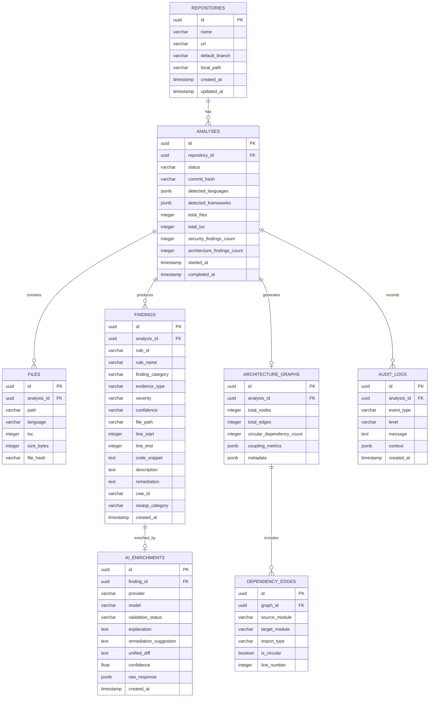

# CodeSentinel — Database Architecture & Schema Specification

## 1. Overview & Strategy

CodeSentinel uses **PostgreSQL 16+** as its primary persistent datastore. The database is utilized by the backend service to store repository metadata, historical analysis runs, findings, architecture dependency graphs, and AI enrichments.

> [!NOTE]
> **Phase Status**: In **Phase 1**, this schema serves as the formal architectural specification. Database connections and SQLAlchemy models are integrated during **Phase 4**. The Phase 1 health check purposefully avoids falsely claiming PostgreSQL connectivity until actually wired.

---

## 2. Entity-Relationship Diagram (ERD)



---

## 3. Detailed Table Specifications

### 3.1 `repositories`
Stores audited repositories and local paths.

```sql
CREATE TABLE repositories (
    id UUID PRIMARY KEY DEFAULT gen_random_uuid(),
    name VARCHAR(255) NOT NULL,
    url VARCHAR(1024),
    default_branch VARCHAR(100) DEFAULT 'main',
    local_path VARCHAR(1024) NOT NULL,
    created_at TIMESTAMPTZ NOT NULL DEFAULT NOW(),
    updated_at TIMESTAMPTZ NOT NULL DEFAULT NOW()
);

CREATE INDEX idx_repositories_name ON repositories(name);
```

### 3.2 `analyses`
Tracks individual analysis runs, status lifecycle, and summary statistics.

```sql
CREATE TABLE analyses (
    id UUID PRIMARY KEY DEFAULT gen_random_uuid(),
    repository_id UUID NOT NULL REFERENCES repositories(id) ON DELETE CASCADE,
    status VARCHAR(50) NOT NULL DEFAULT 'PENDING', -- PENDING, IN_PROGRESS, COMPLETED, FAILED
    commit_hash VARCHAR(64),
    detected_languages JSONB NOT NULL DEFAULT '{}'::jsonb,
    detected_frameworks JSONB NOT NULL DEFAULT '[]'::jsonb,
    total_files INTEGER NOT NULL DEFAULT 0,
    total_loc INTEGER NOT NULL DEFAULT 0,
    security_findings_count INTEGER NOT NULL DEFAULT 0,
    architecture_findings_count INTEGER NOT NULL DEFAULT 0,
    error_message TEXT,
    started_at TIMESTAMPTZ,
    completed_at TIMESTAMPTZ,
    created_at TIMESTAMPTZ NOT NULL DEFAULT NOW()
);

CREATE INDEX idx_analyses_repo_status ON analyses(repository_id, status);
CREATE INDEX idx_analyses_created_at ON analyses(created_at DESC);
```

### 3.3 `findings`
Stores deterministic and heuristic findings produced by the analysis engine.

```sql
CREATE TABLE findings (
    id UUID PRIMARY KEY DEFAULT gen_random_uuid(),
    analysis_id UUID NOT NULL REFERENCES analyses(id) ON DELETE CASCADE,
    rule_id VARCHAR(100) NOT NULL,
    rule_name VARCHAR(255) NOT NULL,
    finding_category VARCHAR(50) NOT NULL, -- SECURITY, ARCHITECTURE, QUALITY
    evidence_type VARCHAR(50) NOT NULL,    -- DETERMINISTIC, HEURISTIC, AI_ASSISTED
    severity VARCHAR(20) NOT NULL,         -- CRITICAL, HIGH, MEDIUM, LOW, INFO
    confidence VARCHAR(20) NOT NULL,       -- HIGH, MEDIUM, LOW
    file_path VARCHAR(1024) NOT NULL,
    line_start INTEGER NOT NULL,
    line_end INTEGER NOT NULL,
    code_snippet TEXT NOT NULL,
    description TEXT NOT NULL,
    remediation TEXT NOT NULL,
    cwe_id VARCHAR(50),
    owasp_category VARCHAR(100),
    created_at TIMESTAMPTZ NOT NULL DEFAULT NOW()
);

CREATE INDEX idx_findings_analysis_severity ON findings(analysis_id, severity);
CREATE INDEX idx_findings_rule_id ON findings(rule_id);
CREATE INDEX idx_findings_file_path ON findings(file_path);
```

### 3.4 `ai_enrichments`
Stores LLM explanations, validation assessments, and diff patches for findings.

```sql
CREATE TABLE ai_enrichments (
    id UUID PRIMARY KEY DEFAULT gen_random_uuid(),
    finding_id UUID NOT NULL UNIQUE REFERENCES findings(id) ON DELETE CASCADE,
    provider VARCHAR(50) NOT NULL,         -- openrouter, ollama
    model VARCHAR(100) NOT NULL,
    validation_status VARCHAR(50) NOT NULL,-- CONFIRMED, PROBABLE_FALSE_POSITIVE, NEEDS_REVIEW
    explanation TEXT NOT NULL,
    remediation_suggestion TEXT NOT NULL,
    unified_diff TEXT,
    confidence FLOAT NOT NULL,
    raw_response JSONB,
    created_at TIMESTAMPTZ NOT NULL DEFAULT NOW()
);

CREATE INDEX idx_ai_enrichments_finding_id ON ai_enrichments(finding_id);
```

### 3.5 `architecture_graphs` & `dependency_edges`
Stores dependency topology, circular dependency flags, and coupling metrics.

```sql
CREATE TABLE architecture_graphs (
    id UUID PRIMARY KEY DEFAULT gen_random_uuid(),
    analysis_id UUID NOT NULL UNIQUE REFERENCES analyses(id) ON DELETE CASCADE,
    total_nodes INTEGER NOT NULL DEFAULT 0,
    total_edges INTEGER NOT NULL DEFAULT 0,
    circular_dependency_count INTEGER NOT NULL DEFAULT 0,
    coupling_metrics JSONB NOT NULL DEFAULT '{}'::jsonb,
    metadata JSONB NOT NULL DEFAULT '{}'::jsonb,
    created_at TIMESTAMPTZ NOT NULL DEFAULT NOW()
);

CREATE TABLE dependency_edges (
    id UUID PRIMARY KEY DEFAULT gen_random_uuid(),
    graph_id UUID NOT NULL REFERENCES architecture_graphs(id) ON DELETE CASCADE,
    source_module VARCHAR(1024) NOT NULL,
    target_module VARCHAR(1024) NOT NULL,
    import_type VARCHAR(50) NOT NULL, -- STATIC, DYNAMIC, TYPE_ONLY
    is_circular BOOLEAN NOT NULL DEFAULT FALSE,
    line_number INTEGER
);

CREATE INDEX idx_dep_edges_graph_modules ON dependency_edges(graph_id, source_module, target_module);
CREATE INDEX idx_dep_edges_circular ON dependency_edges(graph_id) WHERE is_circular = TRUE;
```

---

## 4. Migration & Versioning Strategy

- **Alembic** manages all schema migrations under `backend/alembic/`.
- All migrations are forward-migrated using typed Python migration scripts.
- No direct database DDL executions in production.
