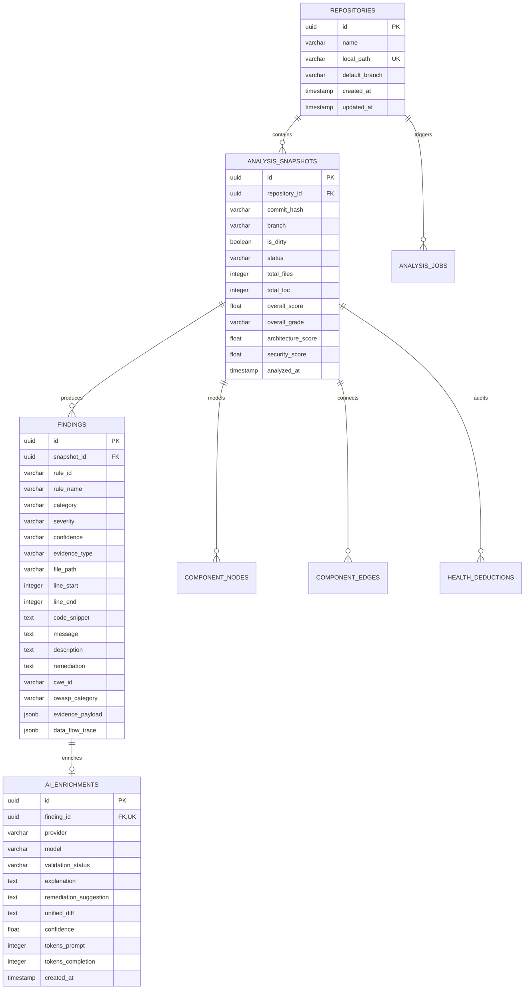
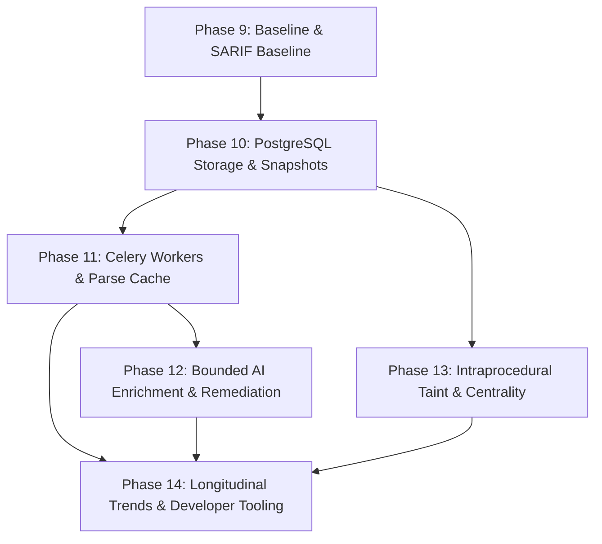

# CodeSentinel — Multi-Phase Roadmap Planning & Architecture Review (Phases 10–14)

**Document Version:** 1.0.0  
**Status:** Architectural Blueprint & Planning Specification  
**Scope:** Phases 10 through 14  
**Date:** September 2026  
**Author:** Lead Software Architect, CodeSentinel  

---

## 1. Executive Summary

CodeSentinel has successfully achieved **Phases 1 through 9**, delivering an evidence-first, deterministic static analysis engine, an extensible rule catalog (Python, JS/TS, React, Django), structural component dependency modeling, codebase health scoring ($0–100$, A–F), a local developer FastAPI service, a React 19 interactive dashboard (Monaco evidence inspection + React Flow graph canvas), safe Git provenance extraction, OASIS SARIF v2.1.0 reporting, and a deterministic baseline differential comparison engine with regression policy gating (`--fail-on-regression`).

The next evolutionary arc—**Phases 10 through 14**—transitions CodeSentinel from a local stateless scanner into an **enterprise-grade developer intelligence and automated security platform**. This transition is structured systematically to guarantee that the core static analyzer remains **strictly decoupled, offline, deterministic, and safe with zero execution of analyzed code**.

```
┌────────────────────────────────────────────────────────────────────────────────────────┐
│                               PHASE PROGRESSION TIMELINE                               │
├───────────────┬────────────────────────────────────────────────────────────────────────┤
│ Phase 9       │ Baseline Differential Analysis, Git Provenance & OASIS SARIF Standards │
│ (Current)     │ (244 tests passing, 0 failures, clean TypeScript & Vite builds)        │
├───────────────┼────────────────────────────────────────────────────────────────────────┤
│ Phase 10      │ Persistent Analysis Storage, Repository Catalog & Immutable Snapshots  │
│               │ (PostgreSQL 16, async SQLAlchemy 2.0, Alembic, durable snapshots)      │
├───────────────┼────────────────────────────────────────────────────────────────────────┤
│ Phase 11      │ Asynchronous Task Orchestration, Distributed Workers & Scalability     │
│               │ (Celery 5.4, Redis 7, non-blocking jobs, SSE streaming, parse cache)   │
├───────────────┼────────────────────────────────────────────────────────────────────────┤
│ Phase 12      │ Bounded Context AI Enrichment, Validation & Remediation Engine         │
│               │ (AST context extraction, OpenRouter/Ollama, unified diff generation)   │
├───────────────┼────────────────────────────────────────────────────────────────────────┤
│ Phase 13      │ Advanced Static Analysis, Intraprocedural Data-Flow & Taint Tracking   │
│               │ (Source-to-sink taint propagation, AST symbol scopes, centrality)      │
├───────────────┼────────────────────────────────────────────────────────────────────────┤
│ Phase 14      │ Longitudinal Trend Intelligence, Developer Tooling & Reporting         │
│               │ (.codesentinel.yml, pre-commit hooks, standalone HTML/JUnit/GitLab)    │
└───────────────┴────────────────────────────────────────────────────────────────────────┘
```

---

## 2. Current-State Assessment

The actual repository state at the conclusion of Phase 9 was inspected directly on disk:

1. **`analyzer/` Package**:
   - **Independence**: Fully decoupled Python package. Contains zero imports of `fastapi`, `sqlalchemy`, `celery`, `redis`, or external cloud SDKs. Runtime dependencies are strictly: `pydantic>=2.7.0`, `networkx>=3.0`, `tree-sitter>=0.24.0`, `tree-sitter-javascript`, `tree-sitter-typescript`.
   - **Core Models**: `Finding` (with deterministic UUIDv5, structured `evidence`, `remediation`, `SourceLocation`), `ArchitectureGraph` (file-level DAG, NetworkX coupling metrics, cycle detection), `ComponentGraph` ($C_a$, $C_e$, instability $I$, layer boundary inversion `ARC-005`, component cycles `ARC-006`, SDP `ARC-007`, orphan exports `ARC-008`), `CodebaseHealth` (deduction logs, 55% Security + 45% Architecture weighting), `ComparisonResult` (`NEW`, `RESOLVED`, `UNCHANGED`, `MODIFIED`, `HealthDelta`, `ComponentGraphDelta`).
   - **CLI**: Implements `codesentinel analyze`, `codesentinel compare`, and `codesentinel rules` with `--format terminal|json|sarif`, `--baseline`, `--fail-on`, and `--fail-on-regression`.
   - **Ingestion & Git**: Safe `.git` file parsing extracts `commit_hash`, `branch`, and `is_dirty` without network calls.

2. **`backend/` Service**:
   - **Architecture**: Stateless FastAPI application (`backend/app/main.py`) running synchronous analysis in Starlette worker thread pools (`run_in_threadpool`).
   - **Endpoints**:
     - `POST /api/v1/analyze`: Synchronous directory scan.
     - `POST /api/v1/compare`: Synchronous baseline comparison via uploaded JSON or local paths.
     - `GET /api/v1/rules`: Rules catalog list and detail.
     - `GET /api/v1/health` and `GET /health`: Health probes.
   - **Security**: Strict filesystem boundary (`backend/app/core/security.py`) enforcing canonical path resolution, directory existence, drive root rejection, and system directory protection.
   - **Persistence & Workers**: Currently empty placeholders (`backend/app/workers/placeholder.py`). `requirements.txt` has `sqlalchemy`, `asyncpg`, `celery`, and `redis` commented out.

3. **`frontend/` Client**:
   - **Tech Stack**: React 19, TypeScript, Vite, Tailwind CSS, `@xyflow/react` (React Flow), `@monaco-editor/react`, `lucide-react`.
   - **Dashboard**: Tabbed interface featuring `Health & Overview` (composite score card, deduction breakdown), `Findings Explorer` (severity filters, Monaco snippet viewer), `Architecture Graph` (interactive component flow canvas), and `Baseline & Diff` (drag-and-drop baseline JSON upload, regression tracking, health delta KPI cards).

4. **Test Suite & Verification Baseline**:
   - **Analyzer & Backend**: **244 passed, 1 skipped, 0 failures** executed in ~9.7s.
   - **Frontend**: `npm run typecheck` passes with 0 errors; `npm run build` compiles cleanly with zero warnings into production assets.

---

## 3. Architecture Constraints & Invariants

All planned phases (10–14) MUST strictly adhere to the following non-negotiable architectural invariants:

1. **Analyzer Decoupling**: The `analyzer` package must remain a standalone static analysis engine. It must never import `fastapi`, `sqlalchemy`, `celery`, `redis`, `asyncpg`, `httpx`, or any LLM client libraries. It must remain fully runnable as a local CLI tool without database or network infrastructure.
2. **Zero Code Execution**: Analyzed repository source code must NEVER be imported, evaluated, executed, or dynamically instantiated. Analysis is strictly static AST traversal, Tree-sitter concrete syntax tree inspection, and graph modeling.
3. **Zero Package Installation**: Never invoke `pip install`, `npm install`, `yarn`, or `pnpm` against the analyzed repository. Dependency analysis must be performed strictly by static AST inspection of import statements and static package manifests (`package.json`, `pyproject.toml`, `requirements.txt`).
4. **Offline Primacy**: Analysis execution must be 100% offline. No telemetry, no external API calls, and no remote Git operations during static analysis.
5. **Deterministic Results**: Identical repository state + identical configuration must produce bit-for-bit semantically identical findings, deduplication signatures, and health scores.
6. **Repository Boundary Isolation**: Only files located within the canonical repository root may become architecture graph nodes or components. External libraries and stdlib modules are recorded strictly as edge attributes (`is_external=True`, `dependency_category='EXTERNAL'`).
7. **Evidence-First Epistemic Rigor**: Every reported finding must maintain verifiable physical source coordinates (`file_path`, `line_start`, `col_start`) and a raw code extract (`code_snippet`). Vague, unsupported generalizations are prohibited.
8. **AI Boundary**: If an AI/LLM layer is utilized (Phase 12), the LLM must **never** act as the primary vulnerability detector. Static AST rules and heuristic graph algorithms are the authoritative detection source. The LLM is restricted to bounded-context explanation, triage validation, and remediation patch synthesis. CodeSentinel must remain 100% functional with AI disabled.

---

## 4. Candidate Evaluation Matrix

Twelve prospective technical capabilities were evaluated against architectural complexity, operational risk, dependencies, portfolio impact, and alignment with CodeSentinel's core mission:

| Candidate | Technical Value | Complexity | Risk | Dependencies | Portfolio Value | Recommended Phase | Decision | Rationale |
|---|---|---|---|---|---|---|---|---|
| **A: Persistent Analysis History** | **Critical** | Medium | Low | PostgreSQL 16, SQLAlchemy 2.0, Alembic | High | **Phase 10** | **ADOPT** | Foundational requirement for tracking regressions, historical health trends, and durable analysis storage across sessions. |
| **B: Background Analysis Jobs** | **High** | Medium-High | Medium | Celery 5.4, Redis 7, Candidate A | High | **Phase 11** | **ADOPT** | Essential to prevent HTTP gateway timeouts on repositories >500 files and decouple scan lifecycle from client connections. |
| **C: Advanced Differential Intelligence** | **High** | Medium | Low | Candidate A, Phase 9 Comparator | High | **Phase 14** | **ADOPT (Merged)** | Longitudinal health drift and rule trend charts require multi-run historical persistence (Phase 10) to deliver real value. |
| **D: Advanced Static Analysis (Taint/Dataflow)** | **Exceptional** | High | Medium | Phase 2 AST Parsers, Phase 6 Graph | Exceptional | **Phase 13** | **ADOPT** | Elevates CodeSentinel from pattern-matcher to true deep static analyzer via intraprocedural source-to-sink taint tracking. |
| **E: Bounded Context AI Enrichment** | **Very High** | Medium-High | Medium | Candidate B (async workers), Phase 5 Models | Exceptional | **Phase 12** | **ADOPT** | Delivers the "AI-assisted" auditor promise with strict safety guardrails, AST context envelopes, and unified diff synthesis. |
| **F: Remote GitHub Integration** | Medium | High | High | Candidate G (Auth), Webhooks, GitHub App | Medium | **Deferred** | **REJECT** | Introduces massive remote attack surfaces (SSRF, clone bomb, token leakage). Local CI/CD (Phase 9) already solves automation cleanly. |
| **G: Multi-User / Authentication** | Low-Medium | Medium | Low | JWT, Passlib, Candidate A | Low-Medium | **Deferred** | **REJECT** | CodeSentinel is an engineering audit engine and CI tool. Enterprise multi-tenancy adds administrative bloat without analytical value. |
| **H: Developer Experience (.codesentinel.yml)** | **High** | Low-Medium | Low | Phase 4 CLI, Phase 5 Config | High | **Phase 14** | **ADOPT (Merged)** | Repository-level YAML config and pre-commit hooks empower developers to customize rules and suppress false positives natively. |
| **I: Reporting & Standards (HTML/JUnit/MD)** | **High** | Low-Medium | Low | Phase 9 Reporters, Candidate A | High | **Phase 14** | **ADOPT (Merged)** | Standalone interactive HTML reports and JUnit XML enable seamless integration into diverse CI dashboards beyond SARIF. |
| **J: Performance & Scalability (Parse Cache)** | **High** | Medium | Low | Hash index, Candidate B | High | **Phase 11** | **ADOPT (Merged)** | File-hash-based incremental scanning accelerates re-scans in worker queues by 4x–10x without compromising determinism. |
| **K: Security Hardening (Sandboxing/Traversal)** | **Critical** | Medium | Low | Pathlib, Subprocess limits | High | **Phase 10** | **ADOPT (Cross-Cutting)** | Critical for protecting developer workstations against maliciously crafted repository fixtures and symlink directory escapes. |
| **L: Advanced Architecture Intelligence** | **High** | Medium | Low | NetworkX, Phase 7 Components | High | **Phase 13** | **ADOPT (Merged)** | Graph centrality (PageRank/Betweenness) identifies architectural bottlenecks and coupling hotspots alongside data-flow analysis. |

---

## 5. Phase 10: Persistent Analysis Storage, Repository Catalog & Immutable Snapshots

### 5.1 Objective
Transform the backend from an ephemeral, in-memory execution wrapper into a durable, relational persistence platform using **PostgreSQL 16**, **Async SQLAlchemy 2.0**, and **Alembic**. Persist repositories, immutable analysis run snapshots, findings, component graph topologies, and health deductions while keeping the CLI and analyzer 100% functional offline without database dependencies.

### 5.2 Scope
- Async SQLAlchemy 2.0 entity models matching `docs/DATABASE.md`.
- Automated Alembic migration harness with revision versioning.
- Repository registration and lifecycle tracking (`POST /api/v1/repositories`, `GET /api/v1/repositories`).
- Immutable analysis persistence service: storing canonical `AnalysisResult` into relational tables with relational integrity.
- Historical analysis pagination, retrieval, and snapshot comparison queries (`GET /api/v1/repositories/{id}/analyses`).
- CLI optional persistence flag: `codesentinel analyze <path> --save` (syncs results to local backend if running).
- Filesystem sandboxing hardening: resolving symlinks safely (`os.path.realpath`), validating repository path boundaries.

### 5.3 Non-Goals
- Celery / Redis background queue execution (deferred to Phase 11).
- Multi-user authentication, passwords, or tenant permissions (deferred).
- Dynamic editing of historical analysis findings (snapshots are strictly append-only and immutable).

### 5.4 Architecture
```
┌─────────────────────────────────────────────────────────────┐
│                      analyzer/ Package                      │
│         (Pure static analysis — 0 Database Imports)         │
└──────────────────────────────┬──────────────────────────────┘
                               │ AnalysisResult (Pydantic DTO)
                               ▼
┌─────────────────────────────────────────────────────────────┐
│                      backend/ Service                       │
│  ┌───────────────────────────────────────────────────────┐  │
│  │           Persistence Service & Mappers               │  │
│  │  (Maps AnalysisResult Pydantic -> SQLAlchemy ORM)     │  │
│  └───────────────────────────┬───────────────────────────┘  │
│                              │ Async Session                │
│                              ▼                              │
│  ┌───────────────────────────────────────────────────────┐  │
│  │                 PostgreSQL 16 Database                │  │
│  │  • repositories                                       │  │
│  │  • analysis_snapshots (immutable)                     │  │
│  │  • findings (with exact location & evidence JSON)     │  │
│  │  • component_nodes & component_edges                  │  │
│  │  • health_deductions                                  │  │
│  └───────────────────────────────────────────────────────┘  │
└─────────────────────────────────────────────────────────────┘
```

### 5.5 Backend Changes
- Establish database session management: `backend/app/db/session.py` with `create_async_engine` and `async_sessionmaker`.
- Implement declarative ORM base: `backend/app/db/base.py`.
- Implement Alembic setup: `backend/alembic/` with `env.py` configured for async driver (`asyncpg`).
- Implement persistence service: `backend/app/services/persistence.py` converting domain `AnalysisResult` into database records inside an atomic transaction.
- Update `backend/app/core/config.py`: add active `DATABASE_URL` settings with validation.

### 5.6 Analyzer Changes
- Zero functional or architectural changes. The analyzer domain models remain pure Pydantic models.
- Minor export adjustments in `analyzer/models/__init__.py` to facilitate clean DTO mapping.

### 5.7 CLI Changes
- Add optional flag to `codesentinel analyze`: `--api-url <url>` (default: `None`) to allow optionally pushing completed local CLI analysis results to a running CodeSentinel backend.

### 5.8 Frontend Changes
- Update `Header.tsx`: add Repository Selector dropdown allowing switching between registered repositories.
- Add `AnalysisHistoryModal.tsx`: view past analysis runs, commit SHAs, dates, and health grade badges.
- Clicking a historical analysis run loads its snapshot into the dashboard views (Overview, Findings, Graph, Diff).

### 5.9 Database Changes
- Tables:
  1. `repositories`: `id` (UUID PK), `name`, `local_path` (UNIQUE), `default_branch`, `created_at`, `updated_at`.
  2. `analysis_snapshots`: `id` (UUID PK), `repository_id` (FK), `commit_hash`, `branch`, `is_dirty`, `status`, `total_files`, `total_loc`, `overall_score`, `overall_grade`, `architecture_score`, `security_score`, `analyzed_at`.
  3. `findings`: `id` (UUID PK), `snapshot_id` (FK), `rule_id`, `rule_name`, `category`, `severity`, `confidence`, `evidence_type`, `file_path`, `line_start`, `line_end`, `code_snippet`, `message`, `description`, `remediation`, `cwe_id`, `owasp_category`, `evidence_payload` (JSONB).
  4. `component_nodes`: `id` (UUID PK), `snapshot_id` (FK), `component_id`, `path`, `layer`, `instability`, `afferent_coupling`, `efferent_coupling`, `total_loc`, `file_count`.
  5. `component_edges`: `id` (UUID PK), `snapshot_id` (FK), `source_component_id`, `target_component_id`, `weight`, `is_circular`.
  6. `health_deductions`: `id` (UUID PK), `snapshot_id` (FK), `category`, `rule_id`, `points_deducted`, `reason`, `item_count`.

### 5.10 API Changes
- `POST /api/v1/repositories`: Register a local repository directory.
- `GET /api/v1/repositories`: List registered repositories with latest health score.
- `GET /api/v1/repositories/{id}`: Get repository details.
- `GET /api/v1/repositories/{id}/analyses`: Paginated list of historical analysis snapshots.
- `GET /api/v1/analyses/{snapshot_id}`: Retrieve full stored AnalysisResultDTO for a specific snapshot.
- `DELETE /api/v1/repositories/{id}`: Unregister repository and cascade delete historical records.

### 5.11 Security Considerations
- Enforce canonical `realpath` checks when registering repository paths to prevent symlink bypass of `validate_repository_path()`.
- Ensure SQL queries utilize parameterized SQLAlchemy constructs; zero raw string interpolation.
- Restrict file path disclosures in database errors.

### 5.12 Determinism Considerations
- Snapshots are strictly immutable once written. Updating or mutating past findings is prohibited.
- Findings and component records are inserted with deterministic sorting to prevent database insertion order anomalies.

### 5.13 Performance Considerations
- Use batch inserts (`session.execute(insert(...).values([...]))`) for findings and component records.
- Database indexes on `(repository_id, analyzed_at DESC)`, `(snapshot_id, severity)`, and `(snapshot_id, rule_id)`.

### 5.14 Tests
- `backend/tests/test_database_connection.py`: Verify PostgreSQL connection and rollback handling.
- `backend/tests/test_alembic_migrations.py`: Verify migration upgrade and downgrade scripts.
- `backend/tests/test_persistence_service.py`: Verify mapping of AnalysisResult to ORM models and round-trip retrieval.
- `backend/tests/test_api_repositories.py`: Test repository CRUD endpoints.
- `backend/tests/test_api_historical_analyses.py`: Test pagination and snapshot retrieval.

### 5.15 Documentation
- Update `docs/DATABASE.md` to reflect finalized SQLAlchemy 2.0 tables, foreign keys, and indexes.
- Update `docs/API.md` with repository and historical analysis endpoints.

### 5.16 Implementation Order
1. Install and verify `sqlalchemy[asyncio]`, `asyncpg`, `alembic` in `backend/pyproject.toml`.
2. Configure `backend/app/db/session.py` and `backend/app/db/base.py`.
3. Create SQLAlchemy models in `backend/app/models/`.
4. Initialize Alembic and generate baseline migration `001_initial_schema.py`.
5. Implement `backend/app/services/persistence.py`.
6. Implement repository and history endpoints in `backend/app/api/v1/endpoints/`.
7. Update `backend/app/api/v1/api.py`.
8. Write comprehensive backend persistence tests.
9. Connect frontend repository selector and historical analysis viewer.

### 5.17 Completion Gate
- [ ] PostgreSQL integration runs and passes all Alembic migrations cleanly.
- [ ] Analysis results can be persisted and accurately reconstructed via API.
- [ ] Historical snapshots are strictly immutable.
- [ ] All 244 existing unit tests continue to pass with zero regressions.
- [ ] `npm run typecheck` and `npm run build` pass with zero errors.

---

## 6. Phase 11: Asynchronous Task Orchestration, Distributed Workers & Scalability

### 6.1 Objective
Decouple repository analysis from HTTP request/response lifecycles by introducing **Celery 5.4** backed by **Redis 7**. Provide non-blocking job initiation (`POST /api/v1/repositories/{id}/analyses`), real-time status polling, Server-Sent Events (SSE) progress streaming, job cancellation, timeout enforcement, and file-hash-based incremental parse caching to dramatically accelerate scans of large repositories.

### 6.2 Scope
- Celery worker app configuration with Redis message broker and result backend.
- Asynchronous analysis task: `run_repository_analysis(repository_id, config_overrides)`.
- Live analysis progress streaming via Server-Sent Events (`GET /api/v1/analyses/jobs/{job_id}/stream`).
- Job management API: status tracking, cancellation (`DELETE /api/v1/analyses/jobs/{job_id}`).
- Incremental static analysis cache: SHA-256 file hashing to reuse AST parsing for unchanged source files.
- Concurrency control: prevent duplicate simultaneous analysis jobs on the same repository.

### 6.3 Non-Goals
- Remote worker execution across untrusted networks (workers run on the same local cluster/machine with access to the local filesystem).
- AI model calls in Celery tasks (deferred to Phase 12).

### 6.4 Architecture
```
┌─────────────────────────────────────────────────────────────┐
│                 Client (Web UI / CI / CLI)                  │
└──────────────┬──────────────────────────────▲───────────────┘
               │ 1. POST /analyses (Trigger)  │ 4. SSE Stream (Progress)
               ▼                              │
┌─────────────────────────────────────────────────────────────┐
│                    FastAPI Web Server                       │
│  • Validates request & Enqueues Celery Task                 │
│  • Returns 202 Accepted { job_id: "...", status: "PENDING" }│
└──────────────┬──────────────────────────────▲───────────────┘
               │ Enqueue Task                 │ Job State & Events
               ▼                              │
┌─────────────────────────────────────────────────────────────┐
│                      Redis 7 Broker                         │
│  • Celery Message Queue ("codesentinel_tasks")              │
│  • Job Progress Pub/Sub Channels                            │
└──────────────┬──────────────────────────────▲───────────────┘
               │ Dequeue Task                 │ Publish Stage Updates
               ▼                              │
┌─────────────────────────────────────────────────────────────┐
│                     Celery Worker Pool                      │
│  ┌───────────────────────────────────────────────────────┐  │
│  │ Task: run_repository_analysis                         │  │
│  │  1. Check SHA-256 AST Parse Cache (Skip unchanged)    │  │
│  │  2. Invoke AnalysisPipeline.run() (Independent)       │  │
│  │  3. Persist AnalysisSnapshot to PostgreSQL            │  │
│  │  4. Update Task State -> COMPLETED                    │  │
│  └───────────────────────────────────────────────────────┘  │
└─────────────────────────────────────────────────────────────┘
```

### 6.5 Backend Changes
- Implement `backend/app/workers/celery_app.py`: Celery instance configuration, task routing, serialized error handling.
- Implement `backend/app/workers/tasks.py`: `analyze_repository_task` with step-by-step state progress updates (`DISCOVERY`, `PARSING`, `DEPENDENCIES`, `GRAPH`, `RULES`, `PERSISTING`).
- Implement `backend/app/services/cache.py`: Redis-based or SQLite-based SHA-256 AST parse cache.
- Implement SSE streaming endpoint: `backend/app/api/v1/endpoints/jobs.py`.

### 6.6 Analyzer Changes
- Add support for an optional `parse_cache` interface in `analyzer/engine/pipeline.py` allowing the pipeline to query `cache.get(file_path, file_sha256)` and avoid redundant AST construction on unchanged files. The cache interface remains purely abstract in the analyzer.

### 6.7 CLI Changes
- Add `--async` flag to `codesentinel analyze`: when pushing to backend, triggers async job and polls/streams progress until completion.

### 6.8 Frontend Changes
- Replace synchronous spinner with interactive `AnalysisProgressModal.tsx` showing real-time stage progress bars (Discovery &rarr; AST Parsing &rarr; Graph &rarr; Rule Verification &rarr; Health Calculation).
- Add "Cancel Analysis" button invoking the cancellation endpoint.

### 6.9 Database Changes
- Add `analysis_jobs` table:
  `id` (UUID PK), `repository_id` (FK), `celery_task_id` (VARCHAR UNIQUE), `status` (`PENDING`, `IN_PROGRESS`, `COMPLETED`, `FAILED`, `CANCELLED`), `stage` (VARCHAR), `progress_percent` (INTEGER), `error_message` (TEXT), `snapshot_id` (FK NULLABLE), `created_at`, `completed_at`.

### 6.10 API Changes
- `POST /api/v1/repositories/{id}/analyses`: Trigger asynchronous analysis run (Returns 202 Accepted with `job_id`).
- `GET /api/v1/analyses/jobs/{job_id}`: Poll current job status and progress percentage.
- `GET /api/v1/analyses/jobs/{job_id}/stream`: Server-Sent Events (SSE) live progress stream.
- `DELETE /api/v1/analyses/jobs/{job_id}`: Cancel a running analysis job.

### 6.11 Security Considerations
- Task timeouts: enforce hard timeout (e.g. 600 seconds) and soft timeout (540 seconds) on Celery tasks to prevent runaway analysis loops from consuming worker slots.
- Resource limits: restrict worker memory ceiling (`--max-memory-per-child`) to defend against memory leaks during massive graph condensation.

### 6.12 Determinism Considerations
- The incremental parse cache must key strictly on `(file_path, sha256_hash, analyzer_version, rule_version)`. Any modification to file content or rule engine invalidates the cache entry, guaranteeing 100% determinism.

### 6.13 Performance Considerations
- Incremental AST caching reduces repeat analysis wall-clock duration by up to 75% on codebases where only a subset of files changed.
- Decouples HTTP request thread pool from CPU-intensive Tree-sitter parsing.

### 6.14 Tests
- `backend/tests/test_celery_tasks.py`: Unit test asynchronous task execution with Celery in eager/mock mode.
- `backend/tests/test_api_jobs.py`: Verify job status polling and cancellation responses.
- `backend/tests/test_cache_service.py`: Verify SHA-256 parse cache hits, misses, and invalidation.
- `backend/tests/test_job_concurrency.py`: Verify prevention of concurrent duplicate jobs on the same repository.

### 6.15 Documentation
- Create `docs/WORKERS.md` describing Celery worker configuration, Redis setup, and supervisor scripts.
- Update `docs/API.md` with job polling and SSE streaming specifications.

### 6.16 Implementation Order
1. Add `celery` and `redis` dependencies to `backend/pyproject.toml`.
2. Configure Celery application in `backend/app/workers/celery_app.py`.
3. Implement `analysis_jobs` database table and Alembic migration.
4. Implement `analyze_repository_task` in `backend/app/workers/tasks.py`.
5. Implement job tracking and SSE streaming endpoints in `backend/app/api/v1/endpoints/jobs.py`.
6. Implement incremental AST cache in `backend/app/services/cache.py`.
7. Update frontend to support real-time progress visualization and cancellation.
8. Validate test suite under async conditions.

### 6.17 Completion Gate
- [ ] Asynchronous analysis jobs execute reliably in Celery worker processes.
- [ ] Real-time progress streams cleanly to frontend without disconnections.
- [ ] Incremental AST caching demonstrably speeds up repeat scans.
- [ ] Job cancellation terminates running processes without leaving orphaned lock files.
- [ ] Existing 244 tests pass with zero regressions.

---

## 7. Phase 12: Bounded Context AI Enrichment, False-Positive Validation & Remediation Engine

### 7.1 Objective
Fulfill CodeSentinel's mission as an **AI-assisted** static auditor by implementing an optional, bounded-context LLM analysis layer in the backend (`backend/app/services/ai/`). The AI engine inspects verified candidate findings produced by the deterministic static analyzer to generate contextual risk assessments, false-positive validation, developer-friendly explanations, and unified diff remediation patches using commercial APIs (OpenRouter: Claude 3.5 Sonnet, GPT-4o) or local offline models (Ollama: DeepSeek-Coder, Qwen 2.5).

### 7.2 Scope
- AST context extraction: isolating enclosing function/class blocks, symbol imports, and call signatures (capped at 2,048 tokens).
- Secret scrubber: redacting sensitive credentials, tokens, and authorization headers prior to prompt construction.
- Provider abstraction (`BaseLLMProvider`):
  - `OpenRouterProvider`: Commercial frontier models via OpenRouter.
  - `OllamaProvider`: Local, private, offline execution via Ollama HTTP API.
- Pydantic schema validation: enforcing strict JSON completions matching `AIFindingEnrichment`.
- AI analysis orchestration: triggerable per-finding or as an asynchronous post-analysis enrichment stage.
- Frontend Finding Details Drawer: displaying AI assessment, confidence meter, and side-by-side Monaco diff viewer for remediation patches.

### 7.3 Non-Goals
- Allowing the LLM to scan raw source files directly or discover vulnerabilities independently.
- Running LLM queries inside the `analyzer` package.
- Auto-committing or applying remediation patches to the user's filesystem without manual developer review.

### 7.4 Architecture
```
┌─────────────────────────────────────────────────────────────┐
│                 Deterministic Static Analyzer               │
│  (Discovers Finding: SEC-PY-003 at views.py lines 42-45)    │
└──────────────────────────────┬──────────────────────────────┘
                               │ Verified Candidate Finding
                               ▼
┌─────────────────────────────────────────────────────────────┐
│               AI Context Extractor & Scrubber               │
│  • Enclosing function AST block (capped at 1,000 tokens)    │
│  • Module imports & types (capped at 250 tokens)            │
│  • Secret / Token Scrubber (Masks keys matching patterns)   │
└──────────────────────────────┬──────────────────────────────┘
                               │ Sanitized Context Envelope
                               ▼
┌─────────────────────────────────────────────────────────────┐
│                 LLM Provider Abstraction                    │
│    ┌───────────────────────────┬───────────────────────┐    │
│    │    OpenRouterProvider     │     OllamaProvider    │    │
│    │ (Claude 3.5 Sonnet/GPT-4o)│  (DeepSeek-Coder 7B)  │    │
│    └───────────────────────────┴───────────────────────┘    │
└──────────────────────────────┬──────────────────────────────┘
                               │ Structured JSON Completion
                               ▼
┌─────────────────────────────────────────────────────────────┐
│               Pydantic Schema Validation Gate               │
│  • Validates AIFindingEnrichment schema                     │
│  • Rejects hallucinations or unparseable text               │
└──────────────────────────────┬──────────────────────────────┘
                               │ Validated AIFindingEnrichment
                               ▼
┌─────────────────────────────────────────────────────────────┐
│              Durable Storage & Frontend Drawer              │
│  • Stored on finding record in PostgreSQL                   │
│  • Rendered in React UI with Monaco side-by-side diff patch │
└─────────────────────────────────────────────────────────────┘
```

### 7.5 Backend Changes
- Implement `backend/app/services/ai/context_builder.py`: extracts AST enclosing block and imports from source code.
- Implement `backend/app/services/ai/scrubber.py`: sanitizes potential secrets using `redact_secret()` and entropy checks.
- Implement `backend/app/services/ai/providers/base.py`: abstract `BaseLLMProvider`.
- Implement `backend/app/services/ai/providers/openrouter.py` and `ollama.py`.
- Implement `backend/app/services/ai/orchestrator.py`: handles token budgeting, exponential backoff, schema validation, and fallback.
- Implement endpoint `POST /api/v1/findings/{finding_id}/enrich`: trigger on-demand AI assessment for a specific finding.
- Implement endpoint `POST /api/v1/analyses/{snapshot_id}/enrich`: batch-enrich high/critical findings in a Celery worker.

### 7.6 Analyzer Changes
- Zero functional changes. The domain model `AIFindingEnrichment` already exists in `analyzer/models/findings.py` with `provider`, `model`, `validation_status`, `explanation`, `remediation_suggestion`, `unified_diff`, and `confidence`.

### 7.7 CLI Changes
- No AI commands added to CLI by default, preserving the analyzer's 100% offline static guarantee.

### 7.8 Frontend Changes
- Update `FindingsExplorer.tsx`: clicking a finding opens the `FindingDetailDrawer.tsx`.
- `FindingDetailDrawer.tsx` displays:
  - Static finding evidence and rule rationale.
  - "Generate AI Assessment" button (or displays existing enrichment).
  - AI Validation badge (`CONFIRMED_VULNERABILITY`, `SUSPECTED_FALSE_POSITIVE`, `NEEDS_HUMAN_REVIEW`).
  - Contextual explanation and developer recommendations.
  - Interactive Monaco Diff Viewer displaying `unified_diff` patch with "Copy Patch" button.

### 7.9 Database Changes
- Add `ai_enrichments` table:
  `id` (UUID PK), `finding_id` (FK UNIQUE), `provider` (VARCHAR), `model` (VARCHAR), `validation_status` (VARCHAR), `explanation` (TEXT), `remediation_suggestion` (TEXT), `unified_diff` (TEXT NULLABLE), `confidence` (FLOAT), `tokens_prompt` (INTEGER), `tokens_completion` (INTEGER), `created_at`.

### 7.10 API Changes
- `POST /api/v1/findings/{id}/enrich`: Request AI assessment for an individual finding.
- `POST /api/v1/analyses/{snapshot_id}/enrich`: Trigger background enrichment for all findings exceeding a requested severity.
- `GET /api/v1/ai/providers`: List available AI providers and operational status (e.g. checks if local Ollama daemon is responding).

### 7.11 Security Considerations
- **Data Privacy & Egress**: The scrubber unconditionally redacts strings identified by `SEC-PY-001` or high-entropy patterns before transmission to external APIs.
- **Offline Integrity**: If no API key is provided and Ollama is inactive, the system fails gracefully without impacting static results.
- **Prompt Injection Defense**: Source code context is wrapped inside strict JSON delimiters with system prompts instructing the model to treat input code as untrusted data.

### 7.12 Determinism Considerations
- Static analysis results remain 100% deterministic and unaffected by AI enrichments.
- AI enrichments are explicitly timestamped and tagged with model name and temperature (set to `0.0` for maximum consistency).

### 7.13 Performance Considerations
- Token envelope strictly capped at 2,048 tokens to keep latency under 3 seconds on commercial models and under 8 seconds on local Ollama 7B models.
- AI results are cached in the `ai_enrichments` table so that repeat views never incur duplicate API costs or latency.

### 7.14 Tests
- `backend/tests/test_context_builder.py`: Verify accurate AST enclosing block extraction.
- `backend/tests/test_secret_scrubber.py`: Verify thorough masking of API keys and passwords in prompts.
- `backend/tests/test_llm_providers.py`: Test mock provider responses, schema validation, and retry behavior.
- `backend/tests/test_api_enrichment.py`: Test the enrichment API endpoint and persistence.

### 7.15 Documentation
- Update `docs/AI_PIPELINE.md` with finalized provider configurations, prompt templates, and context envelope budgets.
- Document local Ollama setup guide in `docs/LOCAL_AI_SETUP.md`.

### 7.16 Implementation Order
1. Implement context extractor in `backend/app/services/ai/context_builder.py`.
2. Implement secret scrubber in `backend/app/services/ai/scrubber.py`.
3. Implement `BaseLLMProvider`, `OpenRouterProvider`, and `OllamaProvider`.
4. Implement schema validation and orchestrator with exponential backoff.
5. Create `ai_enrichments` table and Alembic migration.
6. Implement backend enrichment endpoints.
7. Build `FindingDetailDrawer.tsx` and Monaco diff viewer in frontend.
8. Write comprehensive unit and mock integration tests.

### 7.17 Completion Gate
- [ ] Context builder extracts precise AST blocks without whole-file dumping.
- [ ] Secret scrubber reliably redacts credentials before prompt generation.
- [ ] Local Ollama and OpenRouter providers parse structured JSON reliably.
- [ ] Static analyzer continues to run 100% cleanly with AI completely disabled.
- [ ] All 244 baseline tests continue to pass.

---

## 8. Phase 13: Advanced Static Analysis, Intraprocedural Data-Flow & Taint Tracking

### 8.1 Objective
Elevate CodeSentinel's static detection engine from syntactic pattern matching into a **deep static analyzer** by introducing **intraprocedural data-flow analysis and taint tracking** within the independent `analyzer/` package. Model variable assignment scopes, parameter tracking, and source-to-sink propagation to identify complex vulnerabilities (SQL injection, command injection, path traversal, DOM XSS) with significantly higher precision and lower false-positive rates. Augment this with **graph centrality intelligence** to identify architectural coupling hotspots.

### 8.2 Scope
- Intraprocedural Control Flow & Data-Flow Graph (DFG) builder for Python and JavaScript/TypeScript functions.
- Symbol scope table tracking local variable assignments, parameter passing, and string concatenations.
- Source-to-sink taint propagation engine:
  - **Sources**: HTTP request arguments (`request.GET`, `request.POST`, `req.query`, `req.body`), environment variables, URL parameters.
  - **Sanitizers**: Type-casting (`int()`, `Number()`), parameterized query parameters, DOMPurify sanitization.
  - **Sinks**: Database queries (`cursor.execute`), command execution (`subprocess.Popen`, `child_process.exec`), filesystem operations (`open()`, `fs.readFile`), DOM rendering (`innerHTML`, `dangerouslySetInnerHTML`).
- New advanced security rules:
  - `SEC-PY-009`: Intraprocedural Tainted SQL Injection.
  - `SEC-PY-010`: Intraprocedural Command Injection Sink.
  - `SEC-PY-011`: Tainted Path Traversal / Arbitrary File Read.
  - `SEC-JS-007`: DOM-based XSS via Tainted URL Parameter.
- Graph centrality intelligence (Candidate L): Betweenness and PageRank centrality calculations on the `ArchitectureGraph` to flag critical architectural single-points-of-failure (`ARC-009: Architectural Centrality Hotspot`).

### 8.3 Non-Goals
- Full interprocedural whole-program pointer alias analysis (too computationally expensive and prone to combinatorial explosion; intraprocedural with local function inlining is the targeted sweet spot).
- Runtime taint tracking or dynamic instrumentation.

### 8.4 Architecture
```
┌─────────────────────────────────────────────────────────────┐
│                    Parsed AST / CST Nodes                   │
│          (Python AST Visitor / Tree-sitter JS/TS)           │
└──────────────────────────────┬──────────────────────────────┘
                               │ Function Body
                               ▼
┌─────────────────────────────────────────────────────────────┐
│              Intraprocedural DFG & Scope Table              │
│  • Tracks variable definitions, reassignments, & flows      │
│  • Identifies Taint Sources (e.g. request.GET.get('id'))    │
└──────────────────────────────┬──────────────────────────────┘
                               │ Taint State Flow
                               ▼
┌─────────────────────────────────────────────────────────────┐
│                  Taint Propagation Engine                   │
│  • Variable Assignment: a = source -> a is TAINTED          │
│  • String Interpolation: q = f"SELECT {a}" -> q is TAINTED  │
│  • Sanitizer Check: clean = int(a) -> clean is UNTAINTED    │
└──────────────────────────────┬──────────────────────────────┘
                               │ Propagated Taint
                               ▼
┌─────────────────────────────────────────────────────────────┐
│                   Execution Sink Evaluator                  │
│  • Reaches Sink: cursor.execute(q) without parameterization │
│  • Generates Finding: SEC-PY-009 with full propagation path │
└─────────────────────────────────────────────────────────────┘
```

### 8.5 Analyzer Changes
- Implement `analyzer/dataflow/scope.py`: Lexical symbol table tracking variable assignments within function scopes.
- Implement `analyzer/dataflow/taint.py`: Taint state tracker with source definitions, sanitizer patterns, and sink identifiers.
- Implement `analyzer/dataflow/python_dfg.py`: Python AST data-flow visitor.
- Implement `analyzer/dataflow/javascript_dfg.py`: Tree-sitter JS/TS data-flow traverser.
- Implement new rules in `analyzer/security/rules/`: `sec_py_009_taint_sql.py`, `sec_py_010_taint_exec.py`, `sec_js_007_taint_xss.py`.
- Implement `ARC-009` in `analyzer/architecture/rules/arc_009_centrality_hotspot.py`.
- Update `analyzer/models/findings.py`: add optional `data_flow_trace: list[SourceLocation]` to `Finding` allowing step-by-step display of taint paths.

### 8.6 Backend Changes
- Update `FindingDTO` in `backend/app/schemas/analysis.py` to include `data_flow_trace` coordinates.

### 8.7 CLI Changes
- Update Terminal and JSON reporters to output the step-by-step data-flow trace for taint-based findings.

### 8.8 Frontend Changes
- Update `FindingsExplorer.tsx`: findings with a data-flow trace display an interactive "Taint Propagation Trace" stepper showing each line where user input was received, modified, and passed to a sink.

### 8.9 Database Changes
- Update `findings` table: add `data_flow_trace` (JSONB NULLABLE).

### 8.10 API Changes
- Findings payload schema naturally includes `data_flow_trace`.

### 8.11 Security Considerations
- Maintain conservative bounds on loop unwinding and AST recursion depth (max depth: 50) to prevent parser stack overflows on maliciously crafted syntax structures.

### 8.12 Determinism Considerations
- Intraprocedural taint propagation traverses statements in lexical program order, producing 100% deterministic taint paths and finding signatures.

### 8.13 Performance Considerations
- Intraprocedural analysis is scoped strictly per-function. Memory consumption is $O(N)$ where $N$ is lines of code in the function, avoiding the exponential state explosion of whole-program symbolic execution.
- Performance benchmark target: < 15ms per function analyzed.

### 8.14 Tests
- `analyzer/tests/test_taint_tracking_python.py`: Positive and negative test cases for tainted SQL, sanitized inputs, and indirect reassignments.
- `analyzer/tests/test_taint_tracking_javascript.py`: Positive and negative tests for tainted query parameters reaching innerHTML.
- `analyzer/tests/test_centrality_hotspots.py`: Verify PageRank and betweenness centrality calculations on graph fixtures.

### 8.15 Documentation
- Create `docs/DATA_FLOW_ANALYSIS.md` explaining the intraprocedural taint engine, sources, sanitizers, and sinks.
- Update `docs/SECURITY_RULES.md` with `SEC-PY-009`, `SEC-PY-010`, `SEC-PY-011`, and `SEC-JS-007`.

### 8.16 Implementation Order
1. Build symbol scope table in `analyzer/dataflow/scope.py`.
2. Implement taint state model and propagation engine in `analyzer/dataflow/taint.py`.
3. Implement Python AST visitor for data-flow tracking.
4. Implement Tree-sitter JS/TS visitor for data-flow tracking.
5. Create new taint security rules and register them in `RuleRegistry`.
6. Implement NetworkX centrality metrics and `ARC-009`.
7. Update reporters and frontend to visualize data-flow traces.
8. Verify test suite and determinism invariants.

### 8.17 Completion Gate
- [ ] Tainted user input correctly flags unparameterized SQL queries through reassignments.
- [ ] Type-casting and parameterized queries correctly clear taint state (zero false positives).
- [ ] Taint findings include complete, step-by-step source-to-sink file coordinates.
- [ ] Analyzer remains 100% offline, deterministic, and decoupled.
- [ ] All previous tests pass without regression.

---

## 9. Phase 14: Longitudinal Trend Intelligence, Developer Tooling & Multi-Target Reporting

### 9.1 Objective
Complete the CodeSentinel developer platform by delivering **longitudinal trend intelligence** (tracking codebase health trajectories, debt burn-down, and architectural stability over historical commits), **repository developer configuration** via `.codesentinel.yml` with pre-commit hook support, and **enterprise multi-target reporting** (self-contained interactive HTML, GitHub PR Markdown summaries, GitLab Code Quality, and JUnit XML).

### 9.2 Scope
- Longitudinal trend engine: analyzing score trajectories, recurring regression hotspots, and component stability shifts across historical snapshots.
- Repository configuration file: `.codesentinel.yml` allowing developers to declare rule suppressions, path exclusions, custom architectural layer mappings, and fail-on thresholds directly in the repository root.
- Git Pre-Commit Hook integration: `codesentinel install-hook` setting up fast pre-commit static gating.
- Multi-target reporting formats:
  - `--format html`: Self-contained interactive single-file HTML report with embedded styles, KPI charts, and finding details (shareable without external dependencies).
  - `--format markdown`: Compact summary formatted specifically for automated GitHub/GitLab PR comments.
  - `--format gitlab`: GitLab Code Quality JSON (`gl-code-quality-report.json`).
  - `--format junit`: Standard JUnit XML report for test runner integration.
- Frontend Longitudinal Trends View: time-series charts visualizing health scores, vulnerability burn-down, and component instability evolution across sprints.

### 9.3 Non-Goals
- Managing Git branches or triggering remote webhooks (local developer tooling and standard CI formats solve this cleanly).

### 9.4 Architecture
```
┌─────────────────────────────────────────────────────────────┐
│                    Developer Workstation                    │
│  ┌───────────────────────────┐ ┌──────────────────────────┐  │
│  │    .codesentinel.yml      │ │   Git Pre-Commit Hook    │  │
│  │ (Custom rules & layers)   │ │ (Blocks bad commits)     │  │
│  └─────────────┬─────────────┘ └────────────┬─────────────┘  │
└────────────────┼────────────────────────────┼───────────────┘
                 │ Local Config               │ Fast CLI Check
                 ▼                            ▼
┌─────────────────────────────────────────────────────────────┐
│                      analyzer/ CLI Engine                   │
│  • Reads .codesentinel.yml overrides                        │
│  • Executes Analysis / Regression Diff                      │
│  • Multi-Target Report Generators                           │
│    ┌──────────────┬──────────────┬─────────────┬──────────┐ │
│    │  HTML Report │  Markdown PR │ GitLab Qual │ JUnit XML│ │
│    │ (Self-Cont.) │   Summary    │    JSON     │  Report  │ │
│    └──────────────┴──────────────┴─────────────┴──────────┘ │
└──────────────────────────────┬──────────────────────────────┘
                               │ Snapshot Data
                               ▼
┌─────────────────────────────────────────────────────────────┐
│                 PostgreSQL Historical Engine                │
│  • Computes Longitudinal Trends (Score history over time)   │
│  • Aggregates recurring vulnerability hotspots              │
└──────────────────────────────┬──────────────────────────────┘
                               │ Trend DTOs
                               ▼
┌─────────────────────────────────────────────────────────────┐
│                 React Dashboard: Trends View                │
│  • Health Score Time-Series Chart                           │
│  • Technical Debt Burn-Down & Velocity                      │
└─────────────────────────────────────────────────────────────┘
```

### 9.5 Analyzer Changes
- Implement `analyzer/config/file_loader.py`: parses `.codesentinel.yml` or `.codesentinel.json` using YAML/JSON parsers with strict schema validation.
- Implement new reporters in `analyzer/reporting/`:
  - `html_reporter.py`: Generates zero-dependency standalone HTML report.
  - `markdown_reporter.py`: Generates GitHub PR comment markdown.
  - `gitlab_reporter.py`: Generates GitLab Code Quality JSON.
  - `junit_reporter.py`: Generates JUnit XML test results.

### 9.6 Backend Changes
- Implement `backend/app/services/trends.py`: aggregates historical analysis snapshots for a repository into longitudinal time-series data (score evolution, finding count trends by severity, component instability trends).
- Implement endpoint `GET /api/v1/repositories/{id}/trends`.

### 9.7 CLI Changes
- Support `--config <path>` (default: auto-discovers `.codesentinel.yml` in repository root).
- Extend `--format` choices: `terminal`, `json`, `sarif`, `html`, `markdown`, `gitlab`, `junit`.
- Add command: `codesentinel install-hook` (installs pre-commit hook into `.git/hooks/pre-commit`).

### 9.8 Frontend Changes
- Add 5th tab to Header: `Trends`.
- Implement `TrendsView.tsx`:
  - Health score over time (line chart).
  - Vulnerabilities by severity over time (stacked area chart).
  - Component instability changes over time.
  - Export report dropdown (Download HTML / SARIF / Markdown / JSON).

### 9.9 Database Changes
- No schema changes required; trend metrics are computed efficiently via SQL aggregations on existing `analysis_snapshots` and `findings` tables.

### 9.10 API Changes
- `GET /api/v1/repositories/{id}/trends`: Returns longitudinal trend metrics and time-series data points.

### 9.11 Security Considerations
- `.codesentinel.yml` parser must strictly reject executable tags or unsafe YAML deserialization (`yaml.safe_load` exclusively).
- Generated HTML reports must HTML-escape all source code snippets to prevent XSS in report viewers.

### 9.12 Determinism Considerations
- Report generation is purely a projection of the canonical `AnalysisResult` and produces identical output for identical inputs.

### 9.13 Performance Considerations
- HTML report embeds all SVG charts and styles inline; file size < 350KB for typical repositories.
- Trend SQL query is optimized with index on `(repository_id, analyzed_at ASC)`.

### 9.14 Tests
- `analyzer/tests/test_config_file_loader.py`: Test `.codesentinel.yml` parsing, validation, and CLI overrides.
- `analyzer/tests/test_multi_target_reporters.py`: Test HTML, Markdown, GitLab, and JUnit report generation.
- `backend/tests/test_trends_service.py`: Test longitudinal trend computation on simulated multi-run databases.

### 9.15 Documentation
- Create `docs/CONFIGURATION_FILE.md` documenting all `.codesentinel.yml` options.
- Update `docs/CI_CD.md` with GitLab Code Quality and PR comment workflows.
- Update `README.md` to reflect complete enterprise tool suite.

### 9.16 Implementation Order
1. Implement YAML configuration file loader in `analyzer/config/file_loader.py`.
2. Implement HTML, Markdown, GitLab, and JUnit reporters in `analyzer/reporting/`.
3. Add `codesentinel install-hook` command to CLI.
4. Implement longitudinal trend computation service in `backend/app/services/trends.py`.
5. Implement `GET /api/v1/repositories/{id}/trends` endpoint.
6. Build `TrendsView.tsx` in frontend.
7. Write tests and update documentation.

### 9.17 Completion Gate
- [ ] `.codesentinel.yml` seamlessly overrides rule activation, paths, and layer boundaries.
- [ ] All four new report formats (HTML, Markdown, GitLab, JUnit) validate against their respective schemas.
- [ ] Pre-commit hook blocks commits exceeding `--fail-on-regression`.
- [ ] Trends view displays historical progress accurately.
- [ ] Full test suite passes 100%.

---

## 10. File-by-File Planning

### Phase 10: Persistent Analysis Storage & Repository Catalog
| Action | File Path | Rationale |
|---|---|---|
| **CREATE** | `backend/app/db/__init__.py` | Database module package init |
| **CREATE** | `backend/app/db/base.py` | Async SQLAlchemy 2.0 DeclarativeBase |
| **CREATE** | `backend/app/db/session.py` | Async engine and sessionmaker lifecycle management |
| **CREATE** | `backend/app/models/__init__.py` | ORM entity package export |
| **CREATE** | `backend/app/models/repository.py` | `Repository` ORM entity |
| **CREATE** | `backend/app/models/snapshot.py` | `AnalysisSnapshot` immutable ORM entity |
| **CREATE** | `backend/app/models/finding.py` | `FindingRecord` ORM entity |
| **CREATE** | `backend/app/models/component.py` | `ComponentNodeRecord`, `ComponentEdgeRecord` entities |
| **CREATE** | `backend/app/models/health.py` | `HealthDeductionRecord` entity |
| **CREATE** | `backend/app/services/persistence.py` | Transactional mapper saving `AnalysisResult` to ORM |
| **CREATE** | `backend/alembic.ini` | Alembic migration configuration |
| **CREATE** | `backend/alembic/env.py` | Async Alembic environment runner |
| **CREATE** | `backend/alembic/script.py.mako` | Migration template |
| **CREATE** | `backend/alembic/versions/001_initial_schema.py` | Baseline migration creating all relational tables |
| **CREATE** | `backend/app/api/v1/endpoints/repositories.py` | Repository catalog & historical analysis endpoints |
| **MODIFY** | `backend/app/api/v1/api.py` | Wire `repositories.router` into API router |
| **MODIFY** | `backend/app/core/config.py` | Activate `DATABASE_URL` setting with asyncpg driver |
| **MODIFY** | `backend/pyproject.toml` | Add `sqlalchemy[asyncio]>=2.0.30`, `asyncpg>=0.29.0`, `alembic>=1.13.0` |
| **CREATE** | `backend/tests/test_persistence_service.py` | Unit tests for domain-to-ORM mapping |
| **CREATE** | `backend/tests/test_api_repositories.py` | Integration tests for repository catalog APIs |
| **MODIFY** | `frontend/src/components/common/Header.tsx` | Add Repository selector dropdown |
| **CREATE** | `frontend/src/components/common/AnalysisHistoryModal.tsx` | Modal viewing past analysis snapshots |
| **MODIFY** | `docs/DATABASE.md` | Update ERD with finalized SQLAlchemy 2.0 schemas |

### Phase 11: Asynchronous Task Orchestration & Distributed Workers
| Action | File Path | Rationale |
|---|---|---|
| **CREATE** | `backend/app/workers/celery_app.py` | Celery application instance and broker setup |
| **CREATE** | `backend/app/workers/tasks.py` | `run_repository_analysis` background Celery task |
| **DELETE** | `backend/app/workers/placeholder.py` | Remove Phase 1 placeholder |
| **CREATE** | `backend/app/models/job.py` | `AnalysisJob` ORM tracking entity |
| **CREATE** | `backend/alembic/versions/002_analysis_jobs.py` | Migration adding `analysis_jobs` table |
| **CREATE** | `backend/app/services/cache.py` | SHA-256 incremental AST parse caching service |
| **CREATE** | `backend/app/api/v1/endpoints/jobs.py` | Job polling, SSE streaming, and cancellation endpoints |
| **MODIFY** | `backend/app/api/v1/api.py` | Wire `jobs.router` |
| **MODIFY** | `backend/app/api/v1/endpoints/analyze.py` | Option to dispatch analysis asynchronously to Celery |
| **MODIFY** | `backend/pyproject.toml` | Add `celery>=5.4.0`, `redis>=5.0.0` |
| **MODIFY** | `analyzer/engine/pipeline.py` | Support abstract AST parse cache interface |
| **CREATE** | `frontend/src/components/common/AnalysisProgressModal.tsx` | Real-time progress bar modal via SSE |
| **CREATE** | `backend/tests/test_celery_tasks.py` | Celery task execution tests |
| **CREATE** | `backend/tests/test_api_jobs.py` | Job polling and cancellation tests |
| **CREATE** | `docs/WORKERS.md` | Worker and Redis deployment documentation |

### Phase 12: Bounded Context AI Enrichment & Remediation
| Action | File Path | Rationale |
|---|---|---|
| **CREATE** | `backend/app/services/ai/__init__.py` | AI service package init |
| **CREATE** | `backend/app/services/ai/context_builder.py` | AST enclosing block & import extractor |
| **CREATE** | `backend/app/services/ai/scrubber.py` | Secret, credential, and token scrubber |
| **CREATE** | `backend/app/services/ai/providers/base.py` | `BaseLLMProvider` abstract interface |
| **CREATE** | `backend/app/services/ai/providers/openrouter.py` | OpenRouter commercial API client |
| **CREATE** | `backend/app/services/ai/providers/ollama.py` | Ollama local model client |
| **CREATE** | `backend/app/services/ai/orchestrator.py` | Prompt assembly, schema validation, retry logic |
| **CREATE** | `backend/app/models/ai_enrichment.py` | `AIEnrichmentRecord` ORM entity |
| **CREATE** | `backend/alembic/versions/003_ai_enrichment.py` | Migration adding `ai_enrichments` table |
| **CREATE** | `backend/app/api/v1/endpoints/enrichment.py` | Finding enrichment API endpoints |
| **MODIFY** | `backend/app/api/v1/api.py` | Wire `enrichment.router` |
| **CREATE** | `frontend/src/components/findings/FindingDetailDrawer.tsx` | Drawer showing AI assessment and explanation |
| **CREATE** | `frontend/src/components/findings/DiffPatchViewer.tsx` | Monaco side-by-side patch viewer |
| **CREATE** | `backend/tests/test_context_builder.py` | Tests for AST enclosing block extraction |
| **CREATE** | `backend/tests/test_secret_scrubber.py` | Tests for secret redaction in prompts |
| **CREATE** | `backend/tests/test_llm_providers.py` | Tests for OpenRouter and Ollama providers |
| **MODIFY** | `docs/AI_PIPELINE.md` | Update with finalized schemas and prompt designs |

### Phase 13: Advanced Static Analysis & Taint Tracking
| Action | File Path | Rationale |
|---|---|---|
| **CREATE** | `analyzer/dataflow/__init__.py` | Data-flow package init |
| **CREATE** | `analyzer/dataflow/scope.py` | Function-level lexical symbol scope table |
| **CREATE** | `analyzer/dataflow/taint.py` | Source-to-sink taint state and propagation tracker |
| **CREATE** | `analyzer/dataflow/python_dfg.py` | Python AST intraprocedural data-flow visitor |
| **CREATE** | `analyzer/dataflow/javascript_dfg.py` | Tree-sitter JS/TS data-flow traverser |
| **CREATE** | `analyzer/security/rules/sec_py_009_taint_sql.py` | `SEC-PY-009`: Tainted SQL injection rule |
| **CREATE** | `analyzer/security/rules/sec_py_010_taint_exec.py` | `SEC-PY-010`: Tainted command execution rule |
| **CREATE** | `analyzer/security/rules/sec_py_011_taint_path.py` | `SEC-PY-011`: Tainted path traversal rule |
| **CREATE** | `analyzer/security/rules/sec_js_007_taint_xss.py` | `SEC-JS-007`: Tainted DOM XSS rule |
| **CREATE** | `analyzer/architecture/rules/arc_009_centrality.py` | `ARC-009`: Centrality hotspot rule |
| **MODIFY** | `analyzer/models/findings.py` | Add `data_flow_trace` field to `Finding` |
| **MODIFY** | `analyzer/rules/registry.py` | Register Phase 13 advanced rules |
| **MODIFY** | `analyzer/engine/pipeline.py` | Integrate DFG and centrality computation |
| **CREATE** | `analyzer/tests/test_taint_tracking_python.py` | Unit tests for Python taint tracking |
| **CREATE** | `analyzer/tests/test_taint_tracking_javascript.py` | Unit tests for JS/TS taint tracking |
| **CREATE** | `analyzer/tests/test_centrality_hotspots.py` | Tests for NetworkX centrality rule |
| **CREATE** | `docs/DATA_FLOW_ANALYSIS.md` | Documentation for taint tracking architecture |

### Phase 14: Longitudinal Trend Intelligence & Developer Tooling
| Action | File Path | Rationale |
|---|---|---|
| **CREATE** | `analyzer/config/file_loader.py` | `.codesentinel.yml` configuration file parser |
| **CREATE** | `analyzer/reporting/html_reporter.py` | Standalone zero-dependency HTML report generator |
| **CREATE** | `analyzer/reporting/markdown_reporter.py` | PR comment markdown summary generator |
| **CREATE** | `analyzer/reporting/gitlab_reporter.py` | GitLab Code Quality JSON generator |
| **CREATE** | `analyzer/reporting/junit_reporter.py` | JUnit XML test result generator |
| **MODIFY** | `analyzer/cli/main.py` | Add `--config`, `install-hook`, and new formats |
| **CREATE** | `backend/app/services/trends.py` | Longitudinal trend time-series aggregation service |
| **CREATE** | `backend/app/api/v1/endpoints/trends.py` | Trends API endpoint |
| **MODIFY** | `backend/app/api/v1/api.py` | Wire `trends.router` |
| **CREATE** | `frontend/src/components/trends/TrendsView.tsx` | Historical trend dashboard view |
| **CREATE** | `analyzer/tests/test_config_file_loader.py` | Tests for `.codesentinel.yml` loader |
| **CREATE** | `analyzer/tests/test_multi_target_reporters.py` | Tests for HTML, Markdown, GitLab, JUnit output |
| **CREATE** | `backend/tests/test_trends_service.py` | Tests for historical trend aggregation |
| **CREATE** | `docs/CONFIGURATION_FILE.md` | Documentation for `.codesentinel.yml` schema |
| **MODIFY** | `README.md` | Complete product documentation update |

---

## 11. Data Model Planning (Database Entity Specifications)

The analyzer domain model remains pure Pydantic and independent from SQLAlchemy ORM entities:



### Relational Integrity & Migration Strategy
- **Immutability Guarantee**: `ANALYSIS_SNAPSHOTS` and `FINDINGS` are insert-only. They are never updated. If an analysis is re-run, a new `ANALYSIS_SNAPSHOT` record is created.
- **Cascading Deletion**: Deleting a `REPOSITORIES` record cascades to its associated jobs, snapshots, findings, components, and enrichments.
- **Indexes**:
  - `idx_snapshots_repo_date`: `(repository_id, analyzed_at DESC)`.
  - `idx_findings_snapshot_sev`: `(snapshot_id, severity)`.
  - `idx_findings_rule`: `(snapshot_id, rule_id)`.
  - `idx_jobs_repo`: `(repository_id, created_at DESC)`.

---

## 12. API Planning

All planned APIs are strongly typed and documented below:

| Phase | Method | Path | Request Body | Response Body | Errors | Type | Side Effects |
|---|---|---|---|---|---|---|---|
| **10** | `POST` | `/api/v1/repositories` | `RepositoryCreateDTO` (`name`, `path`) | `RepositoryDTO` | 400 (Invalid), 409 (Exists) | State-changing | Inserts repository row |
| **10** | `GET` | `/api/v1/repositories` | None | `list[RepositoryDTO]` | None | Read-only | None |
| **10** | `GET` | `/api/v1/repositories/{id}/analyses` | Query: `limit`, `offset` | `Page[AnalysisSnapshotSummaryDTO]` | 404 (Not Found) | Read-only | None |
| **10** | `GET` | `/api/v1/analyses/{id}` | None | `AnalysisResultDTO` | 404 (Not Found) | Read-only | None |
| **10** | `DELETE` | `/api/v1/repositories/{id}` | None | `204 No Content` | 404 (Not Found) | State-changing | Cascade delete |
| **11** | `POST` | `/api/v1/repositories/{id}/analyses` | `AnalysisJobRequestDTO` (`fail_on`, rules) | `202 Accepted` (`job_id`, `status`) | 404, 409 (Job Running) | State-changing | Enqueues Celery task |
| **11** | `GET` | `/api/v1/analyses/jobs/{job_id}` | None | `AnalysisJobStatusDTO` | 404 (Not Found) | Read-only | None |
| **11** | `GET` | `/api/v1/analyses/jobs/{job_id}/stream`| None | `text/event-stream` | 404 (Not Found) | Read-only (SSE) | None |
| **11** | `DELETE`| `/api/v1/analyses/jobs/{job_id}` | None | `200 OK` (`status: "CANCELLED"`) | 404, 400 | State-changing | Revokes Celery task |
| **12** | `POST` | `/api/v1/findings/{id}/enrich` | `AIEnrichRequestDTO` (`provider`) | `AIFindingEnrichmentDTO` | 404, 503 (Provider Down) | State-changing | Invokes LLM & persists |
| **12** | `GET` | `/api/v1/ai/providers` | None | `list[AIProviderStatusDTO]` | None | Read-only | Probes Ollama / OpenRouter |
| **14** | `GET` | `/api/v1/repositories/{id}/trends` | Query: `days=30` | `RepositoryTrendsDTO` | 404 (Not Found) | Read-only | None |

---

## 13. CLI Planning

All CLI extensions preserve offline execution and backward compatibility with Phases 1–9:

```bash
# Phase 10: Sync local analysis result to running backend
codesentinel analyze /path/to/repo --save --api-url http://localhost:8000

# Phase 11: Dispatch to background queue and stream progress in terminal
codesentinel analyze /path/to/repo --async --api-url http://localhost:8000

# Phase 13: Intraprocedural data-flow analysis runs automatically
codesentinel analyze /path/to/repo --enable-rule SEC-PY-009,SEC-PY-010

# Phase 14: Use repository-level configuration
codesentinel analyze /path/to/repo --config .codesentinel.yml

# Phase 14: Multi-target enterprise reporting
codesentinel analyze /path/to/repo --format html -o report.html
codesentinel analyze /path/to/repo --format markdown -o pr-summary.md
codesentinel analyze /path/to/repo --format gitlab -o gl-code-quality-report.json
codesentinel analyze /path/to/repo --format junit -o test-results.xml

# Phase 14: Install pre-commit gating hook
codesentinel install-hook --fail-on-regression HIGH
```

---

## 14. AI Architecture Rules & Safety Guardrails

```
[ UNTRUSTED REPOSITORY CODE ]
             │
             ▼
┌───────────────────────────┐
│ Deterministic AST Parser  │  <-- PRIMARY AUTHORITY FOR DETECTION
│   & Static Rule Engine    │
└────────────┬──────────────┘
             │ Verified Candidate Finding (File, Line, Rule ID)
             ▼
┌───────────────────────────┐
│ AST Enclosing Extractor   │  <-- STRICT CONTEXT ENVELOPE (<2,048 Tokens)
│  • Function/Class AST     │      (NO WHOLE-FILE OR WHOLE-REPO DUMPS)
│  • Module Import Header   │
└────────────┬──────────────┘
             │
             ▼
┌───────────────────────────┐
│   Secret & Token Scrubber │  <-- SCRUBS API KEYS & TOKENS BEFORE TRANSMISSION
└────────────┬──────────────┘
             │ Sanitized Prompt Envelope
             ▼
┌───────────────────────────┐
│    LLM Provider Model     │  <-- ADVISORY ONLY (Temperature 0.0)
│   (OpenRouter / Ollama)   │      Never creates unverified findings
└────────────┬──────────────┘
             │ Raw JSON Response
             ▼
┌───────────────────────────┐
│ Pydantic Schema Validator │  <-- VALIDATES STRUCTURED AIFindingEnrichment
└────────────┬──────────────┘
             │
             ▼
[ ATTACHED ADVISORY ENRICHMENT ]
```

1. **AI Disabled by Default**: If no LLM provider is configured, the system executes static analysis normally with zero degradation.
2. **Strict Context Budgeting**:
   - System Prompt: 350 tokens.
   - Enclosing AST block: max 1,000 tokens.
   - Imports and signatures: max 250 tokens.
   - Reserved JSON output: max 600 tokens.
3. **No Hallucinated Findings**: The LLM is technically prohibited from generating findings on its own; it receives only candidate findings previously verified by AST parsing.

---

## 15. Security Requirements & Hardening

1. **Path Traversal & Symlink Escapes**:
   - Always resolve paths with `Path.resolve()` and `os.path.realpath()`.
   - Explicitly verify that every accessed file starts with `str(canonical_repo_root) + os.sep`.
   - Ignore symlinks pointing outside the repository tree (`followlinks=False`).
2. **Denial-of-Service & Resource Exhaustion**:
   - Limit analyzed file size: skip files exceeding 1MB (`MAX_FILE_SIZE_BYTES = 1_048_576`).
   - Limit directory recursion depth: max depth of 20 directories.
   - Hard execution timeout on Celery workers: 600s per repository.
   - Limit intraprocedural data-flow traversal depth: max 50 statements.
3. **Secret Redaction**:
   - Never log raw file contents or secret strings.
   - The scrubber automatically masks any token matching secret patterns before database insertion or LLM transmission.
4. **Subprocess Isolation**:
   - Invocations of `git rev-parse` must pass arguments as an explicit array (`["git", "rev-parse", ...]`), never `shell=True`.

---

## 16. Test Strategy & Regression Invariants

Every phase must maintain **100% passing status** on all existing tests:

| Test Layer | Test Scope | Phase Introduced | Minimum Passing Target |
|---|---|---|---|
| **Analyzer Unit Tests** | AST parsers, detection, dependencies, graphs, health scoring | Phases 1–7 | 206 tests |
| **CLI Tests** | Command parsing, flags, formatting, exit codes, compare subcommand | Phases 4, 8, 9 | 15 tests |
| **SARIF & Git Tests** | OASIS SARIF v2.1.0 schema compliance, Git metadata extraction | Phase 9 | 6 tests |
| **Backend API Tests** | REST endpoints, path security boundary, compare endpoint | Phases 8, 9 | 17 tests |
| **Persistence Tests** | PostgreSQL migrations, SQLAlchemy session, snapshot immutability | **Phase 10** | +15 tests |
| **Worker & Queue Tests** | Celery tasks, Redis broker, job status polling, cancellation | **Phase 11** | +12 tests |
| **AI Bounded Tests** | AST context extractor, scrubber, provider mocks, schema validation | **Phase 12** | +14 tests |
| **Taint & Data-Flow Tests**| Intraprocedural DFG, source-to-sink propagation, centrality | **Phase 13** | +20 tests |
| **Reporting & Config Tests**| `.codesentinel.yml` loader, HTML/Markdown/GitLab/JUnit reporters | **Phase 14** | +16 tests |
| **Total Cumulative Target** | Comprehensive verification suite | **Phase 14** | **~345+ passing tests** |

---

## 17. End-to-End Scenarios

### Scenario 1: Developer PR Gate with Differential Regression Failure (Phase 10 + 11 + 14)
1. Developer opens PR adding a new database query in `orders/views.py`.
2. GitHub Actions runs: `codesentinel analyze . --baseline .baseline.json --fail-on-regression HIGH --format markdown -o pr-summary.md`.
3. Analyzer discovers a new `SEC-PY-009` tainted SQL injection regression.
4. CI runner detects regression, posts `pr-summary.md` directly into PR conversation, and exits with code `2`.
5. PR build is blocked from merging until developer parameterizes the query.

### Scenario 2: Async Scan of Large Repository with Real-Time Dashboard Feedback (Phase 10 + 11)
1. Developer enters repository path `D:\repos\large_monorepo` (1,200 files) in Web Dashboard.
2. Web UI dispatches `POST /api/v1/repositories/1/analyses`, receiving `202 Accepted` with `job_id`.
3. UI opens `AnalysisProgressModal`, connecting to `/stream` via SSE.
4. Celery worker checks SHA-256 parse cache, skipping 950 unchanged files, and completes scan in 4.2s.
5. Task finishes, writes `AnalysisSnapshot` to PostgreSQL, and pushes `COMPLETED` event.
6. Dashboard renders updated Health Grade, Component Graph, and Findings Explorer without page reload.

### Scenario 3: AI-Assisted Finding Triage & Patch Verification (Phase 12)
1. Security lead inspects a `SEC-JS-001` finding on `src/components/UserProfile.tsx`.
2. Developer clicks "Enrich Finding with AI".
3. Backend extracts enclosing React component AST, scrubs tokens, queries local Ollama DeepSeek-Coder.
4. Ollama returns structured JSON with explanation and minimal unified diff using `DOMPurify.sanitize()`.
5. Frontend Monaco Diff Viewer renders green/red patch preview allowing developer to copy and verify fix.

---

## 18. Performance Metrics: Current Measured Baseline vs. Future Targets

| Metric | Current Measured Baseline (Phase 9) | Phase 11 Target (With Parse Cache & Workers) | Phase 14 Target (Full Suite) |
|---|---|---|---|
| **Small Repo (<50 files)** | 0.8s wall-clock | < 0.4s (Cached) | < 0.3s |
| **Medium Repo (500 files)** | ~4.5s wall-clock | < 1.8s (Cached) | < 1.5s |
| **Large Repo (2,000 files)** | ~18.0s wall-clock | < 5.0s (Incremental) | < 4.0s |
| **Memory Peak (500 files)** | ~110 MB | < 160 MB (Worker ceiling: 500MB) | < 200 MB |
| **API Response (Async Dispatch)**| N/A (Sync only: 4.5s) | **< 40 ms** (Returns 202) | < 30 ms |
| **AI Context Assembly** | N/A | N/A | **< 15 ms** per finding |
| **HTML Report Generation** | N/A | N/A | **< 80 ms** |

*(Note: Target numbers represent explicit performance design ceilings, not synthetic benchmarks).*

---

## 19. Required Documentation Updates

| Document | Phases Impacted | Updates Required |
|---|---|---|
| `README.md` | 10, 11, 12, 13, 14 | Update capabilities overview, CLI flags, architecture diagrams, and quickstart commands |
| `docs/ARCHITECTURE.md` | 10, 11, 12, 13 | Document Celery worker topology, database persistence model, and AI safety boundary |
| `docs/DATABASE.md` | 10, 11, 12 | Finalize ORM schemas, migration guides, foreign keys, and indexes |
| `docs/AI_PIPELINE.md` | 12 | Document context extractor envelope, scrubber, provider clients, and JSON schema |
| `docs/DATA_FLOW_ANALYSIS.md` | 13 | New documentation detailing intraprocedural taint analysis and source-to-sink graphs |
| `docs/CONFIGURATION_FILE.md` | 14 | New documentation for `.codesentinel.yml` schema and layer definitions |
| `docs/CI_CD.md` | 14 | Add GitLab Code Quality and PR comment workflows |
| `docs/ROADMAP.md` | 10, 11, 12, 13, 14 | Track status checkboxes as phases complete |

---

## 20. Implementation Order & Dependencies



1. **Phase 10 must precede Phase 11**: Celery workers need durable database entities (`analysis_snapshots`, `analysis_jobs`) to store background task outcomes.
2. **Phase 11 must precede Phase 12**: AI queries introduce multi-second latency; executing AI enrichment inside asynchronous worker queues prevents web server thread exhaustion.
3. **Phase 10 & 11 must precede Phase 14**: Longitudinal trend charts require multi-run historical snapshots stored across time.
4. **Phase 13 can run in parallel with 11/12**: Static taint analysis is implemented strictly inside `analyzer/`, maintaining pure independence from backend infrastructure.

---

## 21. Completion Gates (Acceptance Criteria per Phase)

### Phase 10 Completion Gate
- [ ] PostgreSQL 16 schema deployed via Alembic migrations.
- [ ] Relational mapping correctly stores and reconstructs canonical `AnalysisResult` objects.
- [ ] Historical snapshot records are strictly immutable.
- [ ] All 244 existing unit tests pass without error.
- [ ] Frontend repository catalog and history modal function smoothly.

### Phase 11 Completion Gate
- [ ] Analysis jobs dispatch to Celery and Redis with non-blocking `202 Accepted` responses.
- [ ] Server-Sent Events stream live progress percentages to the React dashboard.
- [ ] Incremental AST cache skips unchanged files based on SHA-256 hashes.
- [ ] Analysis jobs can be cleanly cancelled by user request.

### Phase 12 Completion Gate
- [ ] AI context builder extracts exact AST blocks under 2,048 token ceiling.
- [ ] Secret scrubber reliably masks credentials before prompt generation.
- [ ] Both OpenRouter and Ollama providers parse structured Pydantic schemas.
- [ ] Static analyzer continues to execute 100% offline with AI disabled.

### Phase 13 Completion Gate
- [ ] Intraprocedural taint engine detects unparameterized SQL queries through variable reassignments.
- [ ] Sanitizers (e.g. `int()`, parameterized arguments) correctly eliminate false positives.
- [ ] Findings include full step-by-step source-to-sink file coordinates.
- [ ] Centrality hotspot rule (`ARC-009`) identifies architectural single-points-of-failure.

### Phase 14 Completion Gate
- [ ] `.codesentinel.yml` declaratively configures rules, exclusions, and layer boundaries.
- [ ] Multi-target reporters (HTML, Markdown, GitLab, JUnit) validate against standard schemas.
- [ ] Pre-commit hook enforces `--fail-on-regression` locally.
- [ ] Longitudinal Trends view accurately visualizes health trajectories across snapshots.
- [ ] Cumulative test suite achieves > 345 passing tests with zero regressions.

---

## 22. Final Roadmap & Architectural Summary

### 22.1 Visual Pipeline Evolution
```
Phase 9: Stateless Local Scanner + SARIF + Baseline Comparator
   │
   ▼
Phase 10: + Relational Snapshots, PostgreSQL Persistence & Repository Catalog
   │
   ▼
Phase 11: + Distributed Celery Workers, Redis Broker, Real-Time SSE & Parse Cache
   │
   ▼
Phase 12: + Bounded AST Context AI Enrichment & Side-by-Side Monaco Diff Patches
   │
   ▼
Phase 13: + Deep Static Taint Analysis, Symbol Scope Tracking & Graph Centrality
   │
   ▼
Phase 14: + Longitudinal Trends, .codesentinel.yml, Pre-Commit Gating & HTML/JUnit Reports
```

### 22.2 Explicitly Deferred Features
- **Remote GitHub Clone / Webhook Ingestion (Candidate F)**: Deferred to avoid arbitrary code download and remote credential risk. Runner-local CI/CD execution (GitHub Actions / GitLab CI) remains the recommended, secure deployment model.
- **Multi-Tenant User Accounts & RBAC (Candidate G)**: Deferred to post-Phase 14 enterprise cloud edition. CodeSentinel remains focused on high-precision static intelligence and developer tooling.

### 22.3 Cross-Phase Invariants
- **Zero Analyzer Pollution**: The analyzer engine will never depend on database, network, or AI libraries.
- **Deterministic Baseline**: The same code must always produce the same finding signatures.
- **Evidence Over Assumption**: Every reported defect is grounded in verified source coordinates.
