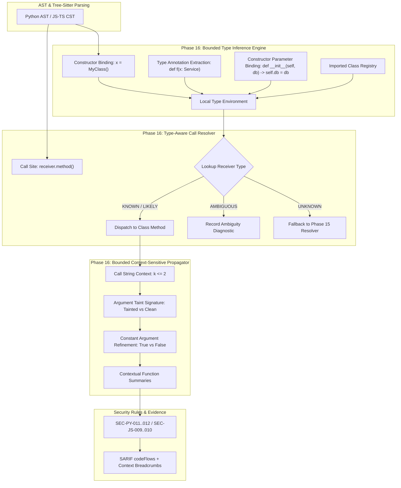
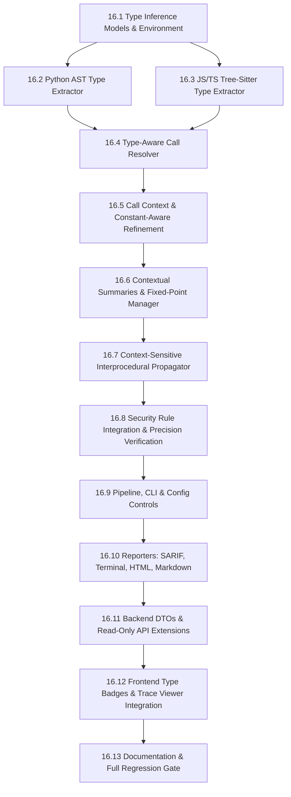

# Phase 16 — Bounded Context-Sensitive & Type-Aware Static Analysis

> **Phase 16 Master Architecture & Implementation Plan**  
> **Status**: CORRECTED ARCHITECTURAL SPECIFICATION (PLAN-ONLY)  
> **Repository**: `E:\AI-Workspace\projects\CodeSentinel`  
> **Target Baseline**: Post-Phase 15 (405 automated tests passing, 1 skipped, frontend typecheck/build clean)  
> **Scope**: Bounded Conservative Type Inference, Type-Aware Receiver Resolution, Bounded Call-Site Context-Sensitive Taint Propagation, Contextual Function Summaries, Constant-Aware Branch Refinement, High-Precision Security Rules, SARIF & Reporter Context Enhancements, Persistence & Read-Only API Extensions, Frontend Resolution Inspector, and CLI Config Controls.

---

## 1. Executive Summary

Phase 16 advances CodeSentinel from **bounded context-insensitive interprocedural analysis** (Phase 15) to **bounded context-sensitive and type-aware static analysis**.

In Phase 15, CodeSentinel established static call-graph construction, bottom-up function summaries, and cross-function taint propagation across Python ASTs and JavaScript/TypeScript Tree-sitter CSTs. However, inspection of the actual Phase 15 codebase reveals two structural precision boundaries:
1. **Receiver Blindness in Call Resolution**: When analyzing method calls on instance variables (e.g., `user_repo.find_by_id(uid)` or `db_client.execute(sql)`), the Phase 15 `CallResolver` does not infer the receiver's type. As a result, it either treats the call as `UnresolvedReason.EXTERNAL_MODULE`, attempts an ambiguous global name search, or matches the first arbitrary method with the same identifier name.
2. **Context Insensitivity in Interprocedural Propagation**: Phase 15 function summaries collapse all calling contexts into a single monolithic summary. When a helper function or sanitizer is invoked at Site A with untrusted input and at Site B with safe constants, context-insensitive propagation can conflate distinct call paths, leading to state contamination across call sites.

Phase 16 addresses these challenges without turning CodeSentinel into an unbounded compiler, dynamic execution runtime, or whole-program theorem prover. It introduces:
- A **conservative, evidence-backed type inference classification** that derives receiver types from local constructors, type annotations, imports, return signatures, and constructor parameter bindings into four discrete confidence levels: `KNOWN`, `LIKELY`, `AMBIGUOUS`, and `UNKNOWN`.
- A **type-aware call resolver** that dispatches method calls directly to class definitions using repository-local evidence, eliminating receiver blindness.
- A **bounded $k$-limiting call-site context sensitivity model ($k$-CFA, $k \le 2$)** for interprocedural propagation, ensuring distinct calling contexts maintain isolated taint states without state explosion.
- **Contextual function summaries** that extend Phase 15 summaries while providing deterministic fallback and conservative widening.
- **Bounded constant-aware branch refinement** for a small, supported domain of literal boolean control arguments (`TRUE`, `FALSE`, `UNKNOWN`).

---

## 2. Phase 15 Baseline

The baseline consists of **405 passing automated tests (1 skipped)** across the repository, a verified database schema up to Alembic migration `0006_phase15_callgraph_summary`, and clean Vite/React TypeScript builds.

### Phase 15 Subsystem Verification

| Subsystem | Actual State in Codebase | Reference |
| :--- | :--- | :--- |
| **Call Graph Models** | `FunctionDefinition`, `CallEdge`, `FunctionSummary`, `CallGraph`, `CallGraphSummary` implemented with deterministic UUIDv5 generation. | [analyzer/dataflow/callgraph/models.py](file:///e:/AI-Workspace/projects/CodeSentinel/analyzer/dataflow/callgraph/models.py) |
| **Function Discovery** | AST visitor for Python and Tree-sitter query visitor for JS/TS with `max_nodes=10000` cap. | [analyzer/dataflow/callgraph/discovery.py](file:///e:/AI-Workspace/projects/CodeSentinel/analyzer/dataflow/callgraph/discovery.py) |
| **Call Resolution** | 4-tier resolution (Dynamic, Local, Import, Global Name Match). Receiver methods on local variables unhandled. | [analyzer/dataflow/callgraph/resolver.py](file:///e:/AI-Workspace/projects/CodeSentinel/analyzer/dataflow/callgraph/resolver.py) |
| **Graph Construction** | Cycle detection via Tarjan's SCC/depth bounds, deterministic topological ordering. | [analyzer/dataflow/callgraph/graph_builder.py](file:///e:/AI-Workspace/projects/CodeSentinel/analyzer/dataflow/callgraph/graph_builder.py) |
| **Function Summarizer** | Computes parameter $\to$ return transfers and parameter $\to$ sink transfers. Monolithic per-function. | [analyzer/dataflow/callgraph/summarizer.py](file:///e:/AI-Workspace/projects/CodeSentinel/analyzer/dataflow/callgraph/summarizer.py) |
| **Interprocedural Propagator** | Depth-bounded ($d \le 5$) cross-function taint path builder. 1-hop context insensitive. | [analyzer/dataflow/interprocedural/propagator.py](file:///e:/AI-Workspace/projects/CodeSentinel/analyzer/dataflow/interprocedural/propagator.py) |
| **Security Rules Catalog** | 31 active rules (12 Python, 10 JS/TS, 9 Architecture) including `SEC-PY-011`, `SEC-PY-012`, `SEC-JS-009`, `SEC-JS-010`. | [analyzer/rules/registry.py](file:///e:/AI-Workspace/projects/CodeSentinel/analyzer/rules/registry.py) |
| **Pipeline Stages** | `CALL_GRAPH` (72%) and `INTER_PROCEDURAL` (80%) stages integrated with CLI flags `--max-call-depth` and `--disable-interprocedural`. | [analyzer/engine/pipeline.py](file:///e:/AI-Workspace/projects/CodeSentinel/analyzer/engine/pipeline.py) |
| **Persistence & API** | Column `call_graph_summary` in `analysis_snapshots`, `GET /api/v1/repositories/{id}/analyses/{analysis_id}/callgraph`. | [backend/app/api/v1/endpoints/callgraph.py](file:///e:/AI-Workspace/projects/CodeSentinel/backend/app/api/v1/endpoints/callgraph.py) |
| **Frontend Visualization** | `InterproceduralTraceViewer.tsx` breadcrumb component integrated into `MonacoViewer.tsx`. | [frontend/src/components/findings/InterproceduralTraceViewer.tsx](file:///e:/AI-Workspace/projects/CodeSentinel/frontend/src/components/findings/InterproceduralTraceViewer.tsx) |

---

## 3. Problem Statement

### 3.1 Receiver Blindness in Call Resolution
In `analyzer/dataflow/callgraph/resolver.py` lines 146–226:
```python
# Real code from Phase 15:
if "." in callee_clean:
    parts = callee_clean.split(".")
    mod_alias = parts[0]
    func_name = parts[-1]
    # Assumes parts[0] is an imported module alias!
    for imp in norm_imports:
        if mod_alias == imp_base or mod_alias in imp.imported_names:
            ...
```
When analyzing:
```python
repo = UserRepository()
repo.find_by_id(user_input)
```
`resolver.py` checks whether `repo` is in `imports`. Because `repo` is a locally constructed variable, the check fails. The resolver falls through to global name lookup. If multiple classes in the repository define `find_by_id`, the call is marked `UnresolvedReason.AMBIGUOUS` or resolved arbitrarily. If `find_by_id` exists in another file, it becomes `UnresolvedReason.EXTERNAL_MODULE`.

### 3.2 Context Conflation in Taint Propagation
In `analyzer/dataflow/callgraph/summarizer.py` and `propagator.py`, function summaries specify whether a parameter transfers taint to the return value (`taint_transfers: list[TaintTransfer]`).
Consider:
```python
def format_log(message, prefix="[INFO]"):
    return f"{prefix} {message}"

# Call Site 1 (Safe Context)
log_msg = format_log("System initialized")
print(log_msg)

# Call Site 2 (Vulnerable Context)
user_msg = format_log(request.args.get("data"))
cursor.execute(f"INSERT INTO logs VALUES ('{user_msg}')")
```
Under context-insensitive analysis, `format_log` has a single monolithic summary: `param 0 -> return`. When propagating taint, if `format_log` contains complex branch logic or internal state, the analyzer cannot isolate the clean execution from the tainted execution, leading to state contamination across call sites.

---

## 4. Primary Theme

### **Bounded Context-Sensitive & Type-Aware Static Analysis**

The two tightly coupled capabilities are:
1. **Conservative Type-Aware Receiver Resolution**: Dispatches method calls on instances to candidate class methods using repository-local evidence.
2. **Bounded Context-Sensitive Interprocedural Taint Propagation**: Isolates taint propagation per call-site context suffix ($k \le 2$) and input taint signature.

#### Architectural Rationale for Coupling
Type-aware call resolution and context-sensitive data flow are fundamentally interdependent:
1. **Type-Aware Resolution Enables Context Creation**: A meaningful call context cannot be established without resolving *which* method is being invoked. Knowing that `repo` is a `UserRepository` is necessary to bind the calling context to `UserRepository.find_by_id`.
2. **Context Preserves Type Invariants**: Inside a method `process(item)`, the type and taint status of `item` depend on the calling context. If Caller A passes an instance of `SanitizedDTO` and Caller B passes `RawInputDTO`, context sensitivity is required to evaluate the method body under the correct type and taint constraints.

---

## 5. Goals

1. **Conservative Type Inference**: Statically infer types for local variables, parameters, fields, and expressions in Python and TypeScript into discrete confidence levels (`KNOWN`, `LIKELY`, `AMBIGUOUS`, `UNKNOWN`).
2. **Type-Aware Call Resolution**: Resolve method invocations on instances (`receiver.method(...)`) with explicit type evidence, reducing `UNRESOLVED` and `AMBIGUOUS` calls on supported object-oriented patterns.
3. **Bounded Call-String Context Sensitivity ($k$-CFA, $k \le 2$)**: Track distinct taint states per calling context, preventing taint conflation across independent call sites.
4. **Bounded Constant-Aware Branch Refinement**: Refine branches controlled by simple literal boolean arguments (`TRUE`, `FALSE`, `UNKNOWN`).
5. **Contextual Function Summaries**: Support multi-context summaries (`ContextualFunctionSummary`) that map specific input taint signatures to output taint behaviors with deterministic widening.
6. **Traceable Semantic Evidence**: Every inferred type and context hop must include line-level evidence and confidence ratings in findings and SARIF output.
7. **Strict Resource Guarantees**: Enforce explicit caps on contexts per function, total contexts, inference steps, summary iterations, and dispatch candidates.
8. **Zero Regression on Baseline**: Maintain 100% passing rate on all Phase 1–15 tests (405 tests) and preserve existing Phase 9 differential baseline comparisons.

---

## 6. Non-Goals

1. **No Full Type Checker**: CodeSentinel will not replace `mypy`, `pyright`, or `tsc`. It will not perform whole-program type unification, complex generic constraint solving, or arbitrary protocol checking.
2. **No Full TypeScript Semantic Checker**: Tree-sitter provides syntax CSTs, not TypeScript's type-checker symbol table. Structural typing, generic inference, and overload resolution are explicitly out of scope.
3. **No Dynamic / Runtime Execution**: Analyzed project code will NEVER be executed, imported (`importlib`), or run in a sandbox. All inference is strictly static AST/CST analysis.
4. **No General Path-Sensitive Symbolic Execution**: No Z3 theorem provers, SMT solvers, or arbitrary path constraint solving. Branch refinement is restricted strictly to simple literal boolean arguments.
5. **No Arbitrary Alias Analysis**: Object-sensitive alias analysis and heap pointer analysis across arbitrary pointer chains are out of scope.
6. **No Object-Sensitive Analysis**: Receiver identity is tracked by bounded type, not allocation site. Full object-sensitivity ($k$-obj) is explicitly out of scope.
7. **No LLM / AI Dependency**: The semantic and type inference engine must be 100% deterministic code. LLMs remain strictly optional for downstream advisory explanations.
8. **No Dynamic Metaprogramming / Reflection**: Dynamic `getattr()`, `setattr()`, monkey patching, `eval()`, and runtime class mutations remain explicitly categorized as `UNKNOWN` / `UNRESOLVED`.
9. **No Unbounded Combinatorial Search**: Context depth is strictly bounded ($k \le 2$). No exponential state-space exploration.

---

## 7. Repository Inspection Findings

A detailed inspection of the current repository revealed the following integration surfaces:

1. **`analyzer/dataflow/symbol.py`**:
   - `Definition` contains `symbol_name`, `kind: DefinitionKind`, `line`, `col`, `raw_expr`.
   - *Finding*: `Definition` lacks type annotations and inferred type metadata. Adding an optional `type_binding: Optional[TypeBinding]` to `Definition` provides an immediate local storage mechanism for inferred types without breaking existing symbol resolution.
2. **`analyzer/dataflow/callgraph/models.py`**:
   - `ParameterDef` already has `type_hint: Optional[str] = None` (added in Phase 15), but it was unused during call resolution.
   - `CallEdge` has `is_method_call: bool`, but lacks `receiver_type: Optional[str]` and `receiver_confidence: Optional[TypeConfidence]`.
3. **`analyzer/dataflow/callgraph/resolver.py`**:
   - Resolves `self.method()` only within the same file.
   - Does not maintain a receiver-type map for local identifiers.
   - Global name fallback (lines 188–216) looks up simple function names, ignoring classes.
4. **`analyzer/dataflow/callgraph/summarizer.py`**:
   - `FunctionSummary` is keyed strictly by `qualified_name`. It has no input context parameter.
5. **`backend/app/services/persistence.py`**:
   - Line 419 accepts `flow_type in ("INTRA_PROCEDURAL_TAINT", "INTER_PROCEDURAL_TAINT")`.
   - *Finding*: Phase 16 enrichment of `dataflow_evidence` with `context_id` or `call_chain[].receiver_type` remains compatible because `dataflow_evidence` is stored as arbitrary JSON.
6. **`backend/app/models/snapshot.py`**:
   - Line 166: `call_graph_summary: Mapped[Optional[dict[str, Any]]] = mapped_column(JSON, nullable=True)`.
   - *Finding*: Phase 16 can store `type_resolution` and `context_sensitivity` metric blocks inside this existing JSON column with **ZERO database migrations**.
7. **`analyzer/comparison/diff.py`**:
   - `BaselineComparator` uses `(rule_id, path, line_start, snippet)` as the canonical match signature.
   - *Finding*: Keeping context metadata inside `finding.evidence` guarantees that baseline findings are **NOT** falsely flagged as NEW or RESOLVED.

---

## 8. Architecture



---

## 9. Type Model

### 9.1 Bounded Confidence Classification
The type system does not implement a formal mathematical lattice with lattice join/meet operators across a type hierarchy. Instead, it defines a **bounded confidence classification for inferred type evidence**:

```
        KNOWN
       /     \
    LIKELY    |
       \     /
      AMBIGUOUS
          |
       UNKNOWN
```

### Definitions:
- **`KNOWN`**: Repository-local evidence directly and unambiguously establishes the type:
  - Local constructor assignment with a resolved repository class (`x = UserRepository()`).
  - Resolved explicit annotation where the referenced type is repository-local and resolvable (`x: UserRepository = ...`).
  - `self` receiver inside a resolved class definition.
  - Instance field bound in `__init__` from a resolved constructor argument (`self.db = db`).
- **`LIKELY`**: Strong but indirect repository-local evidence:
  - Unambiguous repository-local factory return (`repo = get_repo()`).
  - Resolved return type signature from a repository function.
  - Unique compatible repository-local class candidate matching method invocation.
- **`AMBIGUOUS`**: Multiple repository-local candidates remain possible (e.g. union types, conflicting control flow branches, or multiple classes matching an unannotated method).
- **`UNKNOWN`**: Static evidence is insufficient, dynamic behavior is involved, or the target is an external package outside the repository.

> **Important**: Confidence reflects the strength of static evidence, not a statistical correctness probability. `KNOWN` indicates direct syntactic evidence, not a 100% runtime correctness guarantee.

### 9.2 Separate Abstract Domains
To maintain formal integrity, Phase 16 explicitly separates three distinct abstract domains:
1. **Type State**: `KNOWN | LIKELY | AMBIGUOUS | UNKNOWN`.
2. **Taint State**: `UNTAINTED | TAINTED | SANITIZED` (Phase 13/15 taint domain).
3. **Constant State**: `TRUE | FALSE | UNKNOWN` (bounded boolean control domain).

These domains may be associated with the same variable or parameter, but their semantics, transition rules, and storage remain strictly separated.

---

## 10. Type Inference Scope

### 10.1 Python V1 Scope
The Python type inference engine supports:
- Direct instantiation: `x = ClassName()`
- Explicit variable annotations: `x: ClassName = ...`
- Parameter annotations: `def process(repo: UserRepository):`
- Return type annotations: `def get_db() -> DatabaseClient:`
- Direct local return propagation from function bodies.
- Imports of repository-local classes (`from app.db import DatabaseClient`).
- `self` receiver binding within class methods.
- Simple local assignment alias propagation: `a = b`
- Constructor parameter binding: `service = UserService(DatabaseClient())` binds the argument type to parameter `db` in `UserService.__init__`.
- Simple field assignment propagation: `self.db = db` transfers the type of `db` to instance attribute `self.db`.
- Local attribute alias propagation: `x = self.db; x.execute(...)`.
- Simple single inheritance lookup when the base class is repository-local.

#### Explicitly Unsupported / Unknown in Python V1:
- `getattr()`, `setattr()`, `hasattr()` dynamic reflection.
- Monkey patching or runtime attribute mutation.
- Dynamic class creation (`type("DynamicClass", ...)`).
- Metaclasses and complex descriptor protocols (`__get__`, `__set__`).
- Runtime dependency injection containers and service locators.
- Dynamic plugin loading or runtime imports (`__import__`, `importlib`).
- Arbitrary decorators that alter dispatch or return types.

### 10.2 JavaScript / TypeScript V1 Scope
Tree-sitter provides syntax CSTs, not TypeScript's compiler symbol table. Phase 16 JS/TS support is strictly limited to statically visible syntactic patterns:
- Class instantiation: `const x = new ClassName()`
- Explicit TypeScript type annotations: `let x: UserRepository = ...`
- Parameter type annotations: `function handle(repo: UserRepository)`
- Return type annotations: `function getRepo(): UserRepository`
- Repository-local class declarations: `class UserRepository { ... }`
- Simple imports of repository classes: `import { UserRepository } from './repo'`
- Simple local variable alias propagation: `const a = b`

#### Explicitly Unsupported / Unknown in JS/TS V1:
- Structural typing beyond explicit named annotations.
- Generic type parameter inference and constraint solving (`<T extends Base>`).
- Method overload resolution.
- Complex union type narrowing (`x is A`).
- Decorators that transform class or method dispatch.
- Dynamic property access (`obj[dynamicProp]()`).
- Prototype pollution or prototype chain mutation.
- Module resolution requiring package manager execution (`node_modules` inference).

---

## 11. Receiver Resolution

### 11.1 Candidate Resolution Pipeline
When `TypeAwareCallResolver` resolves `receiver.method()`:

```text
receiver expression
        ↓
type environment lookup
        ↓
candidate type(s)
        ↓
repository class registry
        ↓
class / inheritance lookup
        ↓
method candidate set
        ↓
ambiguity analysis
        ↓
resolved / ambiguous / unresolved
```

### 11.2 Resolution Steps:
1. **Dynamic Check**: `getattr()`, `eval()` $\to$ `UNRESOLVED(DYNAMIC_CALL)`.
2. **Local & Self/This Dispatch**:
   - `self.method()` $\to$ resolve in current class or repository-local base classes.
   - Direct function call $\to$ local file functions.
3. **Type-Aware Receiver Dispatch**:
   - Query local `TypeEnvironment` for `receiver`.
   - If `TypeConfidence == KNOWN` or `LIKELY`:
     - Lookup `qualified_type_name` in repository `ClassRegistry`.
     - Resolve `method` in target class or base classes.
     - Generate `CallEdge` with `resolution_type=RESOLVED_LOCAL` or `RESOLVED_IMPORT`, `receiver_type=qualified_type_name`, and `confidence=KNOWN/LIKELY`.
   - If `TypeConfidence == AMBIGUOUS`:
     - Record `CallEdge` with `unresolved_reason=UnresolvedReason.AMBIGUOUS`.
     - Canonicalize and sort `candidate_targets` alphabetically.
   - If `TypeConfidence == UNKNOWN`:
     - Fall back to Tier 4 / Tier 5.
4. **Import-Based Module Call**:
   - `module.func()` $\to$ resolve via Phase 6 imports.
5. **Fallback Global Resolution**:
   - If name is globally unique in repository $\to$ resolve with `LIKELY`. Otherwise $\to$ `UNRESOLVED`.

---

## 12. Context Model

### 12.1 Context Definition
Context is defined as a bounded tuple:
$$\text{Context} = (\text{CallStringSuffix}, \text{InputTaintMask}, \text{ReceiverTypeContext})$$

- **CallStringSuffix**: Ordered list of the last $k$ call-site identifiers ($k \le 2$).
- **InputTaintMask**: Normalized boolean tuple indicating which parameter positions are tainted: $(t_0, t_1, \dots, t_n)$.
- **ReceiverTypeContext**: Optional qualified receiver type for method calls.

### 12.2 Context Depth vs. Analysis Traversal Depth
These two concepts are strictly distinguished:
- **Context Depth ($k$)**: The number of call sites retained in the context suffix. Strictly capped at $k \le 2$.
- **Analysis Traversal Depth ($d$)**: The total number of interprocedural call hops traversed from source to sink. Governed by `--max-call-depth` (default: 5, configurable up to 10).

The arbitrary `min(..., 10)` cap is eliminated.

### 12.3 Deterministic Context Identifier
Context IDs are derived from a canonical string representation:
```python
canonical_key = f"{':'.join(call_string_suffix)}|{','.join(str(b) for b in input_taint_mask)}|{receiver_type or ''}"
context_id = hashlib.sha256(canonical_key.encode("utf-8")).hexdigest()[:16]
```
No random UUIDs, object memory addresses, or dictionary iteration order are used.

---

## 13. Contextual Summaries

### 13.1 Contextual Summary Schema
```python
class ContextualFunctionSummary(BaseModel):
    """Function summary conditioned on a specific incoming calling context."""
    qualified_name: str
    context_id: str                          # Deterministic 16-char hash or "ROOT"
    argument_taint_mask: list[bool]
    constant_args: dict[int, str] = Field(default_factory=dict) # arg_index -> "TRUE" | "FALSE"
    taint_transfers: list[TaintTransfer] = Field(default_factory=list)
    sink_invocations: list[SummarySinkInvocation] = Field(default_factory=list)
    sanitizer_applications: list[SummarySanitizerApplication] = Field(default_factory=list)
    returns_tainted: bool = False
    is_widened: bool = False
```

### 13.2 Deterministic Summary Lookup Order
When querying a function summary for a call site:
1. **Exact Contextual Summary**: Lookup by `(qualified_name, context_id)`.
2. **Compatible Widened Summary**: Lookup by `(qualified_name, argument_taint_mask)`.
3. **Phase 15 Base Summary**: Lookup the monolithic `FunctionSummary` from Phase 15.
4. **Conservative Fallback**: If unsummarized, assume arguments flow to return and return `UNKNOWN`.

### 13.3 Conservative Widening Operation
If the number of contexts generated for a single function exceeds `max_contexts_per_function` (default: 8):
1. The engine halts creation of new specialized contexts for that function.
2. It executes a **conservative join (widening)**: merges all existing context transfers and taint masks by taking the union of tainted return transfers and reachable sinks.
3. The resulting summary is marked `is_widened=True`.
4. A structured truncation event (`MAX_CONTEXTS_PER_FUNCTION`) is recorded.

---

## 14. Constant-Aware Branch Refinement

### 14.1 Bounded Domain
To solve conditional sanitization and bypass patterns without full symbolic execution, Phase 16 introduces an abstract boolean domain:
$$\text{BoolDomain} = \{\text{TRUE}, \text{FALSE}, \text{UNKNOWN}\}$$

### 14.2 Supported Refinement Patterns
When analyzing a function body:
- If a parameter `p` is evaluated in an `if p:` or `if not p:` statement:
  - If the call site provides a literal boolean argument (`True` or `False`), the matching branch is analyzed under that assumption.
  - The non-matching branch is pruned from the contextual summary calculation.
- For all complex runtime conditions, non-literal arguments, or expressions:
  - The condition evaluates to `UNKNOWN`.
  - Both branches are analyzed and their taint transfers are conservatively joined.

> **Strict Non-Goal**: Phase 16 does NOT implement SMT path constraints, integer range analysis, or general symbolic execution.

---

## 15. Interprocedural Propagation

### 15.1 Propagation Algorithm
1. Traverse functions in deterministic topological order (SCC-ordered).
2. At each call site $cs$:
   - Resolve callee using `TypeAwareCallResolver`.
   - Evaluate argument taint status $\to \text{InputTaintMask}$.
   - Evaluate literal boolean control arguments $\to \text{ConstantArgs}$.
   - Compute $C_{next} = \text{push\_context}(C_{curr}, cs.\text{id}, \text{InputTaintMask}, k=2)$.
   - Check recursion guard (Section 16).
   - Retrieve or compute `ContextualFunctionSummary`.
   - Propagate taint to return values or reachable sinks.
3. Connect source $\to$ intermediate call chain steps $\to$ sink.

---

## 16. Recursion Handling

### 16.1 Separate Recursion Guard from Context Suffix
Because $k$-CFA context suffixes retain only the last $k \le 2$ call sites, a cycle of length $> 2$ (e.g., $A \to B \to C \to A$) cannot be detected by inspecting the context suffix alone.

Phase 16 uses two separate mechanisms:
1. **Context Abstraction**: Last $k$ call sites for context sensitivity.
2. **Active Traversal Call Stack (Recursion Guard)**: An explicit stack of `(function_qualified_name, call_edge_id)` maintained during interprocedural traversal.

### 16.2 Cycle Termination & Fixed-Point Convergence
- When a call would add a function already present on the active traversal call stack:
  - **Recursion Detected**.
  - Traversal along this cycle is halted.
  - The current fixed-point summary for the function is applied without creating a deeper recursion frame.
- **Fixed-Point Iteration Cap**: Within recursive SCCs, summarization repeats until summaries converge (no new transfers added) or `max_summary_iterations` (default: 5) is reached.
- If `max_summary_iterations` is reached, remaining transfers are widened and `MAX_SUMMARY_ITERATIONS` truncation is recorded.

---

## 17. Resource Limits

| Resource Limit | Default Value | Enforcement Location | Truncation Action |
| :--- | :--- | :--- | :--- |
| `max_k` | 2 | Context suffix push | Truncate suffix to last 2 call sites. |
| `max_contexts_per_function` | 8 | Context manager | Widen to joined summary; mark `truncated=True`. |
| `max_total_contexts` | 1,000 | Global context registry | Halt new context creation; fall back to base summaries. |
| `max_type_candidates` | 5 | Ambiguous receiver dispatch | Cap candidates list; log `MAX_TYPE_CANDIDATES`. |
| `max_type_inference_steps` | 200 per function | Statement type visitor | Halt deep inference; assign `UNKNOWN` to remaining variables. |
| `max_summary_iterations` | 5 | SCC fixed-point loop | Widen remaining recursive summaries; halt iteration. |
| `max_call_depth` | 5 | Interprocedural propagator | Halt call-chain traversal; emit path up to depth. |
| `max_path_count` | 50 | Findings collector | Halt path search; preserve paths found. |

---

## 18. Cancellation

Cooperative cancellation is verified at the following explicit checkpoints:
1. Start of each file parsing and type inference.
2. Start of each function scope analysis.
3. Each statement iteration during local type inference.
4. Each call site evaluation in `TypeAwareCallResolver`.
5. Each context push operation in `ContextManager`.
6. Each iteration of the summary fixed-point SCC loop.
7. Each interprocedural call-chain hop.
8. Each finding emission.

```python
def check_cancellation(self) -> None:
    if self.is_cancelled and self.is_cancelled():
        from analyzer.models.errors import AnalysisCancelledError
        raise AnalysisCancelledError("Operation cancelled by user")
```

---

## 19. Determinism

> **Phase 16 Determinism Contract**: Identical repository contents, analyzer configuration, parser/runtime environment, and supported inputs produce semantically equivalent and identically ordered analysis results.

### Invariants:
1. **Zero Non-Deterministic Identifiers**: Context IDs, finding IDs, and edge IDs use deterministic hashing (`sha256` or `uuid5`). No `uuid4()`, Python `id()`, or memory addresses.
2. **Canonical Ordering**:
   - Functions sorted by `(file_path, line_start, col_start, qualified_name)`.
   - Call edges sorted by `(call_site_file, call_site_line, call_site_col, caller_qn, callee_qn)`.
   - Ambiguous candidate types sorted alphabetically.
   - Context lists sorted by `context_id`.

---

## 20. Security Rule Integration

### 20.1 Enhanced Existing Rules
Phase 16 refines the 4 interprocedural rules from Phase 15:
- `SEC-PY-011`: Cross-function SQL Injection
- `SEC-PY-012`: Cross-function Subprocess Command Injection
- `SEC-JS-009`: Cross-function DOM-based XSS
- `SEC-JS-010`: Cross-function Dynamic Code Evaluation

### 20.2 Ambiguity Policy for Security Findings
When a call site invokes a method on an `AMBIGUOUS` receiver where some candidate classes contain a sink and others are safe:
- **Default Policy**: CodeSentinel does **NOT** report a confirmed finding. Instead:
  - It records an `AmbiguityDiagnostic` in the analysis result.
  - If `--report-ambiguous-flows` is explicitly enabled, it reports the finding with `severity="INFO"` and `confidence="LOW"`, detailing the conflicting candidates.
- **Unanimous Candidate Sinks**: If ALL viable candidate classes reach a sink, CodeSentinel reports the finding with normal severity and `confidence="MEDIUM"`.

---

## 21. Baseline & Health Compatibility

### 21.1 Phase 9 Baseline Compatibility
In `analyzer/comparison/diff.py`, `BaselineComparator` matches findings using:
$$\text{Signature} = (\text{rule\_id}, \text{file\_path}, \text{line\_start}, \text{code\_snippet})$$

- Phase 16 stores context IDs, receiver types, and type confidence strictly inside `finding.evidence["call_chain"]` and `finding.evidence["context_metadata"]`.
- Because `rule_id`, `location`, and `code_snippet` remain unchanged, existing findings compared between Phase 15 and Phase 16 snapshots are classified as **`UNCHANGED`** with zero false `NEW` or `RESOLVED` transitions.

### 21.2 Health Score Deduplication
- In `analyzer/architecture/health.py`, `HealthScoreCalculator` computes deductions from findings.
- If multiple calling contexts produce findings for the exact same underlying vulnerability (same `rule_id`, `location`, and `sink`), the pipeline deduplicates them to a single canonical finding before passing them to `HealthScoreCalculator`.
- The canonical health formula ($55\% \text{ Security} + 45\% \text{ Architecture}$) remains completely untouched.

---

## 22. Reporting & SARIF

### 22.1 SARIF v2.1.0 Validation
- Thread flow locations in `codeFlows` are enriched with contextual messages:
  `Call to UserRepository.find_by_id [Receiver: KNOWN (UserRepository), Context: c8f1b2]`
- Property bags include:
  `properties.typeConfidence`: `"KNOWN"`
  `properties.contextId`: `"c8f1b2"`
- Full validation against official SARIF v2.1.0 JSON schema.

### 22.2 Reporter Backward Compatibility
Terminal, Markdown, HTML, and JUnit reporters check for Phase 16 fields optionally. If scanning a Phase 15 snapshot or running with `--disable-type-inference`, reporters render standard Phase 15 output seamlessly.

---

## 23. Persistence

- **Zero Database Migrations**: `AnalysisSnapshot` already defines:
  `call_graph_summary: Mapped[Optional[dict[str, Any]]] = mapped_column(JSON, nullable=True)`.
- Phase 16 embeds optional `type_resolution` and `context_sensitivity` sub-dictionaries into this JSON column.
- Snapshots created in Phase 15 can be deserialized without errors.

---

## 24. API Changes

### Schema Extension: `backend/app/schemas/callgraph.py`
```python
class TypeResolutionSummaryDTO(BaseModel):
    types_inferred: int = 0
    type_aware_edges: int = 0
    ambiguous_receivers: int = 0
    confidence_distribution: dict[str, int] = Field(default_factory=dict)

class ContextSensitivitySummaryDTO(BaseModel):
    total_contexts: int = 0
    max_depth_reached: int = 0
    contexts_truncated: int = 0
    truncation_reasons: list[str] = Field(default_factory=list)

class CallGraphSummaryDTO(BaseModel):
    # Existing Phase 15 fields preserved
    analysis_id: str
    total_functions: int = 0
    total_call_edges: int = 0
    ...
    # Optional Phase 16 extensions
    type_resolution: Optional[TypeResolutionSummaryDTO] = None
    context_sensitivity: Optional[ContextSensitivitySummaryDTO] = None
```

---

## 25. Frontend

1. **`frontend/src/types/api.ts`**:
   - Update `CallChainStepDTO` with optional `receiver_type?: string` and `type_confidence?: string`.
   - Update `CallGraphSummaryDTO` with optional `type_resolution` and `context_sensitivity`.
2. **`InterproceduralTraceViewer.tsx`**:
   - Render a badge for receiver type when present (`[UserRepository • KNOWN]`).
   - For ambiguous calls, display an info tooltip listing candidate classes.
3. **Graceful Degradation**:
   - If fields are missing (e.g. Phase 15 snapshots), the viewer renders standard call-chain steps without blank chips or errors.

---

## 26. CLI & Configuration

### 26.1 Configuration Precedence
$$\text{CLI Flags} > \text{Repository Config (.codesentinel.yml)} > \text{System Defaults}$$

### 26.2 CLI Options
- `--disable-type-inference`: Bypasses receiver type resolution (falls back to Phase 15 resolver).
- `--disable-context-sensitivity`: Runs interprocedural analysis in 1-hop context-insensitive mode.
- `--max-k <int>`: Sets context suffix length (default: 2, max: 2).
- `--max-contexts-per-function <int>`: Sets context threshold before widening (default: 8).
- `--max-summary-iterations <int>`: Sets fixed-point iteration cap for recursive SCCs (default: 5).

> **Precedence Invariant**: `--disable-interprocedural` takes precedence over all Phase 16 options, bypassing both call graph and interprocedural stages.

---

## 27. Testing Strategy

### Test Suites Matrix

| Test Suite | Focus Area | Behavioral Verification |
| :--- | :--- | :--- |
| `analyzer/tests/test_phase16_type_inference.py` | Local Python & TS type inference | Constructors, annotations, return types, field assignment (`self.db = db`), inheritance, aliases. |
| `analyzer/tests/test_phase16_call_resolution.py` | Type-aware receiver dispatch | Direct method, inherited method, cross-file class, ambiguous receiver, unknown receiver. |
| `analyzer/tests/test_phase16_context_sensitivity.py` | Call-string context separation | $k$-limiting, separate call sites, same call site different taint mask, recursion guard. |
| `analyzer/tests/test_phase16_constant_branches.py` | Constant-aware branch refinement | Literal boolean `True`/`False` argument branch selection vs `UNKNOWN` merge. |
| `analyzer/tests/test_phase16_contextual_summaries.py` | Summary generation & fixed point | Exact context lookup, widening on limit, fixed-point convergence, iteration cap. |
| `analyzer/tests/test_phase16_security_precision.py` | Targeted security precision | Dispatches to vulnerable class, ignores safe class, contextual sanitizer path isolation. |
| `analyzer/tests/test_phase16_pipeline_cli.py` | CLI flags and config integration | `--disable-type-inference`, `--disable-context-sensitivity`, config overrides. |
| `analyzer/tests/test_phase16_reporters.py` | Reporting and SARIF schema | Valid SARIF v2.1.0 output with context properties, terminal output format. |
| `backend/tests/test_phase16_api_backward_compat.py` | Snapshot persistence and API | Phase 15 snapshot backward compatibility, optional Phase 16 blocks. |

---

## 28. End-to-End Scenarios

### Scenario A — Known Receiver
```python
repo = UserRepository()
repo.find_by_id(user_input)
```
- **Verification**: `repo` inferred as `UserRepository` with confidence `KNOWN`. Dispatched to `UserRepository.find_by_id`.

### Scenario B — Constructor Parameter Binding & Field Propagation
```python
class UserService:
    def __init__(self, db: DatabaseClient):
        self.db = db

    def update_user(self, user_id, raw_bio):
        self.db.execute(f"UPDATE users SET bio = '{raw_bio}' WHERE id = {user_id}")

service = UserService(DatabaseClient())
service.update_user(request.user.id, request.POST.get("bio"))
```
- **Verification**: `DatabaseClient()` argument binds to parameter `db`. `self.db = db` propagates type to instance field. `self.db.execute` resolves to `DatabaseClient.execute` with confidence `KNOWN`. `SEC-PY-011` reported.

### Scenario C — Ambiguous Receiver
Two repository classes expose `save()`. Receiver type cannot be resolved from local scope.
- **Verification**: Resolver marks call `AMBIGUOUS` with sorted candidates `["AuditRepo", "UserRepo"]`. No arbitrary selection.

### Scenario D — Constant-Aware Contextual Sanitizer
```python
def clean_or_raw(data, sanitize=True):
    if sanitize:
        return html.escape(data)
    return data

msg1 = clean_or_raw(request.args.get("m"), sanitize=True)  # Safe
msg2 = clean_or_raw(request.args.get("m"), sanitize=False) # Vulnerable
```
- **Verification**: Context 1 evaluates with `sanitize=TRUE` $\to$ return marked `SANITIZED`. Context 2 evaluates with `sanitize=FALSE` $\to$ return marked `TAINTED`. Only `msg2` reaching a sink produces a finding.

### Scenario E — Same Helper, Two Callers
Caller 1 passes untainted constant; Caller 2 passes tainted input.
- **Verification**: Helper evaluated under two distinct contexts. Untainted caller produces no finding; tainted caller produces finding.

### Scenario F — Mutual Recursion Cycle
Functions $A \to B \to A$ with cycle length $> 2$.
- **Verification**: Active traversal call stack detects cycle. Execution terminates at fixed point without stack overflow.

### Scenario G — Context Cap Widening
Function called from 10 distinct call sites.
- **Verification**: Contexts 1–8 generated. At context 9, engine widens summary and records `MAX_CONTEXTS_PER_FUNCTION`.

### Scenario H — Type Inference Step Cap
Function with 300 assignments exceeding `max_type_inference_steps=200`.
- **Verification**: Inference halts at step 200; remaining symbols assigned `UNKNOWN`.

### Scenario I — Type Inference Disabled Fallback
Run scan with `--disable-type-inference`.
- **Verification**: Resolver falls back to Phase 15 behavior without errors.

### Scenario J — Context Sensitivity Disabled Fallback
Run scan with `--disable-context-sensitivity`.
- **Verification**: Propagator falls back to Phase 15 1-hop insensitive propagation.

### Scenario K — Baseline Comparison Stability
Compare Phase 15 baseline scan against Phase 16 scan of unchanged repository.
- **Verification**: All existing findings classified as `UNCHANGED`. Zero false `NEW` or `RESOLVED` findings.

---

## 29. Performance Methodology

Performance targets will be evaluated on controlled benchmark fixtures (100, 500, and 1,000 functions) under identical environments:
- Python 3.14.x, identical Tree-sitter parsers, cold vs. warm AST cache.
- Metrics measured:
  - Total analysis wall time.
  - Peak memory consumption (RSS).
  - Number of inferred types, dispatches, and contexts.
  - Number of truncation events triggered.
- Target: Phase 16 execution time overhead over Phase 15 should remain manageable on typical repositories, bounded by configured caps.

---

## 30. Security & Resource Exhaustion Defense

- **Adversarial Nesting**: Deeply nested constructors or cyclic imports terminate cleanly due to `max_type_inference_steps=200` and `max_k=2`.
- **Memory Consumption**: Context keys use truncated 16-character SHA-256 hashes. Total contexts hard-capped at 1,000.
- **Offline Guarantee**: The analyzer will never make network calls, spawn untrusted sub-processes, or import analyzed code.

---

## 31. Boundary Independence

The `analyzer/` engine will continue to have **ZERO** imports of:
- `fastapi`, `starlette`
- `sqlalchemy`, `alembic`
- `celery`, `redis`
- `backend.*`, `frontend.*`
- AI SDKs or external network clients.

Automated boundary independence tests will enforce this invariant.

---

## 32. Workstream Dependency Graph



---

## 33. Risk Register

| Risk | Severity | Probability | Mitigation Strategy |
| :--- | :--- | :--- | :--- |
| **Context Explosion on High-Fanout Code** | HIGH | LOW | Bounded $k \le 2$ call-string, hard cap of 8 contexts per function, global 1,000 cap. |
| **False Confidence in Inferred Types** | MEDIUM | MEDIUM | Conservative 4-state classification (`KNOWN`, `LIKELY`, `AMBIGUOUS`, `UNKNOWN`). Ambiguous calls never coerced. |
| **Recursive Cycles Exceeding Context Window** | HIGH | LOW | Separate active traversal call stack (recursion guard) independent of context suffix. |
| **Breaking Baseline Finding IDs** | HIGH | LOW | Canonical finding signatures retain Phase 15 format; context metadata stored in evidence properties only. |
| **Health Score Double-Counting** | MEDIUM | LOW | Deduplicate contextual traces to canonical findings before passing to `HealthScoreCalculator`. |

---

## 34. Documentation Impact

During eventual implementation, the following documentation files will be updated:
1. `docs/ROADMAP.md`: Mark Phase 16 complete with feature breakdown.
2. `docs/ARCHITECTURE.md`: Document Type Inference Engine, Type-Aware Resolver, Context Sensitivity, and Constant-Aware Refinement in Section 10.
3. `docs/API.md`: Document `type_resolution` and `context_sensitivity` in `GET /api/v1/repositories/{id}/analyses/{analysis_id}/callgraph`.
4. `docs/SARIF.md`: Document context properties in `threadFlowLocations`.
5. `README.md`: Update architecture summary and precision capabilities.

---

## 35. Verification Matrix

| Component | Verification Method | Acceptance Criteria |
| :--- | :--- | :--- |
| **Type Inference** | Unit tests on synthetic Python & TS classes | Resolves constructors, annotations, field bindings, and assigns `UNKNOWN` to unsupported patterns. |
| **Receiver Resolution** | Comparative fixture tests | Resolves `receiver.method()` calls on typed receivers; records `AMBIGUOUS` on multiple candidates. |
| **Context Separation** | Targeted security tests | Separates safe vs. tainted call contexts; isolates sanitizer branches with literal arguments. |
| **Recursion Guard** | Cyclic and mutually recursive call graphs | Terminates cleanly at fixed point; zero recursion overflow. |
| **Resource Caps** | High-fanout stress fixtures | Enforces context caps and step limits; emits structured truncation events. |
| **Backward Compatibility** | Full regression suite (`python -m pytest -q`) | 100% of Phase 1–15 tests pass (405 tests). |
| **SARIF Validation** | Schema validation against SARIF v2.1.0 | 100% compliant JSON schema validation. |
| **Frontend Build** | `npm run build` | 0 TypeScript errors, clean production bundle. |

---

## 36. Completion Gates

Phase 16 implementation will be declared complete when:
1. Type-aware receiver resolution works for the explicitly supported patterns.
2. Unsupported/dynamic patterns safely become `UNKNOWN` or `UNRESOLVED`.
3. Context-sensitive propagation separates supported call-site contexts.
4. Constant-aware branch refinement works for the bounded supported domain (`TRUE`, `FALSE`, `UNKNOWN`).
5. Recursive and mutually recursive graphs terminate within configured iteration limits.
6. All configured resource limits are enforced with structured truncation metadata.
7. Cooperative cancellation is honored at all checkpoints.
8. Finding identity remains strictly compatible with Phase 15.
9. Health scoring formula and deduction values remain untouched.
10. SARIF output is schema-valid v2.1.0.
11. API endpoints remain backward compatible.
12. All 405 Phase 1–15 tests pass without regressions.
13. All new Phase 16 behavioral tests pass.
14. Frontend typecheck and production build pass with zero errors.
15. Analyzer remains 100% dependency-isolated from backend frameworks and database drivers.
16. Documentation files are updated.

---

## 37. Rollback & Compatibility Considerations

- If context-sensitivity causes unexpected behavior on a specific codebase, it can be disabled immediately via `--disable-context-sensitivity` or configuration `interprocedural.context_sensitivity.enabled: false`.
- If type inference encounters unhandled syntax, it safely emits `TypeConfidence.UNKNOWN`, falling back to Phase 15 resolution without exceptions.
- Because no database migrations are introduced, rolling back analyzer or backend code requires zero database schema rollbacks.

---

## 38. Final Implementation Checklist

- [ ] **Workstream 16.1**: Implement `analyzer/dataflow/types/models.py` (`TypeBinding`, `TypeConfidence`, `TypeOrigin`, `CallContext`, `ConstantBool`).
- [ ] **Workstream 16.2**: Implement Python AST type inference visitor in `analyzer/dataflow/types/python_type_extractor.py` (constructors, annotations, `self.db = db`).
- [ ] **Workstream 16.3**: Implement JS/TS Tree-sitter type inference visitor in `analyzer/dataflow/types/jsts_type_extractor.py`.
- [ ] **Workstream 16.4**: Build `TypeAwareCallResolver` in `analyzer/dataflow/callgraph/type_resolver.py` with candidate sorting.
- [ ] **Workstream 16.5**: Create `ContextManager` and `ConstantBranchEvaluator` in `analyzer/dataflow/callgraph/context_manager.py`.
- [ ] **Workstream 16.6**: Create `ContextualFunctionSummary` and multi-context summary manager in `analyzer/dataflow/callgraph/context_summarizer.py` with widening.
- [ ] **Workstream 16.7**: Upgrade `InterproceduralTaintPropagator` with call-stack recursion guard and $k$-CFA context tracking.
- [ ] **Workstream 16.8**: Verify security rules `SEC-PY-011`, `SEC-PY-012`, `SEC-JS-009`, `SEC-JS-010` under contextual precision and ambiguity policy.
- [ ] **Workstream 16.9**: Wire CLI flags (`--disable-context-sensitivity`, `--disable-type-inference`) through `pipeline.py` and `main.py`.
- [ ] **Workstream 16.10**: Update Terminal, SARIF, Markdown, and HTML reporters with type confidence and context breadcrumbs.
- [ ] **Workstream 16.11**: Update backend `CallGraphSummaryDTO` with optional semantic blocks.
- [ ] **Workstream 16.12**: Update frontend `types/api.ts` and `InterproceduralTraceViewer.tsx` with receiver type chips.
- [ ] **Workstream 16.13**: Update documentation (`ROADMAP.md`, `ARCHITECTURE.md`, `API.md`, `SARIF.md`, `README.md`) and run full regression suite.
