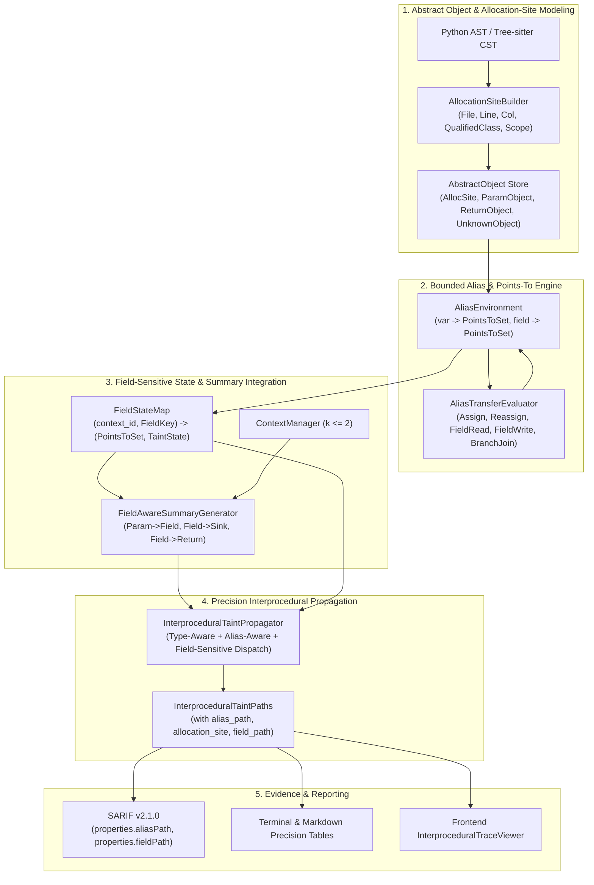

# CodeSentinel Phase 17 Implementation Plan
# Bounded Alias, Points-To & Field-Sensitive Data-Flow Analysis

---

## 1. Executive Summary & Objective

CodeSentinel Phase 16 introduced conservative type inference (`TypeEnvironment`, `TypeBinding`, `TypeConfidence`), type-directed receiver call resolution, bounded $k$-limiting call-string context sensitivity ($k \le 2$), contextual function summaries, and constant-aware branch refinement.

While Phase 16 significantly reduced false-positive cascades from generic method names (e.g. `execute()`, `find_by_id()`), interprocedural analysis remains **blind to local aliasing, multi-step parameter reassignment, return-value references, and distinct object field state**. Specifically, when an object is aliased across local variables (`r = repo`), passed through wrapper parameters (`def run(repository): r = repository; r.execute()`), or accessed through separate object fields (`self.db` vs `self.cache`), the engine either degrades to `UNKNOWN`/`AMBIGUOUS` or fails to propagate taint through field mutations.

**Phase 17 Objective**: Implement a **bounded, static, offline, repository-local, deterministic, evidence-first, and field-sensitive alias and points-to analysis subsystem** that tightly integrates with Phase 13 taint analysis, Phase 15 call-graph summarization, and Phase 16 type/context tracking without unbounded state explosion or general-purpose heap theorem proving.

### Core Design Principles
1. **Bounded & Conservative**: Strict allocation budgets, candidate caps, field caps, and recursion guards prevent exponential state explosion.
2. **Deterministic**: Semantically deterministic under identical repository contents, configuration, parser versions, analyzer version, and environment.
3. **Evidence-First**: Every alias link, field dereference, allocation site, and candidate resolution is preserved with explainable breadcrumbs in findings, reports, and SARIF property bags.
4. **Offline & Isolated**: Zero network access, zero runtime code execution, zero dynamic VM emulation, and strict isolation from backend/database modules.
5. **Separation of Concerns**: Reference/points-to relations, object field values, data taint states, nominal types, and call contexts are maintained as distinct orthogonal domains.

---

## 2. Current Verified Baseline (Post-Phase 16)

The CodeSentinel codebase has completed and verified Phases 1 through 16:
- **Pytest Suite**: All Phase 1–16 regression tests pass (`441 passed, 1 skipped, 2 warnings` across `analyzer/tests/` and `backend/tests/`).
- **Frontend Build**: Production build succeeds cleanly (`npm run build` / `tsc -b && vite build` with 0 errors).
- **Analyzer Boundary**: Strict zero-import isolation from FastAPI, SQLAlchemy, Celery, Redis, PostgreSQL, and AI SDKs in `analyzer/`.
- **Finding Signature Invariance**: Finding comparison and baseline diffing in `analyzer/comparison/diff.py` operate via established 4-tier signature matching.
- **Backward Compatibility**: JSON snapshot persistence (`call_graph_summary` in `analysis_snapshots`) maintains 100% backward compatibility with Phase 10–15 historical analyses.

> [!NOTE]
> All Phase 1–16 regression tests must pass. Phase 17 adds its own tests. The final test count will be reported from the actual test execution run.

---

## 3. Repository Inspection Findings & Architecture Audit

A thorough inspection of the active implementation established the following architectural facts:

1. **Phase 9 Baseline Comparison Implementation (`analyzer/comparison/diff.py`)**:
   - Matching uses a deterministic 4-tier matching algorithm:
     1. Exact signature: `(rule_id, _norm_path(location.file_path), location.line_start, _norm_snippet(code_snippet))`
     2. Fuzzy snippet: `(rule_id, _norm_path(location.file_path), _norm_snippet(code_snippet))` across line shifts
     3. Fuzzy location: `(rule_id, _norm_path(location.file_path), location.line_start)` across minor snippet modifications
     4. Explicit finding ID match fallback.
   - **Architectural Requirement**: Alias and field evidence stored in finding `evidence` property bags must not mutate these matching keys unless source line or code snippet legitimately changes.

2. **Registered Security Rule IDs (`analyzer/dataflow/taint/registry.py`)**:
   - The repository uses canonical rule IDs:
     - `SEC-PY-009`: Python SQL Injection (`cursor.execute()`, `db.execute()`, etc.)
     - `SEC-PY-010`: Python Command Injection (`subprocess.run()`, `os.system()`, etc.)
     - `SEC-JS-007`: JavaScript/TypeScript DOM XSS (`element.innerHTML`, `document.write()`, etc.)
     - `SEC-JS-008`: JavaScript/TypeScript Dynamic Code Evaluation (`eval()`, `Function()`, etc.)
   - Phase 17 enhances detection accuracy for these exact rule IDs without creating redundant duplicate rule definitions.

3. **Phase 14 Configuration Precedence (`analyzer/cli/main.py` & `repo_config.py`)**:
   - Configuration adheres strictly to a three-tier precedence model:
     $$\text{CLI Invocations Flags} > \text{Repository Config File } (\texttt{.codesentinel.yml} / \texttt{.codesentinel.json}) > \text{Built-In System Defaults}$$
   - `--disable-alias-analysis` must fall back cleanly to the existing Phase 16 execution path.

4. **Pydantic Model Usage in Analyzer**:
   - `pydantic.BaseModel` and `pydantic.Field` are already established, standard dependencies across `analyzer/models/`, `analyzer/config/`, and `analyzer/dataflow/` (`types/models.py`, `callgraph/models.py`, `taint/models.py`). Phase 17 models will follow this standard.

5. **Cooperative Cancellation Mechanism (`analyzer/engine/pipeline.py`)**:
   - Cancellation is evaluated via `is_cancelled: Optional[Callable[[], bool]]` raising `AnalysisCancelledError` at bounded work units.

6. **Backend Persistence & DTOs (`backend/app/schemas/callgraph.py`)**:
   - `CallGraphSummaryDTO` persists inside the existing nullable JSON column `analysis_snapshots.call_graph_summary`.
   - Historical Phase 15/16 snapshots omit Phase 17 fields (`alias_analysis=None`, `schema_version=None`). Missing fields must deserialize as `None` (unavailable), not fake zeros.

---

## 4. Confirmed Phase 17 Capability Gaps

| Capability | Phase 16 Baseline | Phase 17 Target Architecture |
| :--- | :--- | :--- |
| **Local Variable Aliasing** | Single-hop direct copy of `TypeBinding` at AST Assign | Scoped `AliasEnvironment` with transitive points-to sets (`x -> {AllocSite_1}`) |
| **Parameter Aliasing** | Isolated local symbol bound to parameter index | Parameter-to-alias tracking linking formal parameters to local alias sets |
| **Return-Value Aliasing** | Resolves return type only if annotated or single constructor | Summary-driven return points-to binding for locally resolved factory calls |
| **Field Sensitivity** | Single hardcoded `"self"` field dictionary | Abstract object field map `(AllocSite, field_name) -> (PointsToSet, TaintState)` |
| **Attribute Assignment** | Only `self.field = value` supported | Arbitrary instance attribute write `obj.field = value` with allocation-site resolution |
| **Object Identity** | Nominal types only; no distinct object allocations | Distinct `AllocationSite` separating independent object instances |
| **Alias Invalidation** | Reassignment overwrites target symbol but leaves existing aliases stale | Strong update on unique allocation targets; weak update / merge on ambiguous sets |
| **Branch Joins** | Overwrites or keeps last seen binding | Deterministic set union of points-to candidates (`PointsToSet` join, max 4 candidates) |
| **Field Mutation & Joins** | Overwrites `self.field` without flow sensitivity | Flow-sensitive field map join across branches with conservative merging |

---

## 5. Architectural Blueprint & Subsystem Decomposition



---

## 6. Core Data Models (`analyzer/dataflow/alias/models.py`)

All Phase 17 data models are strongly typed with Pydantic and located in `analyzer/dataflow/alias/models.py`:

```python
from enum import Enum
import hashlib
from typing import Optional, Set
from pydantic import BaseModel, Field

from analyzer.dataflow.types.models import TypeBinding, TypeConfidence
from analyzer.dataflow.taint.models import TaintState


class ObjectKind(str, Enum):
    """Classification of abstract heap object."""
    ALLOCATION_SITE = "ALLOCATION_SITE"    # Concrete constructor call (x = ClassName() / new ClassName())
    PARAMETER_OBJECT = "PARAMETER_OBJECT"  # Formal parameter reference in function signature
    RETURN_OBJECT = "RETURN_OBJECT"        # Return value placeholder from a callee invocation
    RECEIVER_SELF = "RECEIVER_SELF"        # Implicit instance receiver 'self' or 'this'
    UNKNOWN_OBJECT = "UNKNOWN_OBJECT"      # Dynamic reflection, unannotated external, or unresolvable reference


class AllocationSite(BaseModel):
    """Syntactic allocation site identity for an abstract object."""
    file_path: str                         # Normalized POSIX relative path
    line: int
    col: int = 0
    qualified_class_name: str
    enclosing_function: Optional[str] = None

    def compute_id(self) -> str:
        """Deterministic 16-character SHA-256 allocation site identifier."""
        norm_file = self.file_path.replace("\\", "/")
        seed = f"ALLOC:{norm_file}:{self.line}:{self.col}:{self.qualified_class_name}:{self.enclosing_function or ''}"
        return hashlib.sha256(seed.encode("utf-8")).hexdigest()[:16]


class AbstractObject(BaseModel):
    """Represents a bounded abstract heap location."""
    object_id: str                         # Deterministic 16-char SHA-256 hash
    kind: ObjectKind
    type_binding: TypeBinding
    allocation_site: Optional[AllocationSite] = None
    enclosing_function: Optional[str] = None
    parameter_index: Optional[int] = None
    call_site_id: Optional[str] = None
    context_id: Optional[str] = None       # Populated when contextually specialized

    @classmethod
    def create_allocation_site_object(
        cls,
        type_binding: TypeBinding,
        file_path: str,
        line: int,
        col: int,
        enclosing_function: Optional[str] = None,
    ) -> "AbstractObject":
        alloc = AllocationSite(
            file_path=file_path.replace("\\", "/"),
            line=line,
            col=col,
            qualified_class_name=type_binding.qualified_type_name,
            enclosing_function=enclosing_function,
        )
        return cls(
            object_id=alloc.compute_id(),
            kind=ObjectKind.ALLOCATION_SITE,
            type_binding=type_binding,
            allocation_site=alloc,
            enclosing_function=enclosing_function,
        )

    @classmethod
    def create_synthetic_parameter_object(
        cls,
        fn_qualified_name: str,
        param_index: int,
        param_name: str,
        type_binding: TypeBinding,
    ) -> "AbstractObject":
        seed = f"PARAM:{fn_qualified_name}:{param_index}:{param_name}"
        obj_id = hashlib.sha256(seed.encode("utf-8")).hexdigest()[:16]
        return cls(
            object_id=obj_id,
            kind=ObjectKind.PARAMETER_OBJECT,
            type_binding=type_binding,
            enclosing_function=fn_qualified_name,
            parameter_index=param_index,
        )

    @classmethod
    def create_synthetic_return_object(
        cls,
        callee_qualified_name: str,
        call_site_file: str,
        call_site_line: int,
        call_site_col: int,
        type_binding: TypeBinding,
        context_id: Optional[str] = None,
    ) -> "AbstractObject":
        norm_file = call_site_file.replace("\\", "/")
        seed = f"RET:{callee_qualified_name}:{norm_file}:{call_site_line}:{call_site_col}:{context_id or 'ROOT'}"
        obj_id = hashlib.sha256(seed.encode("utf-8")).hexdigest()[:16]
        return cls(
            object_id=obj_id,
            kind=ObjectKind.RETURN_OBJECT,
            type_binding=type_binding,
            call_site_id=f"{norm_file}:{call_site_line}:{call_site_col}",
            context_id=context_id,
        )

    @classmethod
    def create_receiver_self_object(
        cls,
        enclosing_class: str,
        fn_qualified_name: str,
        type_binding: TypeBinding,
        context_id: Optional[str] = None,
    ) -> "AbstractObject":
        seed = f"SELF:{enclosing_class}:{fn_qualified_name}:{context_id or 'ROOT'}"
        obj_id = hashlib.sha256(seed.encode("utf-8")).hexdigest()[:16]
        return cls(
            object_id=obj_id,
            kind=ObjectKind.RECEIVER_SELF,
            type_binding=type_binding,
            enclosing_function=fn_qualified_name,
            context_id=context_id,
        )

    @classmethod
    def create_unknown_object(
        cls,
        file_path: str,
        line: int,
        col: int = 0,
        reason: str = "DYNAMIC",
    ) -> "AbstractObject":
        norm_file = file_path.replace("\\", "/")
        seed = f"UNKNOWN:{norm_file}:{line}:{col}:{reason}"
        obj_id = hashlib.sha256(seed.encode("utf-8")).hexdigest()[:16]
        unknown_type = TypeBinding(
            type_name="Unknown",
            qualified_type_name="Unknown",
            confidence=TypeConfidence.UNKNOWN,
            origin=TypeOrigin.UNRESOLVED,
            source_file=norm_file,
            line=line,
            col=col,
        )
        return cls(
            object_id=obj_id,
            kind=ObjectKind.UNKNOWN_OBJECT,
            type_binding=unknown_type,
            allocation_site=None,
        )


class PointsToSet(BaseModel):
    """Bounded, deterministically ordered set of abstract object references."""
    candidate_ids: list[str] = Field(default_factory=list)  # Sorted deterministically
    is_unknown: bool = False                                # True if set may contain untracked/external objects
    is_ambiguous: bool = False                              # True if multiple statically possible objects exist
    is_truncated: bool = False                              # True if candidate budget limit was exceeded

    def add_object(self, object_id: str, max_candidates: int = 4) -> None:
        if object_id not in self.candidate_ids:
            if len(self.candidate_ids) >= max_candidates:
                self.is_ambiguous = True
                self.is_truncated = True
                return
            self.candidate_ids.append(object_id)
            self.candidate_ids.sort()
            if len(self.candidate_ids) > 1:
                self.is_ambiguous = True

    def merge(self, other: "PointsToSet", max_candidates: int = 4) -> "PointsToSet":
        """Deterministic lattice join of two PointsToSet domains."""
        combined = sorted(list(set(self.candidate_ids + other.candidate_ids)))
        is_trunc = self.is_truncated or other.is_truncated or len(combined) > max_candidates
        final_ids = combined[:max_candidates]
        is_ambig = self.is_ambiguous or other.is_ambiguous or len(final_ids) > 1
        return PointsToSet(
            candidate_ids=final_ids,
            is_unknown=self.is_unknown or other.is_unknown,
            is_ambiguous=is_ambig,
            is_truncated=is_trunc,
        )


class FieldKey(BaseModel):
    """Deterministic key addressing a field on an abstract object."""
    object_id: str
    field_name: str

    def to_string_key(self) -> str:
        return f"{self.object_id}.{self.field_name}"


class AliasBinding(BaseModel):
    """Metadata describing a resolved alias relationship between symbols or fields."""
    source_symbol: str
    target_symbol: str
    source_field: Optional[str] = None
    target_field: Optional[str] = None
    confidence: TypeConfidence
    line: int
    col: int = 0
```

---

## 7. Allocation Site & Object Identity Semantics

### 7.1 Allocation-Site Identity & Default Resolution
- Objects created via `x = ClassName(...)` (Python) or `const x = new ClassName(...)` (JS/TS) receive an `AbstractObject` uniquely keyed by syntactic `AllocationSite(norm_file_path, line, col, qualified_class_name, enclosing_function)`.
- **Default Resolution**: Allocation-site identity is context-insensitive by default to prevent combinatorial state explosion.
- **Context-Sensitive Pairing**: Context pairing `(AllocationSite, context_id)` is enabled strictly during contextual summary specialization when $k \le 2$ call strings are evaluated.

### 7.2 Synthetic Object Identity Rules
Synthetic objects are strictly partitioned by scope and invocation context:
1. **`RECEIVER_SELF`**: Keyed by `(enclosing_class, function_qualified_name, context_id)`. Never merged across different classes or method scopes.
2. **`PARAMETER_OBJECT`**: Keyed by `(function_qualified_name, parameter_index, parameter_name)`. Distinct across functions and argument positions.
3. **`RETURN_OBJECT`**: Keyed by `(callee_qualified_name, call_site_file, line, col, context_id)`. Unique per call site.
4. **`UNKNOWN_OBJECT`**: Keyed by `(file_path, line, col, reason)`. Preserves location evidence for unresolvable expressions.

---

## 8. Correct Points-To Semantics & Deterministic Join Lattice

The `PointsToSet` abstract domain maintains explicit distinctions between singleton precision, static ambiguity, incomplete knowledge, and budget truncation:

| State Representation | `candidate_ids` | `is_unknown` | `is_ambiguous` | `is_truncated` | Semantic Interpretation |
| :--- | :--- | :---: | :---: | :---: | :--- |
| **Empty / Unset** | `[]` | `False` | `False` | `False` | Uninitialized or null reference |
| **Precise Singleton** | `[A]` | `False` | `False` | `False` | Unambiguously points to object `A` |
| **Static Ambiguity** | `[A, B]` | `False` | `True` | `False` | Statically resolves to either `A` or `B` |
| **Open / Incomplete Set** | `[A]` | `True` | `False` | `False` | Points to `A`, but external/untracked objects are possible |
| **Budget Truncated** | `[A, B, C, D]` | `False` | `True` | `True` | Candidate budget reached; widened to bounded set |
| **Unknown Target** | `[]` | `True` | `True` | `False` | Dynamic reflection or unresolvable receiver |

### Deterministic Join Table (`A.merge(B)`)

| LHS State | RHS State | Resulting Candidates | `is_unknown` | `is_ambiguous` | `is_truncated` |
| :--- | :--- | :--- | :---: | :---: | :---: |
| $\emptyset$ | $\emptyset$ | `[]` | `False` | `False` | `False` |
| $\{A\}$ | $\emptyset$ | `[A]` | `False` | `False` | `False` |
| $\{A\}$ | $\{A\}$ | `[A]` | `False` | `False` | `False` |
| $\{A\}$ | $\{B\}$ | `[A, B]` (sorted) | `False` | `True` | `False` |
| $\{A\}$ (`unknown=True`) | $\{B\}$ | `[A, B]` | `True` | `True` | `False` |
| $\{A, B, C, D\}$ | $\{E\}$ | `[A, B, C, D]` | $\text{LHS} \lor \text{RHS}$ | `True` | `True` |
| $\text{Unknown}$ | $\{A\}$ | `[A]` | `True` | `True` | `False` |

---

## 9. Separation of Reference State vs Data Taint State

CodeSentinel maintains strict orthogonality between reference topology and data taint:

```text
┌─────────────────────────┐     ┌─────────────────────────┐     ┌─────────────────────────┐
│  Points-To State        │     │  Object Field State     │     │  Taint State            │
│  Which abstract object  │     │  What points-to set     │     │  Is the data payload    │
│  does var point to?     │     │  resides in field f?    │     │  attacker-controlled?   │
│  PointsToSet            │     │  FieldStateMap          │     │  TaintState (Canonical) │
└─────────────────────────┘     └─────────────────────────┘     └─────────────────────────┘
```

### Assignment Rules:
- **Reference Transfer (`a = b`)**:
  - `PointsTo(a) := PointsTo(b)`
  - An `AliasBinding` is registered from `b` to `a`.
  - Data taint carried by `b` is assigned to `a`: `Taint(a) := Taint(b)`.
  - **No Spurious Mutation**: The underlying object referenced by `b` is NOT marked tainted simply because a reference variable is assigned.
- **Data Ingress (`repo.execute(user_input)`)**:
  - Receiver `repo` resolves to candidate target methods via `PointsTo(repo) -> AbstractObject -> TypeBinding`.
  - `user_input` carries `TaintState.TAINTED`.
  - Taint propagates into the target method parameter; the receiver object itself remains structurally unaltered.

---

## 10. Precise Alias Assignment, Reassignment & Invalidation

### 10.1 Strong Updates on Local Reassignment
For sequence:
```python
a = SafeRepo()   # PointsTo(a) := {Alloc_Safe}
b = a            # PointsTo(b) := {Alloc_Safe}
a = UnsafeRepo() # PointsTo(a) := {Alloc_Unsafe} (Strong Update)
b.execute(query) # Resolves on PointsTo(b) -> {Alloc_Safe}
```
- Reassigning `a` updates `PointsTo(a)` to `{Alloc_Unsafe}`.
- Existing alias `b` retains its points-to target `{Alloc_Safe}`. `b` is **not** mutated.

### 10.2 Transitive Chaining Independence
For sequence:
```python
a = SafeRepo()   # PointsTo(a) := {Alloc_Safe}
b = a            # PointsTo(b) := {Alloc_Safe}
c = b            # PointsTo(c) := {Alloc_Safe}
b = UnsafeRepo() # PointsTo(b) := {Alloc_Unsafe}
```
- `c` continues to point to `{Alloc_Safe}`. `c` does not transitively change to `{Alloc_Unsafe}`.

---

## 11. Field-Sensitive State & Attribute Semantics

### 11.1 Field State Representation
Field state is stored in a flow-sensitive `FieldStateMap` mapping canonical keys `(context_id, FieldKey(object_id, field_name))` to:
- `points_to: PointsToSet`
- `taint_state: TaintState`
- `type_binding: Optional[TypeBinding]`

### 11.2 Field Write (`obj.field = value`)
1. **Singleton Receiver ($\text{Candidates} = \{A\}$)**:
   - **Strong Update**: Overwrite `FieldStateMap[(ctx, A, field)] := (PointsTo(value), Taint(value), Type(value))`.
2. **Ambiguous Receiver ($\text{Candidates} = \{A, B\}$)**:
   - **Weak Update**: For each candidate $X \in \{A, B\}$:
     $$\text{FieldStateMap}[(ctx, X, field)] := \text{old\_state}.merge(\text{PointsTo}(value), \text{Taint}(value))$$
3. **Unknown Receiver**:
   - Register an unresolved field write placeholder; mark the object's field state as `is_unknown = True` and preserve evidence.

### 11.3 Field Read (`var = obj.field`)
- For all $X \in \text{PointsTo}(obj)$:
  - Retrieve field states from `FieldStateMap[(ctx, X, field)]`.
- `PointsTo(var)` becomes the merged union of all retrieved points-to sets.
- `Taint(var)` becomes the canonical join of all retrieved taint states.

### 11.4 Deterministic Field Overflow Handling
- If the number of distinct fields on an `AbstractObject` exceeds `max_fields_per_object` (default: 16):
  - Mark the object's field state as `is_truncated = True`.
  - Subsequent writes to unmodeled fields record an overflow indicator.
  - Subsequent reads from unmodeled fields evaluate to `PointsToSet(is_unknown=True)` and `TaintState.UNKNOWN`.
  - Security analysis **does not** assume omitted fields are safe; evidence indicates truncation.

---

## 12. Call Boundary Transfer Semantics

### 12.1 Parameter Transfer
When caller invokes `callee(arg0, arg1)`:
- Formal parameters $P_0, P_1$ receive `PointsToSet(arg0), PointsToSet(arg1)`.
- Method calls pass the receiver object at parameter index 0 (`self`/`this`).

### 12.2 Return-Value Transfer
1. **Concrete Local Constructor**: `def create_repo(): return UserRepository()`
   - Caller receives an `AbstractObject` corresponding to the allocation site inside `create_repo`.
2. **Parameter Forwarding**: `def get_repo(repo): return repo`
   - Caller receives the exact `PointsToSet` passed to the parameter.
3. **External / Unresolved Callee**: `def get_external(): ...`
   - Caller receives a synthetic `RETURN_OBJECT` marked `is_unknown = True`.

---

## 13. Integration with Phase 16 Context Sensitivity ($k \le 2$)

Phase 17 reuses Phase 16's `CallContext`, `ContextManager`, and $k \le 2$ call-string suffix limit without creating a competing context subsystem:

$$\text{Combined Analysis State} = \langle \text{CallContext}, \text{PointsToEnvironment}, \text{FieldStateMap}, \text{TaintStateMap} \rangle$$

### Contextual Indexing:
- Local variable bindings are scoped to the active `CallContext.context_id`.
- Field states are indexed by `(CallContext.context_id, FieldKey)`.

### Component-Specific Context Widening:
When a function exceeds `max_contexts_per_function` (default: 8), contexts widen deterministically into `WIDENED_CTX`:
- **Points-To State**: Candidate set union across all contexts; marked `is_ambiguous = True`.
- **Taint State**: Canonical lattice join (`TaintState.merge()`).
- **Type State**: Existing Phase 16 type union.
- **Field State**: Field-wise conservative merge across all recorded field keys.
- Widened states carry `is_widened = True`. Known facts are preserved rather than collapsed to `UNKNOWN`.

---

## 14. Rich Function Summary Transfers

Function summaries in `analyzer/dataflow/callgraph/summarizer.py` and `context_summarizer.py` are extended with explicit directional transfer descriptors:

```python
class TransferDirection(str, Enum):
    PARAM_TO_ALIAS = "PARAM_TO_ALIAS"      # Parameter assigned to local alias
    PARAM_TO_FIELD = "PARAM_TO_FIELD"      # Parameter stored into instance field (self.f = p)
    FIELD_TO_ALIAS = "FIELD_TO_ALIAS"      # Instance field read into local variable (a = self.f)
    FIELD_TO_RETURN = "FIELD_TO_RETURN"    # Instance field returned (return self.f)
    PARAM_TO_RETURN = "PARAM_TO_RETURN"    # Parameter forwarded to return (return p)
    FIELD_TO_SINK = "FIELD_TO_SINK"        # Instance field reaches sensitive sink
    PARAM_TO_SINK = "PARAM_TO_SINK"        # Parameter reaches sensitive sink
    RETURN_TO_FIELD = "RETURN_TO_FIELD"    # Callee return assigned to instance field


class RichSummaryTransfer(BaseModel):
    """Directional transfer descriptor for interprocedural alias and taint summaries."""
    direction: TransferDirection
    from_param_index: Optional[int] = None
    from_field_name: Optional[str] = None
    to_param_index: Optional[int] = None
    to_field_name: Optional[str] = None
    to_sink_category: Optional[SinkCategory] = None
    taint_state: TaintState = TaintState.UNTAINTED
    target_type_hint: Optional[str] = None
    sanitized_by: Optional[str] = None
```

### Recursive Summary Fixed-Point Widening:
- Strongly Connected Components (SCCs) of recursive functions iterate up to `max_summary_iterations` (default: 5).
- If field/alias states do not reach a fixed point within 5 iterations:
  - Summaries apply component-specific widening (`PointsToSet` union, `TaintState.merge()`).
  - Summaries record `is_widened = True` and `iterations_used = 5`.

---

## 15. Security Rule Enhancement & Precision Analysis

Phase 17 enhances detection accuracy for existing canonical security rules:

1. **`SEC-PY-009` (Python SQL Injection)**:
   - Resolves aliased database cursors and connections (`repo = get_db(); r = repo; r.execute(user_query)`).
   - Resolves field-stored repositories (`self.repo.execute(user_query)`).
2. **`SEC-PY-010` (Python Command Injection)**:
   - Resolves aliased subprocess wrappers (`runner = ProcessRunner(); r = runner; r.run(cmd)`).
3. **`SEC-JS-007` (JavaScript/TypeScript DOM XSS)**:
   - Resolves aliased DOM elements and field properties (`elem = document.getElementById(...); e = elem; e.innerHTML = payload`).
4. **`SEC-JS-008` (JavaScript/TypeScript Dynamic Evaluation)**:
   - Resolves aliased evaluator functions and script compilers.

---

## 16. Deterministic Resource Budgets & Widening Semantics

| Parameter | Default Budget | Configuration Flag | Truncation / Widening Behavior |
| :--- | :---: | :--- | :--- |
| `max_points_to_candidates` | 4 | `--max-points-to-candidates` | Caps candidates at 4; sets `is_ambiguous=True`, `is_truncated=True` |
| `max_fields_per_object` | 16 | `--max-fields-per-object` | Excess fields evaluate to `is_unknown=True` and `TaintState.UNKNOWN` |
| `max_objects_per_function` | 32 | `--max-objects-per-function` | Excess allocations merge into synthetic `UNKNOWN_OBJECT` |
| `max_alias_iterations` | 5 | `--max-alias-iterations` | Halts intraprocedural alias loops; conservative merge across unvisited paths |
| `max_summary_iterations` | 5 | `--max-summary-iterations` | Halts SCC iteration; component-wise summary widening (`is_widened=True`) |
| `max_k` (Call-String Suffix)| 2 | `--max-k` | Suffix truncation of call chains ($k \le 2$) |
| `max_contexts_per_function`| 8 | `--max-contexts-per-function` | Merges contextual states into `WIDENED_CTX` |

---

## 17. Cooperative Cancellation & Memory Safety

- Cancellation is checked at bounded work units via `is_cancelled: Optional[Callable[[], bool]]` raising `AnalysisCancelledError`.
- Checkpoints exist:
  - Per file and function entry.
  - In each iteration of `AliasTransferEvaluator`.
  - In each points-to candidate expansion and field traversal.
  - In each summary specialization and SCC iteration.
  - In each step of `InterproceduralTaintPropagator`.
- Memory is bounded by discarding intermediate function-scoped alias environments after summarization. Observed cancellation latency is verified on reference benchmark runs.

---

## 18. Determinism Guarantees & Canonical Ordering

- **Semantic Determinism**: Outputs are semantically identical under identical repository contents, configuration, parser versions, analyzer version, and environment.
- **Canonical Ordering**:
  - `PointsToSet.candidate_ids` sorted lexicographically.
  - `FieldKey` items sorted by `(object_id, field_name)`.
  - `CallEdge` list sorted by `(call_site_file, call_site_line, call_site_col, caller_qualified_name)`.
  - `InterproceduralTaintPath` list sorted by `(source.file_path, source.line, sink.file_path, sink.line, category)`.
- No unordered Python `set` or `dict` iteration is used when producing semantic output.

---

## 19. Multi-File SARIF v2.1.0 Reporting & Evidence Model

SARIF v2.1.0 reporting in `analyzer/reporting/sarif.py` is extended in strict compliance with the official SARIF schema:

- **Thread Flow Location Properties (`properties` bag)**:
  - `properties.aliasPath`: String representation of alias chain (e.g. `repo -> r -> alias`).
  - `properties.allocationSite`: Syntactic origin of receiver (e.g. `app/repo.py:42:4 (UserRepository)`).
  - `properties.fieldPath`: Field dereference path (e.g. `service.repo.db`).
  - `properties.pointsToConfidence`: `"KNOWN"`, `"LIKELY"`, `"AMBIGUOUS"`, or `"UNKNOWN"`.
  - `properties.isTruncated`: Boolean indicating whether candidate budget was reached.
- **Message Formatting**:
  `Call: caller() -> callee(param) [Receiver: KNOWN (UserRepository), Alias: repo -> r, Context: c8f1b2] [PROPAGATE_THROUGH]`

---

## 20. Terminal, Markdown, and HTML Reporter Enhancements

1. **Terminal Reporter (`analyzer/reporting/terminal.py`)**:
   - Enriches finding step lines with alias and field badges: `[Alias: repo -> r | Field: self.repo]`.
   - Adds an `ALIAS & POINTS-TO PRECISION` summary block:
     ```text
     ┌────────────────────────────────────────────────────────┐
     │ ALIAS & POINTS-TO PRECISION SUMMARY                    │
     ├────────────────────────────────────────────────────────┤
     │ Abstract Objects Allocated: 48                         │
     │ Alias Relationships Resolved: 72                       │
     │ Field-Sensitive Edges Tracked: 35                      │
     │ Ambiguous Points-To Sets: 3                            │
     │ Truncated / Widened States: 0                          │
     └────────────────────────────────────────────────────────┘
     ```
2. **Markdown Reporter (`analyzer/reporting/markdown_reporter.py`)**:
   - Formats collapsible trace timelines with alias and allocation badges.
3. **HTML Reporter (`analyzer/reporting/html_reporter.py`)**:
   - Renders interactive step cards with points-to target chips.

---

## 21. Backend Persistence, Schemas, & Backward Compatibility

### 21.1 Zero Database Migrations
Phase 17 metrics persist inside the existing nullable JSON `call_graph_summary` column on `analysis_snapshots`.

### 21.2 Schema Versioning & DTOs (`backend/app/schemas/callgraph.py`)
```python
class AliasAnalysisSummaryDTO(BaseModel):
    abstract_objects_count: int = 0
    alias_bindings_count: int = 0
    field_edges_count: int = 0
    ambiguous_points_to_count: int = 0
    truncated_points_to_count: int = 0


class CallGraphSummaryDTO(BaseModel):
    analysis_id: str
    total_functions: int = 0
    total_call_edges: int = 0
    resolved_local: int = 0
    resolved_import: int = 0
    unresolved: int = 0
    resolution_rate: float = 0.0
    summarized_functions: int = 0
    unsummarized_functions: int = 0
    interprocedural_findings_count: int = 0
    max_call_depth_reached: int = 0
    type_resolution: Optional[TypeResolutionSummaryDTO] = None
    context_sensitivity: Optional[ContextSensitivitySummaryDTO] = None
    alias_analysis: Optional[AliasAnalysisSummaryDTO] = None
    schema_version: Optional[str] = None
```

### 21.3 Backward Compatibility Deserialization
- **Phase 15 Snapshots**: `type_resolution=None`, `context_sensitivity=None`, `alias_analysis=None`, `schema_version=None`.
- **Phase 16 Snapshots**: `type_resolution` & `context_sensitivity` populated, `alias_analysis=None`, `schema_version=None` (or `"16.0"`).
- **Phase 17 Snapshots**: All sections populated, `schema_version="17.0"`.
- Missing Phase 17 data deserializes as `None` (unavailable), **not** as fake zeros.

---

## 22. Frontend Trace Visualization & UI Component Enhancements

### 22.1 API Types (`frontend/src/types/api.ts`)
```typescript
export interface CallChainStepDTO {
  caller_function: string;
  callee_function: string;
  caller_file: string;
  callee_file: string;
  call_site_line: number;
  call_site_col: number;
  argument_index: number;
  callee_param_name: string;
  taint_action: string;
  receiver_type?: string | null;
  receiver_confidence?: string | null;
  context_id?: string | null;
  alias_path?: string | null;
  field_path?: string | null;
  allocation_site?: string | null;
}

export interface AliasAnalysisSummaryDTO {
  abstract_objects_count: number;
  alias_bindings_count: number;
  field_edges_count: number;
  ambiguous_points_to_count: number;
  truncated_points_to_count: number;
}
```

### 22.2 Component Updates (`InterproceduralTraceViewer.tsx`)
- Renders dedicated badges for `[Alias: repo -> r]` and `[Field: self.repo]`.
- Displays tooltips for `allocation_site` origin.
- Distinguishes UI states: `KNOWN`, `LIKELY`, `AMBIGUOUS`, `UNKNOWN`, `TRUNCATED`, `WIDENED`, `UNRESOLVED`.
- For historical Phase 15/16 snapshots, displays `"Unavailable for this historical analysis"` instead of `0`.

---

## 23. CLI Options, Configuration Hierarchy & Feature Flags

Extend `analyzer/config/repo_config.py` and `analyzer/cli/main.py`:

```text
--disable-alias-analysis       Disable alias and points-to analysis (falls back cleanly to Phase 16)
--disable-field-sensitivity    Disable field-sensitive state tracking
--max-points-to-candidates N   Max points-to targets before widening (default: 4)
--max-fields-per-object N      Max fields tracked per abstract object (default: 16)
--max-objects-per-function N   Max abstract objects instantiated per function (default: 32)
--max-alias-iterations N       Max intraprocedural alias fixed-point iterations (default: 5)
```

Configuration precedence:
$$\text{CLI Invocations Flags} > \text{Repository Config File } (\texttt{.codesentinel.yml} / \texttt{.codesentinel.json}) > \text{Built-In System Defaults}$$

---

## 24. Language Support Boundaries

### 24.1 Python Support Boundary
- **Supported**:
  - Local variable assignments (`a = b`, `a = b = c`).
  - Parameter bindings and local alias copies (`def f(p): a = p`).
  - Class constructor instantiations (`x = UserRepository()`).
  - Direct attribute assignments (`self.repo = repo`, `service.db = db`).
  - Direct attribute reads (`alias = self.repo`, `r = service.db`).
  - Simple branch joins (`if/else` assignments).
  - Return value assignments from local factory functions.
- **Unsupported / Fallback**:
  - `getattr()` / `setattr()` / `__dict__` dynamic manipulation $\to$ marked unresolved target / dynamic access unsupported.
  - Monkey patching at runtime $\to$ ignored / static state preserved.
  - Metaclasses $\to$ marked `UNKNOWN`.

### 24.2 JavaScript / TypeScript Support Boundary
- **Supported**:
  - Variable declarations (`const a = b`, `let r = repo`).
  - Constructor expressions (`const r = new UserRepository()`).
  - TypeScript type annotations (`const r: UserRepository = ...`).
  - Parameter-to-alias copies in function and arrow function scopes.
  - Direct property assignments (`this.repo = repo`, `service.db = db`).
  - Direct property reads (`const r = this.repo`).
  - Simple branch joins (`if/else` or ternary operators).
- **Unsupported / Fallback**:
  - Dynamic computed property access (`obj[dynamicKey]`) $\to$ marked unresolved target / dynamic property unsupported.
  - Prototype mutations (`Object.setPrototypeOf`, `__proto__`) $\to$ ignored.
  - Type assertions (`x as AnyType`) $\to$ treated as hint, not proof.

---

## 25. Explicit Non-Goals & Conservative Fallback Domain

Phase 17 explicitly excludes:
1. **No General-Purpose Theorem Prover**: Bounded security linter, not whole-program formal verification.
2. **No Dynamic Execution**: Target code is never executed, imported, or run in a sandbox.
3. **No External Library Introspection**: External modules are treated as black boxes.
4. **No Arbitrary Callback Synthesis**: Unresolved callbacks degrade to `UNRESOLVED` call edges.
5. **No Reflection Emulation**: Dynamic reflection falls back safely to `UNKNOWN_OBJECT`.

---

## 26. Performance Benchmarks & Empirical Evaluation Methodology

### 26.1 Benchmark Fixtures
Evaluated on reference hardware (x86_64, Python 3.14, cold/warm runs):
- **100 Functions**: Micro-benchmark with dense local aliasing.
- **500 Functions**: Medium multi-module repository with dependency injection patterns.
- **1,000 Functions**: Synthetic call graph with recursive loops and deep field chains.

### 26.2 Initial Engineering Targets
- Total analysis time for 500-function fixture: $\le 5.0\text{s}$ (measured median).
- Peak memory overhead of alias subsystem: $\le 30\text{MB}$ peak RSS.
- Bounded execution time scaling with configured candidate, object, field, context, and iteration limits.

---

## 27. Accuracy, Precision & Regression Verification Methodology

- All Phase 1–16 regression tests must continue to pass.
- Labeled precision fixtures will verify:
  - Supported alias flows match expected taint paths.
  - Unsupported dynamic constructs degrade safely to `UNKNOWN` without false crashes.
  - Sanitized flows through aliased objects do not emit false-positive findings.

---

## 28. Finding Identity, Baseline Diffing & Health Scoring Invariance

- **Baseline Matching**: Uses established 4-tier signature matching from `analyzer/comparison/diff.py`.
- **Evidence Isolation**: Alias and field evidence is stored in finding `evidence` property bags and does not alter canonical matching keys unless code line or snippet legitimately shifted.
- **Health Score Deduplication**: Multiple alias paths reaching the same vulnerability sink deduplicate to a single finding and health deduction.

---

## 29. AI Provider Boundary & Non-Authoritative Enrichment

- Phase 12 AI Enrichment consumes alias and field evidence as read-only context.
- AI responses **CANNOT** create findings, alter points-to sets, override type confidence, or modify the health score.

---

## 30. End-to-End Scenarios Matrix (Scenarios A through L)

| Scenario | Code Pattern | Expected Analysis Behavior |
| :--- | :--- | :--- |
| **Scenario A: Local Alias** | `repo = UserRepository(); r = repo; r.execute(query)` | `r` points to `UserRepository`; SQL injection (`SEC-PY-009`) detected with alias evidence `repo -> r` |
| **Scenario B: Parameter Alias** | `def run(repo): r = repo; r.execute(query)` | `r` aliases formal parameter `repo`; taint propagates through parameter alias |
| **Scenario C: Field Alias** | `self.repo = repo; alias = self.repo; alias.execute(query)` | `self.repo` resolves to `repo`; `alias` resolves to `self.repo`; taint reaches sink |
| **Scenario D: Reassignment & Invalidation** | `a = SafeRepo(); b = a; a = UnsafeRepo(); b.execute(q)` and `a = SafeRepo(); b = a; b = UnsafeRepo(); a.execute(q)` | Strong updates preserve alias isolation: `b` remains `SafeRepo` in case 1; `a` remains `SafeRepo` in case 2 |
| **Scenario E: Branch Joins & Disjunction** | `if c: a = RepoA() else: a = RepoB(); b = a; b.execute()` and `if c: a = RepoA() else: a = RepoA(); b = a; b.execute()` | Case 1 resolves ambiguous `{RepoA, RepoB}`; Case 2 resolves precise singleton `RepoA` |
| **Scenario F: Object Separation & Mutation** | `s1.repo = RepoA; s2.repo = RepoB; s1.repo = RepoC; s2.run()` | `s1.repo` and `s2.repo` maintain distinct field states; `s2.repo` remains `RepoB` |
| **Scenario G: Return Alias & Factories** | Local factory returns constructor allocation site; external factory returns `UNKNOWN_OBJECT` | Points-to sets accurately propagate for local factory; external factory safely degrades |
| **Scenario H: Mutual Recursion** | `A -> B -> A` with alias state | Fixed-point analysis terminates within `max_summary_iterations=5` with `is_widened=True` if needed |
| **Scenario I: Context + Alias Interaction** | Helper called under 2 contexts with different alias bindings | $k \le 2$ call strings isolate alias and field states cleanly |
| **Scenario J: Candidate & Field Overflow** | Variable assigned 5 distinct class allocations; object assigned 17 fields | Points-to set caps at 4 candidates (`is_truncated=True`); fields cap at 16 (`is_truncated=True`) |
| **Scenario K: Dynamic Python Fallback** | `getattr(obj, dynamic_name)(query)` | Target marked unresolved / dynamic access unsupported; falls back safely |
| **Scenario L: Dynamic JS/TS Fallback** | `obj[dynamicProp](query)` | Target marked unresolved / dynamic property unsupported; falls back safely |

---

## 31. Comprehensive Risk Register (20 Distinct Risks & Mitigations)

| # | Risk Description | Likelihood | Impact | Mitigation Strategy | Test Verification |
| :- | :--- | :-: | :-: | :--- | :--- |
| 1 | **Alias Explosion in Large Scopes** | Medium | High | Enforce `max_objects_per_function=32` and `max_alias_iterations=5` | Test with 100+ local alias assignments |
| 2 | **Points-To Candidate Bloat** | Medium | Medium | Cap `PointsToSet` at `max_points_to_candidates=4` with widening | Test join of 10 distinct allocation sites |
| 3 | **Accidental Cross-Object Contamination** | Low | High | Key `FieldStateMap` by unique `(context_id, object_id, field_name)` | Test distinct instances `s1` and `s2` (Scenario F) |
| 4 | **Stale Alias State on Reassignment** | Medium | High | Strong update on local reassignments; replace prior target set | Test reassignment fixture (Scenario D) |
| 5 | **Field Mutation Join Inconsistency** | Medium | Medium | Flow-sensitive join merging field states across branches | Test branch join with field write (Scenario E) |
| 6 | **False Precision on Dynamic Features** | Medium | High | Explicit `UNKNOWN_OBJECT` fallback on `getattr`/`setattr` | Test dynamic Python/JS fixtures (Scenarios K, L) |
| 7 | **False Positive Cascades on Ambiguity** | Low | Medium | Mark ambiguous points-to sets with `is_ambiguous=True` | Test ambiguous receiver dispatch |
| 8 | **False Negatives from Premature Widening** | Low | Medium | Calibrate default limits (`max_k=2`, candidates=4) | E2E test suite validation |
| 9 | **Recursive Alias Cycles** | Medium | High | Active call stack recursion guard + SCC iteration caps | Test mutual recursion (Scenario H) |
| 10 | **Context × Object State Blowup** | Low | High | Cap total contexts per function (8) and widen field states | Test deep call tree with aliasing |
| 11 | **Memory Leakage Across Functions** | Low | High | Discard intraprocedural alias environments after summarization | Peak RSS memory profiling |
| 12 | **Performance Regression vs Phase 16** | Low | Medium | Fast paths for unaliased symbols | Benchmark comparison against baseline |
| 13 | **Nondeterministic Candidate Ordering** | Medium | High | Sort all `PointsToSet.candidate_ids` and dictionary keys | Determinism tests running 10x repeated analysis |
| 14 | **Historical Snapshot Deserialization Failure** | Low | High | Optional DTO fields with default `None` | Backward compatibility unit tests |
| 15 | **SARIF Payload Size Inflation** | Low | Low | Compact string representation for alias and field paths | SARIF schema validation on large traces |
| 16 | **Frontend Trace Viewer UI Overflow** | Low | Low | Truncate long alias paths with tooltip expansion | Visual inspection of deep alias chains |
| 17 | **Cancellation Unresponsiveness** | Low | High | Cancellation checkpoints at bounded work units | Cancellation responsiveness unit tests |
| 18 | **Python Complex Unpacking Failures** | Low | Low | Gracefully fallback on complex starred/nested tuple assigns | Test malformed/unsupported assign syntax |
| 19 | **TypeScript Type Assertion Misinterpretation** | Low | Medium | Treat `x as Type` as `LIKELY`, not infallible `KNOWN` | Test TypeScript type assertion fixture |
| 20 | **Analyzer Isolation Boundary Breach** | Zero | Critical | Prohibit imports of web/db/AI modules in `analyzer/` | AST import boundary test |

---

## 32. Repository Dependency Graph & Inter-Component Flows

```text
Phase 13: Intraprocedural Taint & Lattice Models (TaintState, TaintRegistry)
   │
   ▼
Phase 15: Repository-Local Call Graph & Function Summaries (FunctionDefinition, CallEdge, CallGraph)
   │
   ▼
Phase 16: Type Environment & Context Sensitivity (TypeBinding, TypeConfidence, CallContext k<=2)
   │
   ▼
Phase 17: Bounded Alias, Points-To & Field Sensitivity
   ├── AbstractObject & Allocation Sites (analyzer/dataflow/alias/models.py)
   ├── Python AST Alias Extractor (analyzer/dataflow/alias/python_alias_extractor.py)
   ├── JS/TS Tree-Sitter Alias Extractor (analyzer/dataflow/alias/jsts_alias_extractor.py)
   ├── Field-Sensitive Object Map (analyzer/dataflow/alias/field_state.py)
   └── Alias-Aware Interprocedural Propagator (analyzer/dataflow/interprocedural/propagator.py)
   │
   ▼
Reporting, SARIF v2.1.0, Persistence & Frontend Visualization
```

---

## 33. Work Breakdown Structure (15 Workstreams: 17.1 to 17.15)

- **17.1 Repository & Model Audit**: Verify baseline imports, type bindings, and taint lattice structures.
- **17.2 Alias & Points-To Core Models**: Create `analyzer/dataflow/alias/models.py` (`AbstractObject`, `PointsToSet`, `FieldKey`, `AliasBinding`).
- **17.3 Field State Storage & Transfer Functions**: Create `analyzer/dataflow/alias/field_state.py` for flow-sensitive strong/weak field updates.
- **17.4 Python AST Alias Extractor**: Create `analyzer/dataflow/alias/python_alias_extractor.py` parsing assignments, parameters, returns, and attributes.
- **17.5 JS/TS Tree-Sitter Alias Extractor**: Create `analyzer/dataflow/alias/jsts_alias_extractor.py` parsing CST declarations and property writes.
- **17.6 Alias-Aware Call Resolver Integration**: Update `analyzer/dataflow/callgraph/type_resolver.py` to accept `PointsToSet` for receiver dispatch.
- **17.7 Field-Aware Function Summarization**: Extend `analyzer/dataflow/callgraph/summarizer.py` and `context_summarizer.py` with field transfers.
- **17.8 Contextual Alias Propagation**: Integrate alias and field tracking into `analyzer/dataflow/interprocedural/propagator.py`.
- **17.9 Security Rules & Precision Verification**: Verify enhanced detection on `SEC-PY-009`, `SEC-PY-010`, `SEC-JS-007`, `SEC-JS-008`.
- **17.10 Pipeline, Config & CLI Controls**: Update `analyzer/config/settings.py`, `repo_config.py`, and `analyzer/cli/main.py`.
- **17.11 SARIF & Reporter Enhancements**: Extend `analyzer/reporting/sarif.py`, `terminal.py`, and `markdown_reporter.py` with alias property bags.
- **17.12 Backend Schemas & Persistence**: Extend `backend/app/schemas/callgraph.py` with `AliasAnalysisSummaryDTO`.
- **17.13 Frontend API Types & Trace Viewer**: Update `frontend/src/types/api.ts` and `InterproceduralTraceViewer.tsx`.
- **17.14 Test Suite & E2E Verification**: Implement unit tests and all 12 E2E scenarios (A through L).
- **17.15 Documentation Updates**: Update `README.md`, `ROADMAP.md`, `ARCHITECTURE.md`, `API.md`, and `SARIF.md`.

---

## 34. Proposed File Modifications & Detailed File Specifications

### Files to Create:
1. `analyzer/dataflow/alias/__init__.py`: Package export file.
2. `analyzer/dataflow/alias/models.py`: Data models for abstract objects, points-to sets, field keys, and alias bindings.
3. `analyzer/dataflow/alias/field_state.py`: Flow-sensitive field state map and transfer functions.
4. `analyzer/dataflow/alias/python_alias_extractor.py`: Python AST alias and points-to extractor.
5. `analyzer/dataflow/alias/jsts_alias_extractor.py`: JS/TS Tree-sitter CST alias and points-to extractor.
6. `analyzer/tests/test_phase17_alias_models.py`: Unit tests for models, object hashing, and points-to set joins.
7. `analyzer/tests/test_phase17_python_alias_extractor.py`: Unit tests for Python AST alias extraction.
8. `analyzer/tests/test_phase17_jsts_alias_extractor.py`: Unit tests for JS/TS CST alias extraction.
9. `analyzer/tests/test_phase17_field_state.py`: Unit tests for field sensitivity, strong/weak updates, and joins.
10. `analyzer/tests/test_phase17_interprocedural_alias.py`: E2E verification of Scenarios A through L.
11. `analyzer/tests/test_phase17_pipeline_cli.py`: Pipeline, config, and CLI flag tests.
12. `analyzer/tests/test_phase17_reporters.py`: SARIF, Terminal, and Markdown reporting tests.
13. `backend/tests/test_phase17_api_backward_compat.py`: Backend snapshot persistence and API compatibility tests.

### Files to Modify:
1. `analyzer/dataflow/callgraph/type_resolver.py`: Integrate points-to sets with receiver method resolution.
2. `analyzer/dataflow/callgraph/summarizer.py`: Add field transfer modeling to base summaries.
3. `analyzer/dataflow/callgraph/context_summarizer.py`: Add field transfer modeling to contextual summaries.
4. `analyzer/dataflow/interprocedural/propagator.py`: Integrate alias and field-state propagation.
5. `analyzer/config/settings.py` & `analyzer/config/repo_config.py`: Add Phase 17 configuration keys.
6. `analyzer/cli/main.py`: Expose Phase 17 CLI flags.
7. `analyzer/reporting/sarif.py`: Add alias and field properties to thread flow locations.
8. `analyzer/reporting/terminal.py`: Add alias summary tables and inline badges.
9. `analyzer/reporting/markdown_reporter.py`: Add alias and field badges to Markdown findings.
10. `backend/app/schemas/callgraph.py`: Add `AliasAnalysisSummaryDTO` to `CallGraphSummaryDTO`.
11. `frontend/src/types/api.ts`: Add alias and field properties to `CallChainStepDTO` and summary DTOs.
12. `frontend/src/components/findings/InterproceduralTraceViewer.tsx`: Render alias and field badges in trace steps.
13. `README.md`, `docs/ROADMAP.md`, `docs/ARCHITECTURE.md`, `docs/API.md`, `docs/SARIF.md`: Document Phase 17 capabilities.

---

## 35. Comprehensive Test Plan & Verification Strategy

1. **Unit Tests (`analyzer/tests/`)**:
   - Model hashing and deterministic UUID generation.
   - Points-to set union, truncation, and ambiguity marking across all lattice join combinations.
   - Strong vs weak field updates across single vs multi-candidate objects.
   - AST assignment, parameter copying, return value passing, and attribute mutations.
2. **E2E Scenario Tests (`analyzer/tests/test_phase17_interprocedural_alias.py`)**:
   - Verify all 12 scenarios (A through L) with exact assertions on taint detection and evidence contents.
3. **Regression Tests**:
   - Execute the entire existing suite to ensure 100% backward pass rate.
4. **Determinism Tests**:
   - Run 10 repeated analysis cycles on identical fixtures and assert byte-for-byte identical output.
5. **Cancellation Tests**:
   - Trigger cooperative cancellation during alias extraction and propagator execution; assert clean termination.
6. **Backend & Frontend Tests**:
   - Snapshot deserialization across Phase 10, 15, 16, and 17 JSON formats.
   - TypeScript build (`npm run build`) verification with 0 errors.

---

## 36. Objective Completion Gates & Verification Checklist

- [ ] **Gate 1: Core Models & Unit Tests**: All alias models, allocation sites, and field maps pass unit tests.
- [ ] **Gate 2: AST / CST Extractors**: Python and JS/TS extractors pass alias, parameter, and attribute tests.
- [ ] **Gate 3: Call Resolution & Summaries**: Type-aware resolver dispatches through points-to sets; summaries model field transfers.
- [ ] **Gate 4: Interprocedural Propagation**: Propagator traces taint across aliased objects and fields.
- [ ] **Gate 5: E2E Scenarios (A–L)**: All 12 deterministic scenarios pass with expected evidence.
- [ ] **Gate 6: Regression Invariance**: All Phase 1–16 regression tests continue to pass.
- [ ] **Gate 7: Determinism & Limits**: Resource budgets enforced; repeated runs produce identical outputs.
- [ ] **Gate 8: SARIF & Reporting**: SARIF validates against official v2.1.0 schema with enriched alias properties.
- [ ] **Gate 9: Backend API & Persistence**: Snapshot API returns valid `AliasAnalysisSummaryDTO` with backward compatibility.
- [ ] **Gate 10: Frontend Build & UI**: `npm run build` succeeds; `InterproceduralTraceViewer` renders alias badges and handles historical snapshots.
- [ ] **Gate 11: Documentation Complete**: `README.md`, `ROADMAP.md`, `ARCHITECTURE.md`, `API.md`, and `SARIF.md` updated.
