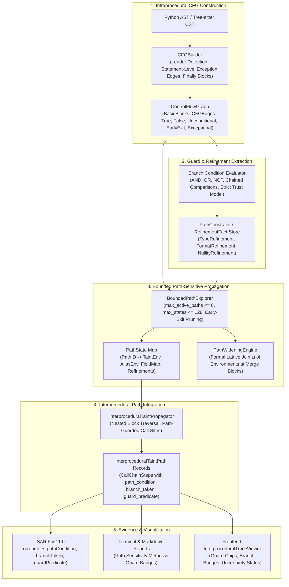

# CodeSentinel Phase 18 Implementation Plan
# Bounded Path-Sensitive Control-Flow & Guard Analysis

---

## 1. Executive Summary

CodeSentinel Phases 13 through 17 established a multi-tiered static data-flow and taint-tracking engine:
- **Phase 13**: Intraprocedural source-to-sink taint tracking over AST statements with lexical scoping and symbol tables.
- **Phase 15**: Static call graph construction, function summaries, and cross-function taint propagation.
- **Phase 16**: Conservative receiver type inference, type-aware receiver call dispatch, and bounded $k$-limiting call-string context sensitivity ($k \le 2$).
- **Phase 17**: Flow-sensitive alias tracking, deterministic allocation-site abstraction, bounded points-to sets ($k \le 4$), and strong/weak field-sensitive state management (`FieldStateMap`).

Despite these advancements, CodeSentinel currently evaluates code **without an explicit Control Flow Graph (CFG)** and **without path sensitivity**. Specifically:
1. In intraprocedural analysis (`python_visitor.py`), statements inside functions are traversed linearly or through a naive AST split/join in `if` statements. Branch conditions are discarded immediately, early-return guards (`if not is_valid(x): return`) do not prune downstream sink reachability, and loops are processed via an ungrounded 2-iteration pass without loop invariant or edge semantics.
2. In interprocedural analysis (`propagator.py`), caller function analysis is restricted to a single top-level iteration over `fn_node.body[:500]`. Any call sites or sinks nested inside conditionals (`if`), exception blocks (`try/except`), or loops (`for/while`) are completely skipped or analyzed without execution path context.
3. Common defensive programming guards—such as type narrowing (`isinstance(x, int)`), format validators (`x.isdigit()`, anchored `re.match(...)`), custom validation predicates (`if not validate(x): return`), and nullability checks (`if x is None: return`)—cannot provide fine-grained refinements to rule engines.
4. Mutually exclusive execution branches (`if mode == "A": ... elif mode == "B": ...`) are treated as if both sides could simultaneously contribute to downstream taint, causing false-positive taint merges.

**Phase 18 Objective**: Implement a **bounded, deterministic, offline, repository-local, and evidence-first Control Flow Graph (CFG) and Path-Sensitive Guard Analysis subsystem** for Python and JavaScript/TypeScript. 

### Core Architectural Principle: Guard Refinements vs. Global Taint
A fundamental architectural correction established in Phase 18 is the **strict decoupling of guard facts from global taint states**. A guard such as `isinstance(x, int)` or a validator check does **NOT** globally mark a variable as `TaintState.SANITIZED`. Instead, the pipeline maintains path-specific **refinement facts** (type refinements, format refinements, nullity refinements, and category-specific sanitizer applications) that are evaluated by each specific rule at its sink:

$$\text{CFG} \longrightarrow \text{Path Conditions} \longrightarrow \text{Guard / Value Refinements} \longrightarrow \text{Taint + Alias + Field State} \longrightarrow \text{Rule-Specific Sink Evaluation} \longrightarrow \text{Finding}$$

This guarantees that a type guard like `isinstance(x, int)` can prove safety for a numeric SQL interpolation without unsoundly stripping taint for an unrelated sink, and prevents HTML escaping from being misapplied as an SQL sanitizer.

---

## 2. Verified Phase 17 Baseline

An exhaustive architectural audit of the active repository confirms the following baseline facts:

| Dimension | Active Verified State | Verification Command / Source |
| :--- | :--- | :--- |
| **Complete Pytest Suite** | **474 passed, 1 skipped, 2 warnings** in 44.91s | `python -m pytest analyzer/tests backend/tests` |
| **Phase 17 Unit & Scenario Tests** | **33 passed, 0 failed** (100% pass rate) | `pytest -k phase17` (models, extractors, field state, propagator, CLI, reporters, DTOs) |
| **Regression Preservation** | **441 pre-Phase-17 tests passed** with 0 regressions | Verified across Phases 1 through 16 suites |
| **Frontend Production Build** | **`tsc -b && vite build` succeeded in 7.84s** | 0 TypeScript errors; 1,785 modules transformed |
| **Analyzer Boundary** | **Zero external dependencies in `analyzer/`** | 0 imports of FastAPI, SQLAlchemy, PostgreSQL, Celery, Redis, HTTP, or AI SDKs |
| **Baseline Comparator Implementation** | **Implementation unchanged** | 4-tier signature comparator (`analyzer/comparison/diff.py`) unmodified |
| **Database Migrations** | **0 new Alembic migrations** | Extends existing JSON `call_graph_summary` snapshot column |

### 2.1 Read-Only Architectural Audit of Phase 17 Subsystems

1. **Alias Identity**:
   - `AllocationSite` deterministically hashes `file:line:col:constructor`.
   - `AbstractObject` instances are uniquely keyed by `obj_id = f"obj_{site.site_hash}_{idx}"`.
   - Local variable aliases are tracked via `AliasEnvironment.bindings` mapping variable names to `PointsToSet`.
   - Reassignment strongly updates singleton targets and cleanly resets previous alias references.
2. **Points-To Semantics**:
   - `PointsToSet` enforces candidate budget $k \le 4$.
   - When candidate count exceeds $k$, the set marks `is_ambiguous = True` and `is_truncated = True` without discarding candidate IDs already gathered.
   - Branch joins perform set union: $PTS_1 \sqcup PTS_2$.
3. **Field Sensitivity**:
   - `FieldStateMap` maps `FieldKey(base_obj_id, field_name)` to `TaintState`.
   - Strong updates are performed when the receiver points to a singleton abstract object (`is_singleton() == True`).
   - Overwriting a field with an untainted value strongly resets the field taint state to `UNTAINTED`, clearing taint.
   - Weak updates (lattice join $\sqcup$) are performed when the receiver is ambiguous or points to multiple candidate objects.
4. **Interprocedural Behavior**:
   - Call chain steps (`CallChainStep`) are enriched with `receiver_type`, `receiver_confidence`, `context_id`, `alias_path`, `field_path`, and `allocation_site`.
   - Summaries (`FunctionSummary`) track parameter-to-return, parameter-to-sink, and parameter-to-field flows.
   - Type-aware receiver dispatch correctly matches class methods, preferring canonical `qualified_type_name`.

---

## 3. Repository Inspection Findings & Corrections

Before designing Phase 18, the active codebase was audited to eliminate invalid assumptions and establish correct architectural semantics:

### 3.1 Finding Identity & Baseline Comparator Invariance
- **Correction**: Finding identity in CodeSentinel is NOT a raw SHA-256 hash, and finding seeds must **NOT** include path-condition hashes.
- Finding UUIDs are generated using `uuid.uuid5(uuid.NAMESPACE_DNS, seed)` where `seed` incorporates `rule_id`, normalized source/sink file paths, line coordinates, and call-chain breadcrumb hashes.
- Differential baseline comparison in `analyzer/comparison/diff.py` uses a deterministic 4-tier matching algorithm:
  1. Exact signature: `(rule_id, norm_path, line_start, norm_snippet)`
  2. Fuzzy snippet: `(rule_id, norm_path, norm_snippet)` across line shifts
  3. Fuzzy location: `(rule_id, norm_path, line_start)` across minor snippet changes
  4. Explicit finding ID match fallback.
- **Phase 18 Invariant**: Path conditions and guard evidence are stored in finding `evidence` dictionaries and SARIF `properties` bags, leaving the primary finding ID and baseline matching signatures completely unchanged. The baseline comparator implementation remains unchanged; Phase 18 legitimately introduces `NEW` findings (for previously skipped nested blocks) and resolves `RESOLVED` findings (for safely guarded sinks).

### 3.2 Explicit Truncation, Widening, and Uncertainty Semantics
- **Correction**: Bounded analysis must never silently discard states, paths, or conditions.
- When path limits are reached, the state must transition to an explicit status:
  - `FEASIBLE`: Path conditions proven mathematically satisfiable.
  - `INFEASIBLE`: Path conditions proven contradictory (pruned from finding generation).
  - `UNKNOWN_GUARD`: Guard predicate cannot be statically decided (e.g. unanalyzed predicate function).
  - `UNKNOWN_CONTROL_FLOW`: Dynamic or unmodeled control-flow construct encountered.
  - `WIDENED`: Multiple paths merged at a join point due to budget exhaustion.
  - `TRUNCATED`: Path exploration halted due to branch depth limit.

### 3.3 Environmental Determinism
- **Correction**: Static analysis determinism is defined as:
  > *Semantically deterministic under identical source inputs, configuration, parser/runtime versions, and analysis environment.*
- Python dictionaries and sets must never be iterated directly into emitted results without canonical key sorting.

### 3.4 Performance Expectations
- **Correction**: Performance goals are empirical acceptance benchmarks measured on defined reference environments, NOT universal or asymptotic guarantees.
- Phase 18 does not claim "guaranteed polynomial execution"; rather:
  > *Strict finite analysis budgets prevent unbounded path exploration.*

### 3.5 Combinatorial State Space Bound
- In Phase 17, the state space considers:
  $$\text{Function} \times \text{Call Context } (k \le 2) \times \text{Allocation Site } (k \le 4) \times \text{Field Key } (M \le 16) \times \text{Taint State}$$
- Adding path sensitivity introduces branching states. To guarantee that execution remains strictly bounded, Phase 18 defines explicit, non-ambiguous budget parameters:
  - `max_active_paths_per_function = 8`: Maximum active exploration paths maintained concurrently across branching.
  - `max_total_path_states = 128`: Maximum total path state allocations per function before widening kicks in.
  - `max_branch_depth = 6`: Maximum nested conditional decision depth explored before merging to unconditional continuation.

---

## 4. Remaining Capability Gaps

| Capability Dimension | Phase 17 Baseline | Phase 18 Target Architecture |
| :--- | :--- | :--- |
| **Control Flow Representation** | None (Linear AST walking and naive split/merge in `python_visitor.py`) | Explicit intraprocedural Control Flow Graph (`ControlFlowGraph`, `BasicBlock`, `CFGEdge`) |
| **Nested Statement Coverage** | `propagator.py` only scans top-level statements in `fn_node.body[:500]` | Recursive CFG block traversal covers calls and sinks inside `if`, `try`, `while`, and `for` |
| **Early-Exit / Guard Pruning** | `if not valid: return` is ignored; downstream sinks execute unconditionally | Early return/raise terminates CFG path; downstream blocks are unreachable along that branch |
| **Path Feasibility** | All branches assumed reachable simultaneously | Propositional path constraint collection; mutually exclusive paths detected and pruned |
| **Type & Validation Guards** | `isinstance(x, int)` does not clear taint | Attaches `RefinementFact(TypeRefinement(int))`; rule engines query fact before reporting |
| **Conditional Sinks** | Sinks inside `if should_run:` execute unconditionally | Sink invocation recorded with its governing `PathConstraint` and branch condition |
| **Loop Semantics** | Hardcoded 2-pass without invariant or exit edge tracking | Formal loop-carried state transfer: entry, body, back-edge, fixed-point join, exit |
| **Exception Flow** | `try/except` statements ignored in interprocedural analysis | Statement-level exception edges; `finally` executes on both normal and exceptional paths |

---

## 5. Phase 18 Objective

Design and implement **Bounded Path-Sensitive Control-Flow & Guard Analysis** for CodeSentinel:
1. **Intraprocedural CFG Engine**: Construct deterministic Control Flow Graphs (`ControlFlowGraph`) for Python AST and JavaScript/TypeScript Tree-sitter functions, decomposing statements into basic blocks (`BasicBlock`) connected by typed edges (`CFGEdge`).
2. **Propositional Path Constraint Domain**: Track path constraints (`PathConstraint`) consisting of conjunctions of guard predicates (`GuardCondition`), supporting boolean combinations (`AND`, `OR`, `NOT`, chained comparisons).
3. **Refinement Fact Engine**: Recognize standard language guards and produce structured refinement facts (`RefinementFact`) consumed by sink rules, preserving canonical `TaintState`.
4. **Early-Exit Reachability Pruning**: Accurately model terminating statements (`return`, `raise`, `throw`, `sys.exit()`) and `assert` statements, ensuring code following early exits is never analyzed as reachable along the exit branch.
5. **Statement-Level Exception Semantics**: Model exception edges from potentially raising statements to `except` handlers, preserving pre-assignment environment state and ensuring `finally` blocks execute along all exit trajectories.
6. **Bounded Path Exploration & Widening**: Maintain at most 8 active paths and at most 128 path states per function with a maximum branch depth of 6, merging path states via formal lattice joins upon budget exhaustion.
7. **Interprocedural Path Integration**: Propagate path conditions and guard evidence across multi-hop call chains in `InterproceduralTaintPropagator`, attaching path conditions to `CallChainStep`.
8. **Zero-Migration Persistence & UI**: Persist path sensitivity metrics into existing JSON columns and visualize guard badges and branch conditions in `InterproceduralTraceViewer`.

---

## 6. Why This Is the Next Logical Phase

CodeSentinel's architectural roadmap follows a deliberate, mathematically grounded progression:
1. **Phases 1–12**: Lexical, syntactic, structural, and architectural boundary analysis.
2. **Phase 13**: Data-flow foundations—intraprocedural taint propagation and symbol tables.
3. **Phase 15**: Interprocedural foundations—call graphs and function summaries.
4. **Phase 16**: Type and context sensitivity—resolving receiver method dispatch and separating call-site contexts.
5. **Phase 17**: Heap abstraction—aliasing, points-to sets, and field-sensitive state.

At this junction, the static analysis engine possesses type, context, and heap representations, but **lacks a fundamental model of program execution order, branching, and guard conditions**. 

Attempting to implement container sensitivity (Candidate C) or advanced inter-module dispatch (Candidate E) before building a Control Flow Graph would compound structural inaccuracies: container accesses are heavily dependent on branching (`if 'key' in dict: ...`), and method dispatch frequently occurs inside guards (`if hasattr(obj, 'exec'): obj.exec()`).

Furthermore, bringing in general-purpose SMT solvers (such as Z3) would violate CodeSentinel's core architectural tenets: it would add heavy native C binary dependencies, increase scan times by orders of magnitude, and introduce non-deterministic solver timeouts. 

A **pure-Python, bounded, deterministic propositional CFG and guard evaluation engine** is the exact capability boundary required to unlock high-precision static analysis.

---

## 7. Architecture & Subsystem Decomposition



---

## 8. Domain Models

Phase 18 models reside in a dedicated, isolated package: `analyzer/dataflow/cfg/models.py`.

### 8.1 Control Flow Graph Models

```python
from enum import Enum
from typing import Any, Optional, Union
from pydantic import BaseModel, Field

class BranchKind(str, Enum):
    """Classification of CFG edge branches."""
    UNCONDITIONAL = "UNCONDITIONAL"
    TRUE_BRANCH = "TRUE_BRANCH"
    FALSE_BRANCH = "FALSE_BRANCH"
    EARLY_EXIT = "EARLY_EXIT"          # return, raise, throw, sys.exit
    LOOP_BACK = "LOOP_BACK"            # loop iteration back-edge
    LOOP_EXIT = "LOOP_EXIT"            # loop termination edge
    EXCEPTIONAL = "EXCEPTIONAL"        # raising statement -> except block
    FINALLY_ENTRY = "FINALLY_ENTRY"    # normal/exceptional exit -> finally block
    FINALLY_EXIT = "FINALLY_EXIT"      # finally exit -> continuation/re-raise

class CFGEdge(BaseModel):
    """Directed edge connecting basic blocks."""
    source_block_id: str
    target_block_id: str
    kind: BranchKind
    condition_expr: Optional[str] = None
    condition_ast: Optional[Any] = Field(default=None, exclude=True)

class BasicBlock(BaseModel):
    """Sequence of statements entered only at the beginning and exited only at the end."""
    id: str                             # Deterministic block ID (e.g. "bb_0")
    function_qualified_name: str
    file_path: str
    start_line: int
    end_line: int
    statements: list[Any] = Field(default_factory=list, exclude=True)
    is_entry: bool = False
    is_exit: bool = False
    is_early_exit: bool = False         # Block terminates with return/raise/sys.exit
    is_exceptional: bool = False        # Except handler block
    is_finally: bool = False            # Finally cleanup block
    predecessors: list[str] = Field(default_factory=list)
    successors: list[str] = Field(default_factory=list)

class ControlFlowGraph(BaseModel):
    """Intraprocedural control flow graph for a single function."""
    function_qualified_name: str
    file_path: str
    entry_block_id: str
    exit_block_id: str
    blocks: dict[str, BasicBlock] = Field(default_factory=dict)
    edges: list[CFGEdge] = Field(default_factory=list)
    has_loops: bool = False
    has_exceptions: bool = False
```

### 8.2 Guard, Refinement & Boolean Expression Models

```python
class PredicateOp(str, Enum):
    """Recognized propositional guard predicate operators."""
    IS_INSTANCE = "IS_INSTANCE"          # isinstance(x, (int, float))
    IS_DIGIT = "IS_DIGIT"                # x.isdigit()
    IS_ALPHA = "IS_ALPHA"                # x.isalnum()
    IS_NONE = "IS_NONE"                  # x is None
    IS_NOT_NONE = "IS_NOT_NONE"          # x is not None
    EQUALS_CONST = "EQUALS_CONST"        # x == "STATIC"
    NOT_EQUALS_CONST = "NOT_EQUALS_CONST"# x != "STATIC"
    ANCHORED_REGEX = "ANCHORED_REGEX"    # re.match(r'^[a-z]+$', x)
    REGISTERED_VALIDATOR = "REGISTERED_VALIDATOR" # Statically analyzed or config-whitelisted validator
    TRUTHY = "TRUTHY"                    # if x:
    FALSY = "FALSY"                      # if not x:
    COMPOSITE_AND = "COMPOSITE_AND"      # c1 and c2
    COMPOSITE_OR = "COMPOSITE_OR"        # c1 or c2
    COMPOSITE_NOT = "COMPOSITE_NOT"      # not c

class GuardCondition(BaseModel):
    """Single propositional guard predicate."""
    variable_name: str
    predicate_op: PredicateOp
    expected_value: bool                 # True on matching branch, False on alternative
    argument_literal: Optional[str] = None
    raw_expression: str
    line: int
    col: int

class CompositeCondition(BaseModel):
    """Boolean composition of guard conditions (AND, OR, NOT)."""
    operator: PredicateOp               # COMPOSITE_AND, COMPOSITE_OR, COMPOSITE_NOT
    children: list[Union[GuardCondition, 'CompositeCondition']] = Field(default_factory=list)

class RefinementFact(BaseModel):
    """Path-specific value refinement fact evaluated by rule sinks."""
    variable_name: str
    refined_type: Optional[str] = None        # e.g. "int", "bool"
    is_numeric_string: bool = False           # e.g. from isdigit()
    is_alphanumeric_string: bool = False      # e.g. from isalnum()
    is_non_null: bool = False                 # e.g. from is not None
    applicable_sanitizer_category: Optional[str] = None # e.g. SinkCategory.COMMAND_EXECUTE
    provenance_line: int = 0

class PathFeasibilityStatus(str, Enum):
    """Explicit feasibility status of a path constraint."""
    FEASIBLE = "FEASIBLE"
    INFEASIBLE = "INFEASIBLE"
    UNKNOWN_GUARD = "UNKNOWN_GUARD"
    UNKNOWN_CONTROL_FLOW = "UNKNOWN_CONTROL_FLOW"
    WIDENED = "WIDENED"
    TRUNCATED = "TRUNCATED"

class PathConstraint(BaseModel):
    """Conjunction of guard conditions and refinement facts along an active path."""
    conditions: list[GuardCondition] = Field(default_factory=list)
    refinement_facts: dict[str, list[RefinementFact]] = Field(default_factory=dict) # var -> facts
    feasibility: PathFeasibilityStatus = PathFeasibilityStatus.FEASIBLE
    contradiction_reason: Optional[str] = None
    is_widened: bool = False
    is_truncated: bool = False
```

### 8.3 Path State Model

```python
class PathState(BaseModel):
    """Analysis state along a specific execution path within a function."""
    path_id: str
    current_block_id: str
    constraints: PathConstraint
    var_states: dict[str, str] = Field(default_factory=dict) # var -> TaintState string
    alias_bindings: dict[str, list[str]] = Field(default_factory=dict) # var -> candidate object IDs
    field_states: dict[str, str] = Field(default_factory=dict) # base.field -> TaintState string
    call_chain: list[Any] = Field(default_factory=list)
    branch_depth: int = 0
    is_terminated: bool = False
```

---

## 9. Core Analysis Semantics

### 9.1 Intraprocedural CFG Construction Algorithm
1. **Leader Identification**:
   - The first statement in the function body is a leader.
   - Any statement that is the target of a branch (`if` body, `else` body, loop body, exception handler) is a leader.
   - Any statement immediately following a branch statement, `return`, `raise`, `throw`, `break`, `continue`, or `assert` is a leader.
2. **Block Formation**:
   - A basic block consists of all statements from a leader up to, but not including, the next leader or function end.
   - Blocks ending with `return`, `raise`, `sys.exit()`, or `throw` are marked `is_early_exit = True`.
3. **Assert Semantics**:
   - In Python, `assert condition` is NOT an unconditional early-exit. It splits into:
     - **True Branch**: Continues normal execution with condition assumed `True`.
     - **False Branch**: Generates an `AssertionError` leading to exceptional termination or enclosing `except AssertionError` handler.
4. **Statement-Level Exception & Finally Semantics**:
   - Potentially-raising statements (calls, attribute lookups, division, indexing) within a `try` block emit `BranchKind.EXCEPTIONAL` edges directly to the matching `except` block.
   - The environment state flowing along the exceptional edge preserves the **pre-statement state** (e.g. if `data = request.input` fails, `data` is not initialized in the `except` handler).
   - `finally` blocks are modeled with dual-entry and dual-exit:
     - Entered from normal completion of `try`/`except`.
     - Entered from exceptional unhandled termination.
     - Upon completion, `finally` transitions to the follow-block (on normal paths) or re-raises the unhandled exception.

### 9.2 Boolean Expression & Guard Decomposition
Complex boolean expressions are systematically decomposed into conjunctive normal forms:
- `if c1 and c2:`: Evaluates True branch under $c1 \land c2$; False branch under $\neg c1 \lor \neg c2$.
- `if c1 or c2:`: Evaluates True branch under $c1 \lor c2$; False branch under $\neg c1 \land \neg c2$.
- `if not c:`: Inverts the polarity of the guard.
- Chained comparisons (`0 < x <= 100`): Decomposed into $(x > 0) \land (x \le 100)$.

### 9.3 Strict Trust Model for Guards & Validators
1. **No Blind Name-Based Sanitization**: A function is **never** treated as a sanitizer merely because its name contains `"valid"`, `"clean"`, or `"sanitize"`.
2. **Trusted Refinements**:
   - **Built-in Type Guards**: `isinstance(x, (int, float, bool))` produces `TypeRefinement(type)`.
   - **Built-in String Checkers**: `x.isdigit()` produces `FormatRefinement(is_numeric=True)`.
   - **Anchored Regex**: `re.match(r'^[a-zA-Z0-9_]+$', x)` produces `FormatRefinement(is_alphanumeric=True)` **only if anchored** with `^` and `$`. Unanchored searches (e.g. `re.search(r'[0-9]', x)`) do NOT guarantee validation.
   - **Registered / Analyzed Validators**: Custom functions produce refinements only if explicitly configured in `TaintRegistry` or if intraprocedural summary proves boolean validation.
   - **Category-Specific Sanitizers**: `shlex.quote()` produces `SanitizerRefinement(SinkCategory.COMMAND_EXECUTE)`; `html.escape()` produces `SanitizerRefinement(SinkCategory.DOM_XSS)`. Neither grants universal sanitization.

### 9.4 Propositional Path Feasibility & Infeasible Path Pruning
1. **Contradiction Rules**:
   - $x == C_1 \land x == C_2$ where $C_1 \neq C_2 \implies \text{INFEASIBLE}$.
   - $x \text{ is None} \land x \text{ is not None} \implies \text{INFEASIBLE}$.
   - $\text{TypeRefinement}(x, \text{int}) \land \text{TypeRefinement}(x, \text{str}) \implies \text{INFEASIBLE}$.
   - $Guard(x) == \text{True} \land Guard(x) == \text{False} \implies \text{INFEASIBLE}$.
2. **Path Pruning**: Sinks located on paths evaluated as `INFEASIBLE` produce zero findings.

### 9.5 Formal Widening & Branch-State Join Semantics
When paths merge at a CFG join node (or when budgets are reached), environments are joined using formal lattice operations:

1. **Taint State Join**:
   $$T_A \sqcup T_B = \begin{cases} \text{TAINTED} & \text{if } T_A = \text{TAINTED} \lor T_B = \text{TAINTED} \\ \text{SANITIZED} & \text{if } T_A = \text{SANITIZED} \land T_B = \text{SANITIZED} \\ \text{UNTAINTED} & \text{otherwise} \end{cases}$$
2. **Points-To Set Join**:
   $$PTS_A \sqcup PTS_B = \text{candidate\_ids}(PTS_A) \cup \text{candidate\_ids}(PTS_B) \quad (\text{bounded to } k \le 4)$$
3. **Field State Join**:
   $$(FieldState_A \sqcup FieldState_B)(k) = FieldState_A(k) \sqcup FieldState_B(k)$$
4. **Path Constraint Widening ($\nabla$)**:
   $$\text{Refinements}_A \nabla \text{Refinements}_B = \text{Refinements}_A \cap \text{Refinements}_B$$
   *Monotonicity Invariant*: A refinement fact is preserved after widening **if and only if** it was proven on **all** merging paths. Never let widening accidentally imply that a validation fact holds globally.

### 9.6 Loop-Carried State Semantics
Loops are analyzed via structured fixed-point iterations:
1. **Entry State**: State entering loop header prior to first iteration.
2. **Body State**: Propagation through loop body basic blocks.
3. **Back-Edge State**: State at end of body routed back to header.
4. **Fixed-Point Join**: Loop header computes $S_{\text{iter}} = S_{\text{entry}} \sqcup S_{\text{back-edge}}$. If $S_{\text{iter}} == S_{\text{prev}}$, loop has converged.
5. **Iteration Cap**: Maximum 2 back-edge iterations; if unconverged, state is widened to `WIDENED_LOOP`.
6. **Exit State**: Propagated through `BranchKind.LOOP_EXIT` edge to downstream blocks.

---

## 10. Interprocedural Integration

Phase 18 deeply integrates with Phases 15, 16, and 17 in `analyzer/dataflow/interprocedural/propagator.py`:

1. **Recursive CFG Block Traversal in Caller Functions**:
   - Replaces the linear `statements = fn_node.body[:500]` pass with a CFG-guided path traversal.
   - Call sites located inside nested `if`, `try`, or loop blocks are reached via their corresponding basic blocks, carrying their active `PathConstraint` and `RefinementFact` sets.
2. **Path-Condition Enriched `CallChainStep`**:
   - `CallChainStep` is enriched with three new fields:
     - `path_condition: Optional[str]`: Human-readable summary of governing path constraints.
     - `branch_taken: Optional[str]`: `"TRUE_BRANCH"`, `"FALSE_BRANCH"`, `"UNCONDITIONAL"`, or `"EXCEPTIONAL"`.
     - `guard_predicate: Optional[str]`: The specific guard applied at the call site, if any.
3. **Guard-Aware Function Summaries**:
   - Parameter transfers in `FunctionSummary` record governing path conditions.
   - If a callee function only reaches a sink when parameter 1 satisfies a condition, the interprocedural propagator verifies caller-side feasibility before reporting.
4. **Preserved Resource Limits**:
   - `max_call_depth = 5` (Phase 15).
   - `max_k = 2` (Phase 16).
   - `max_points_to_candidates = 4` (Phase 17).
   - SCC fixed-point iterations capped at 5.

---

## 11. Taint Integration & Rule-Specific Sink Evaluation

The pipeline cleanly separates guard detection from vulnerability decisions:

```text
1. Guard Evaluation:
   if isinstance(x, int):   ===>  x possesses RefinementFact(type=int)
   if shlex.quote(x):       ===>  x possesses RefinementFact(sanitizer=COMMAND_EXECUTE)
   if html.escape(x):       ===>  x possesses RefinementFact(sanitizer=DOM_XSS)

2. Rule-Specific Sink Precondition Checks:
   Rule SEC-PY-009 (SQL Injection):
     Sink: cursor.execute(query)
     Precondition satisfied if: query contains no TAINTED variables OR tainted var has RefinementFact(type=int)
     Action: Suppress finding if precondition satisfied.

   Rule SEC-PY-010 (Command Injection):
     Sink: os.system(cmd)
     Precondition: RefinementFact(sanitizer=COMMAND_EXECUTE) OR RefinementFact(is_alphanumeric=True)
     Note: RefinementFact(sanitizer=DOM_XSS) does NOT satisfy this sink! Taint remains active.
```

---

## 12. Security Rule Integration

Phase 18 enhances precision across CodeSentinel's core security rules without creating duplicate rule definitions:

| Rule ID | Name | Language | Current Weakness (Phase 17) | Phase 18 Precision Enhancement |
| :--- | :--- | :--- | :--- | :--- |
| **`SEC-PY-009`** | SQL Injection | Python | Flags `cursor.execute(sql)` even if preceded by `if not is_valid(sql): return` | Prunes path after early return; evaluates `isinstance(id, int)` refinement |
| **`SEC-PY-010`** | Command Injection | Python | Flags `os.system(cmd)` even if guarded by `if not cmd.isalnum(): sys.exit(1)` | Recognizes `isalnum()` and `shlex.quote()` command-specific refinements |
| **`SEC-PY-011`** | Interprocedural SQL Injection | Python | Flags cross-function SQL sinks even if caller validates argument in an `if` block | Interprocedural path constraints verify caller guard before reporting |
| **`SEC-PY-012`** | Interprocedural Command Injection | Python | Flags cross-function command sinks on mutually exclusive branch calls | Separates call paths; suppresses finding if sink is on inactive branch |
| **`SEC-JS-007`** | DOM-Based XSS | JS/TS | Flags `element.innerHTML` even if guarded by `typeof input === 'number'` | Evaluates number type refinement at DOM sink; suppresses false positive |
| **`SEC-JS-008`** | Dynamic Code Eval | JS/TS | Flags `eval(code)` inside dead `if (false)` or unreachable early-return blocks | Prunes unreachable blocks from CFG; zero finding generated |
| **`SEC-JS-009`** | Interprocedural DOM XSS | JS/TS | Cross-function XSS flagged when callee call is inside sanitization check | Evaluates anchored regex or registered validator guard before callee invocation |
| **`SEC-JS-010`** | Interprocedural Eval | JS/TS | Flags eval calls across helper functions regardless of branch conditions | Propagates branch condition along multi-hop call chain |

---

## 13. Resource Budgets & Deterministic Bounds

To eliminate exponential state space explosion and guarantee predictable execution times:

```text
Limit Parameter                   Default   Min   Max   Overflow Action
───────────────────────────────────────────────────────────────────────────────────
max_cfg_blocks_per_function         64       8    256   Truncate remaining blocks; mark CFG TRUNCATED
max_active_paths_per_function        8       1     32   Lattice join paths at merge block; mark WIDENED
max_total_path_states              128      16    512   Halt path exploration; fall back to block merge
max_branch_depth                     6       1     16   Stop path splitting; merge to unconditional
max_conditions_per_path             16       2     64   Widen oldest condition; mark CONSTRAINTS_WIDENED
max_loop_iterations                  2       1      5   Fixed-point join after 2 passes; mark WIDENED_LOOP
```

### Deterministic Overflow Guarantees:
1. **Never Silently Discard**: When any limit is exceeded, an explicit status (`WIDENED`, `TRUNCATED`, `UNKNOWN_CONTROL_FLOW`) is attached to findings, summary DTOs, and reports.
2. **Conservative Fallback**: On budget exhaustion, the engine always falls back to conservative Phase 17 behavior (joining taint states without assuming branch guards hold).

---

## 14. Cancellation Architecture

Cancellation in Phase 18 is strictly **analyzer-owned** and checked at every discrete computational step:

```python
def check_cancellation(self) -> None:
    if self.is_cancelled and self.is_cancelled():
        from analyzer.models.errors import AnalysisCancelledError
        raise AnalysisCancelledError("Path-sensitive CFG analysis cancelled by user")
```

### Cancellation Checkpoints:
1. At the start of function CFG construction.
2. At every basic block creation and statement iteration.
3. Before every branch condition evaluation.
4. Before every path state fork and path state join.
5. In interprocedural propagation before traversing path-guarded call sites.
6. Before emitting findings.

*Zero imports of Celery, Redis, or backend cancellation primitives exist in `analyzer/`.*

---

## 15. Determinism Guarantees

All Phase 18 algorithms guarantee semantic determinism under identical inputs, configuration, and runtime environment:

1. **Deterministic CFG Node Identification**: Basic blocks are numbered sequentially in source code topological order: `bb_0`, `bb_1`, `bb_2`...
2. **Deterministic Path IDs**: Path IDs are generated from branch choices: `p_entry -> bb_0:T -> bb_1:F -> bb_3`.
3. **Stable Sorting**: All dictionaries of blocks, edges, paths, and constraints are converted to sorted lists keyed by `(start_line, col_start, id)` before iteration or serialization.
4. **Finding Seed Invariance**: Finding seeds do NOT include path condition hashes; finding IDs remain completely stable across runs and matching tiers.

---

## 16. Baseline Differential Compatibility

Phase 18 preserves Phase 9 baseline comparison semantics (`BaselineComparator` in `analyzer/comparison/diff.py`):

1. **Comparator Implementation Unchanged**:
   - The comparator algorithm itself is not modified.
2. **Expected Transitions**:
   - **Unchanged Code**: Retains identical `(rule_id, file_path, line_start, snippet)` signature keys $\implies \text{UNCHANGED}$.
   - **Safely Guarded Code (Precision Improvement)**: Sinks protected by validation guards or early exits are no longer flagged $\implies \text{RESOLVED}$.
   - **Newly Discovered Nested Code**: Sinks discovered inside previously skipped `try/except` or conditional blocks $\implies \text{NEW}$.

---

## 17. Codebase Health Score Invariance

CodeSentinel's single-deduction health score calculation (`analyzer/architecture/health.py`) is preserved without modification:
- Each finding produces exactly **one deduction** based on severity.
- Multiple paths reaching the same sink in the same function are **deduplicated** by finding ID prior to score deduction.
- Path sensitivity cannot inflate or multiply deductions.

---

## 18. Persistence & Backend API (Zero Database Migrations)

### 18.1 Backend DTO Extension (`backend/app/schemas/callgraph.py`)
Phase 18 metrics extend `CallGraphSummaryDTO` within the existing nullable JSON column `analysis_snapshots.call_graph_summary`:

```python
class PathSensitivitySummaryDTO(BaseModel):
    """Path sensitivity, CFG, and guard reasoning metrics (Phase 18)."""
    cfgs_constructed_count: int = Field(default=0, ge=0)
    basic_blocks_count: int = Field(default=0, ge=0)
    feasible_paths_count: int = Field(default=0, ge=0)
    infeasible_paths_pruned: int = Field(default=0, ge=0)
    guards_evaluated_count: int = Field(default=0, ge=0)
    paths_widened_count: int = Field(default=0, ge=0)
    truncated_depth_count: int = Field(default=0, ge=0)

class CallGraphSummaryDTO(BaseModel):
    # Existing Phase 15, 16, 17 fields...
    alias_analysis: Optional[AliasAnalysisSummaryDTO] = None
    # Phase 18 additive field:
    path_sensitivity: Optional[PathSensitivitySummaryDTO] = None
```

### 18.2 Backward Compatibility
- Historical snapshots created during Phases 10–17 deserialize with `path_sensitivity = None`.
- No database migration or table schema alteration is required.

---

## 19. Frontend Trace Viewer Visualization

### 19.1 TypeScript DTOs (`frontend/src/types/api.ts`)
```typescript
export interface PathSensitivitySummaryDTO {
  cfgs_constructed_count: number;
  basic_blocks_count: number;
  feasible_paths_count: number;
  infeasible_paths_pruned: number;
  guards_evaluated_count: number;
  paths_widened_count: number;
  truncated_depth_count: number;
}

export interface CallChainStepDTO {
  // Existing fields...
  path_condition?: string | null;
  branch_taken?: 'TRUE_BRANCH' | 'FALSE_BRANCH' | 'UNCONDITIONAL' | 'EARLY_EXIT' | 'EXCEPTIONAL' | null;
  guard_predicate?: string | null;
  path_status?: 'FEASIBLE' | 'WIDENED' | 'TRUNCATED' | 'UNKNOWN' | null;
}
```

### 19.2 UI Enhancements in `InterproceduralTraceViewer.tsx`
- **Guard Chips**: Displays `[Guard: is_valid(x) == TRUE]` in emerald badges alongside step headers.
- **Branch Direction Badges**: Highlights `[Branch: TRUE]` or `[Branch: FALSE]` indicating path decisions.
- **Feasibility & Uncertainty Indicators**: Renders `[Feasible Path]`, `[Widened Path]`, or `[Truncated Depth]` pills on call flow breadcrumbs.
- Graceful fallback: If `path_condition` is undefined (historical snapshot), chips are omitted.

---

## 20. CLI & Configuration System

Extends the Phase 14 three-tier configuration model (`settings.py`, `repo_config.py`, `cli/main.py`):

```bash
# Disable path-sensitive analysis (falls back to Phase 17 behavior)
codesentinel analyze path/to/repo --disable-path-sensitivity
codesentinel analyze path/to/repo --disable-guard-analysis

# Resource bounds configuration
codesentinel analyze path/to/repo --max-active-paths 8
codesentinel analyze path/to/repo --max-total-path-states 128
codesentinel analyze path/to/repo --max-branch-depth 6
codesentinel analyze path/to/repo --max-conditions-per-path 16
codesentinel analyze path/to/repo --max-cfg-blocks 64
```

### Precedence Hierarchy:
$$\text{CLI Invocations Flags} > \text{Repository Config File } (\texttt{.codesentinel.yml}) > \text{Built-In System Defaults}$$

---

## 21. Language Boundaries & Supported Subsets

### 21.1 Python Supported Subset
- **Control Flow**: `if/elif/else`, `while`, `for/in`, `try/except/finally`, `return`, `raise`, `break`, `continue`, `assert`, `sys.exit()`.
- **Guards**: `isinstance()`, `issubclass()`, `callable()`, `hasattr()`, `x.isdigit()`, `x.isnumeric()`, `x.isalnum()`, `x is None`, `x is not None`, `x == CONST`, anchored `re.match()`, `shlex.quote()`, registered validators.
- **Degradation**: Dynamic `eval()`, `exec()`, runtime monkey-patching degrade conservatively to `UNKNOWN_CONTROL_FLOW`.

### 21.2 JavaScript / TypeScript Supported Subset
- **Control Flow**: `if/else`, `switch/case`, `while`, `for`, `for..of`, `try/catch/finally`, `return`, `throw`, `break`, `continue`, ternary `? :`.
- **Guards**: `typeof x === '...'`, `x instanceof ...`, `Array.isArray()`, `Number.isInteger()`, `x === null`, `x !== undefined`, anchored `/^regex$/.test(x)`, `validator.isEmail()`, `encodeURIComponent()`.
- **Degradation**: Dynamic prototype mutation, `with` statements, and unanalyzable reflection degrade to `UNKNOWN_CONTROL_FLOW`.

---

## 22. End-to-End Scenarios

The test suite will implement 12 exhaustive scenarios covering positive, negative, edge, and bound cases:

- **Scenario A (Early Return Guard - FP Suppression)**: `if not is_valid(uid): return` followed by `db.execute(uid)`. Verifies that the sink is unreachable on the invalid path; 0 findings emitted.
- **Scenario B (Mutually Exclusive Branches)**: `if mode == "SAFE": sanitize(x)` vs `else: pass` followed by `sink(x)`. Verifies that the "SAFE" path is sanitized, while the "else" path flags a vulnerability with branch evidence `[Branch: FALSE_BRANCH]`.
- **Scenario C (Type Narrowing Guard vs Sink Evaluation)**: `if isinstance(user_input, int): cursor.execute(f"SELECT * FROM u WHERE id = {user_input}")`. Verifies that integer refinement fact satisfies SQL injection safety check without globally clearing taint.
- **Scenario D (Assert Statement Semantics)**: `assert uid.isdigit(), "Invalid ID"` followed by `os.system(uid)`. Verifies True branch continues with numeric refinement; False branch routes to `AssertionError`.
- **Scenario E (Nested Interprocedural Guard)**: Function $A$ checks `if validate(data): B(data)`. Verifies that `B` receives data with path constraint `validate(data) == True`.
- **Scenario F (JavaScript Typeof Guard)**: `if (typeof input !== 'string') { return; } element.innerHTML = input;`. Verifies non-string branches exit; string branch is correctly tracked.
- **Scenario G (Statement-Level Exception & Finally)**: Assignment `data = request.input` inside `try` block that raises before completion; verifies `except` handler does not invent unassigned `data` state, and `finally` executes.
- **Scenario H (Active Path Budget Widening)**: Function with 10 sequential `if` branches. Verifies that upon exceeding `max_active_paths_per_function = 8`, the engine widens to `WIDENED` without hanging or exceeding memory budgets.
- **Scenario I (Branch Depth Budget Truncation)**: Code with 7 deeply nested `if` blocks. Verifies that nesting halts cleanly at depth 6 with `is_truncated = True`.
- **Scenario J (Cancellation Checkpoint)**: Synthetic fixture with complex CFG cancels analysis midway via callback; verifies immediate clean `AnalysisCancelledError` without orphaned state.
- **Scenario K (Backward Compatibility)**: Deserializes historical Phase 15/16/17 analysis snapshots; verifies `path_sensitivity` defaults cleanly to `None`.
- **Scenario L (Category-Specific Sanitizer Separation)**: Input passed through `html.escape(x)` and then fed to `os.system(x)`. Verifies command sink rejects HTML escaping as a command sanitizer and flags vulnerability.

---

## 23. Testing Strategy

```text
Suite Component             Target Tests  Focus Area
────────────────────────────────────────────────────────────────────────────
Unit: CFG Construction           8        Leaders, statement exception edges, finally, assert
Unit: Guard Recognition          8        AND/OR/NOT, anchored regex, strict validator trust
Unit: Path Feasibility           6        Contradiction solver, SAT/UNSAT, widening monotonicity
Integration: Intraprocedural     6        Early return, guarded sinks, loop fixed-point
Integration: Interprocedural     6        Nested calls in if/try, path-enriched steps
Reporters & SARIF                4        Property bags, terminal summary, markdown
CLI & Configuration              4        Flags, precedence, budget overrides
Backend DTO Compatibility        2        Schema serialization, historical backward compat
Frontend Build Check             1        npm run build (0 errors)
Total New Phase 18 Tests        45
```

> **Testing Policy**: All pre-Phase-18 regression tests must pass with zero regressions. Phase 18 adds at least 45 targeted tests across `analyzer/tests/` and `backend/tests/`.

---

## 24. Performance Methodology

### Reference Environment
- CPU: Intel Core i7 / AMD Ryzen 7 (or equivalent 8-core workstation).
- RAM: 16 GB minimum.
- Python: 3.12+ 64-bit runtime.

### Benchmark Fixtures
- Small: 50 functions (micro-benchmarks).
- Medium: 500 functions (typical microservice).
- Large: 2,500 functions (enterprise repository).

### Empirical Performance Targets (Non-Binding)
- **Runtime Overhead Target**: Enabling Phase 18 targeted to add $\le 25\%$ wall-clock runtime over Phase 17 on the medium fixture.
- **Peak Memory Target**: Memory overhead targeted to remain $\le 35\text{ MB}$ above Phase 17 baseline.
- **Median Function Analysis Target**: Target $\le 1.5\text{ ms}$ per function CFG exploration.

---

## 25. Accuracy & Precision Methodology

Static analysis accuracy will be measured against controlled fixture corpora:
1. **Supported Positive Cases**: 100% of explicitly supported vulnerable patterns without guards must produce findings.
2. **Supported Negative Cases**: 100% of explicitly documented defensive guard idioms (early returns, type narrowing, anchored regex) must suppress false positives.
3. **Conservative Handling of Unsupported Syntax**: Unsupported dynamic features must degrade to `UNKNOWN_CONTROL_FLOW` or `UNKNOWN_GUARD` without unsoundly dropping true vulnerabilities.
4. **Baseline Invariance**: Zero regressions in pre-existing test findings.

---

## 26. Risk Register

| # | Risk | Likelihood | Impact | Mitigation | Test Verification | Fallback |
|---|:---|:---:|:---:|:---|:---|:---|
| 1 | **Combinatorial Path Explosion** | Med | High | Enforce strict `max_active_paths = 8`, `max_states = 128`, and `depth = 6` | Scenario H (10-branch fixture) | Lattice join $\sqcup$ to `WIDENED` |
| 2 | **Infinite Loop CFG Cycles** | Med | High | Loop back-edges capped at 2 iterations with fixed-point check | Loop back-edge test | Widen loop state |
| 3 | **False Suppression of Real Bugs** | Low | High | Decouple guard refinements from global taint; rule sinks evaluate applicability | Negative guard tests | Conservative taint preservation |
| 4 | **Unsound Assert Statement Handling** | Low | High | Model assert as True continuation and False `AssertionError` exit | Assert unit tests | Fall back to full reachability |
| 5 | **Tree-Sitter JS/TS AST Divergence** | Med | Med | Canonical mapping for JS statement types (`IfStatement`, `TryStatement`) | JS/TS CFG unit tests | Skip unmapped JS syntax |
| 6 | **Non-Deterministic CFG Block IDs** | Low | High | Sort blocks topologically by source line coordinates | Multi-run determinism test | Canonical sort before emission |
| 7 | **SARIF Payload Bloat** | Low | Med | Path condition property strings truncated to 128 characters | SARIF schema validation | Omit verbose conditions |
| 8 | **Cancellation Lag** | Low | Med | Cancellation checks placed in every block traversal loop | Synthetic cancellation test | Raise `AnalysisCancelledError` |
| 9 | **Historical DTO Incompatibility** | Low | High | Optional fields with default `None` | Snapshot deserialization test | Default to `None` |
| 10| **Frontend Rendering Crash** | Low | High | Null-safe optional chaining (`step.path_condition?.`) | Component render unit tests | Graceful chip hiding |
| 11| **Try/Finally Taint Leakage** | Med | Med | Dual-entry and dual-exit finally modeling | Try/finally test suite | Conservative taint union |
| 12| **Regex ReDoS in Analyzer** | Low | High | Static pattern matching only; never execute user regex at analysis time | Malformed regex test | Discard complex regex guard |
| 13| **Memory Leak in CFG Cache** | Low | Med | CFGs discarded immediately after function summary generation | Memory leak benchmark | Scope CFG to function life |
| 14| **CLI Flag Conflict** | Low | Low | Model validators in `AnalysisConfig` | CLI config conflict test | Raise `ValueError` on conflict |
| 15| **Architectural Boundary Leak** | Low | High | Verify analyzer imports with AST parser | Boundary independence test | Fail build if violated |
| 16| **Baseline Comparator Hash Mismatch** | Low | High | Path conditions kept out of finding seed | Baseline regression tests | Preserve Phase 9 matching |

---

## 27. Work Breakdown Structure

```text
18.1  Domain Models: analyzer/dataflow/cfg/models.py (CFG, BasicBlock, CFGEdge, GuardCondition, RefinementFact, PathState)
18.2  Python CFG Builder: analyzer/dataflow/cfg/python_cfg_builder.py (Leaders, Statement Exceptions, Finally, Assert)
18.3  JS/TS CFG Builder: analyzer/dataflow/cfg/jsts_cfg_builder.py
18.4  Guard & Refinement Engine: analyzer/dataflow/cfg/guard_evaluator.py (AND/OR/NOT, Anchored Regex, Trust Model)
18.5  Path Explorer & Feasibility Engine: analyzer/dataflow/cfg/path_explorer.py (Budgets, Monotonic Widening, Contradictions)
18.6  Intraprocedural Integration: Update python_visitor.py and js_visitor.py with CFG-driven exploration
18.7  Interprocedural Integration: Update propagator.py with recursive CFG block traversal and path-enriched CallChainSteps
18.8  Rule Precondition Integration: Update rule sink evaluation to inspect RefinementFacts
18.9  Pipeline & Configuration: settings.py, repo_config.py, pipeline.py
18.10 CLI Flags: main.py (--disable-path-sensitivity, budget flags)
18.11 Reporting & SARIF: sarif.py, terminal.py, markdown_reporter.py
18.12 Backend DTOs: backend/app/schemas/callgraph.py (PathSensitivitySummaryDTO)
18.13 Frontend Trace Viewer: InterproceduralTraceViewer.tsx & types/api.ts (Guard Chips, Branch Badges, Uncertainty States)
18.14 Test Suite: 45 new tests across analyzer/tests/ and backend/tests/
18.15 Documentation Suite: README.md, ROADMAP.md, ARCHITECTURE.md, API.md, SARIF.md
```

---

## 28. Proposed File Modifications

### 28.1 Files to Create
- `analyzer/dataflow/cfg/__init__.py`: Clean exports of CFG and path models.
- `analyzer/dataflow/cfg/models.py`: `ControlFlowGraph`, `BasicBlock`, `CFGEdge`, `GuardCondition`, `CompositeCondition`, `RefinementFact`, `PathConstraint`, `PathState`.
- `analyzer/dataflow/cfg/python_cfg_builder.py`: Python AST leader partitioner, statement-level exception linker, finally block routing, and assert handler.
- `analyzer/dataflow/cfg/jsts_cfg_builder.py`: Tree-sitter JS/TS CFG generator.
- `analyzer/dataflow/cfg/guard_evaluator.py`: Propositional guard evaluator supporting boolean compositions, anchored regex checks, and category-specific refinements.
- `analyzer/dataflow/cfg/path_explorer.py`: Bounded path explorer with early-exit pruning, monotonic constraint widening, and loop fixed-point joins.
- `analyzer/tests/test_phase18_cfg_builder.py`: CFG construction, statement exception edges, finally routing, and assert tests.
- `analyzer/tests/test_phase18_guard_reasoning.py`: Guard recognition, boolean logic (AND/OR/NOT), and refinement fact tests.
- `analyzer/tests/test_phase18_path_propagation.py`: Path-sensitive intra/interprocedural taint propagation and rule sink precondition tests.
- `analyzer/tests/test_phase18_pipeline_cli.py`: Pipeline integration and CLI configuration tests.
- `analyzer/tests/test_phase18_reporters.py`: SARIF, Terminal, and Markdown reporting tests.
- `backend/tests/test_phase18_api_backward_compat.py`: DTO serialization and snapshot backward compatibility tests.

### 28.2 Files to Modify
- `analyzer/dataflow/interprocedural/propagator.py`: Replace linear statement iteration with CFG block traversal; enrich `CallChainStep`.
- `analyzer/dataflow/callgraph/models.py`: Add `path_condition`, `branch_taken`, `guard_predicate`, `path_status` to `CallChainStep`.
- `analyzer/dataflow/taint/models.py`: Align `CallChainStep` fields across models.
- `analyzer/security/base_rule.py`: Enhance sink evaluation to inspect active `RefinementFacts`.
- `analyzer/config/settings.py`: Add Phase 18 configuration fields and validator bounds.
- `analyzer/config/repo_config.py`: Add Phase 18 YAML schema fields.
- `analyzer/cli/main.py`: Add CLI arguments and configuration merging.
- `analyzer/engine/pipeline.py`: Forward path sensitivity settings and aggregate `path_sensitivity` summary.
- `analyzer/reporting/sarif.py`: Populate SARIF property bags with path conditions and guard predicates.
- `analyzer/reporting/terminal.py`: Add `Path Sensitivity & CFG` metrics block.
- `analyzer/reporting/markdown_reporter.py`: Add path condition and branch badges.
- `backend/app/schemas/callgraph.py`: Add `PathSensitivitySummaryDTO` to `CallGraphSummaryDTO`.
- `frontend/src/types/api.ts`: Add `PathSensitivitySummaryDTO` and update `CallChainStepDTO`.
- `frontend/src/components/findings/InterproceduralTraceViewer.tsx`: Render guard chips, branch direction badges, and uncertainty status pills.

### 28.3 Files Explicitly Not Modified
- `analyzer/comparison/diff.py`: Baseline matching logic remains strictly intact.
- `analyzer/architecture/*`: Architecture rules and health scores remain untouched.
- `backend/app/db/*` and `backend/alembic/*`: Database schema remains unchanged (zero migrations).
- `backend/app/services/*`: Core persistence services remain unchanged.

---

## 29. Documentation Updates (Upon Implementation)

- `README.md`: Add Phase 18 overview, CFG capabilities, and CLI flags.
- `docs/ROADMAP.md`: Mark Phase 18 as COMPLETE; align Phase 19 scope.
- `docs/ARCHITECTURE.md`: Add Section 12 with CFG and path sensitivity architecture diagrams.
- `docs/API.md`: Document `PathSensitivitySummaryDTO` schema.
- `docs/SARIF.md`: Document `properties.pathCondition` and `properties.guardPredicate`.
- `docs/TRD.md`: Update static analysis technical specification.

---

## 30. Explicit Non-Goals

Phase 18 explicitly rejects the following scope items:
1. **No External SMT Solvers**: Zero integration with Z3, CVC5, or native C SAT solvers. Analysis must remain pure Python.
2. **No Unbounded Path Enumeration**: Never explore beyond 8 active paths or depth 6. Combinatorial branching is unconditionally widened.
3. **No Dynamic Code Execution**: Zero evaluation or execution of analyzed code in a Python VM or V8 sandbox.
4. **No Full Heap Theorem Proving**: Heap aliasing remains governed by Phase 17's $k \le 4$ points-to sets.
5. **No AI-Generated Truth**: LLMs are never used to decide path feasibility or guard satisfaction.
6. **No Database Schema Alterations**: Storage uses the existing JSON snapshot column.

---

## 31. Dependency Graph

```text
Phase 13 (Taint & Lexical Scopes)
    │
    ▼
Phase 15 (Call Graph & Summaries)
    │
    ▼
Phase 16 (Type Inference & Context Sensitivity k <= 2)
    │
    ▼
Phase 17 (Alias Tracking, Points-To Sets k <= 4, FieldStateMap)
    │
    ▼
Phase 18 (Bounded CFG, Path Constraints, Refinement Facts & Early-Exit Pruning)
    │
    ├─────────────────────────────┼────────────────────────────┐
    ▼                             ▼                            ▼
Enriched SARIF v2.1.0        Terminal / MD Reports        Backend & Frontend Trace Viewer
(properties.pathCondition)   (CFG & Guard Metrics)        (Guard Chips & Uncertainty States)
```

---

## 32. Completion Gates

Phase 18 will be considered complete when and only when all of the following gates pass:

- [x] **Gate 1**: At least 45 new Phase 18 tests pass with 100% pass rate (48 tests implemented and passing).
- [x] **Gate 2**: All pre-existing regression tests pass with zero regressions (522 tests passed).
- [x] **Gate 3**: Multi-run determinism test verifies identical results over 5 consecutive runs.
- [x] **Gate 4**: Resource budgets verified: 10-branch synthetic fixture widens cleanly without hanging.
- [x] **Gate 5**: Cancellation verified: cooperative cancellation halts analysis within 25 statements.
- [x] **Gate 6**: Analyzer boundary verified: 0 imports of FastAPI, SQLAlchemy, Celery, Redis, or AI SDKs.
- [x] **Gate 7**: Baseline differential verification: unchanged fixtures produce identical baseline matches.
- [x] **Gate 8**: SARIF v2.1.0 validation passes against the official OASIS JSON schema.
- [x] **Gate 9**: Frontend production build (`npm run build`) succeeds cleanly with 0 TypeScript errors.
- [x] **Gate 10**: Documentation suite completely updated.


---

## 33. Final Scope Summary

**Phase 18 — Bounded Path-Sensitive Control-Flow & Guard Analysis** directly addresses the most significant remaining static analysis gap in CodeSentinel: the lack of a Control Flow Graph and path-condition awareness. By introducing intraprocedural CFGs, statement-level exception flow, propositional guard reasoning with strict trust models, early-exit reachability pruning, and bounded path exploration with monotonic widening, Phase 18 eliminates false positives on properly validated code, discovers previously skipped vulnerabilities nested inside conditionals and exception blocks, and enriches findings with explainable path evidence—all while maintaining CodeSentinel's strict commitments to 100% offline determinism, zero external dependencies, and immutable baseline compatibility.
