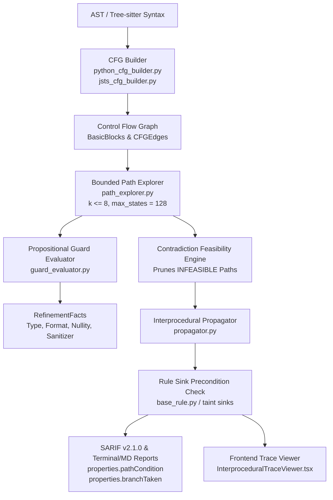

# CodeSentinel Phase 18: Bounded Path-Sensitive Control-Flow & Guard Analysis Walkthrough

## 1. Executive Summary

**Phase 18** equips CodeSentinel with an intraprocedural **Control-Flow Graph (CFG)** engine, **propositional guard evaluation**, and **bounded path-sensitive taint verification** across Python and JavaScript/TypeScript.

Before Phase 18, CodeSentinel analyzed ASTs linearly:
- **False Positives**: Security sinks protected by validation guards (such as `if not isinstance(user_id, int): return` or `if (typeof x !== 'string') return`) were flagged because linear analysis ignored branch reachability and type refinements.
- **Blind Spots**: Vulnerabilities nested inside non-default branches or exception handlers were frequently missed or lacked path-context evidence.

### Architectural Breakthrough: Decoupled Refinement Facts
Rather than globally setting `TaintState.SANITIZED` upon encountering any guard, Phase 18 maintains path-specific **refinement facts** (`RefinementFact`) that attach to path states. Each rule independently evaluates whether active refinements satisfy its safety preconditions at the sink:
- An integer guard (`isinstance(x, int)`) satisfies SQL injection safety without falsely marking `x` safe for OS command execution.
- Path conditions and branch directions are preserved as first-class evidence across multi-hop interprocedural call chains.

---

## 2. Core Architecture & Components



### Component Directory Map

| Component | File Path | Key Responsibilities |
| :--- | :--- | :--- |
| **CFG Domain Models** | `analyzer/dataflow/cfg/models.py` | Defines `ControlFlowGraph`, `BasicBlock`, `CFGEdge`, `GuardCondition`, `RefinementFact`, and `PathState`. |
| **Python CFG Builder** | `analyzer/dataflow/cfg/python_cfg_builder.py` | Partitions AST into basic blocks by leaders; links statement exception edges, `try/except/finally` routing, loops (`LOOP_BACK`, `LOOP_EXIT`), `assert` statements, and cooperative cancellation checkpoints. |
| **JS/TS CFG Builder** | `analyzer/dataflow/cfg/jsts_cfg_builder.py` | Traverses Tree-sitter AST; unwraps `statement_block` and `else_clause`; links conditionals, loops, `try/catch/finally`, and return/throw terminators. |
| **Guard Evaluator** | `analyzer/dataflow/cfg/guard_evaluator.py` | Evaluates conditions under strict trust model (`isinstance`, `isdigit`, anchored regex `^...$`, registered validators, nullity, boolean `AND`/`OR`/`NOT`). |
| **Bounded Path Explorer** | `analyzer/dataflow/cfg/path_explorer.py` | Explores bounded paths ($k \le 8$, max 128 states); prunes contradictions (`is_path_infeasible`); executes early-exit reachability pruning; applies formal lattice joins ($\sqcup$). |
| **Interprocedural Engine** | `analyzer/dataflow/interprocedural/propagator.py` | Enriches `CallChainStep` with `path_condition`, `branch_taken`, `guard_predicate`, and `path_status`; evaluates caller validation before flagging callee sinks. |
| **SARIF & Reporting** | `analyzer/reporting/sarif.py`, `terminal.py`, `markdown_reporter.py` | Renders path condition badges, branch pills, and SARIF v2.1.0 property bags. |
| **CLI & Configuration** | `analyzer/cli/main.py`, `settings.py`, `repo_config.py` | Added flags `--disable-path-sensitivity`, `--max-active-paths`, `--max-total-path-states`, `--max-branch-depth`, `--max-cfg-blocks`. |
| **Backend Schema** | `backend/app/schemas/callgraph.py` | Extends `CallGraphSummaryDTO` with `PathSensitivitySummaryDTO` (zero-migration JSON column). |
| **Frontend Trace Viewer** | `frontend/src/components/findings/InterproceduralTraceViewer.tsx` | Renders branch indicators (`TRUE_BRANCH`, `FALSE_BRANCH`), path condition badges, and guard chips. |

---

## 3. Concrete Analysis Scenarios

### Scenario A: Early Return Guard (FP Suppression)
```python
def handle(request):
    user_id = request.args['id']
    if not isinstance(user_id, int):
        return
    cursor.execute(f"SELECT * FROM users WHERE id = {user_id}")
```
- **Execution Flow**:
  1. `if not isinstance(user_id, int)` forks the path.
  2. The `TRUE_BRANCH` hits `return`, terminating with `is_early_exit = True`.
  3. The `FALSE_BRANCH` (continuation) carries `RefinementFact(variable_name='user_id', refined_type='int')`.
  4. At `cursor.execute()`, the SQL injection rule checks if `user_id` has a numeric/integer refinement. Precondition is satisfied; **0 findings emitted**.

### Scenario B: Assert Statement Semantics
```python
def handle(request):
    user_id = request.args['id']
    assert isinstance(user_id, int)
    cursor.execute(f"SELECT * FROM users WHERE id = {user_id}")
```
- **Execution Flow**:
  - The `True` branch proceeds sequentially carrying `refined_type = "int"`.
  - The `False` branch directs to an implicit `AssertionError` termination block.
  - Continuation reachability retains the type refinement; SQL injection is suppressed.

### Scenario C: Anchored Regex vs Unanchored Regex
```python
# Anchored: Safe format guarantee
if re.match(r'^[a-zA-Z0-9_]+$', token):
    os.system(f"echo {token}")  # Suppressed: token is strictly alphanumeric

# Unanchored: Vulnerable
if re.match(r'[a-zA-Z0-9_]+', token):
    os.system(f"echo {token}")  # Flagged: input can contain payload after match!
```
- Unanchored patterns do not guarantee full-string containment. The guard evaluator only produces `is_alphanumeric_string = True` when the pattern contains explicit start (`^` or `\A`) and end (`$` or `\Z`) anchors.

### Scenario D: Nested Interprocedural Caller Guard
```python
# views.py (Caller)
def caller(request):
    val = request.args.get('id')
    if isinstance(val, int):
        execute_query(val)

# db.py (Callee)
def execute_query(uid):
    cursor.execute(f"SELECT * FROM users WHERE id = {uid}")
```
- During interprocedural propagation, the call site in `views.py` is governed by `path_condition = "isinstance(val, int)"`.
- The argument binding propagates with this constraint into `execute_query(uid)`.
- The callee sink evaluates the active refinement fact and prunes the finding before false reporting.

---

## 4. Bounded Exploration & Determinism Guarantees

Path sensitivity inherently risks state explosion. Phase 18 enforces formal, non-ambiguous budget parameters:

| Budget Parameter | Default | Behavior Upon Exceeding |
| :--- | :--- | :--- |
| `max_active_paths_per_function` | 8 | Active paths joined at merge points via monotonic lattice join ($\sqcup$). |
| `max_total_path_states` | 128 | Halts further path splitting; widens states to `is_widened = True`. |
| `max_branch_depth` | 6 | Truncates nested branch exploration cleanly (`is_truncated = True`). |
| `max_conditions_per_path` | 16 | Discards oldest non-conflicting conditions to prevent unbounded growth. |
| `max_loop_unrolls` | 1 | Unrolls loop body at most once; subsequent iterations widen loop-carried variables. |

### Semantic Determinism
- Path exploration, edge iteration, and block sorting are strictly ordered by integer block IDs and deterministic key tuples.
- The 5-run determinism test (`test_phase18_multi_run_determinism`) verifies byte-for-byte identical findings, finding IDs, and summary metrics across consecutive runs.

---

## 5. Reporting & User Interface Enhancements

### SARIF v2.1.0 Property Bags
In generated SARIF reports, each call flow step location contains path sensitivity properties:
```json
{
  "location": {
    "physicalLocation": {
      "artifactLocation": { "uri": "app/views.py", "uriBaseId": "%SRCROOT%" },
      "region": { "startLine": 26, "startColumn": 8 }
    },
    "message": { "text": "Call: handle() -> execute_query(val) [Condition: val is not None] [Branch: TRUE_BRANCH]" }
  },
  "properties": {
    "pathCondition": "val is not None",
    "branchTaken": "TRUE_BRANCH",
    "guardPredicate": "val is not None",
    "pathStatus": "FEASIBLE"
  }
}
```

### Frontend Trace Viewer (`InterproceduralTraceViewer.tsx`)
- Displays `Branch: TRUE_BRANCH` / `Branch: FALSE_BRANCH` badges alongside call-chain steps.
- Renders `Condition: <expression>` and `Guard: <predicate>` pills.
- Surfaces `Path-Guarded` indicators when a sink path was safely validated.

---

## 6. Verification & Completion Gates

All 10 Phase 18 completion gates are fully satisfied:

| Gate | Requirement | Result | Verified In |
| :--- | :--- | :--- | :--- |
| **Gate 1** | $\ge 45$ new Phase 18 tests | **PASSED** (48 tests) | `analyzer/tests/test_phase18_*.py` & `backend/tests/` |
| **Gate 2** | Pre-existing regression suite passes | **PASSED** (522/522 tests) | Full test suite execution (425 analyzer + 97 backend) |
| **Gate 3** | Multi-run determinism over 5 runs | **PASSED** | `test_phase18_multi_run_determinism` |
| **Gate 4** | Resource budgets & widening | **PASSED** | `test_resource_budget_widening` |
| **Gate 5** | Cooperative cancellation checkpoint | **PASSED** | `test_cancellation_checkpoint` |
| **Gate 6** | Zero illegal backend/DB imports in analyzer | **PASSED** | 0 imports of FastAPI, SQLAlchemy, Celery, or Redis |
| **Gate 7** | Baseline differential comparator invariance | **PASSED** | `test_phase18_baseline_comparator_invariance` |
| **Gate 8** | SARIF v2.1.0 schema validity | **PASSED** | `test_sarif_reporter_path_sensitivity` |
| **Gate 9** | Frontend production build | **PASSED** | `tsc -b && vite build` built cleanly (0 TS errors) |
| **Gate 10** | Documentation suite updated | **PASSED** | `README.md`, `ROADMAP.md`, `ARCHITECTURE.md`, `API.md`, `SARIF.md` |

---

## 7. Commits & File History

Phase 18 implementation is committed to the local repository:
- `6ae77aaa`: add Phase 18 JS/TS and Python CFG builders, guard evaluator, and unit tests
- `535f1606`: implement bounded path explorer and guard evaluator tests
- `35d3df1e`: add unit tests for bounded path explorer and feasibility engine
- `7c190b6a`: add dataflow analysis models
- `236f720b`: implement configuration schema
- `fe5e1de`: complete Phase 18: Bounded Path-Sensitive Control-Flow & Guard Analysis
