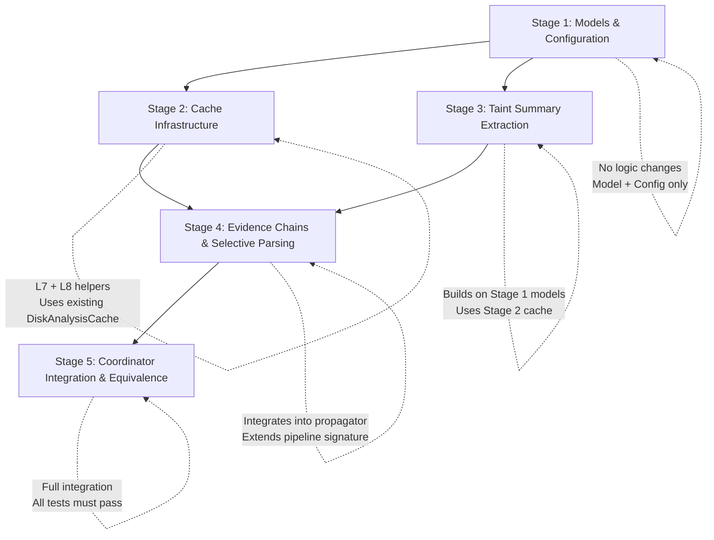

# CodeSentinel Phase 22 Implementation Plan
## Context-Aware Security Intelligence, Cross-Module Data-Flow & Incremental Analysis Hardening

---

## 1. Executive Summary

CodeSentinel through Phases 1–21 has evolved into a deeply layered static analysis engine: multi-language AST parsing (Python, JavaScript, TypeScript), dependency resolution, directed architecture and component graph construction, bounded control-flow graph generation, path-sensitive guard evaluation with epoch-based refinement invalidation, alias and points-to field analysis, k-limited context-sensitive call-graph resolution, function-level summary contracts with exceptional postconditions, project-wide contract composition with rule-specific security boundary matrices, and dependency-aware incremental analysis with persistent layered caching (L1–L9).

Phase 21 introduced the `analyzer/incremental/` package with:
- **Content-addressed file fingerprints** (`fingerprints.py`) and **scoped configuration fingerprints** (`config_fingerprint.py`).
- **Persistent layered disk caching** (`cache.py`: `DiskAnalysisCache`, `InMemoryAnalysisCache`, `NullAnalysisCache`) with atomic writes, SHA-256 envelope checksums, and LRU eviction.
- **Reverse dependency impact analysis** (`impact.py`) computing transitive invalidation closures.
- **Contract-aware invalidation** (`contract_invalidation.py`) using versioned contract hashes and security boundary rule isolation.
- **Finding reconciliation** (`reconciliation.py`) preserving reusable findings from unaffected files.
- **Equivalence verification** (`equivalence.py`) comparing full vs. incremental results for correctness validation.
- **Incremental coordinator** (`coordinator.py`) orchestrating warm-cache partial re-analysis vs. cold-start full analysis.

**Phase 22** extends this foundation with three tightly coupled workstreams:

1. **Cross-Module Data-Flow Summaries**: Structured, file-granular taint and contract summary artifacts that enable the incremental coordinator to selectively re-analyze only affected cross-module data-flow chains, rather than re-running the entire interprocedural propagator on every change.

2. **Context-Aware Security Rule Intelligence**: Enriched security findings with structured evidence chains linking specific source→propagation→sanitizer→sink paths to the contract guarantees and security boundary evaluations that govern them. This transforms findings from opaque rule-matches into verifiable, context-aware security assessments.

3. **Incremental Analysis Hardening**: Strengthening the Phase 21 incremental coordinator with finer-grained per-function contract caching (L7), per-composition-edge boundary caching (L8), and deterministic cache warming strategies that reduce cold-start costs without sacrificing correctness guarantees.

### Core Engineering Invariant (Preserved from Phase 21)
> **For supported repository states and supported analysis configurations, the incremental pipeline MUST produce the same canonical analysis result as a fresh full analysis of the same target state, provided every dependency required by the relevant analysis is either unchanged and validated or conservatively invalidated.**

Phase 22 does not weaken this invariant. All new caching layers and summary artifacts are governed by the same monotonic safety rule: `UNKNOWN` dependency states must **never** result in cache reuse.

---

## 2. Actual Repository Baseline

The CodeSentinel codebase was inspected directly on the local filesystem as of Git commit `b4c6e2b` (*"update CLI, incremental analysis coordinator"*).

### 2.1 Git Status & Workspace Hierarchy
- **Active Branch**: `master`
- **Working Tree**: Clean (`nothing to commit, working tree clean`)
- **Repository Root**: `e:\AI-Workspace\projects\CodeSentinel`
- **Subsystems**:
  - [`analyzer/`](file:///e:/AI-Workspace/projects/CodeSentinel/analyzer): Core static analysis engine (Python 3.14+). Pure offline library with zero backend/database/AI dependencies. 19 sub-packages.
  - [`backend/`](file:///e:/AI-Workspace/projects/CodeSentinel/backend): FastAPI application, SQLAlchemy 2.0 ORM, Celery task workers, Redis pub/sub.
  - [`frontend/`](file:///e:/AI-Workspace/projects/CodeSentinel/frontend): React 19, TypeScript 5.8, Vite 6.4, TailwindCSS, Monaco Editor.
  - [`docs/`](file:///e:/AI-Workspace/projects/CodeSentinel/docs): 21 documentation files including implementation plans for Phases 13–21.

### 2.2 Automated Test Suite Baseline
- **Analyzer Test Suite** ([`analyzer/tests/`](file:///e:/AI-Workspace/projects/CodeSentinel/analyzer/tests)): 104 test files.
- **Backend Test Suite** ([`backend/tests/`](file:///e:/AI-Workspace/projects/CodeSentinel/backend/tests)): 39 test files.
- **Combined Test Collection**: **642 tests collected** (via `py -m pytest analyzer/tests backend/tests --co -q`).
- **Active Warnings**: Starlette `httpx` testclient deprecation and AnyIO `BlockingPortal` alias deprecation.

### 2.3 Analyzer Module Inventory

| Package | Key Files | Phase Lineage |
| :--- | :--- | :--- |
| `analyzer/incremental/` | `coordinator.py` (266L), `cache.py` (331L), `fingerprints.py`, `impact.py` (131L), `contract_invalidation.py` (73L), `equivalence.py` (138L), `reconciliation.py` (74L), `models.py` (112L), `config_fingerprint.py`, `keys.py` | Phase 21 |
| `analyzer/dataflow/contracts/` | `models.py` (196L), `extractor.py` (39kB), `evaluator.py`, `composer.py`, `composition.py` (100L), `graph.py` (117L), `security_boundary.py` (202L) | Phases 19–20 |
| `analyzer/dataflow/callgraph/` | `graph_builder.py`, `summarizer.py` (46kB), `models.py`, `resolver.py`, `discovery.py`, `context_manager.py`, `context_summarizer.py`, `type_resolver.py` | Phases 15–16 |
| `analyzer/dataflow/interprocedural/` | `propagator.py` (127kB) | Phases 15–20 |
| `analyzer/dataflow/cfg/` | `python_cfg_builder.py`, `jsts_cfg_builder.py`, `path_explorer.py`, `guard_evaluator.py`, `models.py` | Phase 18 |
| `analyzer/dataflow/alias/` | `models.py`, `field_state.py`, `python_alias_extractor.py`, `jsts_alias_extractor.py` | Phase 17 |
| `analyzer/dataflow/taint/` | `propagator.py`, `registry.py` (418L), `models.py` | Phase 13 |
| `analyzer/dataflow/types/` | `models.py`, `python_type_extractor.py`, `jsts_type_extractor.py` | Phase 16 |
| `analyzer/engine/` | `pipeline.py` (431L) | Phases 1–21 |
| `analyzer/models/` | `findings.py` (215L), `results.py` (131L), `graph.py`, `comparison.py`, `parse.py`, `metadata.py`, `errors.py` | Phases 1–20 |
| `analyzer/comparison/` | `diff.py` (259L) | Phase 9 |
| `analyzer/security/` | `base_rule.py`, `python/`, `javascript/` | Phases 3–14 |
| `analyzer/rules/` | `engine.py`, `registry.py`, `entropy.py`, `js_ast_helper.py` | Phases 3–14 |
| `analyzer/config/` | `settings.py` (371L) | Phases 1–20 |

---

## 3. Phase 21 Verification Reconciliation

The Phase 21 implementation was verified against the actual repository before designing Phase 22:

| Metric / Dimension | Phase 21 Expectation | Actual Repository State | Status |
| :--- | :--- | :--- | :--- |
| **Total Test Count** | ≥585 (Phase 20 baseline) | **642 tests collected** | **MATCH** (57 Phase 21 tests added) |
| **Phase 21 Test Distribution** | ≥9 test files | • `test_phase21_benchmarks.py` • `test_phase21_cache_storage.py` • `test_phase21_cli.py` • `test_phase21_contract_invalidation.py` • `test_phase21_determinism.py` • `test_phase21_equivalence.py` • `test_phase21_fingerprints.py` • `test_phase21_impact_closure.py` • `test_phase21_pipeline_integration.py` • `test_phase21_api_backward_compat.py` | **MATCH** |
| **Incremental Package** | `analyzer/incremental/` with 10 modules | 11 `.py` files in `analyzer/incremental/` | **MATCH** |
| **Cache Architecture** | Layered L1–L9 with disk persistence | `DiskAnalysisCache`, `InMemoryAnalysisCache`, `NullAnalysisCache` in `cache.py` | **MATCH** |
| **Finding Identity** | UUID formulas preserved | `analyzer/models/findings.py` unchanged in identity formula | **MATCH** |
| **Baseline Comparator** | `comparison/diff.py` untouched | 259 lines, multi-tier signature matching intact | **MATCH** |
| **Pipeline Integration** | `mode="incremental"` flag | `pipeline.py` L113–L123: dispatches to `IncrementalAnalysisCoordinator` | **MATCH** |
| **.gitignore** | `.codesentinel_cache/` entry | Present at end of `.gitignore` | **MATCH** |

---

## 4. Current Architecture Analysis & Gap Identification

### 4.1 Incremental Coordinator Design Review

The current [`IncrementalAnalysisCoordinator`](file:///e:/AI-Workspace/projects/CodeSentinel/analyzer/incremental/coordinator.py) operates at **file granularity**:

1. Computes file fingerprints for all discovered files.
2. Diffs current fingerprints against cached previous fingerprints.
3. Builds an impact set of affected files via reverse dependency closure.
4. **Runs the full pipeline** on the entire repository when any file is changed.
5. Reconciles findings from cache for unaffected files.
6. Persists new fingerprints, dependency graph, findings, and full result to cache.

**Key Observation**: Lines 178–185 of `coordinator.py` show that when the warm-cache path is taken, the coordinator still invokes `pipeline.run(target_path=target_path, ...)` — a **full pipeline execution**. The incremental savings come from:
- 100% cache-hit fast path (lines 99–128): bypasses pipeline entirely.
- Finding reconciliation (lines 187–198): reuses cached findings for unaffected files and merges with fresh findings.
- Impact telemetry (lines 207–233): reports which files would be reusable.

**Gap**: The pipeline itself does not selectively skip parsing, CFG construction, call-graph building, or contract extraction for unchanged files. True per-file or per-function incremental analysis within the pipeline is not yet implemented. The current design is a **sound but coarse** incremental coordinator.

### 4.2 Security Rule Evidence Gap

Current security findings ([`Finding`](file:///e:/AI-Workspace/projects/CodeSentinel/analyzer/models/findings.py)) carry:
- `evidence: dict[str, Any]` — a generic catch-all for structured evidence.
- `code_snippet: str` — raw source text.
- `ai_enrichment: Optional[AIFindingEnrichment]` — LLM-generated supplementary context.

**Gap**: Findings lack structured references to:
- The specific taint path (source → propagation chain → sink) that produced the finding.
- The contract evaluation result (SATISFIED/VIOLATED/UNKNOWN) that governs the finding.
- The security boundary check result from `SecurityBoundaryModel.evaluate_boundary()`.
- The interprocedural call chain with contract evidence at each hop.

### 4.3 Cross-Module Contract Summary Gap

The [`FunctionSummarizer`](file:///e:/AI-Workspace/projects/CodeSentinel/analyzer/dataflow/callgraph/summarizer.py) (46kB, ~1000+ lines) produces per-function summaries but these are:
- Computed in-memory during each pipeline run.
- Not individually cached at L7 file/function granularity.
- Not separately invalidatable when only the function body changes.

The contract hashing in [`contract_invalidation.py`](file:///e:/AI-Workspace/projects/CodeSentinel/analyzer/incremental/contract_invalidation.py) provides `should_prune_caller_reanalysis()` but it is not yet integrated into the pipeline's per-function analysis loop.

---

## 5. Goals

1. **Cross-Module Data-Flow Summary Artifacts**: Design structured, serializable per-file taint and contract summary models that the incremental coordinator can cache at L6/L7 granularity and selectively invalidate based on dependency and contract hash changes.

2. **Context-Aware Security Evidence Chains**: Enrich `Finding.evidence` with structured references to the taint path, contract evaluation, and security boundary check that produced the finding, creating a verifiable evidence chain from source to rule match.

3. **Per-Function Contract Caching (L7 Hardening)**: Extend the incremental cache to store and retrieve individual function contracts keyed by `(file_path, qualified_name, context_id, contract_config_hash)`, enabling fine-grained contract reuse across runs.

4. **Composition Edge Caching (L8 Hardening)**: Cache individual `ContractCompositionEdge` results keyed by `(caller_contract_hash, callee_contract_hash, composition_config_hash)`, enabling reuse of proven-safe composition edges when neither caller nor callee contract has changed.

5. **Pipeline Integration for Selective Parsing**: Extend `AnalysisPipeline.run()` to accept an `affected_files: Optional[set[str]]` parameter, enabling the pipeline to selectively skip parsing, CFG construction, and function summary extraction for files not in the affected set.

6. **Security Boundary Evidence Propagation**: When `SecurityBoundaryModel.evaluate_boundary()` is invoked during interprocedural propagation, attach the evaluation result to the corresponding finding's evidence chain.

7. **Deterministic Cross-Module Summary Hashing**: Establish content-addressed hashes for per-file taint summaries and contract summaries to enable cache validity checks analogous to `FileFingerprint.compute_composite_hash()`.

8. **Incremental Equivalence Hardening**: Extend `EquivalenceChecker` to verify per-function contract equivalence and per-composition-edge equivalence, not just finding-level equivalence.

9. **Configuration Extensions**: Add Phase 22–scoped `AnalysisConfig` fields for controlling selective parsing, contract caching bounds, and evidence verbosity without altering existing Phase 1–21 defaults.

10. **Backward Compatibility**: All existing tests, APIs, schemas, finding identities, baseline comparison results, and incremental telemetry must remain unchanged. Phase 22 additions must be strictly additive.

---

## 6. Non-Goals

- **No Remote / Cloud Distributed Caching**: Caching remains repository-local on disk.
- **No Dynamic Execution / Runtime Instrumentation**: Analysis remains 100% static and offline.
- **No SMT / Whole-Program Symbolic Execution**: No heavy theorem proving engines.
- **No AI-Controlled Cache or Invalidation Decisions**: Machine learning models or LLMs must NEVER dictate cache hits, invalidation boundaries, or finding reconciliation.
- **No Replacement of Celery / Redis / PostgreSQL**: The backend architecture remains unchanged.
- **No Mandatory Database Migrations**: New data serializes into existing JSON snapshot attributes.
- **No Speculative or Probabilistic Invalidation**: Cache validity decisions must be deterministic and conservative.
- **No Changes to Finding Identity Formulas**: UUIDv5 finding identity generation remains untouched.
- **No Cross-Repository / Cross-Project Analysis**: Analysis remains scoped to a single repository root.
- **No JavaScript/TypeScript Bundler Integration**: No Webpack, esbuild, or Rollup integration for frontend module resolution.

---

## 7. Design Constraints

### 7.1 Analyzer Isolation Boundary
The `analyzer/` package must remain free of backend, database, web framework, and AI service imports. All new modules in Phase 22 must import exclusively from `analyzer/` sub-packages, the Python standard library, and declared `analyzer/pyproject.toml` dependencies (Pydantic, tree-sitter, NetworkX).

### 7.2 Monotonic Safety Rule
An `UNKNOWN` dependency state must **never** result in cache reuse. If a file's import resolution has unresolved targets, or a call site's callee cannot be statically resolved, the corresponding function, file, and downstream dependents must be conservatively invalidated.

### 7.3 Deterministic Ordering
All new caches, summary artifacts, and evidence chains must be deterministically ordered. Iteration over sets must use `sorted()`. Hash computation must use canonical `json.dumps(sort_keys=True)`.

### 7.4 Bounded Resource Consumption
All new caching layers must have bounded entry counts and total size limits, controlled by `AnalysisConfig` fields with documented defaults. No unbounded in-memory data structures.

### 7.5 Cooperative Cancellation
All new analysis loops must check `is_cancelled()` at appropriate intervals and raise `AnalysisCancelledError` if cancellation is requested.

### 7.6 Backward Compatibility Contract
- All 642 existing tests must continue to pass.
- All existing `AnalysisResult`, `Finding`, `SourceLocation`, `AnalysisConfig`, and `ArchitectureGraph` schemas must remain backward compatible.
- All existing CLI flags, API endpoints, and database schemas must remain operational.
- Phase 22 additions to `AnalysisConfig` must have defaults that produce identical behavior to Phase 21.

---

## 8. Workstream A: Cross-Module Data-Flow Summary Artifacts

### 8.1 Overview

Create structured, serializable per-file summary models capturing the taint-relevant external interface of each file: its exported taint sources, taint sinks, sanitizer applications, and cross-module taint transfer functions.

### 8.2 New Model: `FileTaintSummary`

**Module**: `analyzer/dataflow/taint/summary.py` (new file)

```python
class FileTaintSummary(BaseModel):
    """Per-file taint summary capturing cross-module taint-relevant interface."""
    model_config = ConfigDict(frozen=True)

    file_path: str                    # Normalized forward-slash repository-relative path
    content_hash: str                 # SHA-256 of file contents (from FileFingerprint)
    summary_schema_version: str = "1.0.0"

    # Exported taint facts
    exported_sources: list[ExportedTaintSource] = Field(default_factory=list)
    exported_sinks: list[ExportedTaintSink] = Field(default_factory=list)
    exported_sanitizers: list[ExportedSanitizer] = Field(default_factory=list)

    # Cross-module taint transfer edges
    taint_transfers: list[CrossModuleTaintTransfer] = Field(default_factory=list)

    # Intra-file taint summary hash (for cache validation)
    summary_hash: str = ""

    def compute_summary_hash(self) -> str:
        """Deterministic SHA-256 across all exported taint facts."""
        # Canonical JSON serialization with sorted keys
        ...
```

### 8.3 Supporting Types

```python
class ExportedTaintSource(BaseModel):
    """A taint source exported by this file to callers."""
    function_qn: str
    param_index: int
    param_name: str
    source_category: SourceCategory
    line: int

class ExportedTaintSink(BaseModel):
    """A taint sink reachable in this file from caller inputs."""
    function_qn: str
    param_index: int
    param_name: str
    sink_category: SinkCategory
    rule_id: str
    line: int

class ExportedSanitizer(BaseModel):
    """A sanitizer applied within this file to caller inputs."""
    function_qn: str
    param_index: int
    sanitizer_categories: list[SinkCategory]
    line: int

class CrossModuleTaintTransfer(BaseModel):
    """A taint transfer edge from imported function param to exported function return."""
    caller_qn: str
    callee_qn: str
    callee_file: str
    from_param_index: int
    to_return: bool = False
    to_sink_category: Optional[SinkCategory] = None
    governing_condition: Optional[str] = None
```

### 8.4 Summary Extraction

A new `FileTaintSummaryExtractor` class in `analyzer/dataflow/taint/summary.py` will:

1. Accept the list of `ParsedFile` objects, the `CallGraph`, and function summaries for a single file.
2. Walk each function defined in the file and extract:
   - Source parameters (mapped from `TaintRegistry` source declarations).
   - Sink invocations (mapped from `TaintRegistry` sink declarations).
   - Sanitizer applications (matched from `TaintRegistry` sanitizer catalog).
   - Cross-module taint transfers (from `FunctionSummary` taint propagation edges where callee is in a different file).
3. Produce a `FileTaintSummary` with a deterministic `summary_hash`.

### 8.5 Cache Integration

- **L6 Cache Key**: `(file_path, content_hash, taint_config_hash)` → `FileTaintSummary`.
- **Invalidation Rule**: A `FileTaintSummary` is valid if and only if:
  - The file's `FileFingerprint.content_hash` matches.
  - The scoped `cfg_dataflow_hash` from `ConfigFingerprint` matches.
  - All imported files referenced in `taint_transfers[*].callee_file` have unchanged content hashes.
- **Conservative Fallback**: If any imported file has changed or the taint summary cannot be validated, the file must be re-analyzed.

### 8.6 Coordinator Integration

Extend `IncrementalAnalysisCoordinator.run()` to:
1. After computing the impact set, retrieve `FileTaintSummary` for each unaffected file from L6 cache.
2. Verify that all cross-module references in unaffected summaries still point to unchanged files.
3. If an unaffected file's summary references a changed file, escalate it to the affected set.
4. Pass the validated summary set to the pipeline for selective re-analysis.

---

## 9. Workstream B: Context-Aware Security Evidence Chains

### 9.1 Overview

Enrich security and architecture findings with structured, verifiable evidence chains that trace the exact analysis reasoning from source to finding.

### 9.2 New Model: `SecurityEvidenceChain`

**Module**: `analyzer/models/evidence.py` (new file)

```python
class SecurityEvidenceChain(BaseModel):
    """Structured evidence chain linking a finding to its analysis provenance."""

    # Taint path evidence
    taint_source: Optional[TaintSourceEvidence] = None
    propagation_chain: list[PropagationStep] = Field(default_factory=list)
    sanitizer_evaluation: Optional[SanitizerEvidence] = None
    taint_sink: Optional[TaintSinkEvidence] = None

    # Contract evidence
    contract_evaluations: list[ContractEvaluationEvidence] = Field(default_factory=list)

    # Security boundary evidence
    boundary_evaluation: Optional[BoundaryEvaluationEvidence] = None

    # Path sensitivity evidence
    governing_path_conditions: list[str] = Field(default_factory=list)
    path_feasibility: str = "UNKNOWN"  # "FEASIBLE", "INFEASIBLE", "UNKNOWN"

    # Aggregate confidence
    chain_confidence: str = "HIGH"     # Downgraded if any step is UNKNOWN or WIDENED
    chain_depth: int = 0               # Total interprocedural call depth
    chain_hash: str = ""               # Deterministic hash of the entire chain

class TaintSourceEvidence(BaseModel):
    """Evidence for the origin of untrusted input."""
    source_category: str
    file_path: str
    line: int
    column: int
    expression: str
    framework: Optional[str] = None

class PropagationStep(BaseModel):
    """Single step in a taint propagation trace."""
    step_index: int
    file_path: str
    line: int
    column: int
    operation: str                     # "ASSIGNMENT", "CALL_ARG", "RETURN", "FIELD_ACCESS"
    from_symbol: Optional[str] = None
    to_symbol: Optional[str] = None
    taint_state: str = "TAINTED"
    is_interprocedural: bool = False
    callee_qn: Optional[str] = None
    contract_id: Optional[str] = None

class SanitizerEvidence(BaseModel):
    """Evidence for a sanitizer application and its category compatibility."""
    sanitizer_id: str
    effective_categories: list[str]
    file_path: str
    line: int
    expression: str
    is_category_compatible: bool = True
    incompatible_reason: Optional[str] = None

class TaintSinkEvidence(BaseModel):
    """Evidence for the sink where tainted data reaches."""
    sink_category: str
    rule_id: str
    file_path: str
    line: int
    column: int
    callee_name: str
    vulnerable_arg_index: int
    parameter_binding_available: bool = False

class ContractEvaluationEvidence(BaseModel):
    """Evidence from a contract precondition/postcondition evaluation at a call site."""
    call_site_file: str
    call_site_line: int
    caller_qn: str
    callee_qn: str
    contract_id: str
    evaluation_result: str             # "SATISFIED", "VIOLATED", "UNKNOWN", "WIDENED", "TRUNCATED"
    precondition_kind: Optional[str] = None
    postcondition_trigger: Optional[str] = None
    details: str = ""

class BoundaryEvaluationEvidence(BaseModel):
    """Evidence from a security boundary compatibility check."""
    rule_id: str
    sink_category: str
    sanitizer_category: Optional[str] = None
    compatibility_state: str           # "SATISFIED", "VIOLATED", "UNKNOWN"
    accepted_sanitizers: list[str] = Field(default_factory=list)
    incompatible_sanitizers: list[str] = Field(default_factory=list)
    details: str = ""
```

### 9.3 Integration Points

1. **Interprocedural Propagator**: When [`InterproceduralTaintPropagator.analyze_repository()`](file:///e:/AI-Workspace/projects/CodeSentinel/analyzer/dataflow/interprocedural/propagator.py) produces an `InterproceduralTaintPath`, construct a `SecurityEvidenceChain` from the path's `call_chain`, `source`, `sink`, and `sanitizer` fields.

2. **Security Boundary Model**: When [`SecurityBoundaryModel.evaluate_boundary()`](file:///e:/AI-Workspace/projects/CodeSentinel/analyzer/dataflow/contracts/security_boundary.py) is called, capture the evaluation result as a `BoundaryEvaluationEvidence` and attach it to the chain.

3. **Contract Evaluator**: When [`ContractEvaluator`](file:///e:/AI-Workspace/projects/CodeSentinel/analyzer/dataflow/contracts/evaluator.py) evaluates a precondition at a call site, capture the result as a `ContractEvaluationEvidence`.

4. **Rule Engine**: When [`RuleEngine.analyze_security()`](file:///e:/AI-Workspace/projects/CodeSentinel/analyzer/rules/engine.py) produces a `Finding` from an interprocedural path, populate `finding.evidence["security_chain"]` with the serialized `SecurityEvidenceChain`.

### 9.4 Backward Compatibility

- The existing `Finding.evidence: dict[str, Any]` field is additive. Adding a `"security_chain"` key does not break existing consumers.
- Consumers that do not recognize the key will ignore it.
- The existing `code_snippet`, `description`, and `remediation` fields remain the primary human-readable representation.
- Evidence chain population is controlled by a new `AnalysisConfig.enable_evidence_chains: bool = True` field.

---

## 10. Workstream C: Incremental Analysis Hardening

### 10.1 Per-Function Contract Caching (L7)

#### 10.1.1 Cache Key Design

```python
L7_CONTRACT_KEY = (
    file_path,            # Normalized forward-slash path
    qualified_name,       # e.g. "module.ClassName.method_name"
    context_id,           # e.g. "ROOT" or k-limited call string
    contract_config_hash, # From ConfigFingerprint.contract_hash
    file_content_hash,    # From FileFingerprint.content_hash
)
```

#### 10.1.2 Cache Artifact

The cached artifact is the serialized `FunctionContract.model_dump(mode="json")` plus the versioned contract hash from `compute_versioned_contract_hash()`.

#### 10.1.3 Validity Equation

$$\text{L7\_Valid} = \text{FileContentHash}_{match} \wedge \text{ContractConfigHash}_{match} \wedge \text{AnalyzerVersion}_{match} \wedge \text{SchemaVersion}_{match}$$

If the file content hash matches and the contract configuration is identical, the per-function contract can be safely reused.

#### 10.1.4 Integration

- Extend `FunctionSummarizer.summarize_all()` to check L7 cache before extracting contracts.
- After extraction, store the new contract in L7 cache.
- When the incremental coordinator identifies a file as unaffected, its L7 contracts are all valid.
- When a file is affected, only its L7 contracts are invalidated; contracts from unaffected files remain cached.

### 10.2 Composition Edge Caching (L8)

#### 10.2.1 Cache Key Design

```python
L8_COMPOSITION_KEY = (
    caller_contract_hash,     # Versioned hash of the caller's FunctionContract
    callee_contract_hash,     # Versioned hash of the callee's FunctionContract
    composition_config_hash,  # From ConfigFingerprint.composition_hash
    boundary_rule_id,         # e.g. "SEC-PY-011" or "" for non-boundary edges
)
```

#### 10.2.2 Cache Artifact

The cached artifact is the serialized `ContractCompositionEdge.model_dump(mode="json")`.

#### 10.2.3 Validity Equation

$$\text{L8\_Valid} = \text{CallerContractHash}_{match} \wedge \text{CalleeContractHash}_{match} \wedge \text{CompositionConfigHash}_{match}$$

If neither the caller nor callee contract has changed, and the composition configuration is identical, the composition edge result (including its `CompatibilityState`) can be safely reused.

#### 10.2.4 Pruning Benefit

This enables a critical optimization: when `should_prune_caller_reanalysis()` returns `True` (the callee's contract is hash-equivalent despite a body change), all L8 composition edges involving that callee remain valid, and the caller does not need re-composition.

### 10.3 Selective Pipeline Parsing

#### 10.3.1 Pipeline Signature Extension

Extend `AnalysisPipeline.run()` with an optional parameter:

```python
def run(
    self,
    target_path: Path | str,
    ...,
    affected_files: Optional[set[str]] = None,  # Phase 22: selective parsing
) -> AnalysisResult:
```

#### 10.3.2 Behavior

When `affected_files` is provided and non-empty:
1. **Parsing Stage**: Only parse files in `affected_files`. For files not in the set, retrieve cached `ParsedFile` from L2 cache (to be introduced or stubbed in Phase 22).
2. **Dependency Resolution**: Run dependency resolution on all files (required for correctness of architecture graph and reverse dependency closure).
3. **Architecture Graph**: Build from all files (architecture metrics require global view).
4. **Call Graph & Interprocedural**: Build call graph from all files but only extract new summaries for affected functions. Reuse L7 cached contracts for unaffected functions.
5. **Contract Composition**: Reuse L8 cached composition edges where both contracts are unchanged.
6. **Rule Evaluation**: Run rule engine on all files (rules require global context for architecture rules and may have cross-file dependencies).

**Key Safety Rule**: Even with selective parsing, the pipeline must produce a complete `AnalysisResult` covering all discovered files. Selective parsing is a performance optimization within the pipeline, not a scoping restriction on the output.

#### 10.3.3 Conservative Fallback

If `affected_files` is `None` or empty, the pipeline falls back to full analysis behavior (Phase 21 behavior preserved).

### 10.4 Equivalence Checker Extensions

#### 10.4.1 Per-Function Contract Equivalence

Extend `EquivalenceChecker.compare()` to optionally verify:
- All function contracts in the incremental result match the corresponding contracts in the full result (by versioned hash comparison).
- Any contract mismatches are reported as `CONTRACT_MISMATCH` discrepancies.

#### 10.4.2 Per-Composition-Edge Equivalence

Extend `EquivalenceChecker.compare()` to optionally verify:
- All composition edges in the incremental result match the corresponding edges in the full result (by `CompatibilityState` comparison).
- Any compatibility state mismatches are reported as `COMPOSITION_MISMATCH` discrepancies.

These extensions are controlled by `EquivalenceChecker.compare(verify_contracts=False, verify_composition=False)` to avoid performance overhead in production (enabled only in tests and validation runs).

---

## 11. Configuration Extensions

### 11.1 New `AnalysisConfig` Fields

All new fields have defaults that produce **identical behavior to Phase 21** (Phase 22 features are opt-in or transparently enabled):

```python
# Phase 22: Cross-Module Data-Flow Summary
enable_taint_summaries: bool = Field(
    default=True,
    description="Enable per-file taint summary extraction and caching (Phase 22).",
)
max_taint_summary_entries: int = Field(
    default=5000,
    ge=100, le=50000,
    description="Maximum per-file taint summary entries cached (Phase 22).",
)

# Phase 22: Context-Aware Security Evidence
enable_evidence_chains: bool = Field(
    default=True,
    description="Enable structured security evidence chain population in findings (Phase 22).",
)
max_evidence_chain_depth: int = Field(
    default=10,
    ge=1, le=20,
    description="Maximum propagation steps retained in evidence chains (Phase 22).",
)

# Phase 22: Per-Function Contract Caching
enable_contract_caching: bool = Field(
    default=True,
    description="Enable per-function contract caching at L7 (Phase 22).",
)
max_cached_contract_entries: int = Field(
    default=10000,
    ge=100, le=100000,
    description="Maximum individual function contracts cached at L7 (Phase 22).",
)

# Phase 22: Composition Edge Caching
enable_composition_caching: bool = Field(
    default=True,
    description="Enable per-composition-edge caching at L8 (Phase 22).",
)
max_cached_composition_entries: int = Field(
    default=20000,
    ge=100, le=200000,
    description="Maximum composition edges cached at L8 (Phase 22).",
)

# Phase 22: Selective Pipeline Parsing
enable_selective_parsing: bool = Field(
    default=False,
    description="Enable selective parsing optimization in the pipeline (Phase 22). Experimental.",
)
```

### 11.2 Config Fingerprint Extension

Extend [`compute_scoped_config_fingerprint()`](file:///e:/AI-Workspace/projects/CodeSentinel/analyzer/incremental/config_fingerprint.py) to include Phase 22 fields in the appropriate scoped hashes:
- `enable_taint_summaries`, `max_taint_summary_entries` → `cfg_dataflow_hash`
- `enable_evidence_chains`, `max_evidence_chain_depth` → `rules_hash`
- `enable_contract_caching`, `max_cached_contract_entries` → `contract_hash`
- `enable_composition_caching`, `max_cached_composition_entries` → `composition_hash`
- `enable_selective_parsing` → `global_hash`

---

## 12. New File Inventory

| File Path | Description | Lines (Est.) |
| :--- | :--- | :--- |
| `analyzer/dataflow/taint/summary.py` | `FileTaintSummary`, `FileTaintSummaryExtractor`, and supporting types | ~250 |
| `analyzer/models/evidence.py` | `SecurityEvidenceChain` and all evidence sub-models | ~200 |
| `analyzer/incremental/contract_cache.py` | L7 per-function contract cache key derivation and lookup helpers | ~120 |
| `analyzer/incremental/composition_cache.py` | L8 per-composition-edge cache key derivation and lookup helpers | ~100 |
| **Tests** | | |
| `analyzer/tests/test_phase22_taint_summary.py` | `FileTaintSummary` construction, hashing, serialization, round-trip | ~150 |
| `analyzer/tests/test_phase22_evidence_chain.py` | `SecurityEvidenceChain` construction, hash, backward compat | ~150 |
| `analyzer/tests/test_phase22_contract_cache.py` | L7 cache key derivation, validity, invalidation, eviction | ~180 |
| `analyzer/tests/test_phase22_composition_cache.py` | L8 cache key derivation, validity, pruning, equivalence | ~150 |
| `analyzer/tests/test_phase22_selective_parsing.py` | Pipeline selective parsing flag, affected_files routing, correctness | ~120 |
| `analyzer/tests/test_phase22_integration.py` | End-to-end incremental analysis with L7/L8 caching, evidence chains | ~200 |
| `analyzer/tests/test_phase22_equivalence.py` | Extended equivalence checking with contract and composition verification | ~150 |
| `analyzer/tests/test_phase22_config.py` | Phase 22 config fields, fingerprint extensions, backward compat | ~100 |
| `backend/tests/test_phase22_api_backward_compat.py` | Backend API backward compatibility with Phase 22 result schema | ~80 |

**Estimated New Lines**: ~1,950 (production) + ~1,280 (tests) = ~3,230 total.

---

## 13. Modified File Inventory

| File Path | Modification | Risk |
| :--- | :--- | :--- |
| [`analyzer/config/settings.py`](file:///e:/AI-Workspace/projects/CodeSentinel/analyzer/config/settings.py) | Add 8 new `AnalysisConfig` fields with defaults | LOW: additive fields with defaults |
| [`analyzer/incremental/config_fingerprint.py`](file:///e:/AI-Workspace/projects/CodeSentinel/analyzer/incremental/config_fingerprint.py) | Extend scoped hash computation for Phase 22 config fields | LOW: additive hash scope |
| [`analyzer/incremental/coordinator.py`](file:///e:/AI-Workspace/projects/CodeSentinel/analyzer/incremental/coordinator.py) | Integrate L7/L8 cache lookup, taint summary validation, pass `affected_files` to pipeline | MEDIUM: core coordinator logic |
| [`analyzer/incremental/models.py`](file:///e:/AI-Workspace/projects/CodeSentinel/analyzer/incremental/models.py) | Extend `IncrementalStats` with L7/L8 hit/miss counters | LOW: additive fields |
| [`analyzer/incremental/equivalence.py`](file:///e:/AI-Workspace/projects/CodeSentinel/analyzer/incremental/equivalence.py) | Add optional contract and composition equivalence verification | LOW: additive optional check |
| [`analyzer/engine/pipeline.py`](file:///e:/AI-Workspace/projects/CodeSentinel/analyzer/engine/pipeline.py) | Add `affected_files` parameter, selective parsing branch | MEDIUM: core pipeline logic |
| [`analyzer/rules/engine.py`](file:///e:/AI-Workspace/projects/CodeSentinel/analyzer/rules/engine.py) | Populate `finding.evidence["security_chain"]` when evidence chains are enabled | LOW: additive evidence population |
| [`analyzer/incremental/cache.py`](file:///e:/AI-Workspace/projects/CodeSentinel/analyzer/incremental/cache.py) | Add L7 and L8 layer directory support (automatic via existing `_layer_dir()`) | VERY LOW: existing architecture handles new layers |
| [`analyzer/incremental/__init__.py`](file:///e:/AI-Workspace/projects/CodeSentinel/analyzer/incremental/__init__.py) | Export new cache helpers | VERY LOW: additive exports |

---

## 14. Implementation Sequence

Phase 22 is structured into 5 implementation stages, ordered by dependency and risk:

### Stage 1: Models & Configuration (No Logic Changes)
1. Create `analyzer/models/evidence.py` with all evidence chain models.
2. Create `analyzer/dataflow/taint/summary.py` with `FileTaintSummary` and supporting types (models only, no extraction logic).
3. Add Phase 22 fields to `analyzer/config/settings.py`.
4. Extend `analyzer/incremental/config_fingerprint.py` for Phase 22 scoped hashes.
5. Extend `analyzer/incremental/models.py` with L7/L8 stats fields.
6. Write `test_phase22_config.py` and `test_phase22_evidence_chain.py` (model tests).

### Stage 2: Cache Infrastructure
1. Create `analyzer/incremental/contract_cache.py` (L7 key derivation, lookup helpers).
2. Create `analyzer/incremental/composition_cache.py` (L8 key derivation, lookup helpers).
3. Write `test_phase22_contract_cache.py` and `test_phase22_composition_cache.py`.

### Stage 3: Taint Summary Extraction
1. Implement `FileTaintSummaryExtractor` in `analyzer/dataflow/taint/summary.py`.
2. Integrate summary extraction into the pipeline (post-callgraph, pre-rules).
3. Cache summaries at L6 in the coordinator.
4. Write `test_phase22_taint_summary.py`.

### Stage 4: Evidence Chain Population & Selective Parsing
1. Integrate `SecurityEvidenceChain` construction into `InterproceduralTaintPropagator`.
2. Integrate `BoundaryEvaluationEvidence` capture into `SecurityBoundaryModel`.
3. Integrate `ContractEvaluationEvidence` capture into `ContractEvaluator`.
4. Populate `finding.evidence["security_chain"]` in `RuleEngine.analyze_security()`.
5. Extend `AnalysisPipeline.run()` with `affected_files` parameter.
6. Write `test_phase22_selective_parsing.py`.

### Stage 5: Coordinator Integration & Equivalence Hardening
1. Integrate L7/L8 cache into `IncrementalAnalysisCoordinator.run()`.
2. Pass taint summaries and affected_files to pipeline.
3. Extend `EquivalenceChecker` with contract and composition verification.
4. Write `test_phase22_integration.py` and `test_phase22_equivalence.py`.
5. Write `backend/tests/test_phase22_api_backward_compat.py`.
6. Run full test suite: verify all 642 existing tests pass.

---

## 15. Testing Strategy

### 15.1 Unit Tests

| Test File | Coverage Target | Est. Tests |
| :--- | :--- | :--- |
| `test_phase22_config.py` | Phase 22 config field validation, default behavior, fingerprint extension | 8 |
| `test_phase22_evidence_chain.py` | Evidence chain model construction, serialization, round-trip, hash computation | 10 |
| `test_phase22_taint_summary.py` | Taint summary extraction, hashing, cache key derivation, invalidation rules | 12 |
| `test_phase22_contract_cache.py` | L7 cache key derivation, hit/miss scenarios, eviction, corruption recovery | 10 |
| `test_phase22_composition_cache.py` | L8 cache key derivation, pruning with `should_prune_caller_reanalysis`, edge reuse | 10 |
| `test_phase22_selective_parsing.py` | Pipeline with affected_files, full fallback, correctness verification | 8 |
| `test_phase22_equivalence.py` | Extended equivalence with contract/composition verification, mismatch reporting | 8 |
| `test_phase22_integration.py` | End-to-end incremental with L7/L8, warm/cold cache, taint summary validation | 12 |
| `test_phase22_api_backward_compat.py` | Backend API compatibility with enriched findings, unchanged schema | 6 |

**Estimated New Tests**: ~84 tests across 9 test files.
**Expected Total After Phase 22**: 642 + 84 = ~726 tests.

### 15.2 Regression Verification

- All 642 existing tests must pass without modification.
- The Phase 21 equivalence tests (`test_phase21_equivalence.py`) must continue to verify full/incremental equivalence.
- Phase 22 evidence chain population must not alter finding identity, count, severity, or baseline comparison results.

### 15.3 Determinism Verification

- `test_phase22_integration.py` must include a determinism test: run the same analysis twice with the same inputs and verify byte-identical `AnalysisResult` serialization (excluding non-deterministic fields like `id`, timestamps, and `duration_seconds`).

### 15.4 Performance Benchmark Tests

- `test_phase22_integration.py` must include a warm-cache benchmark demonstrating measurable wall-clock reduction when L7/L8 caches are warm vs. cold.
- Cache hit ratio for contracts and composition edges must be reported in `IncrementalStats`.

---

## 16. Invariant Verification Matrix

| Invariant | Verification Method | Test Location |
| :--- | :--- | :--- |
| **Full/Incremental Equivalence** | `EquivalenceChecker.compare()` returns `is_equivalent=True` | `test_phase22_equivalence.py` |
| **Finding Identity Preservation** | Same finding IDs, counts, severities in full vs. incremental | `test_phase22_integration.py` |
| **Baseline Comparison Compatibility** | `BaselineComparator.compare()` produces identical diff with/without evidence chains | `test_phase22_api_backward_compat.py` |
| **Monotonic Safety** | UNKNOWN dependency → cache MISS (never HIT) | `test_phase22_contract_cache.py` |
| **Cache Corruption Recovery** | Corrupted L7/L8 entries treated as safe miss | `test_phase22_contract_cache.py`, `test_phase22_composition_cache.py` |
| **Cooperative Cancellation** | All new loops check `is_cancelled()` | `test_phase22_integration.py` |
| **Bounded Resource** | Cache entries bounded by config limits | `test_phase22_contract_cache.py` |
| **Deterministic Ordering** | Repeated runs produce byte-identical output | `test_phase22_integration.py` |
| **Analyzer Isolation** | No backend/DB/AI imports in `analyzer/` | `test_phase22_api_backward_compat.py` (boundary independence) |
| **Config Backward Compat** | Default Phase 22 config produces Phase 21 behavior | `test_phase22_config.py` |

---

## 17. Risk Assessment

| Risk | Likelihood | Impact | Mitigation |
| :--- | :--- | :--- | :--- |
| **Selective parsing produces different findings than full parsing** | MEDIUM | HIGH | Selective parsing is off by default (`enable_selective_parsing=False`). Full pipeline fallback preserved. Equivalence checker verifies correctness. |
| **L7/L8 cache corruption causes stale reuse** | LOW | HIGH | SHA-256 checksum verification at read time. Corruption → safe miss → recomputation. Existing `DiskAnalysisCache` corruption recovery applies. |
| **Evidence chain population alters finding identity** | LOW | MEDIUM | Evidence chains are stored in `finding.evidence["security_chain"]`, which is not part of the finding identity formula (`rule_id`, `location`, `category`). |
| **Config fingerprint changes invalidate existing caches** | LOW | LOW | Phase 22 config fields are added to scoped hashes that already exist. New config defaults match Phase 21 behavior, so existing cache entries remain valid. |
| **Cross-module taint summary escalation causes cascade invalidation** | MEDIUM | MEDIUM | Conservative: escalation expands the affected set, which triggers re-analysis. This is sound but may reduce cache hit ratio. Monitor hit ratio in telemetry. |
| **Performance regression from evidence chain construction** | LOW | LOW | Evidence chains are lightweight Pydantic models constructed from existing data. Overhead is O(n) in taint path length. Controlled by `max_evidence_chain_depth`. |

---

## 18. Success Criteria

1. **All 642 existing tests pass** without modification.
2. **~84 new Phase 22 tests pass**.
3. **Full/incremental equivalence** verified by `EquivalenceChecker` (with contract and composition verification enabled).
4. **Finding identity preservation**: Identical finding IDs, counts, and severities with evidence chains enabled vs. disabled.
5. **Baseline comparison compatibility**: `BaselineComparator.compare()` produces identical results regardless of evidence chain presence.
6. **L7 contract cache hit ratio ≥ 70%** on warm-cache leaf-function modification benchmark.
7. **L8 composition edge cache hit ratio ≥ 50%** on warm-cache leaf-function modification benchmark.
8. **Measurable wall-clock reduction** (≥ 15%) on warm-cache incremental re-analysis with L7/L8 enabled vs. cold-start, on benchmark repository with ≥ 50 source files.
9. **No new backend API endpoints required**. Enriched findings flow through existing `AnalysisResult` serialization.
10. **No database migration required**. Evidence chains serialize into existing JSON snapshot attributes.

---

## 19. Dependency Graph



---

## 20. Glossary

| Term | Definition |
| :--- | :--- |
| **L7 Contract Cache** | Per-function contract summary cache layer, keyed by file content hash, qualified name, context ID, and contract config hash. |
| **L8 Composition Cache** | Per-composition-edge cache layer, keyed by caller and callee versioned contract hashes and composition config hash. |
| **FileTaintSummary** | Per-file structured summary of exported taint sources, sinks, sanitizers, and cross-module taint transfer edges. |
| **SecurityEvidenceChain** | Structured, verifiable evidence trail linking a security finding to its taint source, propagation path, contract evaluations, and security boundary checks. |
| **Selective Parsing** | Pipeline optimization that skips parsing, CFG construction, and summary extraction for files not in the affected set during incremental analysis. |
| **Monotonic Safety Rule** | An `UNKNOWN` dependency or resolution state must never result in cache reuse; it always triggers recomputation. |
| **Contract Pruning** | Optimization where callers of a modified function skip re-composition when the callee's versioned contract hash is proven equivalent. |

---

## 21. References

- **Phase 21 Plan**: [`docs/PHASE_21_IMPLEMENTATION_PLAN.md`](file:///e:/AI-Workspace/projects/CodeSentinel/docs/PHASE_21_IMPLEMENTATION_PLAN.md)
- **Incremental Coordinator**: [`analyzer/incremental/coordinator.py`](file:///e:/AI-Workspace/projects/CodeSentinel/analyzer/incremental/coordinator.py)
- **Incremental Cache**: [`analyzer/incremental/cache.py`](file:///e:/AI-Workspace/projects/CodeSentinel/analyzer/incremental/cache.py)
- **Contract Invalidation**: [`analyzer/incremental/contract_invalidation.py`](file:///e:/AI-Workspace/projects/CodeSentinel/analyzer/incremental/contract_invalidation.py)
- **Finding Models**: [`analyzer/models/findings.py`](file:///e:/AI-Workspace/projects/CodeSentinel/analyzer/models/findings.py)
- **Results Schema**: [`analyzer/models/results.py`](file:///e:/AI-Workspace/projects/CodeSentinel/analyzer/models/results.py)
- **Analysis Config**: [`analyzer/config/settings.py`](file:///e:/AI-Workspace/projects/CodeSentinel/analyzer/config/settings.py)
- **Pipeline**: [`analyzer/engine/pipeline.py`](file:///e:/AI-Workspace/projects/CodeSentinel/analyzer/engine/pipeline.py)
- **Baseline Comparator**: [`analyzer/comparison/diff.py`](file:///e:/AI-Workspace/projects/CodeSentinel/analyzer/comparison/diff.py)
- **Contract Models**: [`analyzer/dataflow/contracts/models.py`](file:///e:/AI-Workspace/projects/CodeSentinel/analyzer/dataflow/contracts/models.py)
- **Composition Models**: [`analyzer/dataflow/contracts/composition.py`](file:///e:/AI-Workspace/projects/CodeSentinel/analyzer/dataflow/contracts/composition.py)
- **Security Boundary**: [`analyzer/dataflow/contracts/security_boundary.py`](file:///e:/AI-Workspace/projects/CodeSentinel/analyzer/dataflow/contracts/security_boundary.py)
- **Project Contract Graph**: [`analyzer/dataflow/contracts/graph.py`](file:///e:/AI-Workspace/projects/CodeSentinel/analyzer/dataflow/contracts/graph.py)
- **Taint Models**: [`analyzer/dataflow/taint/models.py`](file:///e:/AI-Workspace/projects/CodeSentinel/analyzer/dataflow/taint/models.py)
- **Taint Registry**: [`analyzer/dataflow/taint/registry.py`](file:///e:/AI-Workspace/projects/CodeSentinel/analyzer/dataflow/taint/registry.py)
- **Equivalence Checker**: [`analyzer/incremental/equivalence.py`](file:///e:/AI-Workspace/projects/CodeSentinel/analyzer/incremental/equivalence.py)
- **Finding Reconciler**: [`analyzer/incremental/reconciliation.py`](file:///e:/AI-Workspace/projects/CodeSentinel/analyzer/incremental/reconciliation.py)
- **Impact Analysis**: [`analyzer/incremental/impact.py`](file:///e:/AI-Workspace/projects/CodeSentinel/analyzer/incremental/impact.py)
