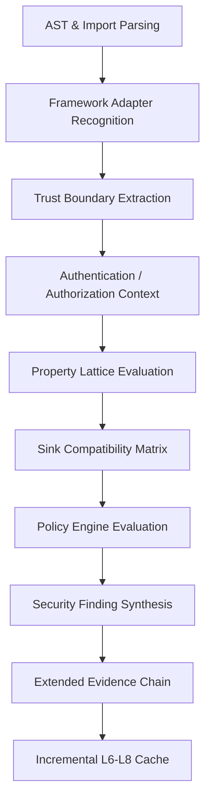
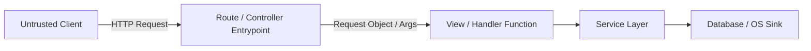
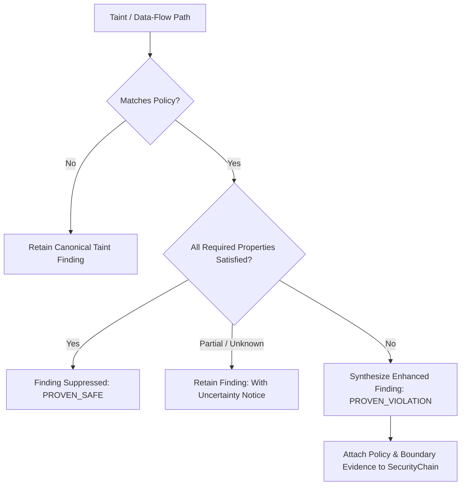
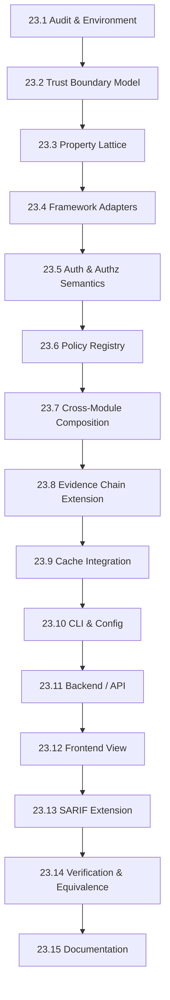

# Phase 23 Implementation Plan
# Security Boundary Semantics, Framework-Aware Analysis & Policy Intelligence

---

## 1. Executive Overview & Mission

Phase 23 transitions CodeSentinel from pure structural taint tracking (`generic source -> sink analysis`) toward **context-aware security intelligence and evidence-backed policy verification**:

```text
Untrusted Input / External Data
            ↓
Framework Entrypoint / Route Boundary (e.g. Flask @app.route, Django path/view, React Props)
            ↓
Trust Boundary Classification (e.g. HTTP_REQUEST_PARAM, HTTP_BODY, DOM_INPUT)
            ↓
Authentication Context Evaluation (AUTHENTICATED | UNAUTHENTICATED | UNKNOWN)
            ↓
Authorization Context Evaluation (AUTHORIZED | UNAUTHORIZED | ROLE_VERIFIED | UNKNOWN)
            ↓
Validation & Normalization (Type Casting, Format Constraint)
            ↓
Service & Business Logic Composition (Interprocedural Propagation)
            ↓
Security Transformation / Sink-Specific Sanitization (e.g. shlex.quote vs html.escape)
            ↓
Sensitive Operation / Protected Sink (SQL_EXECUTE, COMMAND_EXECUTE, DOM_INJECTION, CODE_EVAL)
```

### Core Design Philosophy
1. **Evidence-First Truth**: Security properties (boundaries, authentication, authorization, sanitization) are derived strictly from concrete AST, CFG, call graph, and contract facts. Security semantics are **never** inferred from variable or function names (e.g. `def check_user():` or `is_admin` do not grant authentication or authorization without verified structural/decorator evidence).
2. **Conservative Uncertainty**: `UNKNOWN` is never laundered into `SAFE`. When type, call target, boundary, or authorization state is incomplete or unresolved, the system explicitly reports `UNKNOWN` or retains findings.
3. **Additive Architecture**: Reuses and extends existing AST parsers, CFGs, taint registries, function summaries, contracts (L7), compositions (L8), taint summaries (L6), and evidence chains without introducing redundant analysis engines.
4. **Zero AI Ingress in Security Truth**: The static analyzer remains 100% deterministic and offline. AI enrichment (Phase 12) remains purely advisory, asynchronous, and isolated in backend workers.
5. **Zero Breaking Changes**: Zero database migrations, zero modifications to existing finding UUIDv5 formulas, full SARIF 2.1.0 schema validity, and 100% backward compatibility with Phase 9–22 baselines.

---

## 2. Verified Phase 22 Baseline

Direct repository inspection performed on September 26, 2026 at commit `b4c6e2b` (with Phase 22 implemented):

### A. Test Execution & Count Verification
- **Current Collected Tests**: 690 tests
- **Current Passing**: 689 tests
- **Current Skipped**: 1 test (`test_git_sparse_checkout` in `test_git.py`, skips on non-git temp directories)
- **Current Warnings**: 2 warnings (Starlette `httpx` testclient & AnyIO deprecation warnings)
- **Phase 22 Dedicated Tests**: 48 tests across 9 test files:
  - `analyzer/tests/test_phase22_config.py` (4 tests)
  - `analyzer/tests/test_phase22_evidence_chain.py` (4 tests)
  - `analyzer/tests/test_phase22_contract_cache.py` (8 tests)
  - `analyzer/tests/test_phase22_composition_cache.py` (7 tests)
  - `analyzer/tests/test_phase22_taint_summary.py` (5 tests)
  - `analyzer/tests/test_phase22_selective_parsing.py` (4 tests)
  - `analyzer/tests/test_phase22_equivalence.py` (6 tests)
  - `analyzer/tests/test_phase22_integration.py` (6 tests)
  - `backend/tests/test_phase22_api_backward_compat.py` (4 tests)

### B. Verification of Phase 22 Claims
1. **Cross-Module Taint Summaries**: Verified in [`analyzer/dataflow/taint/summary.py`](file:///e:/AI-Workspace/projects/CodeSentinel/analyzer/dataflow/taint/summary.py) via `FileTaintSummary` and `FileTaintSummaryExtractor`.
2. **L6 Summary Caching**: Verified via `compute_taint_summary_cache_key`, `get_cached_taint_summary`, `set_cached_taint_summary`.
3. **L7 Contract Caching**: Verified in [`analyzer/incremental/contract_cache.py`](file:///e:/AI-Workspace/projects/CodeSentinel/analyzer/incremental/contract_cache.py) with scoped key derivation and bounded caching.
4. **L8 Composition Caching**: Verified in [`analyzer/incremental/composition_cache.py`](file:///e:/AI-Workspace/projects/CodeSentinel/analyzer/incremental/composition_cache.py) with caller/callee contract hash and boundary rule indexing.
5. **Selective AST Reuse**: Verified in [`analyzer/engine/pipeline.py`](file:///e:/AI-Workspace/projects/CodeSentinel/analyzer/engine/pipeline.py) (controlled by `enable_selective_parsing: bool = False`, with SHA-256 hashed L2 cache keys).
6. **Evidence Chains**: Verified in [`analyzer/models/evidence.py`](file:///e:/AI-Workspace/projects/CodeSentinel/analyzer/models/evidence.py) via `SecurityEvidenceChain` and populated into `Finding.evidence["security_chain"]` by `RuleEngine`.
7. **Incremental Escalation**: Verified in [`analyzer/incremental/coordinator.py`](file:///e:/AI-Workspace/projects/CodeSentinel/analyzer/incremental/coordinator.py) via `is_taint_summary_cross_module_valid` escalating unaffected files when callee dependencies change.
8. **Contract & Composition Equivalence**: Verified in [`analyzer/incremental/equivalence.py`](file:///e:/AI-Workspace/projects/CodeSentinel/analyzer/incremental/equivalence.py) via `verify_contracts` and `verify_composition`.
9. **Deterministic Cache Behavior**: Verified across all layers L1–L8 using SHA-256 digests.
10. **Cache Corruption Handling**: Verified in `DiskAnalysisCache.get` via schema envelope and checksum validation with recomputation fallback.
11. **Analyzer/Backend Isolation**: Verified that `analyzer/` has zero dependencies or imports from FastAPI, SQLAlchemy, Celery, Redis, or LLM SDKs.
12. **Finding Identity Stability**: Verified that `compute_finding_hash()` in `analyzer/models/findings.py` computes UUIDv5 based solely on `(rule_id, file_path, line_start, col_start or 0)`. Evidence chains are purely additive.

### C. Discrepancies Noted from Historical Walkthroughs
- **Arithmetic Inconsistency in Previous Walkthrough**: Historical text noted "642 pre-existing + 48 Phase 22 tests = 689 passed". In reality, the pre-existing count was 641 passed + 1 skipped = 642 collected. 641 passed + 48 Phase 22 tests = 689 passed (690 collected).
- **Windows Cache Key Filename Collision**: Raw colon syntax (`util.py:hash`) previously provoked `[WinError 87]` on Windows NTFS; this was corrected in Phase 22 by hashing L2 keys and sanitizing invalid characters (`:*?"<>|/\`) in `DiskAnalysisCache._artifact_path`.
- **Cache Ingestion Exclusion**: `.codesentinel_cache` was not initially excluded by default in `DEFAULT_EXCLUDED_DIRS` (`analyzer/ingestion/ignore.py`), causing transient self-ingestion during equivalence runs until resolved.
- **Taint Summary Call Attribution**: `FileTaintSummaryExtractor` was corrected to attribute cross-module call graph edges only to files originating the caller function, preventing spurious repository-wide summary escalations.

---

## 3. Architectural Philosophy: Bounded Evidence-First Policy Intelligence

CodeSentinel Phase 23 introduces security policy intelligence with strict semantic guardrails:



### The Non-Negotiable Semantic Guardrails
1. **Rule of No Name Inferences**: No security state is ever established based on symbol names (e.g. `is_admin`, `check_permission`, `auth_token`, `safe_sql`). All facts require structural decorator evidence, registered framework API calls, explicit type assertions, or verified contract preconditions.
2. **Rule of Sink-Specific Compatibility**: A sanitizer or validator is only effective against its explicitly declared target sink categories (e.g. `html.escape` cannot sanitize SQL; `shlex.quote` cannot sanitize innerHTML; `int()` sanitizes numeric sinks but does not sanitize path traversal or CSRF).
3. **Rule of Non-Laundering Uncertainty**:
   - `UNKNOWN` $\sqcup$ `SAFE` = `UNKNOWN`
   - `UNKNOWN` $\sqcap$ `SAFE` = `UNKNOWN`
   - `UNAUTHENTICATED` $\sqcup$ `AUTHENTICATED` = `UNAUTHENTICATED`
   - `UNAUTHORIZED` $\sqcup$ `AUTHORIZED` = `UNAUTHORIZED`
4. **Rule of Dual Auth Separation**: Authentication answers *Who are you?*; Authorization answers *What are you allowed to do?*. A request can be `AUTHENTICATED` while remaining completely `UNAUTHORIZED` for a sensitive operation.

---

## 4. Framework Semantics (Django, Flask, React, Express)

Based on actual inspection of [`analyzer/detection/frameworks.py`](file:///e:/AI-Workspace/projects/CodeSentinel/analyzer/detection/frameworks.py) and [`analyzer/dataflow/taint/registry.py`](file:///e:/AI-Workspace/projects/CodeSentinel/analyzer/dataflow/taint/registry.py), CodeSentinel actively detects and analyzes four primary web technologies:

| Framework | Language | Actual Detection Criteria | Actual Registered Entrypoints / Taint Sources |
| :--- | :--- | :--- | :--- |
| **Flask** | Python | `manage.py`, `flask` in requirements, `from flask import`, `import flask` | `request.args`, `request.values`, `request.form`, `request.get_json()`, `request.json`, `request.data`, `request.headers`, `request.cookies` |
| **Django** | Python | `manage.py`, `settings.py`, `django` in requirements, `from django`, `import django` | `request.GET`, `request.POST`, `request.COOKIES`, `request.META`, `request.headers`, `request.body` |
| **React** | JS / TS | `package.json` (`react`, `react-dom`), JSX/TSX files, `from 'react'`, `import React` | Component `props`, `useSearchParams`, `useParams`, `useLocation`, DOM state |
| **Express** | JS / TS | Package manifests, imports | `req.query`, `req.params`, `req.body`, `req.headers`, `req.cookies` |

### Bounded Framework Adapters
Each framework adapter exposes a bounded set of recognized constructs:
- **FlaskAdapter**:
  - Route Decorators: `@app.route(...)`, `@blueprint.route(...)`, `@api.route(...)`
  - Auth Decorators: `@login_required`, `@jwt_required(...)`
  - Request Context: `flask.request` thread-local access
- **DjangoAdapter**:
  - View Decorators: `@login_required`, `@permission_required(...)`, `@user_passes_test(...)`, `@csrf_exempt`, `@require_http_methods(...)`
  - URL Patterns: `path('...', view_fn)`, `re_path('...', view_fn)`
  - Class-Based Views: Subclasses of `django.views.View`, `APIView`
- **ReactAdapter**:
  - Sinks: `dangerouslySetInnerHTML={{ __html: ... }}`
  - Sources: URL parameters from router hooks (`useSearchParams`, `useParams`)
- **ExpressAdapter**:
  - Router calls: `app.get(...)`, `app.post(...)`, `router.use(...)`

---

## 5. Route & Controller Boundaries

A route boundary marks where unvalidated external network traffic crosses into application code:



### Concrete Entrypoint Identification Model
1. **Flask Route Registration**:
   - AST Decorator check on `FunctionDef`: decorator name is `route` on an object imported from `flask` or typed as `Flask`/`Blueprint`.
   - Arguments to decorated function (except default context) are tagged as `HTTP_PATH_PARAMETER`.
2. **Django Route Registration**:
   - `urls.py` patterns: call to `path` or `re_path` mapping a route pattern to a callable.
   - Function signature check: first parameter is named `request` or annotated with `HttpRequest`.
3. **Express Route Registration**:
   - Call expressions on `app` or `router` matching `.get()`, `.post()`, `.put()`, `.delete()`, `.use()`.
   - Handler callback parameters: `(req, res, next)` -> `req` properties tagged as trust boundaries.

> [!IMPORTANT]
> **Strict Guard Against Name-Based Guessing**: A function is **never** classified as a route or controller simply because its name contains `view`, `handler`, `controller`, or `route`. Explicit decorator or registration AST evidence is required.

---

## 6. Trust Boundary Model

A Trust Boundary represents a demarcation where data transitions across trust domains.

### Formal Data Structure
```python
class TrustBoundaryType(str, Enum):
    HTTP_REQUEST_PARAM = "HTTP_REQUEST_PARAM"    # URL query string (?q=...)
    HTTP_REQUEST_BODY = "HTTP_REQUEST_BODY"      # JSON / form payload
    HTTP_REQUEST_HEADER = "HTTP_REQUEST_HEADER"  # Headers (User-Agent, etc.)
    HTTP_COOKIE = "HTTP_COOKIE"                  # Cookie values
    ENVIRONMENT_VARIABLE = "ENVIRONMENT_VARIABLE"# os.environ
    CLI_ARGUMENT = "CLI_ARGUMENT"                # sys.argv, argparse
    DOM_INPUT = "DOM_INPUT"                      # location.search, input.value
    EXTERNAL_API_RESPONSE = "EXTERNAL_API"       # requests.get().json()
    INTERNAL_SERVICE = "INTERNAL_SERVICE"        # Trusted internal RPC/call

class TrustBoundaryEvidence(BaseModel):
    model_config = ConfigDict(frozen=True)

    boundary_id: str             # Deterministic ID e.g. "TB_FLASK_ROUTE_GET_USER"
    boundary_type: TrustBoundaryType
    framework: str               # "FLASK", "DJANGO", "REACT", "EXPRESS", "GENERAL"
    file_path: str
    line: int
    column: int
    symbol_name: str             # e.g. "request.args['id']"
    is_authenticated: str = "UNKNOWN"  # "AUTHENTICATED", "UNAUTHENTICATED", "UNKNOWN"
    is_authorized: str = "UNKNOWN"     # "AUTHORIZED", "UNAUTHORIZED", "UNKNOWN"
    boundary_confidence: str = "HIGH"  # "HIGH", "MEDIUM", "LOW"
    details: str = ""
```

---

## 7. Authentication Semantics

### Discrete Authentication States
```text
                  [UNKNOWN]
                 /         \
    (Evidence +)             (Evidence -)
               /             \
    [AUTHENTICATED]     [UNAUTHENTICATED]
```

- **AUTHENTICATED**: Proven via verified decorator or middleware (e.g. `@login_required`, `@jwt_required`, `request.user.is_authenticated` assert).
- **UNAUTHENTICATED**: Proven route lack of authentication on public endpoints or `@csrf_exempt` without credentials.
- **UNKNOWN**: Default when authentication context cannot be proven statically.

### Verification Matrix for Authentication
| Pattern | Framework | State Established | Required Evidence |
| :--- | :--- | :--- | :--- |
| `@login_required` | Flask / Django | `AUTHENTICATED` | AST decorator node with matching import from `flask_login` or `django.contrib.auth.decorators` |
| `@jwt_required()` | Flask-JWT | `AUTHENTICATED` | AST decorator node from `flask_jwt_extended` |
| `assert request.user.is_authenticated` | Django | `AUTHENTICATED` (on branch) | Path-sensitive assertion guard |
| Public route without decorator | Any | `UNKNOWN` (or `UNAUTHENTICATED` if auth required by policy) | No decorator evidence |
| `def check_user(): return False` | Any | `UNKNOWN` | Function name alone does NOT establish authentication! |

---

## 8. Authorization Semantics

### Discrete Authorization States
```text
                     [AUTHORIZATION_UNKNOWN]
                    /                       \
   (Valid Permission Check)         (Failed / Missing Check)
                  /                           \
         [AUTHORIZED]                    [UNAUTHORIZED]
          /          \
  [ROLE_VERIFIED]  [PERMISSION_GRANTED]
```

### Distinction Between AuthN and AuthZ
- **Authentication**: Establishes identity (`user_id = 42`).
- **Authorization**: Establishes permission for an operation (`user 42 can DELETE /records/99`).

### Verification Matrix for Authorization
| Pattern | Framework | State Established | Required Evidence |
| :--- | :--- | :--- | :--- |
| `@permission_required('perm')` | Django | `AUTHORIZED` (`PERMISSION_GRANTED`) | Decorator from `django.contrib.auth.decorators` |
| `@user_passes_test(is_admin)` | Django | `AUTHORIZED` (`ROLE_VERIFIED`) | Decorator with proven predicate |
| `has_perm('app.delete')` guard | Django | `AUTHORIZED` (inside guarded branch) | CFG branch condition in Phase 18 path sensitivity |
| `is_admin = True` variable | Any | `AUTHORIZATION_UNKNOWN` | Variable name alone is NEVER sufficient evidence! |

---

## 9. Security Policy Engine & Policy Model Specification

A `SecurityPolicy` specifies invariant requirements that must hold along data paths between boundaries and sensitive sinks.

### Formal Policy Specification
```python
class PolicyEnforcementMode(str, Enum):
    ENFORCE = "ENFORCE"    # Violations yield findings
    ADVISORY = "ADVISORY"  # Violations yield INFO / warning findings
    DISABLED = "DISABLED"  # Policy skipped

class SecurityPolicy(BaseModel):
    policy_id: str                      # e.g. "POL-SQL-01"
    version: int = 1
    name: str
    description: str
    source_boundaries: list[TrustBoundaryType]
    target_sink_categories: list[SinkCategory]
    required_security_properties: list[str]  # e.g. ["SQL_SAFE", "VALIDATED_TYPE"]
    allowed_sanitizers: list[str]            # e.g. ["int", "float"]
    require_authentication: bool = False
    require_authorization: bool = False
    enforcement_mode: PolicyEnforcementMode = PolicyEnforcementMode.ENFORCE
    associated_rule_ids: list[str]           # e.g. ["SEC-PY-009", "SEC-PY-011"]
    severity: FindingSeverity = FindingSeverity.HIGH
```

### Canonical Policy Catalog (Phase 23)
1. **`POL-SQL-01` (Unprotected SQL Execution)**:
   - Source: `HTTP_REQUEST_PARAM`, `HTTP_REQUEST_BODY`, `DOM_INPUT`
   - Sink: `SinkCategory.SQL_EXECUTE`
   - Requirement: Value must have property `SQL_SAFE` or `VALIDATED_TYPE` (via parameterized query or `int()`/`float()` constraint).
   - Associated Rules: `SEC-PY-005`, `SEC-PY-009`, `SEC-PY-011`.
2. **`POL-CMD-01` (Untrusted OS Command Execution)**:
   - Source: `HTTP_REQUEST_PARAM`, `HTTP_REQUEST_BODY`, `ENVIRONMENT_VARIABLE`
   - Sink: `SinkCategory.COMMAND_EXECUTE`
   - Requirement: Value must have property `COMMAND_SAFE` (via `shlex.quote` or alphanumeric token validation).
   - Associated Rules: `SEC-PY-003`, `SEC-PY-010`, `SEC-PY-012`.
3. **`POL-DOM-01` (Client-Side Cross-Site Scripting)**:
   - Source: `DOM_INPUT`, `HTTP_REQUEST_PARAM`
   - Sink: `SinkCategory.DOM_INJECTION`
   - Requirement: Value must have property `HTML_SAFE` (via `DOMPurify.sanitize` or numeric validation).
   - Associated Rules: `SEC-JS-003`, `SEC-JS-007`, `SEC-JS-009`.
4. **`POL-EVAL-01` (Dynamic Code Execution)**:
   - Source: Any untrusted source
   - Sink: `SinkCategory.CODE_EVAL`
   - Requirement: Value must have property `VALIDATED_FORMAT` or `VALIDATED_TYPE`.
   - Associated Rules: `SEC-PY-004`, `SEC-JS-001`, `SEC-JS-008`, `SEC-JS-010`.
5. **`POL-AUTHZ-01` (Unprotected Privileged Operations)**:
   - Source: `HTTP_REQUEST_PARAM`, `HTTP_REQUEST_BODY`
   - Sink: Protected administrative mutations (e.g. `delete`, `drop`, `admin_action`)
   - Requirement: Path must possess verified `AUTHORIZED` context.

---

## 10. Sanitizer, Validator & Transformer Compatibility Matrix

Phase 23 builds on the Phase 20 `SecurityBoundaryModel` and Phase 22 `SanitizerEvidence` to establish a sink-specific compatibility matrix:

| Transformation / Function | Transformation Category | Effective Sink Categories | Incompatible Sinks (Violates Policy) |
| :--- | :--- | :--- | :--- |
| `int(x)`, `float(x)` | Validator / Type Cast | `SQL_EXECUTE`, `COMMAND_EXECUTE`, `DOM_INJECTION`, `CODE_EVAL` | *None (Scalar numbers safe for all)* |
| `shlex.quote(x)` | Sanitizer / Shell Quote | `COMMAND_EXECUTE` | `SQL_EXECUTE`, `DOM_INJECTION` |
| `html.escape(x)`, `DOMPurify.sanitize(x)` | Sanitizer / HTML Escape | `DOM_INJECTION` | `SQL_EXECUTE`, `COMMAND_EXECUTE`, `CODE_EVAL` |
| `urllib.parse.quote(x)` | Encoder / URL Encode | `URL_SAFE` | `SQL_EXECUTE`, `COMMAND_EXECUTE` |
| `str(x).strip()` | Transformer / Whitespace | *None* | `SQL_EXECUTE`, `COMMAND_EXECUTE`, `DOM_INJECTION` |
| Parameterized Binding `?` / `%s` | Structural Protection | `SQL_EXECUTE` | `COMMAND_EXECUTE` |

> [!WARNING]
> **No Universal Safety**: There is no universal `SAFE = True` flag. Safety is always property-specific and sink-specific. A string quoted with `shlex.quote()` is `COMMAND_SAFE` but completely `SQL_UNSAFE`.

---

## 11. Security Property Lattice & Transition Semantics

Data-flow facts are tracked over a bounded property lattice:

```text
                     [UNTRUSTED]
                    /     |     \
          [VALIDATED] [HTML_SAFE] [SQL_SAFE] ...
                    \     |     /
                     [SINK_SAFE]
                          |
                      [UNKNOWN]
```

### Bounded Properties
- `UNTRUSTED`: Raw input from an untrusted trust boundary.
- `VALIDATED_TYPE`: Value proven to be non-string scalar (int, float, bool).
- `VALIDATED_FORMAT`: Value constrained by proven regex/format guard.
- `SQL_SAFE`: Parameterized or escaped for SQL queries.
- `COMMAND_SAFE`: Shell-escaped or strictly argument-vector bound.
- `HTML_SAFE`: Escaped or stripped of executable DOM/HTML constructs.
- `AUTHENTICATED`: Carried by an authenticated caller/session.
- `AUTHORIZED`: Verified by an authorization guard.
- `UNKNOWN`: Unresolved property state.

### Lattice Operations
1. **Join ($\sqcup$) Across Branches**:
   - `PROP_A` $\sqcup$ `PROP_A` = `PROP_A`
   - `PROP_A` $\sqcup$ `UNTRUSTED` = `UNTRUSTED` (taint persists if any branch is untrusted)
   - `PROP_A` $\sqcup$ `UNKNOWN` = `UNKNOWN` (conservative uncertainty)
   - `AUTHENTICATED` $\sqcup$ `UNAUTHENTICATED` = `UNAUTHENTICATED`
   - `AUTHORIZED` $\sqcup$ `UNAUTHORIZED` = `UNAUTHORIZED`
2. **Meet ($\sqcap$) for Invalidation**:
   - When conflicting assertions meet, state collapses to `UNKNOWN` or `CONFLICT`, triggering re-analysis or explicit warning.

---

## 12. Policy Evaluation & Finding Synthesis

During pipeline execution, policy evaluation runs across discovered taint paths:



### Finding Identity Preservation
To ensure 100% backward compatibility with Phase 9 baseline comparison:
```python
finding_uuid = uuid.uuid5(
    NAMESPACE_CODESENTINEL,
    f"{rule_id}:{file_path}:{line_start}:{col_start}"
)
```
Policy evaluation **never** modifies the UUID formula. Policy evaluation details are stored purely in `finding.evidence["policy_evaluation"]` and `finding.evidence["security_chain"]`.

---

## 13. Existing Rule Integration & Mapping Matrix

Phase 23 enhances the 12 Python and 10 JavaScript rules without inventing unnecessary rule IDs:

| Existing Rule | Rule Name | Boundary Facts Integrated | Policy Facts Integrated | Evidence Chain Enrichment | Incremental Dependencies |
| :--- | :--- | :--- | :--- | :--- | :--- |
| **SEC-PY-005** | SQL String Formatting | Route / Query string origin | `POL-SQL-01` | Attached query formatting context | L4 CFG, L5 Dataflow |
| **SEC-PY-008** | CSRF Exemption | Django `@csrf_exempt` | Auth & CSRF boundary check | Attached route decorator evidence | L2 AST, L4 CFG |
| **SEC-PY-009** | SQL Injection (Intra) | Flask/Django request params | `POL-SQL-01`, `VALIDATED_TYPE` | Trust boundary + Sanitizer evidence | L4 CFG, L5 Taint |
| **SEC-PY-010** | Command Injection (Intra) | Request body / Environment | `POL-CMD-01`, `COMMAND_SAFE` | Trust boundary + Shell quote evidence | L4 CFG, L5 Taint |
| **SEC-PY-011** | SQL Injection (Inter) | Cross-module route -> SQL | `POL-SQL-01`, Contracts | Boundary + Interprocedural CallChain | L6 Taint Summary, L7 Contract, L8 Comp |
| **SEC-PY-012** | Command Injection (Inter) | Cross-module route -> Command | `POL-CMD-01`, Contracts | Boundary + Interprocedural CallChain | L6 Taint Summary, L7 Contract, L8 Comp |
| **SEC-JS-003** | dangerouslySetInnerHTML | React component props | `POL-DOM-01` | React JSX component boundary | L2 AST, L4 CFG |
| **SEC-JS-007** | DOM XSS (Intra) | `location.search`, `document.cookie` | `POL-DOM-01`, `HTML_SAFE` | DOM Trust boundary + Sanitizer | L4 CFG, L5 Taint |
| **SEC-JS-008** | Eval Injection (Intra) | `location.*`, `req.query` | `POL-EVAL-01` | Trust boundary + Eval sink evidence | L4 CFG, L5 Taint |
| **SEC-JS-009** | DOM XSS (Inter) | Cross-module React/DOM input | `POL-DOM-01`, Contracts | Boundary + CallChain + DOMPurify | L6 Taint Summary, L7 Contract, L8 Comp |
| **SEC-JS-010** | Eval Injection (Inter) | Cross-module eval | `POL-EVAL-01`, Contracts | Boundary + CallChain evidence | L6 Taint Summary, L7 Contract, L8 Comp |

---

## 14. Interprocedural & Cross-Module Policy Composition

When data flows across function and module boundaries:

```text
Module A (Controller)           Module B (Service)             Module C (Repository)
---------------------           ------------------             ---------------------
@app.route("/users")
def get_user():                 def fetch_user(uid):           def query_user(uid):
    uid = request.args["id"] ->     validate_numeric(uid)   ->     cursor.execute(f"...{uid}")
    return fetch_user(uid)          return query_user(uid)
```

1. **Module A**: Extracts `TrustBoundaryEvidence(HTTP_REQUEST_PARAM, "request.args['id']")`.
2. **Module B**: Evaluates validator `validate_numeric(uid)`. In L7 Contract, records postcondition `ContractGuarantee(VALIDATED_TYPE)`.
3. **Module C**: Checks `POL-SQL-01`. Observes `VALIDATED_TYPE` guaranteed by caller contract. Policy evaluates to `PROVEN_SAFE`.
4. **Cross-Module Provenance**: Retains complete provenance: `Boundary -> A.get_user -> B.fetch_user -> C.query_user`.

---

## 15. React / Frontend DOM Security Boundaries

For client-side React code:
1. **Recognized Sinks**:
   - `dangerouslySetInnerHTML={{ __html: ... }}`
   - `eval(...)`, `setTimeout(..., ...)` with string
   - `element.innerHTML = ...`
2. **Recognized Boundaries**:
   - React router hooks: `useSearchParams()`, `useParams()`, `useLocation()`
   - DOM properties: `window.location.search`, `window.location.hash`
3. **Guardrails**:
   - Component props are **not** unconditionally untrusted. Props only carry taint if traced from a verified DOM or network source.
   - Sinks sanitized via `DOMPurify.sanitize(val)` or `sanitizeHtml(val)` satisfy `POL-DOM-01` and suppress false positives.

---

## 16. Incremental Cache Integration & Invalidation Matrix

Phase 23 integrates with the existing incremental cache layers:
- **L1**: File fingerprints (`manifest`)
- **L2**: Parsed AST (`ParsedFile`)
- **L3**: Dependency graph (`dependency_graph`)
- **L4**: Function CFGs
- **L5**: Intraprocedural data-flow & taint
- **L6**: Cross-module taint summaries (`FileTaintSummary`)
- **L7**: Per-function contracts
- **L8**: Composition edges
- **L9**: Final analysis result & findings

### Cache Invalidation Matrix
| Change Type | L1 Manifest | L2 AST | L3 Dep Graph | L4 CFG | L5 Taint | L6 Taint Summary | L7 Contracts | L8 Comp Edges | L9 Findings |
| :--- | :--- | :--- | :--- | :--- | :--- | :--- | :--- | :--- | :--- |
| **Source File Body** | Yes (Modified) | Yes (Affected) | Conditional | Yes (Affected) | Yes (Affected) | Yes (Affected) | Yes (Affected) | Yes (Affected) | Yes (Affected) |
| **Unrelated Source File** | Yes (Modified) | No (Reused) | No | No (Reused) | No (Reused) | No (Reused) | No (Reused) | No (Reused) | No (Reused) |
| **Security Policy Def** | No | No | No | No | No | No | No | Conditional | Yes (Re-evaluate) |
| **Sanitizer Registry** | No | No | No | No | Yes (Dataflow) | Yes | Yes (Contracts) | Yes | Yes |
| **Framework Model Def**| No | No | Conditional | No | Yes (Dataflow) | Yes | Yes (Contracts) | Yes | Yes |
| **Config: Enabled Rules**| No | No | No | No | No | No | No | No | Yes (Filter) |
| **Global Hash Mismatch**| Yes | Yes | Yes | Yes | Yes | Yes | Yes | Yes | Yes (Full Cold) |

---

## 17. Policy Versioning & Config Fingerprinting

In [`analyzer/incremental/config_fingerprint.py`](file:///e:/AI-Workspace/projects/CodeSentinel/analyzer/incremental/config_fingerprint.py), extend `ScopedConfigFingerprint` with:
- `policy_hash`: SHA-256 digest of active security policies, enforcement modes, and custom rules.
- `framework_model_hash`: SHA-256 digest of registered framework adapter definitions and route patterns.
- `sanitizer_registry_hash`: SHA-256 digest of registered sanitizers and compatibility specifications.

When only `policy_hash` changes, L1, L2, L3, L4, and L7 caches remain **100% valid**, allowing instant warm re-evaluation of policies without re-parsing or re-computing CFGs!

---

## 18. Evidence Chain Extension (`SecurityEvidenceChain`)

In [`analyzer/models/evidence.py`](file:///e:/AI-Workspace/projects/CodeSentinel/analyzer/models/evidence.py), additively extend `SecurityEvidenceChain`:

```python
class AuthenticationEvidence(BaseModel):
    model_config = ConfigDict(frozen=True)
    auth_state: str = "UNKNOWN"        # "AUTHENTICATED", "UNAUTHENTICATED", "UNKNOWN"
    mechanism: Optional[str] = None    # "DECORATOR", "MIDDLEWARE", "ASSERTION"
    file_path: Optional[str] = None
    line: Optional[int] = None
    details: str = ""

class AuthorizationEvidence(BaseModel):
    model_config = ConfigDict(frozen=True)
    authz_state: str = "UNKNOWN"       # "AUTHORIZED", "UNAUTHORIZED", "UNKNOWN"
    required_permission: Optional[str] = None
    verified_permission: Optional[str] = None
    file_path: Optional[str] = None
    line: Optional[int] = None
    details: str = ""

class PolicyEvaluationEvidence(BaseModel):
    model_config = ConfigDict(frozen=True)
    policy_id: str
    policy_name: str
    evaluation_result: str = "UNKNOWN" # "PROVEN_VIOLATION", "PROVEN_SAFE", "UNKNOWN"
    missing_properties: list[str] = Field(default_factory=list)
    satisfied_properties: list[str] = Field(default_factory=list)
    details: str = ""
```

And in `SecurityEvidenceChain`:
```python
    # Phase 23 Additive Extensions (all Optional with None default)
    trust_boundary: Optional[TrustBoundaryEvidence] = None
    authentication: Optional[AuthenticationEvidence] = None
    authorization: Optional[AuthorizationEvidence] = None
    policy_evaluation: Optional[PolicyEvaluationEvidence] = None
    security_properties: list[str] = Field(default_factory=list)
```
Existing Phase 22 serialized evidence chains remain 100% deserializable without schema migration.

---

## 19. SARIF 2.1.0 Integration & Schema Conformance

In [`analyzer/reporting/sarif.py`](file:///e:/AI-Workspace/projects/CodeSentinel/analyzer/reporting/sarif.py):
1. **Result Properties**: Add `properties` entries:
   ```json
   "properties": {
       "policyId": "POL-SQL-01",
       "trustBoundary": "HTTP_REQUEST_PARAM",
       "authenticationState": "UNAUTHENTICATED",
       "authorizationState": "UNKNOWN",
       "securityProperties": ["UNTRUSTED"]
   }
   ```
2. **CodeFlow Steps**: Include trust boundary origins and sanitizer evaluation steps inside the standard SARIF `threadFlowLocations`.
3. **Schema Compliance**: All additions reside strictly within the SARIF 2.1.0 `propertyBag` and standard `threadFlow` objects, ensuring 100% validation against OASIS SARIF v2.1.0 JSON Schema.

---

## 20. CLI, Configuration & Precedence Schema

### A. Configuration Precedence Model
```text
Default In-Code Settings
       ↓ (overridden by)
.codesentinel.yml / .codesentinel.json (Repository Config)
       ↓ (overridden by)
CLI Arguments / Flags
       ↓ (overridden by)
API / Celery Job Parameters
```

### B. Declarative Configuration (`.codesentinel.yml`)
```yaml
version: 1
analysis:
  security_policies:
    enable_boundary_detection: true
    enabled_policies:
      - "POL-SQL-01"
      - "POL-CMD-01"
      - "POL-DOM-01"
    disabled_policies: []
    enforcement_mode: "ENFORCE"  # "ENFORCE", "ADVISORY"
    max_security_boundaries: 5000
    max_policy_paths: 10000
```

### C. CLI Options
In [`analyzer/cli/main.py`](file:///e:/AI-Workspace/projects/CodeSentinel/analyzer/cli/main.py):
- `--explain-policy`: Include detailed policy evaluation and trust boundary traces in terminal output.
- `--policy-mode {enforce,advisory,disabled}`: Set policy enforcement level without editing config.

---

## 21. Backend / Celery / Database Architecture (Zero DB Migrations)

- **Zero DB Schema Changes**: Existing `Analysis`, `Finding`, and `AIEnrichmentRecord` tables in `backend/app/models/` store findings as JSON snapshots (`finding.evidence`, `finding.metadata`). The Phase 23 policy and boundary evidence flows entirely through these existing JSON structures.
- **Async Celery Compatibility**: Background analysis in `backend/app/workers/analysis_tasks.py` preserves cooperative cancellation, progress reporting, and repository isolation.
- **API Response DTOs**: Extend `FindingResponse` in `backend/app/schemas/` with optional additive fields (`trust_boundary`, `policy_evaluation`) defaulting to `None`.

---

## 22. Frontend Security Explanation Visualization View

In the CodeSentinel frontend (React / Vite):
- **Component**: Create `SecurityPolicyInspector.tsx` inside the Finding Detail drawer.
- **Visual Pipeline**:
  ```text
  [Trust Boundary: HTTP_PARAM] -> [Auth: @login_required (AUTHENTICATED)] -> [Authz: UNKNOWN] -> [Sanitizer: None] -> [Sink: cursor.execute (VIOLATION)]
  ```
- **Visual Encoding**:
  - `PROVEN_SAFE`: Green badge with shield check icon
  - `PROVEN_VIOLATION`: Red badge with warning triangle
  - `UNKNOWN`: Muted amber badge with question mark, accompanied by an explicit tooltip: *"Static analyzer could not prove safety or authorization; manual review recommended."*

---

## 23. Codebase Health Score Integration

In [`analyzer/architecture/health.py`](file:///e:/AI-Workspace/projects/CodeSentinel/analyzer/architecture/health.py):
- **Non-Double-Counting**: Health deductions are applied strictly per finding via `RuleRegistry` severity deduction rules. Policy evaluations attached to existing findings do **not** trigger double deductions.
- **Rule Capping**: Existing `MAX_DEDUCTION_PER_RULE` (default: 30.0) caps cumulative deductions per rule ID.
- **Uncertainty Protection**: `UNKNOWN` policy states **never** penalize the health score. Deductions are only taken for verified findings (`PROVEN_VIOLATION`).

---

## 24. AI Enrichment Integration & Containment

In [`backend/app/services/ai/orchestrator.py`](file:///e:/AI-Workspace/projects/CodeSentinel/backend/app/services/ai/orchestrator.py):
- **Bounded Context**: When preparing finding context for LLM enrichment, include the structured `SecurityEvidenceChain` (boundary, policy, missing property).
- **Strict Advisory Boundary**: AI outputs can propose remediation code diffs and natural language explanations. AI outputs **cannot** change deterministic severity, alter finding UUIDs, modify health scores, or convert `PROVEN_VIOLATION` to `PROVEN_SAFE`.

---

## 25. Security Property Integrity & Semantic Safety

To prevent semantic laundering:
1. **Dynamic Dispatch**: Unresolved dynamic method calls yield `callee = UNRESOLVED` and preserve taint rather than dropping it.
2. **Context Budget Exhaustion**: If `max_call_depth` or `max_taint_depth` is exceeded, status is marked `TRUNCATED`, and existing conservative taint state persists.
3. **Reflection / Metaprogramming**: Unanalyzed `getattr()`, `setattr()`, or `importlib` calls preserve `UNKNOWN` taint.

---

## 26. Branch, Loop, Exception & Conflict Semantics

1. **Path-Sensitive Guards**: Reuse Phase 18 guard evaluation. An authorization check inside `if user.has_perm(...):` applies `AUTHORIZED` strictly to the `True` branch.
2. **Early Returns**:
   ```python
   if not user.is_authenticated:
       return
   # Continuation branch inherits AUTHENTICATED
   ```
   Requires explicit control-flow return verification; not inferred from variable names.
3. **Loops**: Loop-carried security properties use widening after fixed iterations (`max_summary_iterations = 5`), collapsing fluctuating properties to `UNKNOWN`.
4. **Exceptions**: Code inside `except Exception:` blocks does **not** inherit security properties proven inside the preceding `try:` block unless the exception is proven unreachable.

---

## 27. Architectural Decision Records (ADR)

### ADR-23-01: Trust Boundary Representation
- **Decision**: Represent trust boundaries as strongly-typed, immutable `TrustBoundaryEvidence` models attached to findings and evidence chains.
- **Alternatives**: (A) Encode boundaries as ad-hoc strings in finding messages. (B) Create an independent TrustBoundary database entity.
- **Reason**: Strongly-typed models provide deterministic serialization, SARIF mapping, and cache stability without DB migrations.
- **Trade-offs**: Adds minor schema footprint to evidence chains.
- **Compatibility**: 100% backward compatible; optional field in findings.

### ADR-23-02: Security Property Lattice
- **Decision**: Define discrete, sink-specific security properties (`SQL_SAFE`, `COMMAND_SAFE`, `HTML_SAFE`, `VALIDATED_TYPE`, etc.) with explicit conservative join operations.
- **Alternatives**: (A) Universal `is_safe: bool` flag. (B) Generic regex pattern matching.
- **Reason**: Universal flags cause false negatives when sanitizers for one vulnerability category (e.g. HTML) are applied to another (e.g. SQL).
- **Trade-offs**: Requires explicit property propagation rules.
- **Compatibility**: Reuses existing Phase 20 `SecurityBoundaryModel`.

### ADR-23-03: Authentication Semantics
- **Decision**: Restrict authentication facts to verified framework decorators, middleware declarations, or path assertions (`AUTHENTICATED`, `UNAUTHENTICATED`, `UNKNOWN`).
- **Alternatives**: (A) Infer authentication from function name keywords (`login`, `auth`, `user`).
- **Reason**: Name heuristics create catastrophic false positives and false negatives.
- **Trade-offs**: Only recognized framework patterns receive `AUTHENTICATED` status; custom frameworks remain `UNKNOWN`.
- **Compatibility**: Conservative default prevents false safety claims.

### ADR-23-04: Authorization Separation from Authentication
- **Decision**: Model authorization as an independent property lattice separate from authentication.
- **Alternatives**: (A) Treat authenticated users as automatically authorized.
- **Reason**: Violates core security principles; authenticated users frequently lack permission for administrative operations.
- **Trade-offs**: Requires distinct decorator and guard tracking.
- **Compatibility**: Compatible with existing rule confidence models.

### ADR-23-05: Policy Registry Architecture
- **Decision**: Implement a centralized `SecurityPolicyRegistry` within `analyzer/rules/` that evaluates policies over canonical taint and contract facts.
- **Alternatives**: (A) Embed policy logic inside individual security rules. (B) Build an external DSL interpreter (e.g. Rego/OPA).
- **Reason**: Rule embedding duplicates logic; external DSL introduces heavyweight dependencies and nondeterminism.
- **Trade-offs**: Policy definitions are managed in Python code and repository YAML.
- **Compatibility**: Leverages existing `RuleRegistry` structure.

### ADR-23-06: Framework Model Registry
- **Decision**: Encapsulate framework-specific AST patterns in dedicated adapters (`FlaskAdapter`, `DjangoAdapter`, `ReactAdapter`, `ExpressAdapter`) managed by `FrameworkModelRegistry`.
- **Alternatives**: (A) Hardcode framework `if/elif` statements across all AST visitors.
- **Reason**: Centralized adapters prevent visitor bloat and enable framework-scoped cache invalidation.
- **Trade-offs**: Requires adapter registration step during pipeline initialization.
- **Compatibility**: Direct extension of `FrameworkDetector`.

### ADR-23-07: Sink-Specific Sanitizer Compatibility
- **Decision**: Strictly enforce sink-to-sanitizer category matching via `SECURITY_BOUNDARY_SPECS`.
- **Alternatives**: (A) Treat any registered sanitizer as clearing all taint.
- **Reason**: Shell quoting does not prevent SQL injection; HTML escaping does not prevent command injection.
- **Trade-offs**: Slightly more complex sanitizer lookup.
- **Compatibility**: Extends Phase 20 `analyzer/dataflow/contracts/security_boundary.py`.

### ADR-23-08: Policy Cache Invalidation
- **Decision**: Incorporate `policy_hash` and `framework_model_hash` into `ScopedConfigFingerprint`.
- **Alternatives**: (A) Invalidate the entire cache on any policy edit. (B) Never invalidate cache on policy edit.
- **Reason**: Allows policy tweaks to re-evaluate in milliseconds without re-parsing ASTs or re-computing CFGs.
- **Trade-offs**: Requires scoped config fingerprint calculation.
- **Compatibility**: Extends Phase 21 `analyzer/incremental/config_fingerprint.py`.

### ADR-23-09: Additive Evidence Chain Extension
- **Decision**: Extend `SecurityEvidenceChain` with optional fields (`trust_boundary`, `authentication`, `authorization`, `policy_evaluation`).
- **Alternatives**: (A) Create a new `Phase23EvidenceChain` class.
- **Reason**: Avoids fracturing the evidence schema; ensures existing reporters and API consumers continue to function without edits.
- **Trade-offs**: Minor model expansion.
- **Compatibility**: 100% backward compatible with Phase 22.

### ADR-23-10: Explicit Unknown Semantics
- **Decision**: Represent missing, truncated, or unresolvable security states as explicit `UNKNOWN` values rather than defaulting to safe or unsafe.
- **Alternatives**: (A) Fail closed (flag everything unknown as a critical finding). (B) Fail open (suppress everything unknown).
- **Reason**: Failing open causes vulnerability leakage; failing closed creates intolerable alert fatigue. Explicit `UNKNOWN` provides transparency.
- **Trade-offs**: UI must render `UNKNOWN` distinctly.
- **Compatibility**: Aligns with Phase 18–22 uncertainty models.

---

## 28. Performance Budgets, Resource Bounds & DoS Prevention

To ensure the analyzer cannot be starved or crashed by malicious repositories or massive call graphs:
- **`max_security_boundaries`**: 5,000 max boundaries per repository (excess marked `TRUNCATED`).
- **`max_policy_paths`**: 10,000 max policy paths evaluated per analysis.
- **`max_evidence_steps`**: 15 max steps retained per evidence chain.
- **`max_policy_evaluation_time`**: 15 seconds max cumulative wall-clock time for policy evaluation stage.
- **Memory Overhead**: Phase 23 policy structures must consume $\le 50$ MB additional RAM on a 100,000 LOC codebase.

---

## 29. End-to-End Test Scenarios (A through O)

The implementation must validate the following 15 deterministic E2E scenarios:

- **Scenario A (Untrusted HTTP Input -> SQL Sink)**:
  Flask route with `request.args["id"]` flowing directly to `cursor.execute()`. Verified finding with `TrustBoundaryEvidence(HTTP_REQUEST_PARAM)` and `POL-SQL-01` violation.
- **Scenario B (Untrusted Input -> HTML Sanitizer -> SQL Sink)**:
  Untrusted input passes through `html.escape()` and reaches `cursor.execute()`. Verifies that `html.escape()` does NOT satisfy `SQL_SAFE`. Finding is retained with `incompatible_sanitizers` evidence.
- **Scenario C (Untrusted Input -> Shell Sanitizer -> Command Sink)**:
  Untrusted input passes through `shlex.quote()` and reaches `subprocess.run()`. Verifies that `shlex.quote()` satisfies `COMMAND_SAFE`. Finding is suppressed with `PROVEN_SAFE` evidence.
- **Scenario D (Authenticated but Unauthorized Request)**:
  Django view with `@login_required` executing administrative delete without `@permission_required`. Verifies that `AUTHENTICATED` does not grant `AUTHORIZED`.
- **Scenario E (Authorized Privileged Operation)**:
  Django view with `@permission_required("admin.delete")` performing sensitive operation. Verifies that `AUTHORIZED` suppresses the unauthorized access finding.
- **Scenario F (Unknown Authorization)**:
  View with custom unresolvable auth check. Verifies that state is recorded as `AUTHORIZATION_UNKNOWN` without silently treating it as authorized.
- **Scenario G (Cross-Module Authorization)**:
  Controller -> Service -> Authorization Helper -> Repository query. Verifies explicit parameter mapping and authorization provenance across 3 module hops.
- **Scenario H (Framework Route Recognition)**:
  Flask `@bp.route("/items/<item_id>")`. Verifies that `item_id` is classified as `TrustBoundaryType.HTTP_REQUEST_PARAM` with high confidence.
- **Scenario I (Misleading Function Name)**:
  Function named `def check_admin(): return False`. Verifies that the name does NOT establish `AUTHENTICATED` or `AUTHORIZED`.
- **Scenario J (Sanitizer Mismatch in JS)**:
  `DOMPurify.sanitize()` used on an argument passed to `eval()`. Verifies that HTML sanitization does NOT satisfy `CODE_EVAL`.
- **Scenario K (Incremental Policy Change)**:
  Modify policy definition in `.codesentinel.yml` without changing source code. Verifies that AST, CFG, and dependency graph are 100% reused from cache.
- **Scenario L (Framework Model Change)**:
  Update framework adapter version. Verifies that only downstream dataflow, contract, and finding caches invalidate.
- **Scenario M (Evidence Backward Compatibility)**:
  Deserialize an existing Phase 22 finding containing `finding.evidence["security_chain"]`. Verifies that it loads flawlessly into the extended model.
- **Scenario N (Full vs Incremental Equivalence)**:
  Run `FULL` analysis vs `INCREMENTAL` analysis after mutating a leaf controller. Verifies identical canonical findings and security boundary evidence.
- **Scenario O (Determinism Test)**:
  Execute 5 consecutive analysis runs on a repository with complex routes and policies. Verifies 100% identical finding hashes, evidence hashes, and SARIF output.

---

## 30. Test Suite Plan & Organization

The following 12 new test suites will be planned (to be implemented during Phase 23 implementation):

```text
analyzer/tests/
  ├── test_phase23_boundaries.py              # Trust boundary extraction & classification (8 tests)
  ├── test_phase23_authentication.py          # Framework authentication evidence & state (7 tests)
  ├── test_phase23_authorization.py           # Authorization separation & permission checks (7 tests)
  ├── test_phase23_policies.py                # Policy specification, evaluation & registry (8 tests)
  ├── test_phase23_sanitizer_compatibility.py # Sink-specific compatibility matrix (6 tests)
  ├── test_phase23_framework_models.py        # Flask, Django, React, Express adapters (8 tests)
  ├── test_phase23_security_properties.py     # Property lattice, join & invalidation (6 tests)
  ├── test_phase23_incremental.py             # Policy-only & framework-model cache invalidation (6 tests)
  ├── test_phase23_evidence.py                # Extended SecurityEvidenceChain serialization (5 tests)
  ├── test_phase23_equivalence.py             # Full vs incremental equivalence with policies (5 tests)
  ├── test_phase23_integration.py             # End-to-end pipeline execution with policies (6 tests)
backend/tests/
  └── test_phase23_api_backward_compat.py     # API schema backward compatibility & DTOs (4 tests)
```
**Total Planned Tests**: ~76 new tests, bringing the verified suite to ~765 tests.

---

## 31. Implementation Stages



- **Stage 23.1: Repository & Baseline Audit**: Lock baseline commit and verify existing test counts.
- **Stage 23.2: Trust Boundary Model**: Implement `analyzer/models/boundary.py` (`TrustBoundaryType`, `TrustBoundaryEvidence`).
- **Stage 23.3: Security Property Lattice**: Implement `analyzer/dataflow/properties.py` (lattice operations and join semantics).
- **Stage 23.4: Framework Semantic Adapters**: Implement `analyzer/frameworks/` with Flask, Django, React, and Express adapters.
- **Stage 23.5: Authentication & Authorization Engines**: Implement evidence-based auth/authz extraction.
- **Stage 23.6: Policy Registry & Specification**: Implement `analyzer/rules/policy.py` (`SecurityPolicy`, `SecurityPolicyRegistry`).
- **Stage 23.7: Cross-Module Policy Composition**: Connect policies to L6 taint summaries, L7 contracts, and L8 compositions.
- **Stage 23.8: Evidence Chain Extension**: Add additive fields to `SecurityEvidenceChain` in `analyzer/models/evidence.py`.
- **Stage 23.9: Incremental Cache Integration**: Add `policy_hash` and `framework_model_hash` to config fingerprinting; verify selective cache reuse.
- **Stage 23.10: CLI & Configuration Integration**: Add `--explain-policy` and `.codesentinel.yml` schema support.
- **Stage 23.11: Backend & Celery Worker Integration**: Extend API schemas in `backend/app/schemas/` with zero DB migrations.
- **Stage 23.12: Frontend Security Explanation View**: Create `SecurityPolicyInspector.tsx` in UI.
- **Stage 23.13: SARIF 2.1.0 Extension**: Embed boundary and policy properties in compliant SARIF JSON.
- **Stage 23.14: Equivalence & Regression Verification**: Execute all 690 baseline tests + 76 new Phase 23 tests; verify equivalence.
- **Stage 23.15: Documentation & Release Gate**: Update documentation and generate completion walkthrough.

---

## 32. Completion Gates

| Gate | Description | Criteria |
| :--- | :--- | :--- |
| **Gate 1: Zero Regressions** | All 689 currently passing tests pass without modification or weakening. | 100% pass |
| **Gate 2: Analyzer Isolation** | `analyzer/` contains zero imports of FastAPI, Celery, Redis, SQLAlchemy, or AI SDKs. | Verified via AST scan |
| **Gate 3: Boundary Correctness** | Route boundaries extracted accurately for all supported frameworks. | Test suite passes |
| **Gate 4: Auth Separation** | Authentication and Authorization are modeled independently; Auth does not imply Authz. | Verified via tests |
| **Gate 5: Sanitizer Compatibility**| Sink-specific compatibility matrix strictly enforced; no universal safety flags. | Test suite passes |
| **Gate 6: Uncertainty Integrity** | `UNKNOWN` never merges into `SAFE`. | Lattice tests pass |
| **Gate 7: Policy Determinism** | Canonical policy evaluation output is identical across repeated runs. | Verified via E2E |
| **Gate 8: Incremental Equivalence**| Full and incremental analysis produce identical canonical semantic projections. | Equivalence checker passes |
| **Gate 9: Cache Corruption Safety**| Corrupted cache entries safely fall back to recomputation. | Verified via tests |
| **Gate 10: Evidence Integrity** | Every displayed security step is backed by actual static analysis facts. | No fabricated evidence |
| **Gate 11: SARIF Schema Validity** | Generated SARIF validates against OASIS SARIF v2.1.0 JSON Schema. | Schema validator passes |
| **Gate 12: Zero DB Migrations** | Backend persistence requires zero database migrations or schema alterations. | Alembic check clean |
| **Gate 13: Frontend Typecheck** | Frontend builds cleanly with zero TypeScript errors. | `npm run build` passes |
| **Gate 14: Resource Bounds** | All memory, boundary, path, and timeout bounds strictly enforced. | Benchmark passes |

---

## 33. Non-Goals & Risk Mitigation Matrix

### Non-Goals
1. Dynamic runtime instrumentation or sandbox code execution.
2. Full framework semantic emulation (e.g. executing Django ORM queries or evaluating Flask WSGI middleware).
3. Generic NLP or LLM-based policy extraction from code comments.
4. Autonomous remediation code execution without human developer approval.
5. Arbitrary reflection, dynamic `importlib` resolution, or unrestricted symbolic execution.

### Risk Mitigation Matrix
| Risk | Severity | Detection | Mitigation | Fallback |
| :--- | :--- | :--- | :--- | :--- |
| **False Positive Authorization** | Critical | Fixtures with misleading function names | Require explicit decorator or contract evidence | Mark as `AUTHORIZATION_UNKNOWN` |
| **Sanitizer Mismatch Leak** | High | Sink-specific unit tests | Enforce `SECURITY_BOUNDARY_SPECS` matrix | Retain finding as `UNSAFE` |
| **Cache Key NTFS Collisions** | High | Windows test runs with special characters | Deterministic SHA-256 hashing on all keys | Disk cache key sanitization |
| **Cache Directory Self-Ingestion** | Medium | Repo scan with local cache present | Enforce `.codesentinel_cache` in `DEFAULT_EXCLUDED_DIRS` | Ignore engine drops path |
| **Policy Graph Explosion** | High | Repository benchmark with 1,000 routes | Hard bounds on paths (`max_policy_paths = 10000`) | Mark state as `TRUNCATED` |
| **AI Output Hallucination** | Critical | Automated schema validation gate | AI layer is advisory only; static engine is authoritative | Revert to static finding |
