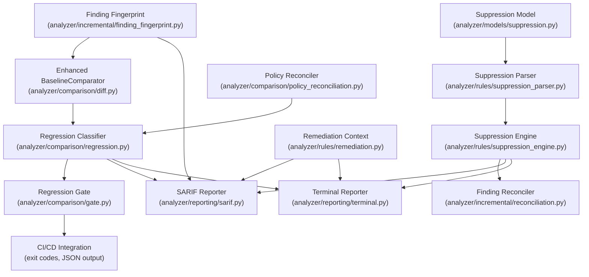

# PHASE 25 IMPLEMENTATION PLAN — Security Regression Classification, Finding Lifecycle & Developer Remediation Intelligence

## 1. Executive Summary

Phase 25 evolves CodeSentinel from a system that **detects, explains, and verifies** security policy obligations into one that also **tracks finding lifecycles across code and policy changes, classifies security regressions, models suppressions, and provides structured remediation intelligence** to developers and CI/CD pipelines.

Prior phases established:
- **Phase 9**: Deterministic baseline comparison (`BaselineComparator`) with four-tier signature matching (`exact_signature`, `fuzzy_snippet`, `fuzzy_location`, `id`) and four transition states (`NEW`, `RESOLVED`, `UNCHANGED`, `MODIFIED`).
- **Phase 21**: Incremental analysis with `FindingReconciler`, file fingerprinting, impact sets, and four finding reconciliation states (`REUSED`, `RECOMPUTED`, `NEW`, `RESOLVED`).
- **Phase 23**: Declarative security policies (`SecurityPolicy`, `SecurityPolicyRegistry`), trust boundary semantics, authentication/authorization state machines, and framework-aware adapters.
- **Phase 24**: Policy proof obligations (`PolicyProofObligation`, `ObligationEvaluationState`), fine-grained `policy_hash`/`framework_model_hash` cache isolation, and structured verification diagnostics.

However, several critical lifecycle gaps remain:

1. **No unified finding identity**: Finding `id` is a random UUID assigned at creation time. Across analysis runs, findings are matched heuristically by the `BaselineComparator` (rule_id + path + line + snippet). There is no **stable, content-addressable fingerprint** that persists across runs and survives line shifts, minor refactors, and branch merges.
2. **No suppression model**: Developers cannot suppress findings (inline `@suppress`, config exclusion, or time-bounded deferral). All findings are always emitted; there is no mechanism to distinguish "acknowledged and deferred" from "unknown".
3. **No regression classification**: Phase 9's `FindingTransition` has only four states. It cannot distinguish between a `NEW` finding that is a genuine security regression vs. one introduced by a policy change, a config change, or a framework model update. CI gates cannot act on this distinction.
4. **No finding reconciliation across policy changes**: When a policy is added, removed, or tightened, all findings affected by that policy appear as `NEW` or `RESOLVED` in baseline comparison, even though the underlying code hasn't changed. This creates noisy, unactionable diffs.
5. **No remediation context**: Findings include static `remediation` text from `RuleDefinition` but no contextual remediation tailored to the specific finding's evidence chain, obligation state, or framework context.
6. **No lifecycle persistence**: The analyzer emits findings transiently. Neither the analyzer nor the backend tracks historical finding state transitions, suppression history, or remediation attempts.

Phase 25 addresses all six gaps while preserving CodeSentinel's core invariants:
- **100% offline, deterministic, zero-AI in `analyzer/`**
- **No external service dependencies**
- **No database migrations** (backend schema changes are additive-only at the API serialization layer)
- **Backward-compatible API and SARIF output**

### Central Model

```
Code Change ─┐
              ├─► Analysis ─► Policy Proof Obligations ─► Finding Fingerprinting
Policy Change ┘                                                    │
                                                                   ▼
                                               Finding Reconciliation Engine
                                                    │
                                     ┌──────────────┼──────────────┐
                                     ▼              ▼              ▼
                            Regression         Lifecycle        Suppression
                          Classification       Tracking          Model
                                     │              │              │
                                     └──────────────┼──────────────┘
                                                    ▼
                                          Developer Remediation
                                              Context
                                                    │
                                                    ▼
                                     CLI / API / SARIF / Frontend
```

---

## 2. Repository Audit — Phase 24 Ground Truth

### 2.1 Test Suite Baseline

| Domain | Test Files | Test Count |
|--------|-----------|------------|
| Analyzer (`analyzer/tests/`) | 95+ test files | ~640 tests |
| Backend (`backend/tests/`) | 42 test files | ~111 tests |
| **Total** | **137+ test files** | **~751 tests** |

- **Execution status**: 751 passed, 1 skipped (`test_git_sparse_checkout`), 0 failures.
- **Phase 24 dedicated tests**: 27 tests across 8 test suites:
  - `test_phase24_proof_obligations.py` (6 tests)
  - `test_phase24_auth_authz_separation.py` (4 tests)
  - `test_phase24_validation_provenance.py` (4 tests)
  - `test_phase24_incremental_policy_invalidation.py` (3 tests)
  - `test_phase24_express_detection.py` (3 tests)
  - `test_phase24_sanitizer_matrix.py` (3 tests)
  - `test_phase24_integration.py` (3 tests)
  - `backend/tests/test_phase24_api_backward_compat.py` (1 test)

### 2.2 Active Rule Registry

- **31 active rules**: 9 architecture (`ARC-001`..`ARC-009`), 10 JavaScript security (`SEC-JS-001`..`SEC-JS-010`), 12 Python security (`SEC-PY-001`..`SEC-PY-012`).
- **5 active policies**: `POL-SQL-01`, `POL-CMD-01`, `POL-DOM-01`, `POL-EVAL-01`, `POL-AUTHZ-01`.

### 2.3 Incremental Cache Architecture (9 Layers + 2 Scoped Hashes)

| Layer | Scope | Fingerprint |
|-------|-------|-------------|
| L1 | File metadata & hash | `FileFingerprint.content_hash` |
| L2 | AST / ParsedFile | `parsing_hash` |
| L3 | Dependency graph | `dependency_hash` |
| L4 | CFG & guard conditions | `cfg_dataflow_hash` |
| L5 | Intraprocedural taint | `cfg_dataflow_hash` |
| L6 | Interprocedural call graph | `callgraph_hash` |
| L7 | Function contracts | `contract_hash` |
| L8 | Contract composition | `composition_hash` |
| L9 | Rule findings & evidence | `rules_hash` |
| Policy | Policy invariants | `policy_hash` (Phase 24) |
| Framework | Framework models | `framework_model_hash` (Phase 24) |

### 2.4 Existing Comparison & Reconciliation Infrastructure

#### `analyzer/comparison/diff.py` — `BaselineComparator`
- Compares `AnalysisResult` pairs using four-tier signature matching.
- Outputs `DifferentialFinding` with `FindingTransition` ∈ {`NEW`, `RESOLVED`, `UNCHANGED`, `MODIFIED`}.
- Produces `ComparisonSummary`, `HealthDelta`, `ComponentGraphDelta`.
- **Gap**: No awareness of policy changes, suppression states, or regression provenance.

#### `analyzer/incremental/reconciliation.py` — `FindingReconciler`
- Reconciles cached findings against freshly computed findings during incremental analysis.
- States: `REUSED`, `RECOMPUTED`, `NEW`, `RESOLVED`.
- **Gap**: Reconciliation is file-scope only. Does not consider policy-scoped or rule-scoped invalidation.

#### `analyzer/models/comparison.py` — `FindingTransition`
- `NEW`, `RESOLVED`, `UNCHANGED`, `MODIFIED`.
- **Gap**: No `SUPPRESSED`, `REOPENED`, `POLICY_INDUCED`, `DEFERRED` states.

### 2.5 Finding Identity Gap

- `Finding.id` is `uuid.uuid4()` — non-deterministic, changes on every analysis run.
- `BaselineComparator` matches by `(rule_id, path, line, snippet)` — fragile to line shifts and snippet whitespace changes.
- No canonical, content-addressable fingerprint that survives across runs.

### 2.6 Policy-Finding Coupling Gap

- `SecurityPolicy.evaluate()` returns `PolicyEvaluationOutcome` with obligations, but the outcome is not attached to finding identity.
- When a policy changes (e.g., `POL-SQL-01` adds a new `required_security_property`), all findings re-evaluated against that policy appear as `NEW` in `BaselineComparator` because their obligation state changed — even though the code is identical.

---

## 3. Phase 24 Verification

Verified against the actual repository:

| Capability | Verification |
|-----------|-------------|
| `PolicyProofObligation` model | ✅ `analyzer/models/obligation.py` — `ObligationKind` (6 variants), `ObligationEvaluationState` (3 states), frozen Pydantic model |
| `SecurityPolicy.generate_proof_obligations()` | ✅ `analyzer/rules/policy.py:72-119` — generates unfilled obligations |
| `SecurityPolicy.evaluate()` | ✅ `analyzer/rules/policy.py:121-272` — returns `PolicyEvaluationOutcome` with obligations |
| Auth/Authz independence | ✅ `evaluate()` checks authentication and authorization independently; `REQUIRES_AUTHENTICATION` ≠ `REQUIRES_AUTHORIZATION` |
| `policy_hash` in `ConfigFingerprint` | ✅ `analyzer/incremental/config_fingerprint.py:161-169` — dedicated scope |
| `framework_model_hash` in `ConfigFingerprint` | ✅ `analyzer/incremental/config_fingerprint.py:171-176` — dedicated scope |
| Evidence chain enrichment | ✅ `analyzer/models/evidence.py:161-163` — `proof_obligations` and `unknown_reasons` fields |
| Express framework detection | ✅ Tests in `test_phase24_express_detection.py` |
| Sanitizer category matrix | ✅ Tests in `test_phase24_sanitizer_matrix.py` |
| API backward compatibility | ✅ `backend/tests/test_phase24_api_backward_compat.py` |

---

## 4. Phase 25 Design — Finding Lifecycle & Regression Intelligence

### 4.1 Stable Finding Fingerprint

#### Problem
`Finding.id` is a random UUID. Across analysis runs, the same logical finding gets different `id` values. Matching relies on heuristic signature matching in `BaselineComparator`, which breaks on line shifts, snippet changes, and cross-branch merges.

#### Solution: Content-Addressable Finding Fingerprint

Introduce a deterministic, content-addressable fingerprint for every finding that is **stable across runs** and **survives minor code changes**.

**New module**: `analyzer/incremental/finding_fingerprint.py`

```python
class FindingFingerprint:
    """Deterministic, content-addressable identity for a security/architecture finding."""
    
    # Primary fingerprint: stable across line shifts
    primary_hash: str      # SHA-256 of (rule_id, normalized_path, normalized_snippet)
    
    # Secondary fingerprint: incorporates location for disambiguation
    location_hash: str     # SHA-256 of (rule_id, normalized_path, line_start, col_start)
    
    # Composite fingerprint: combines primary + policy context
    composite_hash: str    # SHA-256 of (primary_hash, policy_id?, obligation_states?)
    
    # Human-readable stable ID: "CS-{rule_id}-{primary_hash[:12]}"
    stable_id: str
```

**Fingerprinting algorithm**:
1. Normalize `file_path` using `normalize_relative_path()` (forward-slash, lowercase, no leading/trailing slashes).
2. Normalize `code_snippet` by collapsing whitespace (existing `_norm_snippet()` from `comparison/diff.py`).
3. Compute `primary_hash = SHA256(rule_id + ":" + norm_path + ":" + norm_snippet)`.
4. Compute `location_hash = SHA256(rule_id + ":" + norm_path + ":" + str(line_start) + ":" + str(col_start))`.
5. If the finding has associated policy obligations, compute `composite_hash = SHA256(primary_hash + ":" + sorted_obligation_kinds)`.
6. Generate `stable_id = f"CS-{rule_id}-{primary_hash[:12]}"`.

**Integration point**: `Finding` model gains an **optional** `fingerprint` field (backward-compatible):
```python
class Finding(BaseModel):
    # ... existing fields ...
    fingerprint: Optional[FindingFingerprint] = None
```

**Matching upgrade**: `BaselineComparator.compare()` gains a Tier 0 match step:
1. **Tier 0**: Stable fingerprint match (`primary_hash` equality) → `UNCHANGED` or `MODIFIED` (if location changed).
2. Existing Tier 1–4 remain as fallbacks for findings without fingerprints.

### 4.2 Extended Finding Lifecycle State Machine

#### Problem
`FindingTransition` has only 4 states. It cannot model suppressions, policy-induced changes, reopened findings, or deferred resolutions.

#### Solution: `FindingLifecycleState` Enum

**New enum** in `analyzer/models/comparison.py`:

```python
class FindingLifecycleState(str, Enum):
    """Extended lifecycle state of a finding across analysis runs."""
    
    # Core transitions (backward-compatible with FindingTransition)
    NEW = "NEW"                          # First appearance in current run
    RESOLVED = "RESOLVED"                # Present in baseline, absent in current
    UNCHANGED = "UNCHANGED"              # Identical across runs
    MODIFIED = "MODIFIED"                # Same logical finding, location/snippet shifted
    
    # Suppression states
    SUPPRESSED = "SUPPRESSED"            # Actively suppressed by developer
    DEFERRED = "DEFERRED"               # Suppressed with expiration date
    REOPENED = "REOPENED"               # Previously suppressed, suppression expired or revoked
    
    # Policy-induced states
    POLICY_INDUCED_NEW = "POLICY_INDUCED_NEW"     # New finding due to policy addition/tightening
    POLICY_INDUCED_RESOLVED = "POLICY_INDUCED_RESOLVED"  # Resolved due to policy removal/relaxation
    
    # Regression classification
    REGRESSION = "REGRESSION"            # Confirmed security regression (new finding in changed code)
    PERSISTENT = "PERSISTENT"            # Finding persists across code changes (unchanged code region)
```

**Backward compatibility**: `FindingTransition` remains unchanged. `FindingLifecycleState` is a superset used only in the new lifecycle-aware comparison engine.

### 4.3 Suppression Model

#### Problem
No mechanism for developers to mark findings as acknowledged, deferred, or false-positive. Every finding is always emitted.

#### Solution: `FindingSuppression` Model

**New module**: `analyzer/models/suppression.py`

```python
class SuppressionKind(str, Enum):
    """Classification of finding suppression mechanism."""
    INLINE_ANNOTATION = "INLINE_ANNOTATION"    # Source code comment: # codesentinel-suppress SEC-PY-005
    CONFIG_EXCLUSION = "CONFIG_EXCLUSION"       # .codesentinel.yaml rule exclusion
    TIMED_DEFERRAL = "TIMED_DEFERRAL"          # Deferred until expiration date
    FALSE_POSITIVE = "FALSE_POSITIVE"          # Marked as confirmed false positive

class SuppressionScope(str, Enum):
    """Granularity of the suppression target."""
    FINDING = "FINDING"        # Specific finding by fingerprint
    RULE = "RULE"              # All findings from a specific rule ID
    FILE = "FILE"              # All findings in a specific file
    RULE_IN_FILE = "RULE_IN_FILE"  # Specific rule in a specific file

class FindingSuppression(BaseModel):
    """A developer-specified suppression of one or more findings."""
    suppression_id: str
    kind: SuppressionKind
    scope: SuppressionScope
    target_rule_id: Optional[str] = None
    target_file_path: Optional[str] = None
    target_fingerprint: Optional[str] = None    # primary_hash of target finding
    reason: str = ""
    author: Optional[str] = None
    created_at: datetime
    expires_at: Optional[datetime] = None       # For TIMED_DEFERRAL
    is_active: bool = True
```

**Inline suppression parser**: New module `analyzer/rules/suppression_parser.py` that scans source files for inline annotations during the parsing phase:

```
# codesentinel-suppress SEC-PY-005 reason="Parameterized in ORM layer"
# codesentinel-suppress SEC-PY-005 until=2025-12-31
// codesentinel-suppress SEC-JS-003 reason="Sanitized by DOMPurify upstream"
```

**Config-based suppression**: Extension to `RepoConfig` (`.codesentinel.yaml`):

```yaml
suppressions:
  - rule_id: SEC-PY-005
    file: "legacy/migrations.py"
    reason: "Legacy migration code, will be removed in Q1"
    expires: "2025-12-31"
  - rule_id: SEC-JS-003
    scope: RULE
    reason: "React app uses sanitized markdown renderer"
```

**Suppression lifecycle**:
1. During analysis, `SuppressionParser` collects all active suppressions from source annotations and config.
2. After finding emission, the **SuppressionEngine** matches findings against suppressions using fingerprints, rule IDs, and file paths.
3. Matched findings are tagged with `FindingLifecycleState.SUPPRESSED` or `DEFERRED` (if `expires_at` is set).
4. On subsequent runs, if a suppression has expired, the finding transitions from `DEFERRED` → `REOPENED`.

### 4.4 Security Regression Classification Engine

#### Problem
Phase 9's `BaselineComparator` labels all newly introduced findings as `NEW`. It cannot distinguish:
- A finding in **changed code** (genuine regression) from one in **unchanged code** (pre-existing, missed by previous config).
- A finding caused by **code change** vs. **policy change** vs. **config change**.

#### Solution: `RegressionClassifier`

**New module**: `analyzer/comparison/regression.py`

```python
class RegressionCause(str, Enum):
    """Root cause classification for new or changed findings."""
    CODE_CHANGE = "CODE_CHANGE"           # Finding in modified/added source file
    POLICY_CHANGE = "POLICY_CHANGE"       # Finding due to policy addition/tightening
    CONFIG_CHANGE = "CONFIG_CHANGE"       # Finding due to analysis config change
    RULE_CHANGE = "RULE_CHANGE"           # Finding due to new/modified rule
    FRAMEWORK_CHANGE = "FRAMEWORK_CHANGE" # Finding due to framework model update
    PRE_EXISTING = "PRE_EXISTING"         # Finding in unchanged code, previously undetected
    UNKNOWN = "UNKNOWN"

class RegressionSeverity(str, Enum):
    """Urgency classification for regression findings."""
    BLOCKING = "BLOCKING"       # Must fix before merge (CRITICAL/HIGH in changed code)
    ACTIONABLE = "ACTIONABLE"   # Should fix soon (MEDIUM in changed code)
    ADVISORY = "ADVISORY"       # Informational (LOW/INFO, or policy-induced)
    DEFERRED = "DEFERRED"       # Suppressed or deferred

class RegressionClassification(BaseModel):
    """Rich regression metadata attached to a differential finding."""
    cause: RegressionCause
    severity: RegressionSeverity
    is_in_changed_code: bool
    changed_file_path: Optional[str] = None
    policy_id: Optional[str] = None        # If POLICY_CHANGE
    config_scope: Optional[str] = None     # If CONFIG_CHANGE (e.g., "rules_hash")
    explanation: str = ""
```

**Classification algorithm** (in `RegressionClassifier.classify()`):

For each `DifferentialFinding` with `transition == NEW`:

1. **Changed code check**: Is `finding.location.file_path` in the `ImpactSet.directly_changed_files` or `ImpactSet.affected_files`?
   - Yes → `is_in_changed_code = True`.
   - No → `is_in_changed_code = False`.

2. **Policy change check**: Did `policy_hash` change between baseline and current `ConfigFingerprint`?
   - Yes → Check if the finding's associated policy (via `obligation.policy_id`) was added or tightened.
   - If so → `cause = POLICY_CHANGE`, `severity = ADVISORY`.

3. **Config change check**: Did `rules_hash` or `cfg_dataflow_hash` change?
   - Yes, and code unchanged → `cause = CONFIG_CHANGE`, `severity = ADVISORY`.

4. **Framework change check**: Did `framework_model_hash` change?
   - Yes, and code unchanged → `cause = FRAMEWORK_CHANGE`, `severity = ADVISORY`.

5. **Code regression check**: If `is_in_changed_code` and no policy/config/framework change:
   - `cause = CODE_CHANGE`.
   - `severity = BLOCKING` if `finding.severity ∈ {CRITICAL, HIGH}`.
   - `severity = ACTIONABLE` if `finding.severity == MEDIUM`.
   - `severity = ADVISORY` if `finding.severity ∈ {LOW, INFO}`.

6. **Pre-existing check**: If `is_in_changed_code == False` and no config/policy/framework change:
   - `cause = PRE_EXISTING`, `severity = ADVISORY`.
   - This covers newly detected patterns that were always in the code but only now surfaced.

**Integration**: `RegressionClassification` is added as an optional field on `DifferentialFinding`:

```python
class DifferentialFinding(BaseModel):
    finding: Finding
    transition: FindingTransition
    baseline_finding_id: Optional[str] = None
    match_method: Optional[str] = None
    detail: Optional[str] = None
    # Phase 25 extensions (additive, backward-compatible)
    lifecycle_state: Optional[FindingLifecycleState] = None
    regression: Optional[RegressionClassification] = None
    suppression: Optional[FindingSuppression] = None
```

### 4.5 Policy-Aware Finding Reconciliation

#### Problem
When policies change between runs (added, removed, tightened, relaxed), the `BaselineComparator` generates noisy `NEW`/`RESOLVED` transitions for unchanged code.

#### Solution: `PolicyAwareReconciler`

**New module**: `analyzer/comparison/policy_reconciliation.py`

**Reconciliation rules**:

| Baseline Policy | Current Policy | Code Changed? | Transition |
|----------------|----------------|---------------|------------|
| Exists | Same | No | `UNCHANGED` |
| Exists | Same | Yes | Normal comparison |
| Exists | Tightened | No | `POLICY_INDUCED_NEW` (for new violations) |
| Exists | Relaxed | No | `POLICY_INDUCED_RESOLVED` (for resolved violations) |
| Not exists | Added | No | `POLICY_INDUCED_NEW` |
| Exists | Removed | No | `POLICY_INDUCED_RESOLVED` |
| Exists | Same enforcement mode | No | `UNCHANGED` |
| Exists | ENFORCE → ADVISORY | No | `POLICY_INDUCED_RESOLVED` (demoted to informational) |
| Exists | ADVISORY → ENFORCE | No | `POLICY_INDUCED_NEW` (promoted to enforcement) |

**Algorithm**:
1. Extract `policy_hash` from both baseline and current `ConfigFingerprint`.
2. If `policy_hash` is identical, skip policy reconciliation (standard comparison).
3. If `policy_hash` differs, compute a **policy diff** by comparing registered policies:
   - `added_policies = current_policies - baseline_policies`
   - `removed_policies = baseline_policies - current_policies`
   - `changed_policies = {p for p in common if p.version != baseline_p.version or p.enforcement_mode != baseline_p.enforcement_mode or p.required_security_properties != baseline_p.required_security_properties}`
4. For each `NEW` finding, check if its associated `policy_id` is in `added_policies` or `changed_policies`.
5. Tag appropriately with `FindingLifecycleState.POLICY_INDUCED_NEW`.
6. For each `RESOLVED` finding, check if its associated `policy_id` is in `removed_policies` or `changed_policies`.
7. Tag with `FindingLifecycleState.POLICY_INDUCED_RESOLVED`.

### 4.6 Developer Remediation Context Engine

#### Problem
Findings include static `remediation` text from `RuleDefinition` (e.g., "Use parameterized queries"). This is generic and doesn't account for:
- The specific framework in use.
- The specific obligation state (`PROVEN_VIOLATION` vs. `UNKNOWN`).
- The specific sanitizer that was applied but was category-incompatible.
- The specific evidence chain showing how tainted data reached the sink.

#### Solution: `RemediationContextBuilder`

**New module**: `analyzer/rules/remediation.py`

```python
class RemediationContext(BaseModel):
    """Rich, contextual remediation guidance for a specific finding instance."""
    
    # Static guidance (from RuleDefinition)
    static_remediation: str
    
    # Framework-specific guidance
    framework_guidance: Optional[str] = None    # e.g., "In Flask, use db.session.execute(text(...), params)"
    framework: Optional[str] = None
    
    # Obligation-specific guidance
    obligation_guidance: list[str] = []          # Per-obligation remediation steps
    
    # Evidence-based guidance
    evidence_guidance: Optional[str] = None      # e.g., "Taint flows from request.args['id'] at line 15 through build_query() at line 23 to cursor.execute() at line 31"
    
    # Sanitizer suggestion
    suggested_sanitizers: list[str] = []         # e.g., ["shlex.quote", "int()", "Literal()"]
    incompatible_sanitizer_warning: Optional[str] = None  # e.g., "html.escape() is not effective against SQL injection"
    
    # Priority and effort
    estimated_effort: str = "UNKNOWN"            # "TRIVIAL", "MODERATE", "SIGNIFICANT"
    fix_pattern: Optional[str] = None            # e.g., "PARAMETERIZE_QUERY", "ADD_AUTH_DECORATOR"
```

**Remediation template registry**: Each `SecurityPolicy` and framework adapter contributes remediation templates:

```python
REMEDIATION_TEMPLATES = {
    ("POL-SQL-01", "FLASK"): "In Flask, replace raw string formatting with `db.session.execute(text(':param'), {'param': value})`.",
    ("POL-SQL-01", "DJANGO"): "In Django, use the ORM `.filter()` API or `connection.cursor().execute(sql, [params])`.",
    ("POL-CMD-01", None): "Use `subprocess.run([cmd, arg1, arg2], shell=False)` with explicit argument lists.",
    ("POL-DOM-01", "REACT"): "Avoid `dangerouslySetInnerHTML`. Use `DOMPurify.sanitize()` or render text content directly.",
}
```

**Context building algorithm** (in `RemediationContextBuilder.build()`):
1. Start with `finding.remediation` (static guidance from `RuleDefinition`).
2. Look up framework-specific template for `(policy_id, framework)`.
3. For each proof obligation with `state == PROVEN_VIOLATION`:
   - Generate obligation-specific guidance: "This endpoint requires authentication but none was detected. Add `@login_required` (Flask) or `@authentication_classes` (Django REST)."
4. If evidence chain has `sanitizer_evaluation` with `is_category_compatible == False`:
   - Generate warning: "The applied sanitizer `html.escape()` protects against XSS but is not effective against SQL injection. Use `psycopg2.sql.Literal()` or parameterized queries instead."
5. If evidence chain has a complete taint path:
   - Summarize: "Tainted data originates from `request.args['q']` (line 15), flows through `build_query()` (line 23), and reaches `cursor.execute()` (line 31) without parameterization."
6. Estimate effort from fix pattern.

### 4.7 SARIF v2.1.0 Lifecycle Extensions

#### Problem
Current SARIF output does not include suppression states, regression classifications, or lifecycle metadata.

#### Solution: SARIF Suppression and Baseline Properties

The SARIF v2.1.0 spec natively supports:
- `result.suppressions[]` — array of `suppression` objects with `kind` (`inSource`, `external`) and `status` (`accepted`, `underReview`, `rejected`).
- `result.baselineState` — `new`, `unchanged`, `updated`, `absent`.
- `result.properties` — property bag for custom extensions.

**SARIF extension mapping**:

| Phase 25 Concept | SARIF Field |
|-----------------|-------------|
| `FindingLifecycleState.SUPPRESSED` | `result.suppressions[0].kind = "inSource"` |
| `FindingLifecycleState.DEFERRED` | `result.suppressions[0].kind = "external"` + `properties.expiresAt` |
| `FindingLifecycleState.NEW` | `result.baselineState = "new"` |
| `FindingLifecycleState.RESOLVED` | `result.baselineState = "absent"` |
| `FindingLifecycleState.UNCHANGED` | `result.baselineState = "unchanged"` |
| `FindingLifecycleState.MODIFIED` | `result.baselineState = "updated"` |
| `RegressionClassification` | `result.properties.regressionCause`, `result.properties.regressionSeverity` |
| `RemediationContext` | `result.fixes[]` + `result.properties.remediationContext` |
| `FindingFingerprint.stable_id` | `result.correlationGuid` |
| `FindingFingerprint.primary_hash` | `result.fingerprints["primaryHash/v1"]` |

### 4.8 CI/CD Regression Gate Model

#### Problem
CI pipelines need machine-readable, policy-aware pass/fail signals. Currently, `fail_on_severity` in `AnalysisConfig` fails on any finding above a threshold regardless of lifecycle state.

#### Solution: `RegressionGatePolicy`

**New module**: `analyzer/comparison/gate.py`

```python
class GateVerdict(str, Enum):
    PASS = "PASS"
    FAIL = "FAIL"
    WARN = "WARN"

class RegressionGatePolicy(BaseModel):
    """CI/CD gate policy for security regression checks."""
    fail_on_new_critical: bool = True
    fail_on_new_high: bool = True
    fail_on_new_medium: bool = False
    ignore_policy_induced: bool = True       # Don't fail on POLICY_INDUCED_NEW
    ignore_pre_existing: bool = True         # Don't fail on PRE_EXISTING
    ignore_suppressed: bool = True           # Don't fail on SUPPRESSED/DEFERRED
    max_new_findings: Optional[int] = None   # Absolute threshold
    max_new_security_findings: Optional[int] = None

class RegressionGateResult(BaseModel):
    """Verdict of a regression gate evaluation."""
    verdict: GateVerdict
    blocking_findings: list[DifferentialFinding] = []
    advisory_findings: list[DifferentialFinding] = []
    suppressed_findings: list[DifferentialFinding] = []
    summary: str = ""
```

**Gate evaluation algorithm**:
1. Filter `DifferentialFinding` list to `transition == NEW` or `lifecycle_state == REGRESSION`.
2. Exclude `POLICY_INDUCED_NEW` if `ignore_policy_induced`.
3. Exclude `PRE_EXISTING` if `ignore_pre_existing`.
4. Exclude `SUPPRESSED` / `DEFERRED` if `ignore_suppressed`.
5. Check remaining findings against severity thresholds.
6. Produce `GateVerdict.FAIL` if any blocking finding exists.

### 4.9 Incremental Cache — Finding Lifecycle Scope

#### Problem
When a suppression is added or removed, the entire L9 (findings) cache is invalidated because the finding results change. This is over-broad.

#### Solution: `suppression_hash` in `ConfigFingerprint`

Add a new scoped hash `suppression_hash` to `ConfigFingerprint`:

```python
# 12. Phase 25 Suppression Scope
suppression_payload = {
    "config_suppressions": sorted_config_suppressions,  # From .codesentinel.yaml
    "inline_suppression_syntax": "codesentinel-suppress",
}
suppression_hash = canonical_json_digest(suppression_payload)
```

**Invalidation rules**:
- `suppression_hash` change → invalidate L9 (findings) only.
- L1–L8 remain valid.
- Inline suppressions (source comments) are content-dependent and already captured by L1 `content_hash`.

### 4.10 Enhanced Comparison Summary

Extend `ComparisonSummary` with lifecycle-aware counters:

```python
class ComparisonSummary(BaseModel):
    # ... existing fields ...
    
    # Phase 25 lifecycle counters (additive, backward-compatible)
    suppressed_count: int = Field(default=0, ge=0)
    deferred_count: int = Field(default=0, ge=0)
    reopened_count: int = Field(default=0, ge=0)
    policy_induced_new_count: int = Field(default=0, ge=0)
    policy_induced_resolved_count: int = Field(default=0, ge=0)
    regression_count: int = Field(default=0, ge=0)
    pre_existing_count: int = Field(default=0, ge=0)
    
    # Regression gate summary
    gate_verdict: Optional[str] = None    # "PASS", "FAIL", "WARN"
    blocking_count: int = Field(default=0, ge=0)
```

---

## 5. File-Level Implementation Plan

### 5.1 New Files

| File | Domain | Description |
|------|--------|-------------|
| `analyzer/incremental/finding_fingerprint.py` | Analyzer | Stable, content-addressable finding fingerprint computation |
| `analyzer/models/suppression.py` | Analyzer | `FindingSuppression`, `SuppressionKind`, `SuppressionScope` models |
| `analyzer/rules/suppression_parser.py` | Analyzer | Inline annotation parser (`# codesentinel-suppress`) |
| `analyzer/rules/suppression_engine.py` | Analyzer | Suppression matching engine against findings |
| `analyzer/comparison/regression.py` | Analyzer | `RegressionClassifier`, `RegressionCause`, `RegressionSeverity`, `RegressionClassification` |
| `analyzer/comparison/policy_reconciliation.py` | Analyzer | Policy-aware finding reconciliation across policy changes |
| `analyzer/comparison/gate.py` | Analyzer | `RegressionGatePolicy`, `RegressionGateResult`, CI gate evaluation |
| `analyzer/rules/remediation.py` | Analyzer | `RemediationContextBuilder`, `RemediationContext`, framework-specific templates |
| `analyzer/tests/test_phase25_finding_fingerprint.py` | Tests | Finding fingerprint stability and cross-run matching |
| `analyzer/tests/test_phase25_lifecycle_states.py` | Tests | Extended lifecycle state machine transitions |
| `analyzer/tests/test_phase25_suppression_model.py` | Tests | Suppression model validation, expiration, scope matching |
| `analyzer/tests/test_phase25_suppression_parser.py` | Tests | Inline annotation parsing (Python `#`, JS `//`) |
| `analyzer/tests/test_phase25_regression_classifier.py` | Tests | Regression cause and severity classification |
| `analyzer/tests/test_phase25_policy_reconciliation.py` | Tests | Policy-induced transition classification |
| `analyzer/tests/test_phase25_regression_gate.py` | Tests | Gate policy evaluation and verdict |
| `analyzer/tests/test_phase25_remediation_context.py` | Tests | Contextual remediation builder |
| `analyzer/tests/test_phase25_integration.py` | Tests | End-to-end lifecycle and regression pipeline |
| `backend/tests/test_phase25_api_backward_compat.py` | Tests | API schema backward compatibility |

### 5.2 Modified Files

| File | Change | Scope |
|------|--------|-------|
| `analyzer/models/findings.py` | Add optional `fingerprint: Optional[FindingFingerprint]` field | Additive |
| `analyzer/models/comparison.py` | Add `FindingLifecycleState` enum; extend `DifferentialFinding` with `lifecycle_state`, `regression`, `suppression` fields; extend `ComparisonSummary` with lifecycle counters | Additive |
| `analyzer/comparison/diff.py` | Add Tier 0 fingerprint matching in `BaselineComparator.compare()` | Enhancement |
| `analyzer/incremental/reconciliation.py` | Extend `FindingReconciler` with suppression-aware reconciliation | Enhancement |
| `analyzer/incremental/config_fingerprint.py` | Add `suppression_hash` scope | Additive |
| `analyzer/incremental/models.py` | Add `suppression_hash` to `ConfigFingerprint`; extend `FindingReconciliationState` with `SUPPRESSED` | Additive |
| `analyzer/reporting/sarif.py` | Emit `result.suppressions[]`, `result.baselineState`, `result.correlationGuid`, `result.fingerprints`, `result.properties.regressionCause` | Enhancement |
| `analyzer/reporting/terminal.py` | Display lifecycle state, suppression status, regression severity in CLI output | Enhancement |
| `analyzer/reporting/json_reporter.py` | Include lifecycle and regression metadata in JSON output | Enhancement |
| `analyzer/reporting/markdown_reporter.py` | Include regression summary table and suppression section | Enhancement |
| `analyzer/rules/engine.py` | Invoke `FindingFingerprintComputer` after finding emission | Enhancement |
| `analyzer/config/repo_config.py` | Add `suppressions` list to `RepoConfig` | Additive |
| `analyzer/config/settings.py` | Add `enable_suppression_parsing`, `enable_regression_classification`, `gate_policy` settings | Additive |

### 5.3 Frontend Changes (Additive Only)

| Area | Change |
|------|--------|
| Finding list | Add lifecycle state badge (color-coded: green=RESOLVED, red=REGRESSION, yellow=SUPPRESSED, blue=POLICY_INDUCED) |
| Finding drawer | Show regression classification, suppression status, and remediation context |
| Comparison view | Show regression gate verdict banner and lifecycle transition breakdown chart |
| Filter controls | Add lifecycle state filter and regression cause filter |

---

## 6. Test Plan

### 6.1 Test Inventory

| Test File | Test Count | Focus |
|-----------|-----------|-------|
| `test_phase25_finding_fingerprint.py` | 6 | Fingerprint stability, normalization, cross-run identity |
| `test_phase25_lifecycle_states.py` | 5 | State enum coverage, backward compatibility with `FindingTransition` |
| `test_phase25_suppression_model.py` | 5 | Suppression creation, scope matching, expiration |
| `test_phase25_suppression_parser.py` | 5 | Python `#`, JS `//`, multi-rule, `until=` parsing |
| `test_phase25_regression_classifier.py` | 6 | All `RegressionCause` variants, severity mapping |
| `test_phase25_policy_reconciliation.py` | 5 | Policy add/remove/tighten/relax transitions |
| `test_phase25_regression_gate.py` | 5 | Gate policy pass/fail/warn, threshold enforcement |
| `test_phase25_remediation_context.py` | 5 | Framework-specific, obligation-specific, evidence-based context |
| `test_phase25_integration.py` | 4 | Full pipeline: fingerprint → comparison → regression → gate |
| `test_phase25_api_backward_compat.py` | 3 | API schema stability with new optional fields |
| **Total** | **49** | |

### 6.2 Test Design Principles

1. **Determinism**: Every test produces identical output across platforms. No randomness, no I/O, no filesystem dependencies (except mocked fixtures).
2. **Isolation**: Each test file is self-contained. No cross-file test dependencies.
3. **Backward compatibility**: All new fields are optional with defaults. Existing tests must pass without modification.
4. **Boundary testing**: Test edge cases for fingerprint collisions, suppression scope overlaps, and ambiguous regression classifications.

### 6.3 Key Test Scenarios

#### Finding Fingerprint Stability
```python
def test_fingerprint_stable_across_runs():
    """Same finding in two separate analysis runs produces identical primary_hash."""

def test_fingerprint_survives_line_shift():
    """Moving a finding down 3 lines (without changing snippet) produces same primary_hash."""

def test_fingerprint_changes_on_rule_change():
    """Different rule_id produces different primary_hash even with same location."""

def test_fingerprint_normalization():
    """Windows backslash paths and extra whitespace in snippet produce same fingerprint."""
```

#### Regression Classification
```python
def test_code_change_regression():
    """Finding in modified file → REGRESSION with CODE_CHANGE cause."""

def test_policy_induced_new():
    """New finding in unchanged code when policy_hash differs → POLICY_INDUCED_NEW."""

def test_pre_existing_finding():
    """New finding in unchanged code with unchanged config → PRE_EXISTING."""

def test_regression_severity_mapping():
    """CRITICAL finding in changed code → BLOCKING severity."""
```

#### Suppression Lifecycle
```python
def test_inline_suppression_python():
    """# codesentinel-suppress SEC-PY-005 → finding transitions to SUPPRESSED."""

def test_timed_deferral_expiration():
    """Suppression with expired `until=` date → finding transitions to REOPENED."""

def test_suppression_scope_rule_in_file():
    """Config suppression targeting rule+file → only matching findings suppressed."""
```

#### Gate Evaluation
```python
def test_gate_fails_on_critical_regression():
    """New CRITICAL finding in changed code → FAIL verdict."""

def test_gate_passes_on_policy_induced():
    """POLICY_INDUCED_NEW finding with ignore_policy_induced=True → PASS."""

def test_gate_respects_suppression():
    """Suppressed CRITICAL finding → ignored in gate evaluation."""
```

---

## 7. Constraint Verification

| Constraint | Compliance |
|-----------|-----------|
| **Offline-only** | ✅ No external service calls. All analysis, fingerprinting, regression classification, and remediation context generation are local computations. |
| **Deterministic** | ✅ Finding fingerprints use SHA-256 of normalized content. Regression classification is rule-based. No randomness. |
| **Zero-AI in `analyzer/`** | ✅ No LLM invocations. Remediation context uses static template registry. |
| **No database migrations** | ✅ Backend changes are additive optional fields in API serialization only. |
| **Backward-compatible API** | ✅ All new fields have defaults. Existing API consumers see no breaking changes. |
| **Backward-compatible SARIF** | ✅ New SARIF fields (`suppressions`, `baselineState`, `fingerprints`) are valid SARIF v2.1.0 properties. |
| **Analyzer isolation** | ✅ No imports from `backend/`, `fastapi`, `celery`, `sqlalchemy`, or any external framework in analyzer code. |
| **Additive-only model changes** | ✅ Existing enums (`FindingTransition`, `FindingReconciliationState`) are not modified. New enums (`FindingLifecycleState`, `RegressionCause`) are introduced alongside. |

---

## 8. Dependency Graph



### Implementation Order

| Step | Component | Depends On | Estimated Tests |
|------|-----------|-----------|----------------|
| 1 | Finding Fingerprint | None | 6 |
| 2 | Suppression Model | None | 5 |
| 3 | Suppression Parser | Suppression Model | 5 |
| 4 | Extended Lifecycle States | None | 5 |
| 5 | Enhanced BaselineComparator (Tier 0) | Finding Fingerprint | — (integrated) |
| 6 | Suppression Engine | Suppression Model + Parser | — (integrated) |
| 7 | Regression Classifier | Finding Fingerprint + Lifecycle States | 6 |
| 8 | Policy Reconciler | Regression Classifier | 5 |
| 9 | Regression Gate | Regression Classifier | 5 |
| 10 | Remediation Context | Policy model + Framework adapters | 5 |
| 11 | Config Fingerprint (suppression_hash) | Suppression Model | — (integrated) |
| 12 | SARIF Enhancement | All above | — (integrated) |
| 13 | Terminal/JSON/MD Reporter Enhancement | All above | — (integrated) |
| 14 | Integration Tests | All above | 4 |
| 15 | Backend API Backward Compat | All above | 3 |

---

## 9. Risk Assessment

| Risk | Severity | Mitigation |
|------|----------|------------|
| Fingerprint collision (two distinct findings produce same `primary_hash`) | Low | Use SHA-256 which has negligible collision probability. Add `location_hash` as tiebreaker. |
| Inline suppression parser performance on large codebases | Low | Parser runs during existing L2 parsing phase. Only scans comments, not full AST. Negligible overhead. |
| Policy reconciliation complexity with many policy versions | Medium | Initial implementation supports single-version comparison. Multi-version history tracking is deferred to Phase 26+. |
| Regression classification ambiguity (code + policy changed simultaneously) | Medium | Default to `CODE_CHANGE` when ambiguous (conservative). Document that `POLICY_CHANGE` requires unchanged code. |
| Suppression abuse (developers suppress everything) | Low | Audit trail: every suppression requires `reason`. Expiration dates for `TIMED_DEFERRAL`. Regression gate can override suppressions via `ignore_suppressed = False`. |
| SARIF consumer compatibility | Low | All SARIF extensions use standard v2.1.0 fields (`suppressions`, `baselineState`, `fingerprints`). No custom schemas. |

---

## 10. Success Criteria

1. **751+ existing tests pass** with zero regressions (no modifications to existing tests).
2. **~49 new Phase 25 tests** all pass.
3. Finding fingerprints are **deterministic and stable** across:
   - Multiple analysis runs on identical code.
   - Line-shifted code (same snippet, different line number).
   - Cross-platform path normalization (Windows vs. Linux).
4. Regression classifier correctly distinguishes:
   - `CODE_CHANGE` (finding in modified file) from `PRE_EXISTING` (finding in unchanged file).
   - `POLICY_CHANGE` (finding due to policy modification) from `CODE_CHANGE`.
5. Suppression model correctly handles:
   - Inline annotations (`# codesentinel-suppress`).
   - Config-based exclusions (`.codesentinel.yaml`).
   - Time-bounded deferrals with expiration → `REOPENED`.
6. Regression gate produces correct `PASS` / `FAIL` / `WARN` verdicts:
   - Fails on new CRITICAL/HIGH regressions in changed code.
   - Passes when only policy-induced or pre-existing findings.
   - Respects suppression overrides.
7. SARIF output includes valid `suppressions[]`, `baselineState`, `correlationGuid`, and `fingerprints` per OASIS SARIF v2.1.0 spec.
8. Remediation context provides framework-specific guidance for at least Flask, Django, Express, and React.
9. All new models, enums, and fields are **additive-only** with sensible defaults.
10. Analyzer maintains **zero imports** from `backend/`, `fastapi`, `celery`, `sqlalchemy`, or any external web framework.

---

## 11. Out of Scope for Phase 25

The following capabilities are explicitly deferred to future phases:

1. **Historical finding timeline**: Tracking finding state transitions across >2 analysis runs (requires persistence beyond single comparison).
2. **Multi-branch finding reconciliation**: Reconciling findings across Git branches (e.g., main vs. feature branch).
3. **AI-assisted remediation generation**: Using LLM to generate context-aware fix suggestions (violates zero-AI constraint in `analyzer/`).
4. **Database-backed suppression store**: Persisting suppressions in the backend database (would require migrations).
5. **Finding assignment and ownership**: Assigning findings to specific developers or teams.
6. **Custom policy authoring UI**: Frontend interface for creating/editing security policies.
7. **Suppression approval workflow**: Multi-user approval flow for suppression requests.
8. **SARIF baseline comparison import**: Importing external SARIF files as baselines.
