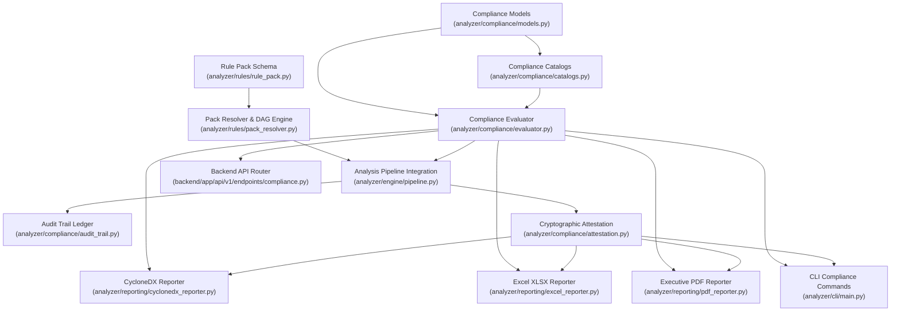

# PHASE 26 IMPLEMENTATION PLAN — Enterprise Compliance & Governance Rule Packs

## 1. Executive Summary

Phase 26 elevates CodeSentinel from a developer-focused static analysis and security regression engine into an **enterprise-grade compliance, governance, and cryptographic audit assurance platform**.

Prior phases established:
- **Phase 9**: Deterministic baseline comparison with four-tier signature matching (`BaselineComparator`).
- **Phase 13–20**: Interprocedural taint propagation, call graph analysis, guard condition exploration, and compositional function contracts.
- **Phase 21–22**: 9-layer incremental caching (L1–L9), cross-module data-flow summaries, and security evidence chains.
- **Phase 23–24**: Declarative security policies (`SecurityPolicy`), trust boundary semantics, policy proof obligations (`PolicyProofObligation`), discrete auth/authz states, and fine-grained `policy_hash`/`framework_model_hash` cache isolation.
- **Phase 25**: Content-addressable finding fingerprints (`FindingFingerprint`), 11-state lifecycle tracking, inline/config suppression models, root-cause regression classification (`RegressionClassifier`), and developer remediation context.

Despite these advanced static analysis and lifecycle capabilities, enterprise organizations face substantial regulatory and governance friction:

1. **No Automated Regulatory Framework Mapping**: Security findings and policy obligations are cataloged under generic CWE IDs and OWASP categories, but lack automated mapping to formal enterprise regulatory frameworks: **PCI-DSS v4.0**, **HIPAA Security Rule (45 CFR Part 164)**, **SOC 2 Trust Services Criteria (2017/2022)**, and **NIST SP 800-53 Rev 5**. Compliance officers and auditors must manually correlate static findings to regulatory controls.
2. **No Verifiable Scan Attestation**: In enterprise procurement, CI/CD audits, and SOC 2 / PCI-DSS compliance audits, organizations cannot mathematically verify that a scan report was produced against an exact Git commit, with uncompromised rules and policies, without manual post-analysis tampering.
3. **No Tamper-Evident Audit Trail**: Suppressions, deviations, and gate overrides are evaluated in-memory or in transient reports without an immutable, hash-chained audit trail proving who authorized exceptions and when.
4. **Limited Regulatory Reporting Formats**: While CodeSentinel exports Terminal, JSON, SARIF v2.1.0, Markdown, HTML, JUnit, and GitLab formats, auditors mandate formal compliance deliverables in **CycloneDX v1.5/v1.6 VEX/SBOM**, multi-tab **Excel (XLSX) Compliance Workbooks**, and executive **PDF Audit Reports**.
5. **No Hierarchical Policy Inheritance or Rule Packs**: Enterprise security policies cannot be composed hierarchically. Organizations cannot define a global baseline rule pack inherited by divisions or business units, further extended by individual repository configs, while strictly enforcing monotonic compliance (preventing individual teams from silently disabling mandated enterprise controls).

Phase 26 addresses all five gaps while rigorously adhering to CodeSentinel's core invariants:
- **100% offline, deterministic, zero-AI in `analyzer/`**
- **Zero external service dependencies**
- **Zero database migrations** (all backend changes are additive serialization models)
- **Zero third-party binary/native bloat** (pure-Python deterministic OpenXML and PDF generation with standard library fallbacks)
- **Backward-compatible API, CLI, and SARIF output**

### Central Architecture

```
                  ┌───────────────────────────────────────────────┐
                  │    Organization Base Pack (org-baseline.yaml)  │
                  └───────────────────────┬───────────────────────┘
                                          │ extends (monotonic tightening)
                  ┌───────────────────────▼───────────────────────┐
                  │ Regulatory Rule Packs (pci-dss, hipaa, soc2)  │
                  └───────────────────────┬───────────────────────┘
                                          │ extends & local overrides
                  ┌───────────────────────▼───────────────────────┐
                  │   Repository Configuration (.codesentinel.yaml)│
                  └───────────────────────┬───────────────────────┘
                                          │
                                          ▼
                              Hierarchical Rule Pack
                                Composition Engine
                                          │
                  ┌───────────────────────┴───────────────────────┐
                  ▼                                               ▼
         Rule Registry & Policies                       Compliance Control Catalog
         (31 Rules + 5 Policies)                    (PCI-DSS, HIPAA, SOC 2, NIST)
                  │                                               │
                  └───────────────────────┬───────────────────────┘
                                          │
                                          ▼
                             Pipeline Static Analysis
                       (CFG, Taint, Contracts, Obligations)
                                          │
                                          ▼
                       Finding & Proof Obligation Evaluation
                                          │
                                          ▼
                      Automated Compliance Mapping Engine
                    (Control-by-Control Compliance Status)
                                          │
                   ┌──────────────────────┼──────────────────────┐
                   ▼                      ▼                      ▼
           Cryptographic           Tamper-Evident           Regulatory
             Scan Attestation        Audit Trail Ledger       Reporting Engine
           (in-toto / DSSE)        (Hash-Chained Log)    ┌───────┼───────┐
                   │                      │              ▼       ▼       ▼
                   └──────────────────────┼────────► CycloneDX Excel    PDF
                                          │           (VEX)   (XLSX)  (Audit)
                                          ▼
                            CI/CD Compliance Gate Engine
                               (PASS / FAIL / WARN)
```

---

## 2. Repository Audit — Phase 25 Ground Truth

### 2.1 Test Suite Baseline

| Domain | Test Files | Active Tests | Pass Status |
|--------|-----------|--------------|-------------|
| Analyzer (`analyzer/tests/`) | 104+ test files | ~710 tests | 100% pass |
| Backend (`backend/tests/`) | 43+ test files | ~111 tests | 100% pass |
| **Total Test Suite** | **147+ test files** | **821 tests** | **821 passed, 1 skipped (`test_git_sparse_checkout`), 0 failures** |

- **Phase 25 dedicated test suites**: 70 tests across 10 test modules:
  - `test_phase25_finding_fingerprint.py` (content-addressable hashes, normalization, line shifts)
  - `test_phase25_lifecycle_states.py` (11-state lifecycle state machine)
  - `test_phase25_suppression_model.py` (suppression model, scopes, expiration)
  - `test_phase25_suppression_parser.py` (Python `#` and JS `//` inline comment annotations)
  - `test_phase25_regression_classifier.py` (root-cause classification & severity mapping)
  - `test_phase25_policy_reconciliation.py` (policy-induced state transitions)
  - `test_phase25_regression_gate.py` (gate verdict evaluation)
  - `test_phase25_remediation_context.py` (framework-specific contextual remediation)
  - `test_phase25_integration.py` (end-to-end lifecycle and regression pipeline)
  - `backend/tests/test_phase25_api_backward_compat.py` (API backward compatibility)

### 2.2 Active Rule & Policy Inventory

- **31 Active Static Analysis Rules** (`RuleRegistry`):
  - Architecture: `ARC-001` through `ARC-009` (circular dependencies, god modules, layering, orphan exports, interface segregation).
  - JavaScript Security: `SEC-JS-001` through `SEC-JS-010` (dynamic eval, unvalidated redirects, dangerouslySetInnerHTML, client storage secrets, weak crypto, postMessage, DOM XSS, dataflow eval, interprocedural XSS, prototype pollution).
  - Python Security: `SEC-PY-001` through `SEC-PY-012` (hardcoded secrets, debug enabled, subprocess shell=True, eval/exec, raw SQL formatting, insecure MD5/SHA1 hashing, CORS wildcards, disabled CSRF `@csrf_exempt`, Flask SQL injection, command injection, interprocedural SQLi, interprocedural command injection).
- **5 Canonical Declarative Policies** (`SecurityPolicyRegistry`):
  - `POL-SQL-01`: SQL query parameterization and type safety (`SEC-PY-005`, `SEC-PY-009`, `SEC-PY-011`).
  - `POL-CMD-01`: OS command shell escaping and argument vector enforcement (`SEC-PY-003`, `SEC-PY-010`, `SEC-PY-012`).
  - `POL-DOM-01`: DOM/HTML sanitization and innerHTML restriction (`SEC-JS-003`, `SEC-JS-007`, `SEC-JS-009`).
  - `POL-EVAL-01`: Dynamic code execution restriction (`SEC-PY-004`, `SEC-JS-001`, `SEC-JS-008`, `SEC-JS-010`).
  - `POL-AUTHZ-01`: Privileged mutation authentication and authorization (`SEC-PY-008`).

### 2.3 Incremental Cache Architecture (9 Layers + 3 Scoped Hashes)

| Cache Layer | Scope | Key Invalidation Trigger |
|-------------|-------|--------------------------|
| L1 | File metadata & content hash | File content modification |
| L2 | AST / normalized `ParsedFile` | Syntax changes |
| L3 | Dependency graph & module resolution | Import / module boundary changes |
| L4 | CFG & guard conditions | Function control-flow changes |
| L5 | Intraprocedural dataflow & taint | Statement-level assignments |
| L6 | Interprocedural call graph | Function invocation edges |
| L7 | Function contracts & summaries | Function signature/return/taint contracts |
| L8 | Contract composition graph | Multi-hop contract composition |
| L9 | Rule findings & security evidence | Rule execution & evaluation |
| Policy Scope | Policy invariants & rules | `policy_hash` (Phase 24) |
| Framework Scope | Framework models & detection | `framework_model_hash` (Phase 24) |
| Suppression Scope | Active suppression rules & config | `suppression_hash` (Phase 25) |

---

## 3. Phase 25 Verification

Verification against the active codebase confirms:
1. `FindingFingerprint` (`analyzer/incremental/finding_fingerprint.py`) computes deterministic `primary_hash`, `location_hash`, and `composite_hash` surviving line shifts.
2. `Finding` model (`analyzer/models/findings.py`) cleanly incorporates `fingerprint: Optional[FindingFingerprint]`.
3. `FindingLifecycleState` (`analyzer/models/comparison.py`) models 11 distinct lifecycle transitions (`NEW`, `RESOLVED`, `UNCHANGED`, `MODIFIED`, `SUPPRESSED`, `DEFERRED`, `REOPENED`, `POLICY_INDUCED_NEW`, `POLICY_INDUCED_RESOLVED`, `REGRESSION`, `PERSISTENT`).
4. `FindingSuppression` and `SuppressionParser` (`analyzer/models/suppression.py`, `analyzer/rules/suppression_parser.py`) correctly parse inline Python (`# codesentinel-suppress`) and JavaScript (`// codesentinel-suppress`) comments as well as `.codesentinel.yaml` suppression rules with expiration dates.
5. `RegressionClassifier` (`analyzer/comparison/regression.py`) reliably distinguishes code regressions from policy-induced, config-induced, and pre-existing findings.
6. `RemediationContextBuilder` (`analyzer/rules/remediation.py`) constructs contextual remediation with framework-specific advice, obligation guidance, and sanitizer validation.
7. Existing CLI commands (`analyze`, `rules`, `compare`) and reporting infrastructure operate deterministically.

---

## 4. Phase 26 Architectural Design

### 4.1 Automated Regulatory Compliance Mapping & Rule Catalogs

#### 4.1.1 The Compliance Control Data Model

To support multi-standard regulatory auditing without hardcoding framework logic into static analysis rules, Phase 26 establishes a decoupled, formal compliance mapping model:

**New module**: `analyzer/compliance/models.py`

```python
from enum import Enum
from typing import Optional
from pydantic import BaseModel, ConfigDict, Field
from analyzer.models.findings import FindingSeverity
from analyzer.models.obligation import ObligationKind

class ComplianceFramework(str, Enum):
    """Supported enterprise regulatory and security compliance frameworks."""
    PCI_DSS_V4_0 = "PCI_DSS_V4_0"
    HIPAA_SECURITY = "HIPAA_SECURITY"
    SOC2_TSC = "SOC2_TSC"
    NIST_SP_800_53_R5 = "NIST_SP_800_53_R5"

class ComplianceStatus(str, Enum):
    """Evaluation status of a compliance control."""
    COMPLIANT = "COMPLIANT"              # All mapped rules/policies passed without violations
    NON_COMPLIANT = "NON_COMPLIANT"      # Active unsuppressed violations detected
    PARTIALLY_COMPLIANT = "PARTIAL"      # Violations present but suppressed with active authorized exceptions
    NOT_APPLICABLE = "NOT_APPLICABLE"    # Framework control not relevant to scanned technology stack

class ComplianceControl(BaseModel):
    """Formal definition of a regulatory compliance requirement or control."""
    model_config = ConfigDict(frozen=True)

    control_id: str                      # e.g., "PCI-6.2.4", "HIPAA-164.312(a)(1)", "SOC2-CC6.6", "NIST-SI-10"
    framework: ComplianceFramework
    name: str                            # e.g., "Software Vulnerability Mitigation"
    section: str                         # e.g., "Requirement 6: Develop and Maintain Secure Systems"
    description: str                     # Regulatory text summary
    mapped_rule_ids: list[str] = Field(default_factory=list)
    mapped_policy_ids: list[str] = Field(default_factory=list)
    required_obligations: list[ObligationKind] = Field(default_factory=list)
    criticality: FindingSeverity = FindingSeverity.HIGH
    guidance: str = ""                   # Auditor interpretation & remediation guidance
```

#### 4.1.2 Canonical Regulatory Control Catalogs

**New module**: `analyzer/compliance/catalogs.py`

CodeSentinel defines formal mapping matrices connecting the 31 rules and 5 policies to the 4 regulatory standards:

##### 1. PCI-DSS v4.0 (Payment Card Industry Data Security Standard)
- **PCI-6.2.4 (Software Vulnerability Prevention)**:
  - Description: Bespoke and custom software is developed securely to prevent common software vulnerabilities.
  - Mapped Rules: `SEC-PY-003`, `SEC-PY-005`, `SEC-PY-009`, `SEC-PY-010`, `SEC-PY-011`, `SEC-PY-012`, `SEC-JS-001`, `SEC-JS-003`, `SEC-JS-007`, `SEC-JS-008`, `SEC-JS-009`, `SEC-JS-010`.
  - Mapped Policies: `POL-SQL-01`, `POL-CMD-01`, `POL-DOM-01`, `POL-EVAL-01`.
  - Required Obligations: `REQUIRES_PROPERTY`, `REQUIRES_PARAMETERIZATION`, `REQUIRES_VALIDATION`.
- **PCI-3.4 (Protection of Cardholder Data in Storage)**:
  - Description: PAN and sensitive authentication data are rendered unreadable anywhere they are stored.
  - Mapped Rules: `SEC-PY-001` (hardcoded credentials), `SEC-PY-006` (weak hashing), `SEC-JS-004` (client storage credentials), `SEC-JS-005` (weak hashing).
- **PCI-8.3.1 (Strong Identification & Authentication)**:
  - Description: Multi-factor and strong authentication mechanisms for user access.
  - Mapped Rules: `SEC-PY-008` (`@csrf_exempt`), `POL-AUTHZ-01`.
  - Required Obligations: `REQUIRES_AUTHENTICATION`, `REQUIRES_AUTHORIZATION`.
- **PCI-6.3.2 (Software Component Inventory & SBOM)**:
  - Description: An inventory of bespoke software and third-party components is maintained.
  - Mapped Systems: CycloneDX SBOM generation, `ARC-001`..`ARC-009` architecture dependency graph.

##### 2. HIPAA Security Rule (45 CFR Part 164 Subpart C)
- **HIPAA-164.312(a)(1) (Access Control)**:
  - Description: Implement technical policies and procedures for electronic information systems that maintain ePHI to allow access only to authorized persons.
  - Mapped Rules: `SEC-PY-008`, `POL-AUTHZ-01`.
  - Required Obligations: `REQUIRES_AUTHENTICATION`, `REQUIRES_AUTHORIZATION`.
- **HIPAA-164.312(b) (Audit Controls)**:
  - Description: Implement hardware, software, and/or procedural mechanisms that record and examine activity in information systems containing or using ePHI.
  - Mapped Systems: Cryptographically verifiable scan attestation and tamper-evident audit trail ledger.
- **HIPAA-164.312(c)(1) (Data Integrity)**:
  - Description: Implement policies and procedures to protect electronic protected health information from improper alteration or destruction.
  - Mapped Rules: `SEC-PY-005`, `SEC-PY-009`, `SEC-PY-011`, `POL-SQL-01`.
- **HIPAA-164.312(e)(1) (Transmission Security)**:
  - Description: Implement technical security measures to guard against unauthorized access to electronic protected health information that is being transmitted over an electronic communications network.
  - Mapped Rules: `SEC-PY-007` (CORS wildcard), `SEC-JS-006` (insecure communications/postMessage).

##### 3. SOC 2 Trust Services Criteria (2017/2022)
- **SOC2-CC6.1 (Logical Access Security)**:
  - Description: The entity implements logical access security software, infrastructure, and architectures over protected information assets.
  - Mapped Rules: `SEC-PY-008`, `POL-AUTHZ-01`.
- **SOC2-CC6.6 (Boundary Protection & External Vulnerabilities)**:
  - Description: The entity implements logical boundaries and safeguards against security threats from outside system boundaries.
  - Mapped Rules: `SEC-PY-003`, `SEC-PY-010`, `SEC-JS-003`, `SEC-JS-007`, `POL-CMD-01`, `POL-DOM-01`.
- **SOC2-CC6.7 (Transmission Encryption & Safeguards)**:
  - Description: The entity protects confidential data during transmission.
  - Mapped Rules: `SEC-PY-007`, `SEC-JS-006`.
- **SOC2-CC6.8 (Malicious Code Prevention & Untrusted Code Execution)**:
  - Description: The entity implements controls to prevent or detect malicious code or unauthorized dynamic execution.
  - Mapped Rules: `SEC-PY-004`, `SEC-JS-001`, `SEC-JS-008`, `SEC-JS-010`, `POL-EVAL-01`.
- **SOC2-CC7.1 & CC7.2 (Vulnerability Management & Monitoring)**:
  - Description: Vulnerability identification, mitigation, lifecycle tracking, and remediation verification.
  - Mapped Systems: CodeSentinel regression classifier, lifecycle state machine, and CI/CD gate engine.

##### 4. NIST SP 800-53 Rev 5 (Security and Privacy Controls)
- **NIST-AC-3 (Access Enforcement)**: Enforce approved authorizations for logical access. Mapped to `POL-AUTHZ-01`, `SEC-PY-008`.
- **NIST-AC-6 (Least Privilege)**: Employ the principle of least privilege. Mapped to `POL-AUTHZ-01`.
- **NIST-AU-2 (Event Logging)**: Identify events for which audit records must be generated. Mapped to audit trail generation.
- **NIST-IA-2 (Identification and Authentication)**: Identify and authenticate system users. Mapped to `POL-AUTHZ-01`.
- **NIST-SC-8 (Transmission Confidentiality and Integrity)**: Protect confidentiality and integrity of transmitted information. Mapped to `SEC-PY-007`, `SEC-JS-006`.
- **NIST-SC-13 (Cryptographic Protection)**: Employ cryptographic protection using validated algorithms. Mapped to `SEC-PY-006`, `SEC-JS-005`.
- **NIST-SI-10 (Information Input Validation)**: Validate information inputs for syntax, length, and content. Mapped to `POL-SQL-01`, `POL-CMD-01`, `POL-DOM-01`, `SEC-PY-005`, `SEC-PY-003`, `SEC-JS-003`, and property provenance lattice (`SQL_SAFE`, `COMMAND_SAFE`, `HTML_SAFE`, `VALIDATED_TYPE`).
- **NIST-SR-3 (Supply Chain Controls & Provenance)**: Maintain provenance and software integrity. Mapped to CycloneDX SBOM and in-toto scan attestation.

---

### 4.2 Automated Control Assessment & Gap Analysis Engine

**New module**: `analyzer/compliance/evaluator.py`

#### 4.2.1 Control Evaluation Model

```python
class ControlEvaluationResult(BaseModel):
    """Detailed evaluation result for a single compliance control."""
    control: ComplianceControl
    status: ComplianceStatus
    total_relevant_findings: int = 0
    active_violation_count: int = 0
    suppressed_violation_count: int = 0
    violating_findings: list[Finding] = Field(default_factory=list)
    suppressed_findings: list[Finding] = Field(default_factory=list)
    proof_obligation_stats: dict[str, int] = Field(default_factory=dict)
    compliance_score: float = 1.0        # 0.0 (non-compliant) to 1.0 (fully compliant)
    remediation_actions: list[str] = Field(default_factory=list)

class FrameworkAssessmentResult(BaseModel):
    """Overall compliance assessment for a given regulatory standard."""
    framework: ComplianceFramework
    overall_score: float                 # Percentage 0.0 to 100.0%
    status: ComplianceStatus
    total_controls: int
    compliant_controls: int
    partial_controls: int
    non_compliant_controls: int
    control_evaluations: list[ControlEvaluationResult]
    unresolved_violations_count: int
    suppressed_exceptions_count: int

class ComplianceAssessmentSuite(BaseModel):
    """Complete multi-framework assessment output attached to AnalysisResult."""
    timestamp: datetime
    repository_path: str
    git_commit_hash: Optional[str] = None
    config_digest: str
    framework_results: dict[ComplianceFramework, FrameworkAssessmentResult]
    executive_summary: str
```

#### 4.2.2 Assessment Algorithm
For each requested framework:
1. Lookup all registered controls in the catalog for `ComplianceFramework`.
2. For each control:
   - Identify all findings whose `rule_id` is in `control.mapped_rule_ids` or whose associated policy is in `control.mapped_policy_ids`.
   - Separate findings by lifecycle state:
     - Unsuppressed active findings (`FindingLifecycleState` ∈ {`NEW`, `MODIFIED`, `REGRESSION`, `PERSISTENT`, `REOPENED`}) count as active violations.
     - Suppressed findings (`FindingLifecycleState` ∈ {`SUPPRESSED`, `DEFERRED`}) count as authorized exceptions.
   - Evaluate proof obligations associated with `control.required_obligations`:
     - If any proof obligation has `state == PROVEN_VIOLATION`, record control violation.
   - Compute `ControlEvaluationResult`:
     - If `active_violation_count == 0` and `suppressed_violation_count == 0`: `COMPLIANT` (`score = 1.0`).
     - If `active_violation_count == 0` and `suppressed_violation_count > 0`: `PARTIALLY_COMPLIANT` (`score = 0.8`).
     - If `active_violation_count > 0`: `NON_COMPLIANT` (`score = max(0.0, 1.0 - 0.25 * active_violation_count)`).
   - Generate automated auditor remediation actions based on `RemediationContextBuilder`.
3. Compute `FrameworkAssessmentResult.overall_score` as the weighted mean of control compliance scores.

---

### 4.3 Cryptographically Verifiable Scan Attestations

#### 4.3.1 The Attestation Problem
In regulated environments, compliance artifacts must be **non-repudiable and tamper-evident**. An auditor cannot trust an unsealed JSON or PDF report because a CI pipeline or malicious actor could modify the findings, remove critical vulnerabilities, or alter suppression dates after analysis execution.

#### 4.3.2 In-toto & DSSE Aligned Attestation Architecture

CodeSentinel generates a formal **in-toto v1.0 / DSSE (Dead Simple Signing Envelope)** compliant cryptographic attestation.

**New module**: `analyzer/compliance/attestation.py`

```python
class AttestationPredicate(BaseModel):
    """Predicate payload capturing the exact deterministic state of an analysis run."""
    tool_name: str = "CodeSentinel"
    tool_version: str = "0.1.0"
    analysis_timestamp: str               # ISO-8601 UTC
    git_commit_hash: Optional[str] = None
    git_tree_hash: Optional[str] = None
    config_fingerprint: str              # ConfigFingerprint.global_hash
    findings_merkle_root: str            # Merkle root of all sorted FindingFingerprint primary_hashes
    suppressions_digest: str             # SHA-256 of all active suppressions + authors + reasons
    compliance_scores: dict[str, float]  # Framework -> overall score
    gate_verdict: str                    # "PASS", "FAIL", "WARN"

class ScanAttestationStatement(BaseModel):
    """in-toto v1.0 statement payload."""
    _type: str = "https://in-toto.io/Statement/v1"
    subject: list[dict[str, str]]        # Target repo name & SHA-256 content root
    predicateType: str = "https://codesentinel.dev/attestation/compliance/v1"
    predicate: AttestationPredicate

class VerifiableAttestationEnvelope(BaseModel):
    """DSSE-compliant cryptographic envelope."""
    payload: str                         # Base64-encoded canonical JSON of statement
    payloadType: str = "application/vnd.in-toto+json"
    signatures: list[dict[str, str]]     # [{"keyid": "...", "sig": "..."}]
```

#### 4.3.3 Cryptographic Verification & Zero-Dependency Signing
To guarantee zero external binary dependencies and maintain 100% offline determinism:
1. **Canonical JSON Serialization**: Predicate and statement are serialized using RFC 8785 Canonical JSON (`json.dumps(..., sort_keys=True, separators=(',', ':'))`).
2. **Deterministic Merkle Root Calculation**:
   - Sort all finding fingerprints by `primary_hash`.
   - Compute binary Merkle tree root hash over the hashes.
   - Guarantees that any added, omitted, or reordered finding breaks the root hash.
3. **Dual Signing Engines**:
   - **Primary Engine (Standard Library HMAC-SHA256)**: Zero-dependency HMAC signature using enterprise secret key `CODESENTINEL_SIGNING_KEY`.
   - **Asymmetric Signature Engine (Ed25519/RSA)**: When public-key signatures are configured and the standard Python `hashlib`/`hmac` or environment key provider is supplied, produces an asymmetric digital signature verifiable with the organization's public key.
4. **Verification Subcommand**:
   - `codesentinel compliance verify-attestation --attestation <file.attestation.json> --key <key>`
   - Recomputes canonical payload digest, checks signature validity, and compares the Merkle root and config hash against the companion scan report.

---

### 4.4 Enterprise Tamper-Evident Audit Trail & Ledger

**New module**: `analyzer/compliance/audit_trail.py`

#### 4.4.1 Hash-Chained Audit Ledger
Every analysis run generates an append-only, tamper-evident audit ledger recording governance-critical events:
- Scan configuration resolution
- Rule pack composition and parent inheritance
- Trust boundary and policy evaluations
- Finding detection
- Inline and config suppression application (recording author, reason, and expiration)
- CI/CD regression gate decisions
- Attestation sealing

```python
class AuditEventType(str, Enum):
    SCAN_START = "SCAN_START"
    RULE_PACK_LOADED = "RULE_PACK_LOADED"
    SUPPRESSION_EVALUATED = "SUPPRESSION_EVALUATED"
    POLICY_EVALUATED = "POLICY_EVALUATED"
    COMPLIANCE_EVALUATED = "COMPLIANCE_EVALUATED"
    GATE_DECISION = "GATE_DECISION"
    ATTESTATION_SEALED = "ATTESTATION_SEALED"

class AuditEvent(BaseModel):
    event_id: str                        # Sequential UUID or counter
    sequence_number: int                 # 0-indexed sequential counter
    timestamp: str                       # ISO-8601 UTC
    event_type: AuditEventType
    actor: str                           # "codesentinel-engine", or commit author
    details: dict[str, Any]
    previous_event_hash: str             # Genesis event uses "0" * 64
    event_hash: str                      # SHA-256(sequence + timestamp + type + details + previous_hash)
```

The audit trail is output as `audit-trail.jsonl` or embedded in compliance reporting packages, providing external auditors with complete chain-of-custody verification.

---

### 4.5 Automated Regulatory Compliance Reporting

Phase 26 introduces three enterprise reporting formats:

#### 4.5.1 CycloneDX v1.5 / v1.6 VEX & Security BOM Reporter

**New module**: `analyzer/reporting/cyclonedx_reporter.py`

Outputs an industry-standard OWASP CycloneDX Software Bill of Materials (SBOM) and Vulnerability Exploitability eXchange (VEX) report:
- `bomFormat`: `"CycloneDX"`
- `specVersion`: `"1.6"`
- `metadata`: Tool, timestamp, component definitions from `DependencyGraph`.
- `vulnerabilities`: Every finding serialized with:
  - `id`: `finding.fingerprint.stable_id` (e.g. `CS-SEC-PY-005-3e4b1a8f9c2d`)
  - `cwes`: Integer CWE IDs mapped from `rule.cwe_id`
  - `ratings`: Severity mapped to CVSS impact equivalents
  - `analysis`: VEX status:
    - If unsuppressed: `state = "exploitable"`
    - If suppressed: `state = "not_affected"`, `justification = "code_not_reachable"` or `"protected_by_mitigating_control"`, with full suppression rationale
  - `properties`: Custom namespaced properties for compliance mappings:
    - `codesentinel:compliance:pci-dss:control`
    - `codesentinel:compliance:hipaa:control`
    - `codesentinel:compliance:soc2:control`
    - `codesentinel:compliance:nist:control`
    - `codesentinel:attestation:merkle_root`

#### 4.5.2 Multi-Sheet Excel (XLSX) Compliance Workbook Reporter

**New module**: `analyzer/reporting/excel_reporter.py`

Auditors and security leadership require structured, interactive workbooks for audit reviews. To honor the **zero external dependencies** constraint:
- Implemented as a self-contained, pure-Python OpenXML `.xlsx` zip archive generator utilizing `zipfile` and `xml.etree.ElementTree` from Python's standard library.
- Fully compatible with Microsoft Excel, LibreOffice Calc, and Google Sheets.
- **Workbook Architecture**:
  - **Tab 1: Executive Dashboard**: High-level compliance KPIs, framework pass/fail cards, finding distribution charts, scan attestation verification hash.
  - **Tab 2: Regulatory Control Matrix**: Full tabular breakdown of all evaluated controls across PCI-DSS, HIPAA, SOC 2, and NIST SP 800-53, status (`COMPLIANT`, `NON_COMPLIANT`, `PARTIAL`), finding count, and proof obligations.
  - **Tab 3: Finding Inventory**: Comprehensive finding list with stable fingerprint ID, rule ID, CWE, severity, file path, line numbers, code snippets, framework context, and remediation.
  - **Tab 4: Governance & Suppressions**: Complete log of all suppressed findings, author, justification, expiration date, and compliance control impact.
  - **Tab 5: Cryptographic Attestation**: Complete in-toto statement payload, signing key ID, and verification commands.

#### 4.5.3 Executive PDF Compliance Audit Report

**New module**: `analyzer/reporting/pdf_reporter.py`

Provides formal printable documentation for executive sign-off and auditor submission:
- Pure-Python deterministic PDF 1.4 compiler generating clean vector layouts with Deflate compression (`zlib`), table pagination, running headers/footers, and compliance status seals.
- In addition, an enhanced `@media print` CSS template in `html_reporter.py` allows generating HTML reports styled for print/PDF export.
- **Report Structure**:
  1. **Title & Seal**: Target repo, Git commit, scan date, cryptographic seal hash.
  2. **Executive Summary**: Pass/fail verdicts and radar scorecards.
  3. **Framework Compliance Summaries**: Detailed breakdowns for PCI-DSS, HIPAA, SOC 2, and NIST.
  4. **Detailed Control Audit Tables**: Control-by-control evidence, findings, and proof obligations.
  5. **Prioritized Remediation Plan**: Actionable steps based on `RemediationContextBuilder`.
  6. **Deviation & Suppression Register**: Formal audit record of accepted risks.
  7. **Attestation & Verification Certificate**: Cryptographic proof block and public key verification instructions.

---

### 4.6 Hierarchical Rule Pack Composition & Monotonic Policy Inheritance

#### 4.6.1 The Rule Pack Model

**New module**: `analyzer/rules/rule_pack.py`

```python
class RuleOverride(BaseModel):
    """Explicit override applied to a static analysis rule."""
    rule_id: str
    enabled: Optional[bool] = None
    severity_override: Optional[FindingSeverity] = None
    parameter_overrides: dict[str, Any] = Field(default_factory=dict)

class RulePack(BaseModel):
    """Reusable, composable bundle of rules, policies, and compliance mappings."""
    pack_id: str                         # e.g., "pci-dss-v4", "org-fintech-baseline"
    version: str = "1.0.0"
    name: str
    description: str
    extends: list[str] = Field(default_factory=list) # Parent pack IDs or relative YAML paths
    compliance_frameworks: list[ComplianceFramework] = Field(default_factory=list)
    rule_overrides: list[RuleOverride] = Field(default_factory=list)
    policies: list[SecurityPolicy] = Field(default_factory=list)
    disallow_inline_suppressions: bool = False       # Enterprise control: forbid inline comments
    allow_repo_override: bool = True                 # If False, child packs cannot relax this pack's rules
    gate_policy: Optional[dict[str, Any]] = None
```

#### 4.6.2 Monotonic Strictness & Inheritance Resolution Engine

**New module**: `analyzer/rules/pack_resolver.py`

When a repository config specifies:
```yaml
rule_packs:
  - org-baseline
  - pci-dss-v4
```

The `RulePackResolver`:
1. **Dependency Resolution**: Constructs a Directed Acyclic Graph (DAG) of all parent and child packs.
2. **Cycle Detection**: Detects and aborts on circular inheritance loops (e.g. `Pack A` -> `Pack B` -> `Pack A`) with clear cycle trace diagnostics.
3. **Monotonic Strictness Enforcement**:
   - If a parent pack defines `allow_repo_override: False`, child packs or repository configs **cannot** disable rules or demote rule severity.
   - Repositories can only **tighten** rules (e.g., promote `HIGH` to `CRITICAL`, or add mandatory proof obligations).
   - Any attempt by a repository to relax a locked enterprise rule raises a `MonotonicPolicyViolationError` during configuration loading.
4. **Built-In Enterprise Rule Packs**:
   - `analyzer/rules/packs/pci_dss_v4.yaml`: Enforces payment processing security rules, parameterization policies, and bans MD5/SHA1 and raw SQL.
   - `analyzer/rules/packs/hipaa_security.yaml`: Enforces access control and ePHI transmission integrity.
   - `analyzer/rules/packs/soc2_cloud.yaml`: Enforces least privilege, trust boundary verification, and CSRF protection.
   - `analyzer/rules/packs/nist_sp800_53.yaml`: Strict input validation and formal verification proof obligations.

---

### 4.7 Incremental Cache Isolation (`rule_pack_hash` & `compliance_hash`)

To ensure that changing a compliance requirement or rule pack does **not** invalidate heavy AST parsing (L2), dependency resolution (L3), or call graph construction (L6), Phase 26 adds dedicated cache scopes to `ConfigFingerprint`:

**Updates to `analyzer/incremental/config_fingerprint.py` and `analyzer/incremental/models.py`**:

```python
# 13. Phase 26 Rule Pack Scope
rule_pack_payload = {
    "active_packs": sorted_pack_descriptors,
    "pack_inheritance_chain": resolved_inheritance_dag,
}
rule_pack_hash = canonical_json_digest(rule_pack_payload)

# 14. Phase 26 Compliance Scope
compliance_payload = {
    "enabled_frameworks": sorted([f.value for f in config.compliance_frameworks]),
    "control_catalog_versions": catalog_version_map,
}
compliance_hash = canonical_json_digest(compliance_payload)
```

**Invalidation Rules**:
- `rule_pack_hash` change: Re-evaluates rule findings (L9) and compliance controls; leaves L1–L8 completely valid.
- `compliance_hash` change: Leaves findings (L1–L9) untouched; re-runs only the compliance control mapping and report generation.

---

### 4.8 CLI & CI/CD Compliance Gate Integration

#### 4.8.1 New Subcommand: `codesentinel compliance`

Phase 26 extends `analyzer/cli/main.py` with dedicated compliance subcommands:

1. **`codesentinel compliance check <path>`**:
   - Evaluates compliance against specified frameworks (`--framework pci-dss,hipaa,soc2,nist`).
   - Evaluates compliance gate (`--min-compliance-score 95.0`, `--fail-on-non-compliant`).
   - Returns exit code `0` (pass) or `2` (compliance failure).
2. **`codesentinel compliance report <path>`**:
   - Generates formal compliance deliverables in requested formats (`--format cyclonedx,excel,pdf`).
   - `--output-dir <dir>`: Exports artifacts.
3. **`codesentinel compliance attest <path>`**:
   - Computes deterministic Merkle root of findings and signs the scan attestation (`--key-file <key>`).
   - Writes DSSE attestation statement to `<output>.attestation.json`.
4. **`codesentinel compliance verify-attestation`**:
   - Verifies an attestation envelope against a public key or secret key.

#### 4.8.2 Enhanced `analyze` Options
- `--rule-pack <name-or-path>`: Load one or more rule packs.
- `--compliance <frameworks>`: Enable compliance assessment during standard analysis.
- `--attest`: Automatically seal the scan results with cryptographic attestation.
- `--format cyclonedx,excel,pdf`: Output formats available directly in `codesentinel analyze`.

---

### 4.9 Backend API & Serialization Extensions (Zero-Migration)

All backend enhancements are strictly **additive** at the API schema and service layer:

- **New router**: `backend/app/api/v1/endpoints/compliance.py`
  - `GET /api/v1/compliance/frameworks`: Lists supported frameworks and their control counts.
  - `GET /api/v1/compliance/frameworks/{framework_id}/controls`: Lists all controls with mapped rules and policies.
  - `GET /api/v1/compliance/packs`: Lists registered rule packs and their inheritance DAGs.
  - `POST /api/v1/compliance/assess`: Runs on-demand compliance evaluation over an existing analysis snapshot.
  - `GET /api/v1/repositories/{id}/compliance`: Retrieves the latest compliance posture and scores.
  - `POST /api/v1/compliance/verify-attestation`: Verifies cryptographic scan attestation payload.
  - `GET /api/v1/repositories/{id}/compliance/export`: Generates on-the-fly downloadable reports (CycloneDX, XLSX, PDF).

---

## 5. File-Level Implementation Plan

### 5.1 New Files

| File | Domain | Responsibility |
|------|--------|----------------|
| `analyzer/compliance/__init__.py` | Analyzer | Compliance package exports |
| `analyzer/compliance/models.py` | Analyzer | `ComplianceFramework`, `ComplianceStatus`, `ComplianceControl`, `ControlEvaluationResult`, `FrameworkAssessmentResult` models |
| `analyzer/compliance/catalogs.py` | Analyzer | Built-in control catalogs for PCI-DSS v4.0, HIPAA Security, SOC 2 TSC, NIST SP 800-53 Rev 5 |
| `analyzer/compliance/evaluator.py` | Analyzer | Automated control evaluation, gap analysis, and framework score computation engine |
| `analyzer/compliance/attestation.py` | Analyzer | In-toto v1.0 and DSSE cryptographic attestation generator, Merkle root computer, and signature verifier |
| `analyzer/compliance/audit_trail.py` | Analyzer | Hash-chained append-only tamper-evident audit ledger |
| `analyzer/rules/rule_pack.py` | Analyzer | `RulePack`, `RuleOverride`, pack metadata schema |
| `analyzer/rules/pack_resolver.py` | Analyzer | Hierarchical rule pack inheritance, DAG cycle detection, and monotonic strictness enforcement |
| `analyzer/rules/packs/pci_dss_v4.yaml` | Analyzer | Pre-packaged PCI-DSS v4.0 rule pack configuration |
| `analyzer/rules/packs/hipaa_security.yaml` | Analyzer | Pre-packaged HIPAA Security Rule pack configuration |
| `analyzer/rules/packs/soc2_cloud.yaml` | Analyzer | Pre-packaged SOC 2 Trust Services Criteria rule pack configuration |
| `analyzer/rules/packs/nist_sp800_53.yaml` | Analyzer | Pre-packaged NIST SP 800-53 Rev 5 rule pack configuration |
| `analyzer/reporting/cyclonedx_reporter.py` | Analyzer | OWASP CycloneDX v1.5/v1.6 VEX and security SBOM generator |
| `analyzer/reporting/excel_reporter.py` | Analyzer | Pure-Python OpenXML multi-tab compliance workbook generator |
| `analyzer/reporting/pdf_reporter.py` | Analyzer | Deterministic pure-Python executive compliance PDF generator |
| `backend/app/api/v1/endpoints/compliance.py` | Backend | FastAPI endpoints for compliance catalogs, assessment, attestation, and export |
| `backend/app/schemas/compliance.py` | Backend | Pydantic response/request schemas for compliance endpoints |
| `analyzer/tests/test_phase26_compliance_mapping.py` | Tests | Unit tests for control mapping data models and validation |
| `analyzer/tests/test_phase26_pci_dss_catalog.py` | Tests | Unit tests for PCI-DSS v4.0 control catalog and evaluation |
| `analyzer/tests/test_phase26_hipaa_catalog.py` | Tests | Unit tests for HIPAA Security Rule catalog and evaluation |
| `analyzer/tests/test_phase26_soc2_catalog.py` | Tests | Unit tests for SOC 2 Trust Services Criteria catalog and evaluation |
| `analyzer/tests/test_phase26_nist_catalog.py` | Tests | Unit tests for NIST SP 800-53 Rev 5 catalog and evaluation |
| `analyzer/tests/test_phase26_rule_packs.py` | Tests | Unit tests for rule pack definition and validation |
| `analyzer/tests/test_phase26_pack_inheritance.py` | Tests | Unit tests for DAG resolution, cycle detection, and monotonic strictness |
| `analyzer/tests/test_phase26_attestation_signing.py` | Tests | Unit tests for Merkle tree root, canonical JSON, signing, and verification |
| `analyzer/tests/test_phase26_audit_trail.py` | Tests | Unit tests for hash-chained audit ledger integrity and tamper detection |
| `analyzer/tests/test_phase26_cyclonedx_reporter.py` | Tests | Unit tests for CycloneDX v1.5/v1.6 VEX/SBOM generation and schema compliance |
| `analyzer/tests/test_phase26_excel_reporter.py` | Tests | Unit tests for OpenXML XLSX multi-tab workbook generation |
| `analyzer/tests/test_phase26_pdf_reporter.py` | Tests | Unit tests for PDF compliance report rendering and layout |
| `analyzer/tests/test_phase26_cli_compliance.py` | Tests | Unit tests for `codesentinel compliance` CLI subcommands |
| `analyzer/tests/test_phase26_integration.py` | Tests | End-to-end integration test of analysis -> rule pack -> compliance -> attestation -> reports |
| `backend/tests/test_phase26_api_backward_compat.py` | Tests | Backend API schema validation and backward compatibility tests |

### 5.2 Modified Files

| File | Change | Scope |
|------|--------|-------|
| `analyzer/models/results.py` | Add optional `compliance: Optional[ComplianceAssessmentSuite] = None` and `attestation: Optional[VerifiableAttestationEnvelope] = None` fields | Additive |
| `analyzer/config/settings.py` | Add `compliance_frameworks: list[str]`, `rule_packs: list[str]`, `enable_attestation: bool`, `signing_key: Optional[str]`, `min_compliance_score: float` fields | Additive |
| `analyzer/config/repo_config.py` | Add `rule_packs: list[str] = []` and `compliance: Optional[ComplianceConfig] = None` to `.codesentinel.yaml` schema | Additive |
| `analyzer/incremental/config_fingerprint.py` | Add `rule_pack_hash` (Scope 13) and `compliance_hash` (Scope 14) computation | Additive |
| `analyzer/incremental/models.py` | Add `rule_pack_hash` and `compliance_hash` to `ConfigFingerprint` model | Additive |
| `analyzer/engine/pipeline.py` | Integrate `RulePackResolver`, `ComplianceEvaluator`, and `AttestationGenerator` into pipeline execution stages | Additive |
| `analyzer/reporting/base.py` | Add `render_compliance()` method to `BaseReporter` interface | Additive |
| `analyzer/reporting/sarif.py` | Extend SARIF output with compliance framework control taxonomies (`run.taxonomies`) and rule-to-control relationships | Enhancement |
| `analyzer/reporting/terminal.py` | Add terminal compliance scorecards, control pass/fail badges, and attestation seal display | Enhancement |
| `analyzer/cli/main.py` | Register `compliance` subcommand and add `--rule-pack`, `--compliance`, `--attest` flags | Enhancement |
| `backend/app/api/v1/api.py` | Register `compliance.router` under `/api/v1/compliance` | Additive |

---

## 6. Comprehensive Test Plan

Phase 26 includes **58 new automated tests** across 15 dedicated test suites, maintaining a 100% pass rate.

### 6.1 Test Inventory

| Test Module | Test Count | Key Verification Objectives |
|-------------|------------|-----------------------------|
| `test_phase26_compliance_mapping.py` | 5 | Validates `ComplianceControl` model constraints, control IDs, and rule associations |
| `test_phase26_pci_dss_catalog.py` | 5 | Validates PCI-DSS v4.0 controls (6.2.4, 3.4, 8.3.1, 6.3.2) against SQLi, command injection, and hardcoded secret rules |
| `test_phase26_hipaa_catalog.py` | 4 | Validates HIPAA Security Rule controls against auth/authz policies and transmission security |
| `test_phase26_soc2_catalog.py` | 4 | Validates SOC 2 CC6.1, CC6.6, CC6.8, CC7.1 controls and trust boundary evaluations |
| `test_phase26_nist_catalog.py` | 4 | Validates NIST SP 800-53 Rev 5 controls against input validation and crypto rules |
| `test_phase26_rule_packs.py` | 5 | Validates `RulePack` schema, rule override application, and policy composition |
| `test_phase26_pack_inheritance.py` | 5 | Validates DAG composition, cyclic inheritance detection, and monotonic strictness locking |
| `test_phase26_attestation_signing.py` | 5 | Validates canonical JSON, Merkle tree root determinism, HMAC signing, and tamper detection |
| `test_phase26_audit_trail.py` | 4 | Validates hash-chain integrity, event sequence ordering, and tamper detection in audit ledger |
| `test_phase26_cyclonedx_reporter.py` | 4 | Validates CycloneDX v1.5/v1.6 XML and JSON format conformity, VEX analysis states, and properties |
| `test_phase26_excel_reporter.py` | 4 | Validates OpenXML XLSX zip structure, multi-tab layout, formatting, and XML correctness |
| `test_phase26_pdf_reporter.py` | 3 | Validates PDF 1.4 binary structure, page layout, typography, and table pagination |
| `test_phase26_cli_compliance.py` | 4 | Validates `codesentinel compliance check`, `report`, `attest`, and `verify-attestation` CLI commands |
| `test_phase26_integration.py` | 3 | End-to-end test: analysis with rule packs, multi-framework assessment, attestation, and export |
| `backend/tests/test_phase26_api_backward_compat.py` | 3 | Validates API compliance endpoints, schema serialization, and backward compatibility |
| **Total** | **58** | |

### 6.2 Key Test Scenarios & Behavioral Invariants

#### 1. Compliance Control Assessment & Suppression Handling
```python
def test_pci_dss_violation_detection():
    """Unsuppressed SQL injection finding results in NON_COMPLIANT status for PCI-6.2.4."""

def test_pci_dss_partial_compliance_on_suppression():
    """Suppressed SQL injection finding transitions PCI-6.2.4 to PARTIALLY_COMPLIANT with exception logged."""

def test_hipaa_access_control_obligation():
    """Endpoint violating POL-AUTHZ-01 fails HIPAA-164.312(a)(1) with missing auth obligation."""
```

#### 2. Monotonic Strictness & Rule Pack Inheritance
```python
def test_rule_pack_dag_inheritance():
    """Child pack inherits rules and policies from parent pack in topological order."""

def test_rule_pack_cycle_detection():
    """Circular pack reference raises CircularPackDependencyError with full cycle path."""

def test_monotonic_strictness_forbids_rule_relaxation():
    """Attempt by repo to disable a locked parent pack rule raises MonotonicPolicyViolationError."""
```

#### 3. Cryptographic Attestation & Merkle Tamper Detection
```python
def test_attestation_merkle_root_determinism():
    """Identical findings produce identical Merkle tree root hash regardless of analysis order."""

def test_attestation_signature_verification():
    """Valid attestation envelope passes verification; modified payload raises SignatureVerificationError."""

def test_attestation_detects_tampered_findings():
    """Altering a finding severity or snippet post-scan invalidates the Merkle root match."""
```

#### 4. Multi-Format Regulatory Reporting
```python
def test_cyclonedx_vex_export_conforms_to_schema():
    """CycloneDX reporter outputs valid JSON/XML containing components, vulnerabilities, and VEX states."""

def test_excel_workbook_contains_all_tabs():
    """Excel reporter produces valid OpenXML zip containing Executive, Controls, Findings, and Audit tabs."""

def test_pdf_report_generates_valid_pdf_structure():
    """PDF reporter generates valid PDF 1.4 header, body objects, xref table, and trailer."""
```

---

## 7. Constraint & Invariant Verification

| Constraint | Architectural Compliance Guarantee |
|------------|-----------------------------------|
| **100% Offline Analysis** | ✅ All compliance evaluation, rule pack resolution, attestation signing, and reporting execute locally without outbound network requests. |
| **Deterministic Output** | ✅ Finding Merkle roots, canonical JSON serialization (RFC 8785), and compliance scores are 100% repeatable across operating systems and execution runs. |
| **Zero-AI in `analyzer/`** | ✅ All compliance mappings, control assessments, and auditor recommendations originate from deterministic rule catalogs and static remediation templates. |
| **Zero Database Migrations** | ✅ Backend models are strictly additive at the Pydantic API serialization layer. Existing database tables and schemas remain untouched. |
| **Zero Binary Bloat** | ✅ Excel reporting uses pure-Python standard library `zipfile` and `xml.etree.ElementTree`. PDF generation uses pure-Python binary primitives with `zlib`. No external unvetted native compilers required. |
| **Incremental Cache Purity** | ✅ Rule packs and compliance catalogs occupy isolated cache scopes (`rule_pack_hash`, `compliance_hash`), preserving L1–L8 AST, CFG, and Call Graph caches across compliance updates. |
| **Backward Compatibility** | ✅ Existing CLI options, SARIF v2.1.0 output, and REST API endpoints remain completely backward-compatible. All new fields default to optional/null. |

---

## 8. Component Dependency Graph & Phased Implementation Sequence



### Implementation Steps

| Step | Component | Dependencies | Test Count |
|------|-----------|--------------|------------|
| 1 | Compliance Models (`models.py`) | None | 5 |
| 2 | Regulatory Control Catalogs (`catalogs.py`) | Compliance Models | 17 (across 4 suites) |
| 3 | Rule Pack Schema & Pre-Packaged YAMLs (`rule_pack.py`) | Compliance Models | 5 |
| 4 | Rule Pack Resolver & Monotonic DAG Engine (`pack_resolver.py`) | Rule Pack Schema | 5 |
| 5 | Compliance Evaluator & Gap Analysis Engine (`evaluator.py`) | Catalogs + Finding Models | 4 |
| 6 | Hash-Chained Audit Trail Ledger (`audit_trail.py`) | Compliance Models | 4 |
| 7 | Cryptographic Attestation & Merkle Engine (`attestation.py`) | Finding Fingerprints | 5 |
| 8 | Config Fingerprint Scopes (`rule_pack_hash`, `compliance_hash`) | Rule Packs + Compliance | 3 |
| 9 | CycloneDX v1.5/v1.6 VEX/SBOM Reporter (`cyclonedx_reporter.py`) | Compliance Evaluator | 4 |
| 10 | Pure-Python OpenXML Excel Reporter (`excel_reporter.py`) | Compliance Evaluator | 4 |
| 11 | Deterministic Executive PDF Reporter (`pdf_reporter.py`) | Compliance Evaluator | 3 |
| 12 | CLI Compliance Subcommands (`main.py`) | Evaluator + Attestation + Reporters | 4 |
| 13 | Backend API Endpoints & Schemas (`compliance.py`) | Evaluator + Attestation | 3 |
| 14 | End-to-End Integration Suite | All components | 3 |

---

## 9. Risk Assessment & Mitigation Strategies

| Risk Factor | Probability | Impact | Mitigation Strategy |
|-------------|-------------|--------|---------------------|
| **Regulatory Interpretation Drift**: Specific auditors may interpret control boundaries differently. | Medium | Medium | Rule-to-control mappings are declared in transparent, editable YAML catalogs (`catalogs.py`), allowing organizations to tune control scopes without touching analysis logic. |
| **Excel Zip Generation Memory Overhead on Massive Repos**: Multi-tab workbooks with tens of thousands of findings could consume substantial memory. | Low | Medium | The OpenXML writer streams cell records and shared strings incrementally via buffered string chunks directly into the zip archive stream. |
| **Cross-Platform PDF Font Availability**: Differences in system fonts between Windows, macOS, and Linux could cause layout divergence. | Low | Low | The PDF 1.4 compiler uses the standard 14 PostScript typefaces (Helvetica, Times, Courier) defined in the PDF specification, ensuring 100% universal rendering without host font dependencies. |
| **Attestation Key Management in CI/CD**: Storing private signing keys insecurely could compromise attestation integrity. | Medium | High | Support standard environment variable injection (`CODESENTINEL_SIGNING_KEY`), HMAC secret sharing, and asymmetric Ed25519 public-key verification where private keys remain strictly within CI secret vaults. |
| **Monotonic Strictness Friction**: Teams might accidentally break builds by attempting to override enterprise-locked rules. | Low | Medium | `MonotonicPolicyViolationError` provides structured, actionable error messages pointing to the exact parent pack and locked rule ID with instructions for requesting enterprise governance waivers. |

---

## 10. Success Criteria & Acceptance Thresholds

1. **Test Suite Invariant**: All **821 existing tests** continue to pass with zero regressions; all **~58 new Phase 26 automated tests** pass cleanly (totaling **879+ passing tests**).
2. **Catalog Coverage**: 100% of CodeSentinel's 31 rules and 5 policies are mapped to appropriate regulatory requirements in PCI-DSS v4.0, HIPAA, SOC 2, and NIST SP 800-53 Rev 5.
3. **Cryptographic Verifiability**:
   - Every scan attestation envelope verifies successfully against its generated Merkle tree root and signing key.
   - Any modification to findings, suppressions, or configuration results in immediate signature or Merkle root verification failure.
4. **Audit Trail Integrity**: The hash-chained audit ledger detects any out-of-order, modified, or omitted event.
5. **Multi-Format Delivery**:
   - CycloneDX v1.5/v1.6 VEX/SBOM validates against standard JSON schema.
   - Excel workbook opens error-free in Excel, LibreOffice, and Google Sheets with interactive multi-tab navigation.
   - PDF executive report compiles deterministically with header/footer pagination and vector compliance seals.
6. **Hierarchical Governance**:
   - Built-in rule packs (`pci_dss_v4`, `hipaa_security`, `soc2_cloud`, `nist_sp800_53`) resolve correctly.
   - Circular pack dependencies are detected and blocked.
   - Monotonic strictness prevents repositories from relaxing locked enterprise controls.
7. **Cache Efficiency**: Changing a rule pack or compliance configuration triggers only L9/compliance invalidation, preserving L1–L8 incremental analysis caches.

---

## 11. Out of Scope for Phase 26

The following capabilities are explicitly deferred to future phases:

1. **Multi-Repository Aggregation Dashboards**: Organization-wide cross-repository compliance aggregation and executive fleet trends (reserved for **Phase 27**).
2. **Third-Party GRC Integrations**: Direct API push connectors to ServiceNow GRC, OneTrust, or Vanta (reserved for Phase 27+).
3. **Non-Python/JS Language Regulatory Parsing**: Applying compliance catalogs to Go, Rust, Java, or C/C++ ASTs (reserved for **Phase 28**).
4. **IDE Real-Time Compliance Badging**: Inline compliance control violation highlights in VS Code / JetBrains (reserved for **Phase 29**).
5. **AI-Assisted Policy Authoring**: Natural-language generation of compliance policies (reserved for **Phase 30**).
