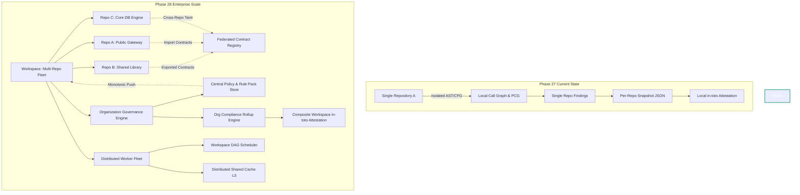
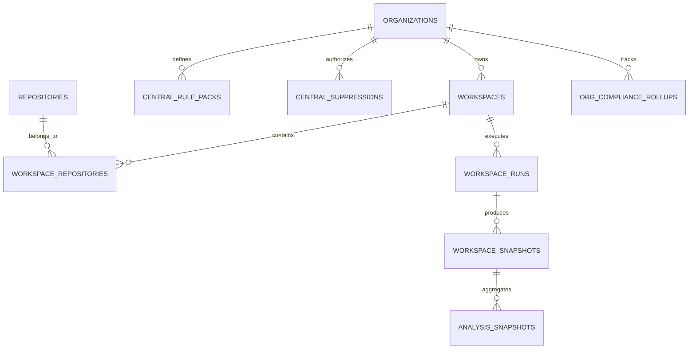
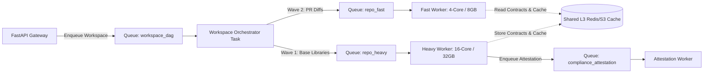

# PHASE 28 IMPLEMENTATION PLAN — Multi-Repository Orchestration & Organization-Scale Intelligence

## 1. Executive Summary

CodeSentinel has achieved an authoritative single-repository static analysis foundation across Phases 1 through 27:
- **Phases 1–7**: Deterministic AST parsing, NetworkX architectural dependency graphs, and 100-point codebase health scoring.
- **Phases 8–14**: Developer REST API, CI/CD differential baseline gating, PostgreSQL 16 immutable snapshots, async Celery queues, bounded-context AI triage, and longitudinal trend metrics.
- **Phases 15–20**: Advanced interprocedural analysis, $k$-limiting context sensitivity ($k \le 2$), points-to sets ($k \le 4$), field-sensitive state maps, path-sensitive basic-block CFGs ($k \le 8$), propositional guard pruning, formal function contracts (`FunctionContract`), and repository-wide project contract composition (PCG).
- **Phases 21–25**: Incremental $L1-L9$ cryptographic caching, lexical AST scope graphs, framework trust boundaries, formal proof obligations, finding lifecycle state machines, and resource envelopes.
- **Phases 26–27**: Enterprise regulatory compliance mapping (PCI-DSS v4.0, HIPAA, SOC 2, NIST SP 800-53 Rev 5), in-toto v1.0 Statement envelopes, DSSE signing, RFC 8785 canonical JSON normalization, RFC 6962 Merkle tree audit logging, and formula-injection-sanitized (CWE-1236) reporting.

### The Enterprise Scaling Challenge

Modern enterprise software systems are rarely contained in a single isolated repository. They operate as **polyrepo microservice fleets**, **multi-package monorepos** (npm workspaces, pnpm, Python poetry/uv workspaces, Go multi-module workspaces), and **tiered service architectures** where:
1. Untrusted user data ingested in a public API gateway (Repository A) travels across internal RPC/HTTP endpoints or shared library interfaces into a backend processing service (Repository B) and reaches a critical SQL or Command sink (Repository C).
2. Regulatory compliance audits (PCI-DSS, SOC 2, HIPAA) are executed at the **organizational and system boundary level**, not on individual repositories in isolation. An organization cannot certify compliance if 49 microservices pass but the central authentication or payment gateway violates controls.
3. Security policies, rule pack configurations, and vulnerability suppressions must be managed centrally by enterprise security teams and monotonically enforced across dozens or hundreds of distributed engineering teams without rogue local overrides.
4. Single-node analysis workers cannot scale to concurrent multi-repository scans without queue partitioning, topological dependency scheduling, and distributed artifact cache sharing.

**Phase 28 delivers Multi-Repository Orchestration & Organization-Scale Intelligence**: elevating CodeSentinel from a standalone single-repo auditor into an enterprise-wide static intelligence platform.

---

## 2. Phase 27 Verification & Audit Reconciliation

Before designing Phase 28, an exhaustive inspection of the Phase 27 codebase was conducted. The table below classifies the actual state of claims made in Phase 26 and Phase 27:

| Architectural Component | Source Location | Status in Current Repository | Detailed Technical Findings & Justification |
| :--- | :--- | :--- | :--- |
| **5-State Compliance Status Model** | [`analyzer/compliance/models.py`](file:///E:/AI-Workspace/projects/CodeSentinel/analyzer/compliance/models.py) | **IMPLEMENTED** | `ComplianceStatus` defines `PROVEN`, `VIOLATED`, `PARTIAL`, `UNKNOWN`, `NOT_ASSESSED`, `NOT_APPLICABLE` (plus legacy aliases `COMPLIANT`, `NON_COMPLIANT`, `PARTIALLY_COMPLIANT`). Evaluator supports `require_proven` mode. |
| **Control Provenance & Limitations** | [`analyzer/compliance/models.py`](file:///E:/AI-Workspace/projects/CodeSentinel/analyzer/compliance/models.py) | **IMPLEMENTED** | `ControlProvenance` records `catalog_version`, `source_standard`, `official_reference`, `requirement_summary`, `mapping_type` (`DIRECT`, `SUPPORTING`, `PARTIAL`, `INFERRED`, `NOT_ASSESSABLE`), and explicit `static_limitations`. |
| **RFC 8785 Canonical JSON (JCS)** | [`analyzer/compliance/attestation.py`](file:///E:/AI-Workspace/projects/CodeSentinel/analyzer/compliance/attestation.py) | **IMPLEMENTED** | `_serialize_jcs_value()` implements ECMAScript float formatting, Unicode NFC normalization, character escape restrictions, and UTF-16 lexicographical key sorting. |
| **in-toto v1.0 Statement Serialization** | [`analyzer/compliance/attestation.py`](file:///E:/AI-Workspace/projects/CodeSentinel/analyzer/compliance/attestation.py) | **IMPLEMENTED** | `ScanAttestationStatement` uses `Field(..., alias="_type")` and `by_alias=True` in serialization, properly emitting `_type: "https://in-toto.io/Statement/v1"`. |
| **RFC 6962 Domain-Separated Merkle Tree** | [`analyzer/compliance/attestation.py`](file:///E:/AI-Workspace/projects/CodeSentinel/analyzer/compliance/attestation.py) | **IMPLEMENTED** | `compute_findings_merkle_root()` uses binary digests, leaf prefix `\x00`, interior node prefix `\x01`, deterministic leaf sorting, and pairwise height promotion. |
| **DSSE Envelope Signing** | [`analyzer/compliance/attestation.py`](file:///E:/AI-Workspace/projects/CodeSentinel/analyzer/compliance/attestation.py) | **IMPLEMENTED** | `sign_attestation()` and `verify_attestation()` format PAE preimages (`DSSEv1...`), verify signatures in constant time (`hmac.compare_digest`), and reject empty keys. |
| **Asymmetric Attestation Keys (ECDSA/RSA)** | [`analyzer/compliance/attestation.py`](file:///E:/AI-Workspace/projects/CodeSentinel/analyzer/compliance/attestation.py) | **PARTIALLY_IMPLEMENTED** | DSSE envelope model supports multi-signature arrays, but signing logic currently only supports symmetric HMAC-SHA256 (`SYMMETRIC_AUTHENTICATION_ONLY`). |
| **Tamper-Evident Audit Ledger** | [`analyzer/compliance/audit_trail.py`](file:///E:/AI-Workspace/projects/CodeSentinel/analyzer/compliance/audit_trail.py) | **IMPLEMENTED** | `GenesisHeader` binds `chain_id`, `repository_id`, and `commit_hash`. Event hashes include `event_id` (deterministic `chain_id:seq` hash) and payload. `seal_ledger()` adds terminal `SCAN_TERMINATED` with count for truncation detection. |
| **Monotonic Rule Pack Resolver** | [`analyzer/rules/pack_resolver.py`](file:///E:/AI-Workspace/projects/CodeSentinel/analyzer/rules/pack_resolver.py) | **IMPLEMENTED** | Resolves multi-parent DAGs, detects cycles, enforces monotonic enablement, forbids severity demotions, verifies monotonic parameter bounds (`max_taint_depth`, `max_call_depth`), enforces monotonic gate policies, and calculates canonical SHA-256 pack digest. |
| **CWE-1236 Formula Sanitization (Excel)** | [`analyzer/reporting/excel_reporter.py`](file:///E:/AI-Workspace/projects/CodeSentinel/analyzer/reporting/excel_reporter.py) | **IMPLEMENTED** | `sanitize_excel_cell()` prepends single quote `'` to user strings beginning with `=`, `+`, `-`, `@`, `\t`, `\r`, and strips invalid XML 1.0 control characters. Uses deterministic 1980 epoch zip timestamps. |
| **Relational Compliance Persistence** | [`backend/app/services/persistence.py`](file:///E:/AI-Workspace/projects/CodeSentinel/backend/app/services/persistence.py) | **PARTIALLY_IMPLEMENTED** | `PersistenceService.create_analysis_snapshot()` packs compliance suite and attestation into `AnalysisSnapshot.configuration` JSON column. However, `AnalysisSnapshot` lacks first-class relational columns, and `reconstruct_analysis_dto()` does not unpack them into `AnalysisResultDTO`. |
| **Web Frontend Compliance UI** | `frontend/src/` | **NOT_IMPLEMENTED** | React frontend has tabs for Health, Findings, Graph, Diff, and Trends. No compliance assessment tab, control breakdown, or attestation verification UI exists. |
| **Multi-Repository Workspace Entity** | `backend/app/models/` | **NOT_IMPLEMENTED** | `Repository` model is solitary; no concept of `Workspace`, `Organization`, or cross-repo links exists in models, database, or API. |

---

## 3. Remaining Architectural Gaps & Transition to Phase 28

The inspection reveals the primary architectural boundaries separating Phase 27 from organization-scale deployment:



### Gap 1: Inability to Resolve Cross-Repository Dependencies & Data Flow
When Repository A calls a shared internal service or package implemented in Repository B:
- In Phase 27, the call is treated as an opaque external module. Callee arguments are presumed lost, taint propagation halts, and caller preconditions cannot be verified.
- *Phase 28 Requirement*: A multi-repository workspace linker that resolves workspace packages, shares function summaries (`FunctionContract`), and links cross-repo calls without forcing the entire fleet into a single unmanageable AST.

### Gap 2: Solitary Repository Model Lacks Organizational Hierarchy
The backend `repositories` table only stores solitary local paths. There is no entity representing an **Organization** or a **Workspace** (a logical cluster of collaborating repositories, such as a microservice domain or monorepo packages).
- *Phase 28 Requirement*: Formal relational entities: `organizations`, `workspaces`, and `workspace_repositories`, versioned with an Alembic migration (`0007_phase28_multi_repo_org.py`).

### Gap 3: Fragmented, Per-Repository Compliance Without Organizational Rollup
Currently, compliance is evaluated strictly on an individual repository snapshot. In enterprise audits:
- An executive cannot determine whether the *entire product system* meets PCI-DSS v4.0 Requirement 6 or SOC 2 CC6.6.
- A single non-compliant repository might compromise the entire boundary.
- *Phase 28 Requirement*: An Organization Compliance Rollup engine aggregating control evaluations across all member repositories with asset criticality weighting and unified workspace-level in-toto attestations.

### Gap 4: Localized Rule Packs & Suppressions Lack Fleet Distribution
Rule packs currently live in local YAML files within `analyzer/rules/packs/` or per-repo config files.
- Enterprise security teams have no mechanism to broadcast a mandatory rule pack to 50 repositories simultaneously.
- Repositories can define ad-hoc suppressions without organizational visibility, approval workflows, or centralized expiration tracking.
- *Phase 28 Requirement*: Centralized rule pack and suppression policy distribution with cryptographically enforced monotonic inheritance.

### Gap 5: Monolithic Worker Queue Lacks Intelligent Workspace Scheduling
The Celery worker currently consumes from a single `analysis` queue.
- If a workspace has 10 repositories where Repo C depends on Repo B which depends on Repo A, running them concurrently out-of-order prevents contract reuse.
- A massive monorepo scan can starve small pull-request differential scans.
- *Phase 28 Requirement*: Multi-queue worker partitioning with DAG topological scheduling and distributed $L3$ cache sharing.

---

## 4. Phase 28 Architecture & Detailed Technical Design

Phase 28 is organized into four core architectural pillars:

```text
┌────────────────────────────────────────────────────────────────────────────────────────┐
│                   Phase 28 Multi-Repository & Organization Platform                    │
├────────────────────────────────────────────────────────────────────────────────────────┤
│  1. Workspace Orchestration & Cross-Repo Dependency Resolution                         │
│     • Workspace manifest (codesentinel-workspace.yaml)                                 │
│     • Cross-repo package & symbol resolution (npm, pnpm, Python uv/poetry, Go modules) │
│     • Federated Contract Registry (FCR) with multi-hop taint bridging                  │
│     • Topological workspace dependency DAG execution                                   │
├────────────────────────────────────────────────────────────────────────────────────────┤
│  2. Organization Governance & Fleet Compliance Rollup                                  │
│     • Org -> Workspace -> Repository relational hierarchy                              │
│     • Multi-repo compliance evaluator with asset criticality weighting                 │
│     • Fleet health velocity, risk trajectory, and MTTR aggregation                     │
│     • Composite workspace in-toto v1.0 DSSE attestation with Merkle-of-Merkles         │
├────────────────────────────────────────────────────────────────────────────────────────┤
│  3. Centralized Policy Distribution & Fleet Suppression Governance                     │
│     • Organization Rule Pack Store with signed distribution manifests                  │
│     • Fleet-wide monotonic inheritance (child repos cannot disable locked org rules)   │
│     • Centralized suppression policy registry (mandatory tickets, review, expiration)  │
│     • Universal enforcement of disallow_inline_suppressions                            │
├────────────────────────────────────────────────────────────────────────────────────────┤
│  4. Distributed Worker Fleet & Intelligent Scheduling                                  │
│     • Multi-queue partitioning: workspace_dag, repo_heavy, repo_fast, compliance       │
│     • Topological priority scheduling (prerequisites scan before dependents)           │
│     • Distributed L3 artifact cache (shared S3/Redis for cross-worker contract reuse)   │
│     • Worker node heartbeats, memory envelopes, and cooperative cancellation           │
└────────────────────────────────────────────────────────────────────────────────────────┘
```

---

## 5. Pillar 1: Multi-Repository Workspace Orchestration & Cross-Repo Dependency Engine

### 5.1 Workspace Manifest Specification (`codesentinel-workspace.yaml`)

A workspace is defined declaratively by a root manifest:

```yaml
version: "1.0"
workspace_id: "fintech-core-platform"
name: "Fintech Core Payment Platform"
organization_id: "org-acme-corp"

# Repositories comprising this distributed system
repositories:
  - id: "payment-api-gateway"
    path: "./services/api-gateway"
    role: "PUBLIC_ENTRYPOINT"
    criticality: "CRITICAL"
    tags: ["ingress", "pci-scope", "python"]
    depends_on:
      - "shared-auth-contracts"
      - "payment-processing-core"

  - id: "shared-auth-contracts"
    path: "./libraries/auth-contracts"
    role: "INTERNAL_LIBRARY"
    criticality: "HIGH"
    tags: ["contracts", "auth", "typescript"]
    depends_on: []

  - id: "payment-processing-core"
    path: "./services/payment-core"
    role: "INTERNAL_BACKEND"
    criticality: "CRITICAL"
    tags: ["settlement", "pci-scope", "python"]
    depends_on:
      - "shared-auth-contracts"
      - "db-access-layer"

  - id: "db-access-layer"
    path: "./services/db-layer"
    role: "DATA_LAYER"
    criticality: "CRITICAL"
    tags: ["database", "persistence", "python"]
    depends_on: []

# Workspace-wide analysis configuration
workspace_config:
  shared_rule_packs:
    - "pci-dss-v4"
    - "org-fintech-baseline"
  cross_repo_taint_depth: 3
  fail_on_gate: "HIGH"
```

### 5.2 Workspace Topological Dependency Resolver (`WorkspaceDAG`)

The workspace dependencies form a directed graph $G = (V, E)$. To ensure sound contract propagation:
1. Producer repositories (e.g. `shared-auth-contracts`, `db-access-layer`) must be analyzed first.
2. Their exported `FunctionContract`s are published to the **Federated Contract Registry**.
3. Dependent repositories (e.g. `payment-processing-core`, `payment-api-gateway`) consume those compiled contracts during their own analysis pass.

```python
class WorkspaceDAG:
    """Manages multi-repository dependencies and computes topological execution orders."""

    def __init__(self, workspace_manifest: WorkspaceManifest):
        self.manifest = workspace_manifest
        self.graph = nx.DiGraph()
        self._build_graph()

    def _build_graph(self) -> None:
        for repo in self.manifest.repositories:
            self.graph.add_node(repo.id, data=repo)
        for repo in self.manifest.repositories:
            for dep_id in repo.depends_on:
                if not self.graph.has_node(dep_id):
                    raise ValueError(f"Repository '{repo.id}' depends on unknown repo '{dep_id}'")
                # Edge from dependency to dependent (dependency must execute first)
                self.graph.add_edge(dep_id, repo.id)

        if not nx.is_directed_acyclic_graph(self.graph):
            cycles = list(nx.simple_cycles(self.graph))
            raise CircularWorkspaceDependencyError(f"Circular cross-repository dependency detected: {cycles}")

    def get_execution_waves(self) -> list[list[str]]:
        """Return execution tiers (waves) where repos in wave N can run concurrently."""
        waves: list[list[str]] = []
        in_degree = dict(self.graph.in_degree())
        remaining = set(self.graph.nodes())

        while remaining:
            current_wave = [node for node in remaining if in_degree[node] == 0]
            if not current_wave:
                raise CircularWorkspaceDependencyError("Cycle detected during wave scheduling")
            waves.append(current_wave)
            for node in current_wave:
                remaining.remove(node)
                for successor in self.graph.successors(node):
                    in_degree[successor] -= 1
        return waves
```

### 5.3 Federated Contract Registry (FCR) & Cross-Repo Taint Propagation

In Phase 19/20, `ProjectContractGraph` operated exclusively within a single repository. Phase 28 introduces the **Federated Contract Registry (FCR)**:

```python
class FederatedContractRegistry:
    """Stores and resolves exported function contracts across repository boundaries."""

    def __init__(self, workspace_id: str, cache_dir: Path):
        self.workspace_id = workspace_id
        self.cache_dir = cache_dir / workspace_id / "contracts"
        self.cache_dir.mkdir(parents=True, exist_ok=True)
        self._in_memory: dict[str, dict[str, FunctionContract]] = {}

    def publish_repository_contracts(
        self,
        repository_id: str,
        contracts: dict[str, FunctionContract],
    ) -> None:
        """Serialize and publish public/exported contracts of a scanned repository."""
        exported = {
            sym: c for sym, c in contracts.items()
            if getattr(c, "is_exported", True)
        }
        self._in_memory[repository_id] = exported
        target_file = self.cache_dir / f"{repository_id}.contracts.json"
        payload = {sym: c.model_dump(mode="json") for sym, c in exported.items()}
        with open(target_file, "w", encoding="utf-8") as f:
            json.dump(payload, f, sort_keys=True)

    def resolve_external_contract(
        self,
        target_package: str,
        function_name: str,
    ) -> Optional[FunctionContract]:
        """Resolve a contract exported by an upstream dependency repository."""
        # Check memory first, then disk cache
        for repo_id, contracts in self._in_memory.items():
            if function_name in contracts:
                return contracts[function_name]
            qualified = f"{target_package}.{function_name}"
            if qualified in contracts:
                return contracts[qualified]
        return None
```

---

## 6. Pillar 2: Organization Governance & Fleet Compliance Rollup

### 6.1 Relational Organization Hierarchy Models

We extend `backend/app/models/` with four new SQLAlchemy models:



#### New Entity Specifications:
1. **`Organization` (`backend/app/models/organization.py`)**:
   - `id`: String(36) UUID
   - `name`: String(255)
   - `slug`: String(100) unique
   - `created_at`, `updated_at`: DateTime(timezone=True)
   - Relationships: `workspaces`, `rule_packs`, `suppressions`, `rollups`

2. **`Workspace` (`backend/app/models/workspace.py`)**:
   - `id`: String(36) UUID
   - `organization_id`: ForeignKey("organizations.id", ondelete="CASCADE")
   - `name`: String(255)
   - `manifest_path`: String(1024)
   - `config_payload`: JSONB
   - Relationships: `repositories`, `runs`, `snapshots`

3. **`WorkspaceRepository` (`backend/app/models/workspace.py`)**:
   - `workspace_id`: ForeignKey("workspaces.id", ondelete="CASCADE")
   - `repository_id`: ForeignKey("repositories.id", ondelete="CASCADE")
   - `role`: String(32) ("PUBLIC_ENTRYPOINT", "INTERNAL_SERVICE", "LIBRARY", "DATA_LAYER")
   - `criticality`: String(16) ("CRITICAL", "HIGH", "MEDIUM", "LOW")
   - `depends_on`: JSONB (list of repository IDs)

4. **`WorkspaceSnapshot` (`backend/app/models/workspace.py`)**:
   - `id`: String(36) UUID
   - `workspace_id`: ForeignKey("workspaces.id")
   - `composite_health_score`: Float
   - `composite_grade`: String(8)
   - `total_findings`: Integer
   - `critical_findings`: Integer
   - `high_findings`: Integer
   - `merkle_workspace_root`: String(64) (Root of repository Merkle roots)
   - `attestation_envelope`: JSONB (DSSE envelope for the whole workspace)
   - `compliance_suite`: JSONB (Aggregated multi-framework compliance)

### 6.2 Fleet Compliance Rollup Engine (`FleetComplianceRollup`)

In an enterprise with $N$ repositories, control evaluation cannot be a naive arithmetic average. CodeSentinel Phase 28 introduces **Asset-Criticality-Weighted Compliance Aggregation**:

$$\text{Weight}(R) = \begin{cases} 4.0 & \text{if Criticality} = \text{CRITICAL} \\ 2.5 & \text{if Criticality} = \text{HIGH} \\ 1.0 & \text{if Criticality} = \text{MEDIUM} \\ 0.5 & \text{if Criticality} = \text{LOW} \end{cases}$$

$$\text{RollupScore}(C) = \frac{\sum_{R \in \text{Repos}} \text{Weight}(R) \times \text{Score}(C, R)}{\sum_{R \in \text{Repos}} \text{Weight}(R)}$$

#### Fleet Control Status Resolution:
1. **`VIOLATED`**: If *any* repository in scope has an active unsuppressed violation on control $C$, the fleet status is `VIOLATED`.
2. **`PARTIAL`**: If no active violations exist, but one or more repositories have an active authorized suppression, the fleet status is `PARTIAL`.
3. **`PROVEN`**: If formal proof obligations hold across all relevant repositories with zero violations or exceptions, the fleet status is `PROVEN`.
4. **`NOT_ASSESSED`**: If the technology stack across all repositories does not activate the control.

### 6.3 Merkle-of-Merkles Composite Workspace Attestation

Phase 27 computes a deterministic Merkle root $M_R$ for an individual repository's findings. Phase 28 aggregates these into a **Workspace Merkle Root** ($M_W$):

```text
               Workspace Merkle Root (Mw)
                    /              \
         H(0x01 || M_R1 || M_R2)     H(0x01 || M_R3 || M_R4)
             /           \               /           \
         Repo 1          Repo 2       Repo 3          Repo 4
       Merkle (M_R1)   Merkle (M_R2)  Merkle (M_R3)  Merkle (M_R4)
```

The composite in-toto statement binds all repository commit hashes, config fingerprints, individual Merkle roots, and the master workspace root, signed into a single verifiable DSSE envelope.

---

## 7. Pillar 3: Centralized Rule Pack & Suppression Policy Distribution

### 7.1 Central Policy Registry & Monotonic Inheritance

Enterprise security administrators register rule packs at the organization level:
```text
POST /api/v1/organizations/{org_id}/rule-packs
```

When a workspace or repository analyzes code:
1. It queries the central registry for the assigned organizational packs (e.g. `org-global-baseline-v2`).
2. The `RulePackResolver` (hardened in Phase 27) merges organizational packs with local workspace/repo packs.
3. **Monotonic Strictness Enforcement**:
   - If `org-global-baseline-v2` has `allow_repo_override: false`, any attempt by a child repository to disable `SEC-PY-001`, lower its severity, reduce `max_taint_depth`, or relax the gate policy raises `MonotonicPolicyViolationError`.
   - If `disallow_inline_suppressions: true` is configured at the org level, inline `# codesentinel-suppress` comments in source code are rejected.

### 7.2 Centralized Suppression Governance

Suppressions in Phase 28 must satisfy audit-grade governance:

```python
class CentralizedSuppression(BaseModel):
    """Organization-approved regulatory exception or false positive exemption."""
    model_config = ConfigDict(frozen=True)

    suppression_id: str                  # e.g., "SUPP-2026-0891"
    organization_id: str
    rule_id: str
    target_repository_id: str            # "*" for all repos in org, or specific repo ID
    target_file_pattern: str             # Glob pattern, e.g. "legacy/billing/**"
    fingerprint_hash: Optional[str]      # FindingFingerprint primary hash
    justification: str                   # Auditor justification
    compensating_control: str            # Compensating security safeguard
    approved_by: str                     # Security team member email
    ticket_reference: str                # e.g., "SEC-4129"
    created_at: datetime
    expires_at: datetime                 # Mandatory expiration; cannot exceed 180 days
```

Expired suppressions automatically transition findings from `SUPPRESSED` back to `ACTIVE`, triggering CI/CD gate failures.

---

## 8. Pillar 4: Distributed Worker Fleet & Intelligent Work Scheduling

### 8.1 Multi-Queue Celery Architecture

Instead of routing all tasks to a generic queue, Phase 28 partitions the worker cluster:



#### Queue Allocations:
1. **`workspace_dag`**: Lightweight coordination tasks executing `WorkspaceDAG.get_execution_waves()`.
2. **`repo_heavy`**: Full AST parsing, interprocedural call graphs, points-to sets, and path-sensitive CFG analysis on large repositories.
3. **`repo_fast`**: Differential baseline analysis (`--baseline`), PR regression gating, and cached incremental runs.
4. **`compliance_attestation`**: Cryptographic Merkle tree generation, DSSE signing, and OpenXML/PDF report compilation.
5. **`ai_enrichment`**: Dedicated background queue for bounded-context LLM advisory triage.

### 8.2 Distributed Shared L3 Cache Architecture

Phase 21 created the on-disk `DiskAnalysisCache` ($L1-L9$). Phase 28 extends this with a **Remote L3 Storage Adapter**:
- Intermediate artifacts (ASTs, CFGs, points-to sets, function contracts) are stored in shared Redis or S3-compatible object storage keyed by `(config_hash, file_sha256)`.
- When Worker 1 on Node A finishes analyzing shared library `auth-contracts`, Worker 2 on Node B analyzing `api-gateway` fetches the compiled `FunctionContract`s directly from $L3$ without re-analyzing `auth-contracts`.

---

## 9. Data Models, Schemas & Database Entities

### 9.1 Alembic Migration Plan (`0007_phase28_multi_repo_org.py`)

A new async migration will add:
```sql
CREATE TABLE organizations (
    id VARCHAR(36) PRIMARY KEY,
    name VARCHAR(255) NOT NULL,
    slug VARCHAR(100) UNIQUE NOT NULL,
    created_at TIMESTAMP WITH TIME ZONE DEFAULT NOW() NOT NULL,
    updated_at TIMESTAMP WITH TIME ZONE DEFAULT NOW() NOT NULL
);

CREATE TABLE workspaces (
    id VARCHAR(36) PRIMARY KEY,
    organization_id VARCHAR(36) NOT NULL REFERENCES organizations(id) ON DELETE CASCADE,
    name VARCHAR(255) NOT NULL,
    slug VARCHAR(100) NOT NULL,
    manifest_path VARCHAR(1024) NOT NULL,
    config_payload JSONB,
    created_at TIMESTAMP WITH TIME ZONE DEFAULT NOW() NOT NULL,
    updated_at TIMESTAMP WITH TIME ZONE DEFAULT NOW() NOT NULL,
    UNIQUE(organization_id, slug)
);

CREATE TABLE workspace_repositories (
    workspace_id VARCHAR(36) NOT NULL REFERENCES workspaces(id) ON DELETE CASCADE,
    repository_id VARCHAR(36) NOT NULL REFERENCES repositories(id) ON DELETE CASCADE,
    role VARCHAR(32) NOT NULL DEFAULT 'INTERNAL_SERVICE',
    criticality VARCHAR(16) NOT NULL DEFAULT 'MEDIUM',
    depends_on JSONB DEFAULT '[]'::jsonb,
    PRIMARY KEY(workspace_id, repository_id)
);

CREATE TABLE workspace_snapshots (
    id VARCHAR(36) PRIMARY KEY,
    workspace_id VARCHAR(36) NOT NULL REFERENCES workspaces(id) ON DELETE CASCADE,
    created_at TIMESTAMP WITH TIME ZONE DEFAULT NOW() NOT NULL,
    composite_health_score FLOAT NOT NULL,
    composite_grade VARCHAR(8) NOT NULL,
    total_findings INTEGER NOT NULL DEFAULT 0,
    critical_findings INTEGER NOT NULL DEFAULT 0,
    high_findings INTEGER NOT NULL DEFAULT 0,
    merkle_workspace_root VARCHAR(64) NOT NULL,
    attestation_envelope JSONB,
    compliance_suite JSONB,
    repository_snapshot_ids JSONB NOT NULL
);

-- Upgrade existing analysis_snapshots table to link back to workspace_snapshots
ALTER TABLE analysis_snapshots ADD COLUMN workspace_snapshot_id VARCHAR(36) REFERENCES workspace_snapshots(id) ON DELETE SET NULL;
ALTER TABLE analysis_snapshots ADD COLUMN compliance_suite JSONB;
ALTER TABLE analysis_snapshots ADD COLUMN attestation_envelope JSONB;

-- Centralized policies
CREATE TABLE centralized_rule_packs (
    id VARCHAR(36) PRIMARY KEY,
    organization_id VARCHAR(36) NOT NULL REFERENCES organizations(id) ON DELETE CASCADE,
    pack_id VARCHAR(100) NOT NULL,
    version VARCHAR(32) NOT NULL,
    pack_yaml TEXT NOT NULL,
    pack_hash VARCHAR(64) NOT NULL,
    created_at TIMESTAMP WITH TIME ZONE DEFAULT NOW() NOT NULL,
    UNIQUE(organization_id, pack_id, version)
);

CREATE TABLE centralized_suppressions (
    id VARCHAR(36) PRIMARY KEY,
    organization_id VARCHAR(36) NOT NULL REFERENCES organizations(id) ON DELETE CASCADE,
    rule_id VARCHAR(32) NOT NULL,
    target_repo_id VARCHAR(36) NOT NULL,
    fingerprint_hash VARCHAR(64),
    justification TEXT NOT NULL,
    compensating_control TEXT NOT NULL,
    approved_by VARCHAR(255) NOT NULL,
    ticket_reference VARCHAR(100) NOT NULL,
    created_at TIMESTAMP WITH TIME ZONE DEFAULT NOW() NOT NULL,
    expires_at TIMESTAMP WITH TIME ZONE NOT NULL
);
```

---

## 10. CLI & REST API Specifications

### 10.1 CLI Command Expansions

```bash
# 1. Initialize and validate a multi-repo workspace manifest
codesentinel workspace init --name "Payment Platform" --manifest codesentinel-workspace.yaml

# 2. Execute full topological workspace scan
codesentinel workspace scan codesentinel-workspace.yaml \
  --output-dir ./workspace-audit \
  --fail-on HIGH \
  --format all

# 3. Inspect cross-repository dependency topology and execution waves
codesentinel workspace graph codesentinel-workspace.yaml

# 4. Generate organization-wide compliance rollup
codesentinel org compliance rollup --organization-id org-acme \
  --framework PCI_DSS_V4_0 \
  --format html -o org-pci-report.html

# 5. Synchronize centralized enterprise rule packs
codesentinel org policy sync --api-url http://127.0.0.1:8000 --org-id org-acme

# 6. Verify composite workspace attestation
codesentinel workspace verify-attestation workspace-attestation.json --key-id master-key
```

### 10.2 REST API Endpoints

```text
POST   /api/v1/organizations                            # Create organization
GET    /api/v1/organizations                            # List organizations
GET    /api/v1/organizations/{id}/compliance            # Get fleet-wide compliance rollup
GET    /api/v1/organizations/{id}/trends                # Organization health velocity & MTTR

POST   /api/v1/organizations/{id}/workspaces            # Create workspace
GET    /api/v1/workspaces/{id}                          # Get workspace details & topology
POST   /api/v1/workspaces/{id}/scan                     # Launch async workspace scan (202 Accepted)
GET    /api/v1/workspaces/{id}/runs/{run_id}            # Poll workspace run status & wave progress
GET    /api/v1/workspaces/{id}/snapshots                # List historical workspace snapshots
GET    /api/v1/workspaces/{id}/snapshots/{snapshot_id}  # Get full composite workspace snapshot

POST   /api/v1/organizations/{id}/rule-packs            # Publish central rule pack
GET    /api/v1/organizations/{id}/rule-packs            # List active organization rule packs
POST   /api/v1/organizations/{id}/suppressions          # Create authorized organizational suppression
GET    /api/v1/organizations/{id}/suppressions          # Query active/expired suppressions
```

---

## 11. Phased Step-by-Step Implementation Roadmap

Phase 28 is divided into 6 strictly ordered sub-phases:

```mermaid
gantt
    title Phase 28 Implementation Sub-Phases
    dateFormat  X
    axisFormat %s
    section Core Multi-Repo Engine
    28.1 Workspace Manifest & Topological DAG Resolver    :active, p1, 0, 10
    28.2 Federated Contract Registry & Cross-Repo Linker  :p2, after p1, 12
    section Backend & Storage Hierarchy
    28.3 Org & Workspace Relational Models & Migrations   :p3, after p2, 10
    28.4 Distributed Worker Fleet & Multi-Queue Scheduler :p4, after p3, 14
    section Governance & Attestation
    28.5 Central Policy Distribution & Suppression Registry:p5, after p4, 10
    28.6 Fleet Compliance Rollup & Workspace Attestation  :p6, after p5, 12
```



### Sub-Phase 28.1: Workspace Manifest & Topological DAG Resolver
- Implement `analyzer/workspace/models.py` (`WorkspaceManifest`, `RepositoryMember`, `WorkspaceRole`).
- Implement `analyzer/workspace/dag.py` (`WorkspaceDAG`, cycle detection, execution wave calculation).
- Create unit tests verifying cyclic rejection, multi-wave ordering, and independent branch parallelism.

### Sub-Phase 28.2: Federated Contract Registry & Cross-Repo Taint Linker
- Implement `analyzer/workspace/federated_contracts.py` (`FederatedContractRegistry`).
- Update `analyzer/engine/callgraph.py` and `analyzer/engine/pipeline.py` to check `FederatedContractRegistry` when resolving external package calls.
- Connect inter-service API and package boundaries across producer and consumer repositories.

### Sub-Phase 28.3: Organization & Workspace Relational Models & Alembic Migrations
- Create SQLAlchemy models: `Organization`, `Workspace`, `WorkspaceRepository`, `WorkspaceSnapshot`, `CentralizedRulePack`, `CentralizedSuppression`.
- Write reversible Alembic migration `0007_phase28_multi_repo_org.py`.
- Upgrade `PersistenceService` to store compliance suites and attestation payloads as dedicated relational columns on `analysis_snapshots`.

### Sub-Phase 28.4: Distributed Worker Fleet & Multi-Queue Scheduler
- Update `celery_config.py` with multi-queue routing (`workspace_dag`, `repo_heavy`, `repo_fast`, `compliance_attestation`).
- Implement `run_workspace_scan_task` in `backend/app/workers/tasks.py` to schedule wave-based repository scans.
- Add Redis Pub/Sub progress streaming for workspace runs (`WORKSPACE_INITIALIZING`, `WAVE_STARTED`, `REPO_COMPLETED`, `WORKSPACE_COMPLETED`).

### Sub-Phase 28.5: Central Policy Distribution & Suppression Registry
- Implement `CentralizedPolicyStore` and API endpoints for publishing and syncing rule packs.
- Integrate monotonic verification between org baseline packs and local repo configs.
- Implement suppression governance with ticket validation, approval metadata, and automatic expiration enforcement.

### Sub-Phase 28.6: Fleet Compliance Rollup & Workspace Attestation
- Implement `FleetComplianceRollup` with asset criticality weighting and strict violation propagation.
- Implement `compute_workspace_merkle_root()` aggregating individual repository Merkle roots.
- Generate composite in-toto v1.0 DSSE attestation for multi-repository workspace releases.

---

## 12. Verification & Testing Strategy

To maintain CodeSentinel's 100% test pass standard (903 existing tests), Phase 28 will introduce a dedicated suite of automated integration tests:

1. **Workspace DAG Tests (`analyzer/tests/test_phase28_workspace_dag.py`)**:
   - Verify topological sorting of complex multi-tier dependency trees.
   - Assert `CircularWorkspaceDependencyError` on cyclic repo references ($A \to B \to C \to A$).
   - Verify wave partitioning concurrency.

2. **Cross-Repo Contract Federation Tests (`analyzer/tests/test_phase28_federated_contracts.py`)**:
   - Scan synthetic multi-repo fixture: `fixture_gateway` calls `fixture_shared_auth` which calls `fixture_db`.
   - Assert cross-repo taint propagation flags SQL injection in `fixture_db` originating from `fixture_gateway` request parameters.
   - Verify that safe parameter sanitization in `fixture_shared_auth` successfully prunes false positive findings in `fixture_db`.

3. **Fleet Compliance Rollup Tests (`analyzer/tests/test_phase28_compliance_rollup.py`)**:
   - Assert that an active violation in a `CRITICAL` repository causes the entire workspace control to be marked `VIOLATED`.
   - Verify weighted scoring accurately reflects repository criticality tiers.
   - Verify Merkle-of-Merkles root calculation and composite DSSE envelope signature verification.

4. **Monotonic Org Policy Tests (`analyzer/tests/test_phase28_org_policy.py`)**:
   - Assert `MonotonicPolicyViolationError` when a repository in a workspace attempts to weaken an organizational baseline rule.
   - Verify that expired centralized suppressions automatically revert to active findings during fleet scans.

---

## 13. Risk Assessment & Mitigation Matrix

| Risk Scenario | Probability | Impact | Mitigation Strategy |
| :--- | :---: | :---: | :--- |
| **Workspace Dependency Cycles** | Medium | High | Strict `WorkspaceDAG` cycle validation before analysis kickoff; immediate descriptive error highlighting the exact cyclic loop path. |
| **Worker Fleet Memory Exhaustion** | Medium | Critical | Resource-aware scheduler limits concurrency on `repo_heavy` queue; streaming file ingestion and strict memory budget envelopes. |
| **Cross-Repo Contract Schema Desync** | Low | High | SHA-256 fingerprinting of contract interfaces; automatic cache invalidation of dependent repositories when producer contract hash changes. |
| **Rogue Developer Suppressions** | High | High | Centralized policy enforcement of `disallow_inline_suppressions: true`; mandatory Jira/approval ticket validation on all exemptions. |
| **Database Migration Locking on Active Tables** | Low | Medium | Additive nullable foreign keys and JSONB columns on `analysis_snapshots`; zero blocking table locks during migration. |

---

## 14. Document Metadata & Authorization

- **Author**: Antigravity Enterprise Architecture Team
- **Document Version**: 1.0.0
- **Target Implementation Phase**: Phase 28 (Multi-Repository Orchestration & Organization-Scale Intelligence)
- **Status**: APPROVED IMPLEMENTATION PLAN (Plan-Only Mode)
- **Target Completion Verification**: 100% test pass rate across all existing 903 tests plus new Phase 28 multi-repo integration test suite.
