# PHASE 29 IMPLEMENTATION PLAN — Polyglot Language Expansion & Framework Intelligence

## 1. Actual Roadmap Phase 29 Audit

Inspection of [`docs/ROADMAP.md`](file:///E:/AI-Workspace/projects/CodeSentinel/docs/ROADMAP.md) lines 419–435 reveals the authoritative state of planned future phases:

```markdown
## Phase 29: Language Ecosystem Expansion (PLANNED)
- [ ] Go static analysis with go/ast integration and goroutine safety rules.
- [ ] Rust security analysis with syn AST parsing and unsafe block auditing.
- [ ] Java/Kotlin analysis with Tree-sitter grammars and Spring Security framework adapters.
- [ ] C/C++ basic taint analysis with memory safety rule catalogs.

---

## Phase 29: IDE Integration & Real-Time Analysis (PLANNED)
- [ ] VS Code extension with inline finding annotations and quick-fix actions.
- [ ] Language Server Protocol (LSP) implementation for real-time diagnostics.
- [ ] JetBrains plugin (IntelliJ, PyCharm, WebStorm) with inspection integration.
- [ ] Incremental file-save analysis with sub-second feedback loops.
```

### Roadmap Findings & Scope Realignment
1. **Authoritative Objective**: The primary Phase 29 heading is **Language Ecosystem Expansion**. The duplicate heading (`Phase 29: IDE Integration & Real-Time Analysis`) represents a historical numbering duplicate in the roadmap, which will naturally sequence as Phase 30.
2. **Rejection of Multi-Language Rewrite**: The roadmap lists Go, Rust, Java/Kotlin, and C/C++. However, attempting to implement four complex language toolchains concurrently violates CodeSentinel's core design philosophy: **sound, bounded, deterministic static analysis with formal contracts over superficial parser wrappers**.
   - C/C++ requires platform ABI emulation, macro preprocessor simulation, and raw pointer arithmetic modeling.
   - Rust requires procedural macro expansion and borrow-checker lifetime emulation.
   - Java/Kotlin requires nominal class hierarchies, annotation processors, and complex XML/Gradle build graphs.
3. **Disciplined Single-Language Expansion**: Rather than a sprawling, unmaintainable expansion across multiple ecosystems, Phase 29 establishes the foundational **Language Adapter Architecture** and selects **ONE** language: **Go**.
   - Go is explicitly the **first planned item** in the Phase 29 roadmap.
   - Once the adapter architecture and Go integration are verified end-to-end, Java/Kotlin, Rust, and C/C++ will follow in future phases using the established adapter protocol.
4. **Parser Strategy Correction (`go/ast` vs `tree-sitter-go`)**: The roadmap notes `go/ast integration`. However, `go/ast` is a Go standard library package written in Go. Directly utilizing `go/ast` would require either:
   - Spawning host `go` binary subprocesses, or
   - Compiling CGo shared libraries.
   Both violate CodeSentinel's strict architectural invariants: **100% offline, zero-subprocess, pure Python execution without requiring host compiler toolchains**. Therefore, Phase 29 fulfills the roadmap's Go static analysis requirement using **`tree-sitter-go`**, which integrates natively into CodeSentinel's existing Tree-sitter parser infrastructure.

---

## 2. Phase 28 Baseline Audit

A thorough audit of the actual Phase 28 codebase was conducted to establish the baseline before planning Phase 29:

| Architectural Component | Source Location | Actual Repository Status | Verification & Technical Details |
| :--- | :--- | :--- | :--- |
| **Workspace Manifest & DAG Resolver** | [`analyzer/workspace/models.py`](file:///E:/AI-Workspace/projects/CodeSentinel/analyzer/workspace/models.py), [`dag.py`](file:///E:/AI-Workspace/projects/CodeSentinel/analyzer/workspace/dag.py) | **IMPLEMENTED** | `WorkspaceManifest` validates `codesentinel-workspace.yaml`. `WorkspaceDAG` builds dependency graphs, detects cycles (`CircularWorkspaceDependencyError`), and computes concurrent execution waves (`get_execution_waves()`). 8 tests passing. |
| **Federated Contract Registry (FCR)** | [`analyzer/workspace/federated_contracts.py`](file:///E:/AI-Workspace/projects/CodeSentinel/analyzer/workspace/federated_contracts.py) | **IMPLEMENTED** | `FederatedContractRegistry` indexes contracts by repository and package prefix, computes deterministic SHA-256 state hashes, and models cross-repo call links. 5 tests passing. |
| **Org & Workspace Models** | [`backend/app/models/organization.py`](file:///E:/AI-Workspace/projects/CodeSentinel/backend/app/models/organization.py), [`workspace.py`](file:///E:/AI-Workspace/projects/CodeSentinel/backend/app/models/workspace.py) | **IMPLEMENTED** | Relational hierarchy (`Organization`, `Workspace`, `WorkspaceRepository`, `WorkspaceSnapshot`). Migration `0007_phase28_multi_repo_org.py` applied. 5 tests passing. |
| **Central Policy Distribution** | [`backend/app/services/policy_distribution.py`](file:///E:/AI-Workspace/projects/CodeSentinel/backend/app/services/policy_distribution.py) | **IMPLEMENTED** | Enforces monotonic rule packs, audit ticket requirements, and 180-day hard expiration gates for suppressions. 3 tests passing. |
| **Fleet Compliance Rollup** | [`analyzer/workspace/compliance_rollup.py`](file:///E:/AI-Workspace/projects/CodeSentinel/analyzer/workspace/compliance_rollup.py) | **IMPLEMENTED** | Asset criticality weighting (`CRITICAL=4.0` to `LOW=0.5`), RFC 6962 Merkle-of-Merkles attestation, in-toto v1.0 DSSE signing. 5 tests passing. |
| **Multi-Queue Celery Workers** | [`backend/app/workers/celery_config.py`](file:///E:/AI-Workspace/projects/CodeSentinel/backend/app/workers/celery_config.py), [`tasks.py`](file:///E:/AI-Workspace/projects/CodeSentinel/backend/app/workers/tasks.py) | **IMPLEMENTED** | Routes `workspace_dag`, `repo_heavy`, `repo_fast`, `compliance_attestation`. Background task `run_workspace_scan_task` operational. 3 tests passing. |
| **REST API & CLI** | [`backend/app/api/v1/endpoints/`](file:///E:/AI-Workspace/projects/CodeSentinel/backend/app/api/v1/endpoints/), [`analyzer/cli/main.py`](file:///E:/AI-Workspace/projects/CodeSentinel/analyzer/cli/main.py) | **IMPLEMENTED** | `/api/v1/organizations`, `/api/v1/workspaces`. CLI: `codesentinel workspace init`, `graph`, `scan`, `verify-attestation`. 7 tests passing. |
| **Language Detection & Parsing** | [`analyzer/detection/languages.py`](file:///E:/AI-Workspace/projects/CodeSentinel/analyzer/detection/languages.py), [`analyzer/parsing/`](file:///E:/AI-Workspace/projects/CodeSentinel/analyzer/parsing/) | **PARTIALLY_IMPLEMENTED** | Supports Python (`ast`), JavaScript, and TypeScript (`tree-sitter`). Pipeline uses hardcoded parser singletons (`py_parser`, `js_parser`, `ts_parser`). No Go support exists. |
| **Complete Regression Test Suite** | Full repository test suite | **IMPLEMENTED** | **939 passed, 1 skipped, 0 failures** across analyzer and backend. |

---

## 3. Phase 29 Objective

The primary objective of Phase 29 is to establish a decoupled **Language Adapter Architecture** within CodeSentinel and implement the first new language adapter (**Go**) with framework intelligence for **Gin** and **`net/http`**.

This expansion must strictly preserve:
- **Offline, deterministic analysis**: Zero network access, zero external build tool execution (`go build`, `go get` are prohibited).
- **Evidence-first findings**: Every finding backed by exact physical source coordinates and AST proof nodes.
- **Bounded static analysis**: Explicit recursion, AST depth, and CFG path budgets.
- **Strict analyzer isolation**: Zero backend (`fastapi`, `sqlalchemy`, `celery`, `redis`) dependencies in `analyzer/`.
- **Phase 28 Contract Federation**: Exporting Go exported function contracts into the existing [`FederatedContractRegistry`](file:///E:/AI-Workspace/projects/CodeSentinel/analyzer/workspace/federated_contracts.py).

---

## 4. Scope

Phase 29 encompasses the following technical deliverables:
1. **Language Adapter Interface & Registry**:
   - [`BaseLanguageAdapter`](file:///E:/AI-Workspace/projects/CodeSentinel/analyzer/adapters/base.py) abstract contract defining parsing, symbol extraction, dependency resolution, and contract export.
   - [`LanguageCapability`](file:///E:/AI-Workspace/projects/CodeSentinel/analyzer/adapters/base.py) bitmask flags declaring supported features.
   - Refactoring existing Python, JavaScript, and TypeScript parsers into compliant adapters (`PythonAdapter`, `JavaScriptAdapter`, `TypeScriptAdapter`).
2. **Go Language Adapter (`GoAdapter`)**:
   - Parsing `.go` files via `tree-sitter-go` into canonical [`ParsedFile`](file:///E:/AI-Workspace/projects/CodeSentinel/analyzer/models/parse.py).
   - Symbol extraction: `package`, `struct`, `interface`, `func`, and pointer/value receiver methods (`func (s *Server) Handle(...)`).
   - Safe, pure-Python lexical parsing of `go.mod` without running Go commands.
   - Dependency classification into `STDLIB`, `LOCAL`, `EXTERNAL`, and `UNRESOLVED`.
3. **Framework Intelligence (Gin & `net/http`)**:
   - Structural route registration detection (`r.GET`, `r.POST`, `http.HandleFunc`).
   - Untrusted source extraction (`c.Query`, `c.Param`, `c.PostForm`, `r.URL.Query().Get`).
4. **Go Security Rules & Taint Analysis**:
   - Stable rules: `SEC-GO-001` (SQLi), `SEC-GO-002` (Command Injection), `SEC-GO-003` (Path Traversal), `SEC-GO-004` (SSRF).
   - Language-specific transfer functions for multiple-return assignments (`val, err := ...`) and string concatenations.
5. **Phase 28 Contract Federation Integration**:
   - Exporting public Go functions (capitalized identifiers) to [`FunctionContract`](file:///E:/AI-Workspace/projects/CodeSentinel/analyzer/dataflow/contracts/models.py).
   - Enabling multi-repo workspaces with Go gateways and downstream services.
6. **Incremental Caching & Reporting**:
   - Binding adapter versions into L1–L9 cache keys.
   - Emitting OASIS SARIF v2.1.0 findings for Go files.

---

## 5. Non-Goals

The following items are explicitly **out of scope** for Phase 29:
- **No Multi-Language Sprawl**: No support for Java, Kotlin, Rust, C/C++, PHP, or Ruby in Phase 29.
- **No Runtime Code Execution or Compiler Invocations**: No execution of `go run`, `go build`, `go vet`, `go get`, or `go mod download`.
- **No Network Access**: The analyzer remains completely disconnected from package registries and external APIs.
- **No Unrestricted Symbolic Execution or Whole-Program Model Checking**: Analysis stays bounded to $k \le 4$ call contexts.
- **No Concurrency Soundness Proofs**: Goroutines communicating over channels with mutable shared memory degrade conservatively to `UNKNOWN_CONCURRENCY`.
- **No AI Hallucinations in Core Analyzer**: All security findings are derived from deterministic AST/CFG traversal.
- **No New Dashboards**: Language information integrates directly into existing repository and workspace UI cards.

---

## 6. Selected Language: Go

### Justification for Selecting Go Initially
1. **Roadmap Alignment**: Line 422 of `docs/ROADMAP.md` lists Go as the very first planned item for Phase 29.
2. **Cloud-Native Ingress Architecture**: In modern multi-repo workspaces (Phase 28), high-performance API gateways and network proxies are predominantly written in Go, acting as the ingress point that forwards untrusted parameters to downstream microservices.
3. **Grammar Orthogonality & Simplicity**:
   - Go lacks complex class inheritance hierarchies, method overloading, multiple inheritance, and macro annotations.
   - Structs, interfaces, and receiver methods map cleanly into CodeSentinel's [`SymbolDefinition`](file:///E:/AI-Workspace/projects/CodeSentinel/analyzer/models/parse.py) and call graphs.
4. **Deterministic Module Boundaries**: `go.mod` is a simple, standardized text manifest that can be parsed lexically without executing build tools or complex XML schema resolvers (unlike Maven POMs).
5. **Fast, Lightweight Tree-sitter Grammar**: `tree-sitter-go` has mature pre-built wheels compatible with Python 3.11–3.14.

### Language Capability Matrix

| Capability | Python | JavaScript / TypeScript | Go (Phase 29) |
| :--- | :--- | :--- | :--- |
| **AST Parsing** | SUPPORTED (`ast`) | SUPPORTED (`tree-sitter`) | **SUPPORTED** (`tree-sitter-go`) |
| **Symbol Extraction** | SUPPORTED | SUPPORTED | **SUPPORTED** (funcs, structs, receivers) |
| **Import & Package Resolution** | SUPPORTED | SUPPORTED | **SUPPORTED** (`go.mod`, local subpackages) |
| **Manifest Parsing** | SUPPORTED (`requirements.txt`, `pyproject.toml`) | SUPPORTED (`package.json`) | **SUPPORTED** (`go.mod` lexical parser) |
| **Call Graph Construction** | SUPPORTED ($k \le 2$) | SUPPORTED ($k \le 2$) | **BOUNDED** ($k \le 2$, receiver-indexed) |
| **Type/Receiver Resolution** | BOUNDED | BOUNDED | **BOUNDED** (struct receivers, interfaces) |
| **Basic Block CFG** | SUPPORTED ($k \le 8$) | SUPPORTED ($k \le 8$) | **BOUNDED** (if, switch, for, multi-return) |
| **Taint Propagation** | SUPPORTED | SUPPORTED | **BOUNDED** (assignment, multi-return, concat) |
| **Framework Intelligence** | SUPPORTED (Django, Flask, FastAPI) | SUPPORTED (Express, React) | **SUPPORTED** (Gin, `net/http`) |
| **Function Contracts** | SUPPORTED | SUPPORTED | **SUPPORTED** (capitalized exported functions) |
| **FCR Federation (Ph 28)** | SUPPORTED | SUPPORTED | **SUPPORTED** |
| **Incremental Caching** | SUPPORTED (L1–L9) | SUPPORTED (L1–L9) | **SUPPORTED** (L1–L9) |
| **Concurrency Data-Flow** | NOT_APPLICABLE | NOT_APPLICABLE | **PARTIAL** (`UNKNOWN_CONCURRENCY`) |

---

## 7. Language Adapter Architecture

To replace the hardcoded parser singletons in [`analyzer/engine/pipeline.py`](file:///E:/AI-Workspace/projects/CodeSentinel/analyzer/engine/pipeline.py) lines 83–85 and 209–215:

```text
                               CodeSentinel Analyzer Pipeline
                                             |
                                  LanguageAdapterRegistry
                                             |
            +-------------------+------------+------------+-------------------+
            |                   |                         |                   |
      PythonAdapter     JavaScriptAdapter         TypeScriptAdapter       GoAdapter (Ph 29)
      [stdlib ast]        [tree-sitter]             [tree-sitter]       [tree-sitter-go]
            |                   |                         |                   |
            +-------------------+------------+------------+-------------------+
                                             |
                             Canonical Intermediate Representation
                         (ParsedFile, ImportStatement, SymbolDefinition)
                                             |
                            +----------------+----------------+
                            |                                 |
                 Architecture Graph & Metrics        Interprocedural Taint & FCR
```

### Formal Interface: `BaseLanguageAdapter` (`analyzer/adapters/base.py`)

```python
from abc import ABC, abstractmethod
from enum import Flag, auto
from pathlib import Path
from typing import Any, Dict, List, Optional
from analyzer.models.parse import ParsedFile, ImportStatement
from analyzer.dataflow.contracts.models import FunctionContract

class LanguageCapability(Flag):
    PARSING = auto()
    SYMBOLS = auto()
    IMPORTS = auto()
    MANIFESTS = auto()
    CALL_GRAPH = auto()
    TYPE_RESOLUTION = auto()
    CFG = auto()
    TAINT = auto()
    FRAMEWORK_MODELING = auto()
    CONTRACTS = auto()

class BaseLanguageAdapter(ABC):
    """Abstract contract for all language static analysis adapters."""

    @property
    @abstractmethod
    def language_id(self) -> str:
        """Language identifier: 'PYTHON', 'JAVASCRIPT', 'TYPESCRIPT', 'GO'."""
        pass

    @property
    @abstractmethod
    def supported_extensions(self) -> List[str]:
        """File extensions handled by this adapter, e.g. ['.go']."""
        pass

    @property
    @abstractmethod
    def capabilities(self) -> LanguageCapability:
        """Bitmask of statically supported analysis capabilities."""
        pass

    @property
    @abstractmethod
    def adapter_version(self) -> str:
        """Version string embedded into cache keys for invalidation."""
        pass

    @abstractmethod
    def parse_file(self, file_path: Path, relative_path: str, content: str) -> ParsedFile:
        """Parse source code into normalized ParsedFile."""
        pass

    @abstractmethod
    def extract_dependencies(self, parsed_file: ParsedFile, repo_root: Path) -> List[ImportStatement]:
        """Classify and resolve imports into LOCAL, STDLIB, EXTERNAL, or UNRESOLVED."""
        pass

    @abstractmethod
    def extract_contracts(self, parsed_file: ParsedFile) -> List[FunctionContract]:
        """Extract public API contracts for Federated Contract Registry export."""
        pass
```

### Registry: `LanguageAdapterRegistry` (`analyzer/adapters/registry.py`)

```python
class LanguageAdapterRegistry:
    """Thread-safe registry mapping file extensions and language IDs to adapters."""
    _adapters_by_id: Dict[str, BaseLanguageAdapter] = {}
    _adapters_by_ext: Dict[str, BaseLanguageAdapter] = {}

    @classmethod
    def register(cls, adapter: BaseLanguageAdapter) -> None:
        cls._adapters_by_id[adapter.language_id.upper()] = adapter
        for ext in adapter.supported_extensions:
            cls._adapters_by_ext[ext.lower()] = adapter

    @classmethod
    def get_by_extension(cls, ext: str) -> Optional[BaseLanguageAdapter]:
        return cls._adapters_by_ext.get(ext.lower())

    @classmethod
    def get_by_language(cls, lang: str) -> Optional[BaseLanguageAdapter]:
        return cls._adapters_by_id.get(lang.upper())

    @classmethod
    def get_all_capabilities(cls) -> Dict[str, List[str]]:
        return {
            lang_id: [cap.name for cap in LanguageCapability if cap in adapter.capabilities]
            for lang_id, adapter in cls._adapters_by_id.items()
        }
```

---

## 8. Canonical Analyzer Model

CodeSentinel's canonical parse representation is defined in [`analyzer/models/parse.py`](file:///E:/AI-Workspace/projects/CodeSentinel/analyzer/models/parse.py). 

**No second IR is created for Go.** All Go constructs map directly into the existing schema:

```text
ParsedFile
  ├── file_path: str
  ├── relative_path: str
  ├── language: "GO"
  ├── success: bool
  ├── loc: int
  ├── symbols: list[SymbolDefinition]
  │     ├── name: str (e.g. "Server.HandleRequest" or "ProcessTransaction")
  │     ├── kind: SymbolKind (FUNCTION, STRUCT, INTERFACE, VARIABLE, TYPE_ALIAS)
  │     ├── line_start: int
  │     └── line_end: int
  ├── imports: list[ImportStatement]
  │     ├── source_module: str (e.g. "net/http", "github.com/gin-gonic/gin")
  │     ├── imported_names: list[str]
  │     ├── dependency_category: ImportCategory (STDLIB, LOCAL, EXTERNAL, UNRESOLVED)
  │     └── line_number: int
  ├── exports: list[ExportStatement]
  │     ├── name: str (Capitalized Go identifiers, e.g. "StartServer")
  │     └── line_number: int
  └── errors: list[ParseError]
        ├── message: str
        ├── line: int
        └── error_type: str ("SYNTAX_ERROR", "BUDGET_EXCEEDED")
```

### Backward-Compatible Model Extension
In [`analyzer/models/parse.py`](file:///E:/AI-Workspace/projects/CodeSentinel/analyzer/models/parse.py), `SymbolKind` will be extended with:
```python
class SymbolKind(str, Enum):
    FUNCTION = "FUNCTION"
    CLASS = "CLASS"
    VARIABLE = "VARIABLE"
    INTERFACE = "INTERFACE"
    TYPE_ALIAS = "TYPE_ALIAS"
    STRUCT = "STRUCT"  # Added for Go structs
```
Existing Python, JavaScript, and TypeScript consumers remain 100% unaffected.

---

## 9. Parsing: Tree-sitter Go

### Parser Implementation: `GoParser` (`analyzer/parsing/go_parser.py`)
- Leverages `tree-sitter-go` (version $\ge 0.23.0$) using the official Tree-sitter Python bindings (`tree-sitter >= 0.24.0`).
- Implements `BaseParser` (`parse(file_path, relative_path, content) -> ParsedFile`).
- Traverses the concrete syntax tree (CST):
  - `package_clause` $\rightarrow$ sets package namespace.
  - `import_declaration` $\rightarrow$ generates `ImportStatement`s.
  - `function_declaration` $\rightarrow$ generates `SymbolDefinition(kind=SymbolKind.FUNCTION)`.
  - `method_declaration` $\rightarrow$ extracts receiver type and generates `SymbolDefinition` with qualified name `ReceiverType.MethodName`.
  - `type_declaration` $\rightarrow$ extracts `struct_type` (`SymbolKind.STRUCT`) or `interface_type` (`SymbolKind.INTERFACE`).

### Robustness & Error Tolerance
- If Tree-sitter encounters syntax errors: it generates `ERROR` or `MISSING` nodes in the syntax tree.
- `GoParser` records a `ParseError` diagnostic, sets `success=False`, and continues extracting valid surrounding declarations so partial analysis can proceed.
- Hard file size limit: Files $> 2.0\text{ MB}$ trigger a `FILE_TOO_LARGE` diagnostic and skip parsing.

---

## 10. Language Detection

Update [`analyzer/detection/languages.py`](file:///E:/AI-Workspace/projects/CodeSentinel/analyzer/detection/languages.py):

```python
LANGUAGE_EXTENSION_MAP = {
    ".py": "PYTHON",
    ".js": "JAVASCRIPT",
    ".jsx": "JAVASCRIPT",
    ".mjs": "JAVASCRIPT",
    ".cjs": "JAVASCRIPT",
    ".ts": "TYPESCRIPT",
    ".tsx": "TYPESCRIPT",
    ".go": "GO",  # Added in Phase 29
}
```

### Mixed-Language Monorepo Handling
In a repository containing both Go and TypeScript (e.g. Go backend in `cmd/`, `pkg/` and React frontend in `frontend/`):
1. `discover_repository_files()` discovers all files.
2. `LanguageDetector.calculate_distribution()` returns `{"GO": 42, "TYPESCRIPT": 38}`.
3. `AnalysisPipeline` delegates each file to its registered adapter:
   - `.go` $\rightarrow$ `GoAdapter`
   - `.ts`, `.tsx` $\rightarrow$ `TypeScriptAdapter`
4. Discovered declarations and dependencies merge into a unified `parsed_files` list, enabling cross-language architectural dependency tracking.

---

## 11. Symbol Extraction

`GoAdapter` extracts symbols with deterministic coordinate mappings:

### 1. Functions & Receiver Methods
- **Standard Functions**: `func ExecuteTask(ctx context.Context, id string) error`
  - Name: `ExecuteTask`
  - Kind: `FUNCTION`
  - Visibility: Public (since name begins with uppercase `E`).
- **Receiver Methods**: `func (s *HTTPServer) Shutdown(timeout time.Duration) error`
  - Qualified Name: `HTTPServer.Shutdown`
  - Kind: `FUNCTION`
  - Receiver: `*HTTPServer` (pointer receiver recorded in symbol metadata).

### 2. Structs & Interfaces
- **Structs**: `type Config struct { Host string; Port int }`
  - Name: `Config`
  - Kind: `STRUCT`
- **Interfaces**: `type StorageBackend interface { Read(k string) ([]byte, error) }`
  - Name: `StorageBackend`
  - Kind: `INTERFACE`

---

## 12. Dependency Resolution

Go dependency resolution is handled by [`GoDependencyResolver`](file:///E:/AI-Workspace/projects/CodeSentinel/analyzer/dependencies/go_resolver.py) in pure Python without spawning external processes:

### 1. Offline `go.mod` Lexical Parsing
`analyzer/dependencies/go_mod.py` parses `go.mod` at repository root:
- Extracts `module <path>` (e.g. `module github.com/acme/gateway`).
- Extracts direct and indirect dependencies from `require (...)` blocks.
- Extracts `replace` directives mapping remote modules to local subdirectories.

### 2. Import Classification Algorithm
For each import string `import_path` in a `.go` file:
1. **Standard Library (`STDLIB`)**:
   - Single-element paths (e.g. `fmt`, `os`, `strings`, `errors`, `sync`, `context`) or known prefixes (`net/*`, `database/*`, `crypto/*`, `encoding/*`, `path/*`, `io/*`, `archive/*`, `hash/*`, `mime/*`, `os/*`, `time`) $\rightarrow$ `ImportCategory.STDLIB`.
2. **Local Repository (`LOCAL`)**:
   - If `import_path` starts with the repository's module name (e.g. `github.com/acme/gateway/pkg/auth`), strip the module prefix $\rightarrow$ resolves to local directory `pkg/auth/*.go`.
   - Category set to `ImportCategory.LOCAL` with `resolved_path="pkg/auth"`.
3. **External Third-Party (`EXTERNAL`)**:
   - Any multi-part import path not matching the module prefix or standard library (e.g. `github.com/gin-gonic/gin`, `gorm.io/gorm`, `go.uber.org/zap`) $\rightarrow$ `ImportCategory.EXTERNAL`.
4. **Unresolved (`UNRESOLVED`)**:
   - If an import begins with the local module path but the corresponding local folder does not exist on disk $\rightarrow$ `ImportCategory.UNRESOLVED`.

---

## 13. Type Resolution

Go uses structural typing and explicit method receivers. Whole-program theorem proving is avoided in favor of **bounded receiver resolution**:

1. **Receiver Method Indexing**:
   - The analyzer maintains an index mapping `(receiver_type, method_name) -> function_symbol`.
   - Method calls on variable `s` of type `*Server`: `s.Start()` directly resolves to `Server.Start`.
2. **Structural Interface Satisfaction**:
   - If an interface `Handler` requires `ServeHTTP(w, r)`, any struct with a matching method signature is indexed as a candidate implementer.
   - If exactly 1 local implementation exists $\rightarrow$ direct dispatch.
   - If multiple local implementations exist $\rightarrow$ bounded candidate set (max 4 candidates).
   - If no local implementations exist $\rightarrow$ marked as `EXTERNAL_INTERFACE`.
3. **Conservative Degradation**:
   - If dynamic type assertion (`val.(TargetType)`) or `reflect` is used, receiver resolution degrades safely to `UNKNOWN_RECEIVER`.

---

## 14. Framework Intelligence: Gin & `net/http`

Framework intelligence is bounded to the two most common Go HTTP service patterns:

### 1. Gin Framework (`github.com/gin-gonic/gin`)
- **Detection Evidence**:
  - `go.mod` requires `github.com/gin-gonic/gin`.
  - Source imports `"github.com/gin-gonic/gin"`.
- **Structural Route Detection**:
  - Method calls matching `router.GET(path, handler)`, `router.POST(path, handler)`, `router.PUT`, `router.DELETE` on instances of `*gin.Engine` or `*gin.RouterGroup`.
  - Normalizes path: e.g. `r.GET("/api/v1/users/:id", ...)` $\rightarrow$ `GET /api/v1/users/:id`.
- **Untrusted Sources**:
  - Calls on `*gin.Context`: `c.Query(key)`, `c.Param(key)`, `c.PostForm(key)`, `c.GetString(key)`, `c.ShouldBindJSON(obj)`.

### 2. Standard Library `net/http`
- **Detection Evidence**:
  - Source imports `"net/http"`.
- **Structural Route Detection**:
  - Calls to `http.HandleFunc(pattern, handler)` or `mux.HandleFunc(pattern, handler)`.
- **Untrusted Sources**:
  - Calls on `*http.Request`: `r.URL.Query().Get(...)`, `r.FormValue(...)`, `r.PostFormValue(...)`, `r.Body`.

---

## 15. Security Analysis

Phase 29 registers 4 stable, evidence-first Go security rules in [`analyzer/security/go/`](file:///E:/AI-Workspace/projects/CodeSentinel/analyzer/security/go/):

| Rule ID | Name | Severity | CWE | Description |
| :--- | :--- | :--- | :--- | :--- |
| **`SEC-GO-001`** | SQL Injection in Go | `CRITICAL` | CWE-89 | Untrusted HTTP parameter formatted/concatenated into `database/sql` query without parameterization. |
| **`SEC-GO-002`** | OS Command Injection in Go | `CRITICAL` | CWE-78 | Untrusted input passed into `os/exec.Command("sh", "-c", cmd)` or dynamic executable path. |
| **`SEC-GO-003`** | Path Traversal in Go | `HIGH` | CWE-22 | Untrusted file path passed to `os.Open`, `os.ReadFile`, or `os.Create` without `filepath.Clean` and prefix check. |
| **`SEC-GO-004`** | Server-Side Request Forgery | `HIGH` | CWE-918 | Untrusted URL passed directly to `http.Get`, `http.Post`, or `http.NewRequest` without host whitelisting. |

### Rule Structure & Determinism
- Each rule inherits from [`BaseSecurityRule`](file:///E:/AI-Workspace/projects/CodeSentinel/analyzer/security/base_rule.py).
- Findings emit deterministic UUIDs calculated via Phase 9/25 hash equations:
  `UUID = SHA256(rule_id || relative_path || line_start || code_snippet)`.
- Rule definition registered in [`RuleRegistry`](file:///E:/AI-Workspace/projects/CodeSentinel/analyzer/rules/registry.py) with zero collisions with `SEC-PY-*` or `SEC-JS-*`.

---

## 16. Data Flow & Taint Analysis

New Go rules integrate with CodeSentinel's interprocedural [`TaintPropagator`](file:///E:/AI-Workspace/projects/CodeSentinel/analyzer/dataflow/taint/propagator.py):

### 1. Go Transfer Functions (`analyzer/dataflow/taint/go_transfer.py`)
- **Multiple-Return Assignment**:
  ```go
  data, err := readUserData(req)
  ```
  If `readUserData` returns untrusted taint at index 0 and error at index 1, `data` is marked with `TaintState.UNTRUSTED`, while `err` is marked clean.
- **String Concatenation & Formatting**:
  - Binary operator `+` with string operands propagates taint.
  - Calls to `fmt.Sprintf(format, ...)` propagate taint from any tainted argument into the returned string.
- **Slice Appends**:
  - `slice = append(slice, taintedItem)` propagates taint to the destination slice.

### 2. Concurrency & Goroutine Handling
- Goroutines (`go worker(data)`) create asynchronous control flows.
- If static synchronization (mutex, waitgroup) cannot be proven, shared mutable heap states accessed across goroutines degrade conservatively to `UNKNOWN_CONCURRENCY`. The analyzer logs the conservative approximation rather than claiming false safety.

---

## 17. Contract/FCR Integration

Phase 28 introduced the [`FederatedContractRegistry`](file:///E:/AI-Workspace/projects/CodeSentinel/analyzer/workspace/federated_contracts.py) for cross-repository microservice contract federation. Phase 29 bridges Go functions into canonical [`FunctionContract`](file:///E:/AI-Workspace/projects/CodeSentinel/analyzer/dataflow/contracts/models.py):

### Go Contract Export Bridge
```python
class GoContractBridge:
    """Translates Go function symbols into language-neutral FunctionContracts."""

    @staticmethod
    def export_contract(symbol: SymbolDefinition, relative_path: str, pkg_name: str) -> Optional[FunctionContract]:
        # In Go, capitalized first character indicates exported public symbol
        if not symbol.name or not symbol.name[0].isupper():
            return None

        qualified_name = f"{pkg_name}.{symbol.name}"
        return FunctionContract(
            function_name=symbol.name,
            qualified_name=qualified_name,
            is_exported=True,
            parameters=[],
            preconditions=[],
            postconditions=[],
            is_pure=False,
        )
```

### Strict Cross-Language Boundary Rules
- **Explicit Boundary Matching**: When Repository A (Go API Gateway) calls `POST /api/v1/charge`, and Repository B (Python billing service) implements `POST /api/v1/charge`, FCR matches the call link via explicit HTTP route contracts.
- **No Name-Guessing Fallback**: Cross-language contracts are **never** inferred merely because two functions in different languages share a similar name (e.g. `ProcessPayment`). If no explicit HTTP route or schema contract exists, the link resolves strictly to `UNKNOWN`.

---

## 18. Workspace Integration

Phase 29 integrates cleanly with Phase 28 workspace orchestration without modifying core orchestration abstractions:

```text
Phase 28 Workspace Manifest (codesentinel-workspace.yaml)
                         ↓
Topological DAG Wave Scheduler (WorkspaceDAG)
                         ↓
Repository Capability Detection (detects Go, Python, or TS)
                         ↓
Language Adapter Dispatch (GoAdapter for Go repos)
                         ↓
Local Analysis & Contract Export
                         ↓
Phase 28 Federated Contract Registry (FCR)
                         ↓
Phase 28 Fleet Compliance Rollup & In-Toto DSSE Attestation
```

The `WorkspaceDAG` resolver in [`analyzer/workspace/dag.py`](file:///E:/AI-Workspace/projects/CodeSentinel/analyzer/workspace/dag.py) remains completely language-agnostic.

---

## 19. Incremental Cache Integration

Phase 21 established layered caching ($L1$–$L9$). Phase 29 preserves deterministic cache invalidation:

```text
L1_Key = SHA256(file_path || file_sha256 || "GO" || adapter_version || grammar_version)
L2_Key = SHA256(L1_Key || "AST" || config_hash)
L6_Key = SHA256(L2_Key || "CONTRACTS")
```

- When `GoAdapter.adapter_version` is bumped from `"1.0.0"` to `"1.1.0"` or `tree-sitter-go` is upgraded, all cached Go ASTs, call graphs, and contracts are automatically invalidated.
- Modifying a single `.go` file in a repository containing 200 Go files only re-parses the modified file ($L2$ cache hit for 199 files).

---

## 20. CLI and REST API

### CLI Enhancements (`analyzer/cli/main.py`)
Existing commands retain 100% backward compatibility:
```bash
# Automatic language detection (default behavior)
codesentinel analyze ./services/api-gateway

# Explicit language flag
codesentinel analyze ./services/api-gateway --language go

# Informational inspection commands
codesentinel languages
codesentinel frameworks
```

### REST API Endpoints
- `GET /api/v1/languages`: Returns registered language adapters, supported extensions, and capability bitmasks (`SUPPORTED`, `BOUNDED`, `NOT_SUPPORTED`).
- `GET /api/v1/frameworks`: Returns recognized frameworks (now including `gin`).
- `GET /api/v1/repositories/{id}/capabilities`: Returns per-repository language distribution and enabled analyzers.

---

## 21. Frontend Integration

No separate "language dashboard" will be constructed. Language intelligence integrates into existing screens:
1. **Repository Summary Card**: Displays language distribution pill (e.g. `[Go: 78%] [TypeScript: 22%]`) with capability badges (`[TAINT]`, `[CONTRACTS]`).
2. **Findings Explorer**: Adds a `Language` filter facet and renders a subtle `Go` badge next to `SEC-GO-*` findings.
3. **Architecture Graph**: Renders Go package nodes alongside Python/TypeScript modules in the dependency graph.

---

## 22. Comprehensive Test Strategy

Phase 29 introduces a dedicated automated test suite organized across targeted modules:

1. `analyzer/tests/test_phase29_adapters.py`:
   - `BaseLanguageAdapter` interface contract compliance.
   - `LanguageAdapterRegistry` registration and extension lookup.
   - Python, JavaScript, TypeScript adapter wrappers backward compatibility.
2. `analyzer/tests/test_phase29_go_parser.py`:
   - Valid Go syntax parsing into `ParsedFile`.
   - Symbol extraction: structs, interfaces, functions, receiver methods.
   - Syntax error recovery with `ParseError` generation.
3. `analyzer/tests/test_phase29_go_manifest.py`:
   - Safe `go.mod` parsing without executing `go` commands.
   - Extraction of module path, requirements, and local replace directives.
4. `analyzer/tests/test_phase29_go_dependencies.py`:
   - Classification into `STDLIB`, `LOCAL`, `EXTERNAL`, `UNRESOLVED`.
5. `analyzer/tests/test_phase29_go_frameworks.py`:
   - Gin structural route detection (`r.GET`, `r.POST`) and parameter sources (`c.Query`).
   - `net/http` route detection (`http.HandleFunc`).
6. `analyzer/tests/test_phase29_go_security_rules.py`:
   - `SEC-GO-001`: SQL injection positive/negative test cases.
   - `SEC-GO-002`: Command injection positive/negative test cases.
   - `SEC-GO-003`: Path traversal positive/negative test cases.
   - `SEC-GO-004`: SSRF positive/negative test cases.
7. `analyzer/tests/test_phase29_go_contracts.py`:
   - Capitalized exported Go function extraction into `FunctionContract`.
   - Registration and retrieval from `FederatedContractRegistry`.
8. `analyzer/tests/test_phase29_mixed_repos.py`:
   - End-to-end analysis of repository containing Go backend and TypeScript frontend.
9. `analyzer/tests/test_phase29_incremental_cache.py`:
   - Cache hits on unmodified `.go` files; cache invalidation on adapter version bump.
10. `analyzer/tests/test_phase29_sarif.py`:
    - Emitting valid OASIS SARIF v2.1.0 for Go security findings.
11. `analyzer/tests/test_phase29_isolation.py`:
    - Static AST audit proving `analyzer/` contains zero imports of `fastapi`, `sqlalchemy`, `celery`, `redis`, `backend.*`.
    - Confirms that the only permitted subprocess call in `analyzer/` is the existing Git provenance fallback in `analyzer/ingestion/git.py`.

---

## 23. End-to-End Scenarios

### Scenario 1: Mixed-Language Monorepo Analysis
- **Target**: `fixtures/mixed_go_ts_repo/`
  - `cmd/gateway/main.go` (Gin HTTP server routing requests)
  - `frontend/src/App.tsx` (React application)
- **Execution**: `codesentinel analyze fixtures/mixed_go_ts_repo/ --format json`
- **Verification**:
  - `detected_languages` reports both `GO` and `TYPESCRIPT`.
  - Architecture graph links both Go packages and TypeScript modules.
  - Gin routes detected alongside React components.
  - Zero crashes or unresolved symbol exceptions.

### Scenario 2: Multi-Repository Workspace with Go Gateway & Python Service
- **Target**: Phase 28 workspace manifest `codesentinel-workspace.yaml`:
  - `repo-gateway`: Go Gin microservice forwarding parameters.
  - `repo-billing`: Python Django microservice processing payments.
- **Execution**: `codesentinel workspace scan codesentinel-workspace.yaml`
- **Verification**:
  - Wave 1 analyzes `repo-billing` (Python) and registers contracts in FCR.
  - Wave 2 analyzes `repo-gateway` (Go), exporting Go contracts and resolving cross-repo link.
  - Composite workspace attestation generated and signed with Merkle root.

---

## 24. Performance Targets & Benchmark Plan

Empirical benchmarks on realistic multi-thousand-line Go repositories:

| Metric | Target Baseline | Verification Method |
| :--- | :--- | :--- |
| **Go Parsing Throughput** | $\ge 400$ files/second | 100-file Go benchmark fixture on NVMe disk |
| **Memory Overhead** | $< 150\text{ MB}$ RSS increase | Memory profiler during 500-file Go scan |
| **Incremental L2 Cache Hit Speedup** | $\ge 8.0\times$ faster than cold parse | Benchmark fixture with 10% modified files |
| **Determinism** | 100% byte-identical findings | 3 consecutive runs on identical source trees |

---

## 25. Security & Resource Limits

### Resource Envelopes
To prevent denial-of-service from adversarial or generated code:
- **Maximum File Size**: 2.0 MB.
- **Maximum AST Recursion Depth**: 128 levels.
- **Maximum Declarations per File**: 500 symbols.
- **Maximum CFG Blocks per Function**: 64 basic blocks.
- **Parser Timeout**: 5.0 seconds per file.

### Explicit Diagnostics
When a limit or error is encountered, structured diagnostics are emitted:
- `PARSE_ERROR`: Tree-sitter unrecoverable token error.
- `UNSUPPORTED_SYNTAX`: Feature beyond current adapter scope (e.g. complex CGO directives).
- `ANALYSIS_BUDGET_EXCEEDED`: File exceeded declaration or recursion budgets.
- `UNRESOLVED_DEPENDENCY`: Module import could not be mapped locally.

---

## 26. Compatibility: Backward Compatibility, SARIF & Compliance

### 1. Backward Compatibility Invariant
Existing Python, JavaScript, and TypeScript analysis behavior remains strictly bit-for-bit identical. If no `.go` files are present, performance is identical to Phase 28.

### 2. SARIF v2.1.0 Compliance
All Go findings serialize cleanly into standardized SARIF:
- `locations[].physicalLocation.artifactLocation.uri`: Forward-slash relative path (e.g. `pkg/api/handler.go`).
- `locations[].physicalLocation.region`: 1-indexed `startLine`, `endLine`, `startColumn`, `endColumn`.
- `rules[].id`: `SEC-GO-001`, `SEC-GO-002`, etc.

### 3. Regulatory Compliance Mapping
- `SEC-GO-001` (SQLi) maps to:
  - **PCI-DSS v4.0**: Requirement 6.2.4 (Injection flaw mitigation).
  - **SOC 2 TSC**: CC6.6 (Boundary protection and input validation).
  - **NIST SP 800-53 Rev 5**: SI-10 (Information input validation).

---

## 27. Risks and Mitigations

| Risk | Impact | Mitigation Strategy |
| :--- | :--- | :--- |
| **Tree-sitter Go wheel availability on Python 3.14** | High | Pin `tree-sitter-go >= 0.23.0` which provides official pre-built wheels for Linux, Windows, and macOS across Python 3.11–3.14. |
| **Pathological AST depth in generated Protobuf Go code** | Medium | Cap CST traversal depth to 128; log `ANALYSIS_BUDGET_EXCEEDED` and skip deeply nested generated trees. |
| **False-positive cross-repo route matching** | Medium | Require exact matching of both HTTP method (`POST`) and route path (`/api/v1/charge`); otherwise degrade to `UNKNOWN`. |
| **Cache invalidation omissions on grammar upgrade** | High | Embed both `GoAdapter.adapter_version` and `tree_sitter_go.__version__` into L1–L9 cache keys. |

---

## 28. Implementation Order

Phase 29 is structured into 7 sequential sub-phases:

```mermaid
gantt
    title Phase 29 Implementation Sub-Phases
    dateFormat  X
    axisFormat %s
    section Architecture & Adapters
    29.1 Language Adapter Contract & Registry        :active, p1, 0, 7
    29.2 Go Adapter & Tree-sitter Parser             :p2, after p1, 8
    section Dependencies & Frameworks
    29.3 Safe go.mod Parsing & Dependency Resolver   :p3, after p2, 7
    29.4 Gin & net/http Framework Intelligence       :p4, after p3, 7
    section Rules & Contracts
    29.5 Go Security Rules (SEC-GO-001..004) & Taint :p5, after p4, 8
    29.6 Go Contract Export & FCR Federation         :p6, after p5, 7
    section Hardening & Verification
    29.7 CLI/API/Frontend & Full Regression Suite   :p7, after p6, 7
```



### Sub-Phase 29.1: Language Adapter Contract & Registry
- Implement `analyzer/adapters/base.py` (`BaseLanguageAdapter`, `LanguageCapability`).
- Implement `analyzer/adapters/registry.py` (`LanguageAdapterRegistry`).
- Wrap existing Python, JavaScript, and TypeScript parsers into compliant adapters.
- Refactor `AnalysisPipeline` to resolve parsers via `LanguageAdapterRegistry`.

### Sub-Phase 29.2: Go Adapter & Tree-sitter Parser
- Add `tree-sitter-go` dependency to `analyzer/pyproject.toml`.
- Implement `analyzer/parsing/go_parser.py` (`GoParser`).
- Implement `analyzer/adapters/go_adapter.py` (`GoAdapter`).
- Unit tests verifying Go parsing and symbol extraction.

### Sub-Phase 29.3: Safe `go.mod` Parsing & Dependency Resolver
- Implement `analyzer/dependencies/go_mod.py` (pure Python lexical `go.mod` parser).
- Implement `analyzer/dependencies/go_resolver.py` (`GoDependencyResolver`).
- Unit tests for stdlib, local subpackage, and external dependency classification.

### Sub-Phase 29.4: Gin & `net/http` Framework Intelligence
- Implement `analyzer/frameworks/go/gin_detector.py` for route and parameter detection.
- Register Gin evidence with `FrameworkDetector`.

### Sub-Phase 29.5: Go Security Rules (`SEC-GO-001..004`) & Taint Transfer
- Implement `RuleSecGo001` (SQLi), `RuleSecGo002` (Command Injection), `RuleSecGo003` (Path Traversal), `RuleSecGo004` (SSRF) in `analyzer/security/go/`.
- Register rules in `RuleRegistry`.
- Implement Go taint transfer functions for multi-return assignments and string concatenation.

### Sub-Phase 29.6: Go Contract Export & FCR Federation
- Implement `GoContractBridge` exporting public Go functions to `FunctionContract`.
- Test contract export and resolution in Phase 28 `FederatedContractRegistry`.

### Sub-Phase 29.7: CLI, API, Frontend & Regression Hardening
- Add `--language go`, `codesentinel languages`, and `codesentinel frameworks` CLI options.
- Add `GET /api/v1/languages` backend endpoint.
- Update frontend repository capability pills.
- Run complete 939+ test suite verifying 100% pass rate.

---

## 29. Completion Gates

Phase 29 will be considered complete ONLY when all 14 gates pass:

- [ ] **Gate 1 — Existing Regression**: All 939 preexisting tests pass without error.
- [ ] **Gate 2 — Adapter Contract & Registry**: `BaseLanguageAdapter` and `LanguageAdapterRegistry` cleanly isolate all parser implementations.
- [ ] **Gate 3 — Go Parsing & Symbols**: `.go` source files parse deterministically into `ParsedFile` with functions, structs, and receiver methods.
- [ ] **Gate 4 — Dependency Resolution**: `go.mod` parses safely in pure Python; dependencies correctly classified as `LOCAL`, `STDLIB`, `EXTERNAL`, or `UNRESOLVED`.
- [ ] **Gate 5 — Framework Intelligence**: Gin and `net/http` structural routes and parameter sources detected with verifiable evidence.
- [ ] **Gate 6 — Security Rules**: `SEC-GO-001..004` detect injection, traversal, and SSRF vulnerabilities with zero regressions.
- [ ] **Gate 7 — Data-Flow Integration**: Go multiple return values and string formatting propagate taint correctly.
- [ ] **Gate 8 — FCR Integration**: Exported Go functions register with Phase 28 `FederatedContractRegistry` without altering FCR semantics.
- [ ] **Gate 9 — Incremental Cache**: Go AST and contracts invalidate deterministically upon file modification or adapter version bump.
- [ ] **Gate 10 — SARIF Compatibility**: Go findings serialize into valid OASIS SARIF v2.1.0 with 1-indexed source coordinates.
- [ ] **Gate 11 — Analyzer Isolation**: Zero prohibited imports (`fastapi`, `sqlalchemy`, `celery`, `redis`, `backend.*`) in `analyzer/`.
- [ ] **Gate 12 — Determinism**: Repeated equivalent analyses on Go repositories produce identical findings and hashes.
- [ ] **Gate 13 — Robustness**: Malformed Go syntax or oversized files produce structured diagnostics without crashing analysis.
- [ ] **Gate 14 — Documentation**: Architecture, TRD, Security Rules, and API documents updated with Go capabilities and limitations.

---

## 30. Known Limitations

To prevent overclaiming analysis capabilities, the following known limitations of the Go adapter are explicitly documented:
1. **Concurrency Approximations**: Data races and mutable shared memory passed across goroutines over complex channel networks degrade to `UNKNOWN_CONCURRENCY`.
2. **Interface Polymorphism**: Structural interface satisfaction is resolved for locally implemented structs; ambiguous or unresolvable interface dispatches degrade to a bounded candidate set ($\le 4$) or `UNKNOWN`.
3. **CGO Boundaries**: Embedded C code (`import "C"`) is treated as an unmodeled external boundary (`UNKNOWN`).
4. **Dynamic Reflection**: Reflection calls via the standard library `reflect` package cannot be analyzed statically and degrade to `UNKNOWN`.
5. **Conditional Build Tags**: Analysis evaluates the standard build configuration; complex multi-platform conditional build tags (`//go:build ...`) are not dynamically simulated.
